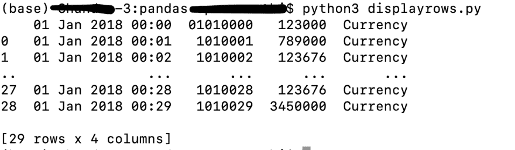
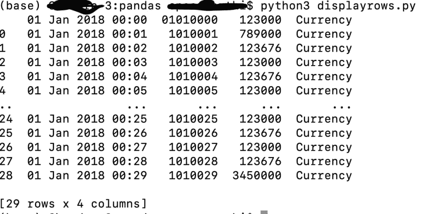

# 熊猫显示所有行如何使用熊猫显示数据框中的所有行

> 原文：<https://dev.to/chanduthedev/how-to-display-all-rows-from-data-frame-using-pandas-dha>

最近我开始用 python 研究机器学习。在使用 **pandas** 包对我们的输入数据进行一些操作时，我遇到了这个问题。所以想到这里分享一下。

以下是使用 python pandas 框架加载 csv 文件和打印数据框的简单步骤。

```
 import pandas
df = pandas.read_csv("data.csv")
print(df) 
```

<svg width="20px" height="20px" viewBox="0 0 24 24" class="highlight-action crayons-icon highlight-action--fullscreen-on"><title>Enter fullscreen mode</title></svg> <svg width="20px" height="20px" viewBox="0 0 24 24" class="highlight-action crayons-icon highlight-action--fullscreen-off"><title>Exit fullscreen mode</title></svg>

这将打印 data.csv 文件中的输入数据，如下所示。

[](https://res.cloudinary.com/practicaldev/image/fetch/s--mg4wP_d8--/c_limit%2Cf_auto%2Cfl_progressive%2Cq_auto%2Cw_880/https://thepracticaldev.s3.amazonaws.com/i/kmuwawriqpm3h6qudg8u.png)

在上图中，您可以看到总共有 29 行，但它只显示了 5 行。这是因为在我的环境中，pandas 库中的默认设置只有 5 行(一些系统根据设置会有 60 行)。改变这个值的熊猫属性名是 **display.max_rows** 。我们可以更改这个值，根据您的需要显示任意多的行。如果希望显示十行，可以将 display.max_rows 属性值设置为十，如下所示。

```
 pandas.set_option('display.max_rows', 10)
df = pandas.read_csv("data.csv")
print(df) 
```

<svg width="20px" height="20px" viewBox="0 0 24 24" class="highlight-action crayons-icon highlight-action--fullscreen-on"><title>Enter fullscreen mode</title></svg> <svg width="20px" height="20px" viewBox="0 0 24 24" class="highlight-action crayons-icon highlight-action--fullscreen-off"><title>Exit fullscreen mode</title></svg>

你可以看到下面的结果，显示了 10 行。
[T3】](https://res.cloudinary.com/practicaldev/image/fetch/s--U919l7SV--/c_limit%2Cf_auto%2Cfl_progressive%2Cq_auto%2Cw_880/https://thepracticaldev.s3.amazonaws.com/i/kqwc5nwvbv1bs8eio8pp.png)

如果我们想显示数据框中的所有行。我们需要将该值设置为不超过数据框中的总行数，如下所示。

将 display.max_rows 属性设置为 None 的代码

```
 pandas.set_option('display.max_rows', None)
df = pandas.read_csv("data.csv")
print(df) 
```

<svg width="20px" height="20px" viewBox="0 0 24 24" class="highlight-action crayons-icon highlight-action--fullscreen-on"><title>Enter fullscreen mode</title></svg> <svg width="20px" height="20px" viewBox="0 0 24 24" class="highlight-action crayons-icon highlight-action--fullscreen-off"><title>Exit fullscreen mode</title></svg>

用于将 display.max_rows 属性设置为仅多于总行数的代码

```
 df = pandas.read_csv("data.csv")
pandas.set_option('display.max_rows', df.shape[0]+1)
print(df) 
```

<svg width="20px" height="20px" viewBox="0 0 24 24" class="highlight-action crayons-icon highlight-action--fullscreen-on"><title>Enter fullscreen mode</title></svg> <svg width="20px" height="20px" viewBox="0 0 24 24" class="highlight-action crayons-icon highlight-action--fullscreen-off"><title>Exit fullscreen mode</title></svg>

下面是显示数据框架中所有行的屏幕截图。
[T3】](https://res.cloudinary.com/practicaldev/image/fetch/s--JY2io99E--/c_limit%2Cf_auto%2Cfl_progressive%2Cq_auto%2Cw_880/https://thepracticaldev.s3.amazonaws.com/i/v24vhdv1a9hbauxaiepj.png)