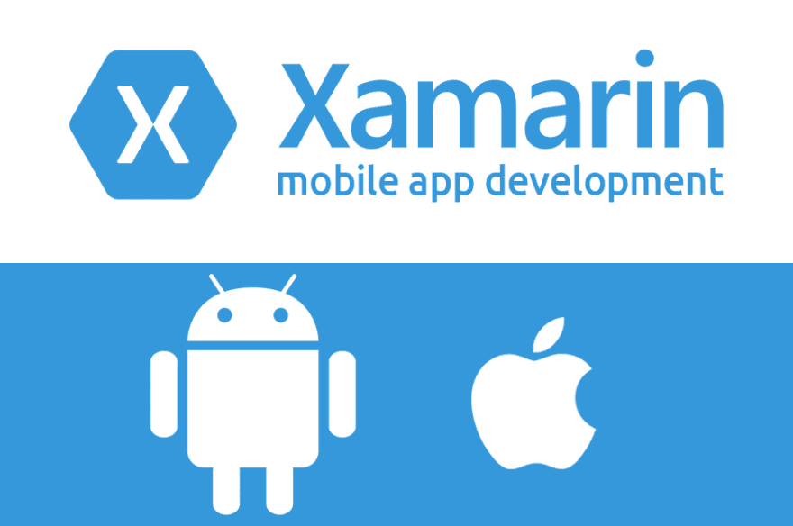

# 为什么您的团队应该在他们的移动开发工具中使用 Xamarin

> 原文：<https://dev.to/herocod3r/why-you-team-should-have-xamarin-amongst-their-mobile-dev-tools-48bf>

Xamarin 是一个开发原生跨平台移动应用的框架，归微软所有。

但在 2019 年，随着开发跨平台移动应用程序的不同选择越来越多，关于使用哪种工具来完成这项工作的辩论总是会出现，我不是来挑选任何一方的，虽然 flutter，react native，ionic 等都很棒，在大多数情况下都可以完成这项工作，但只是在某些情况下，一些其他工具会比其他工具更容易完成这项工作。

因此，为了不浪费时间，我将与你分享 xamarin 背后的一般想法

## 接近

早在 2012/2013 年 xamarin 问世时，市场上就有其他工具提供跨平台开发，但其中许多工具都采用了“首先共享 UI”的方法，毫不奇怪，html 和 css 是这方面的第一个考虑过程，这导致了使用 webviews 和暴露一组平台 api 的框架的噩梦。

Xamarin 采用了“先共享代码”的方法，他们查看了两个主要平台，想出了嵌入的方法。Net(C#)到本地 api 中，允许 C#直接调用平台 api....所以本质上我们有了一个框架，可以使用原生 UI(android xml，ios storyboards)并使用 C#调用原生 api...他们还将 interop C#与平台原生语言结合起来，基本上允许您在 xamarin 应用程序中直接使用 java 库和 objective-c 库，这太棒了，您不仅可以使用一种语言跨平台构建应用程序，还可以使用平台原生语言库，而不必重新发明轮子。

这极大地改变了跨平台移动行业，并为我们今天拥有的大多数框架铺平了道路。

Xamarin 后来想出了一个更酷的方法来共享 UI，这就是 Xamarin。Forms 基本上是一组在本地 UI 控件之上的抽象控件，例如，既然 android 有一个按钮视图，ios 也有一个按钮 UIView，为什么不只是抽象平台实现，并有一个 xamarin forms 按钮，最终在 android 上是一个按钮视图，在 Ios 上是按钮 UIView...这种方法允许开发人员共享 ui 和代码，而没有复杂性或性能方面的开销。

总之，我为什么要使用 xamarin？

1.  你可以使用原生 UI、android xml 和 ios 故事板来构建移动应用，这将允许与核心原生开发者进行更多的协作

2.  你可以使用 java/objective C 库，xamarin 可以让你为 java 和 objective-c 库创建 C#绑定，这基本上可以把一个. aar 或者。jar java 库到. Net dll 的转换🙂太酷了是吗？

3.  您还可以获得。Net 框架，还有大量像 entityframework 这样的库，这真的可以让你的开发工作变得更容易

4.  代码共享，除了与其他移动平台共享您的 C#代码，您还可以与您的。Net Core Api 是一个桌面应用程序，实际上可以运行任何东西。网😎

5.  你可以决定与 xamarin.forms 共享跨平台的 UI，xamarin . forms 使用 xaml，对于 react-native 的开发人员来说，他们正在努力放弃像 Vue 和 react 这样的酷框架，xaml 还可以让你进行开箱即用的绑定(MVVM ),没有任何依赖，你还可以使用 CSS 来设计视图🚀

总之，xamarin 是一个非常可靠的工具，它包含了许多功能，可以让你用比其他框架快 10 倍的时间来构建应用程序，它还允许你不受限制地构建应用程序。我建议任何机动队考虑在他们的武器库中使用 xamarin。