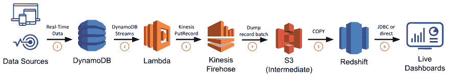
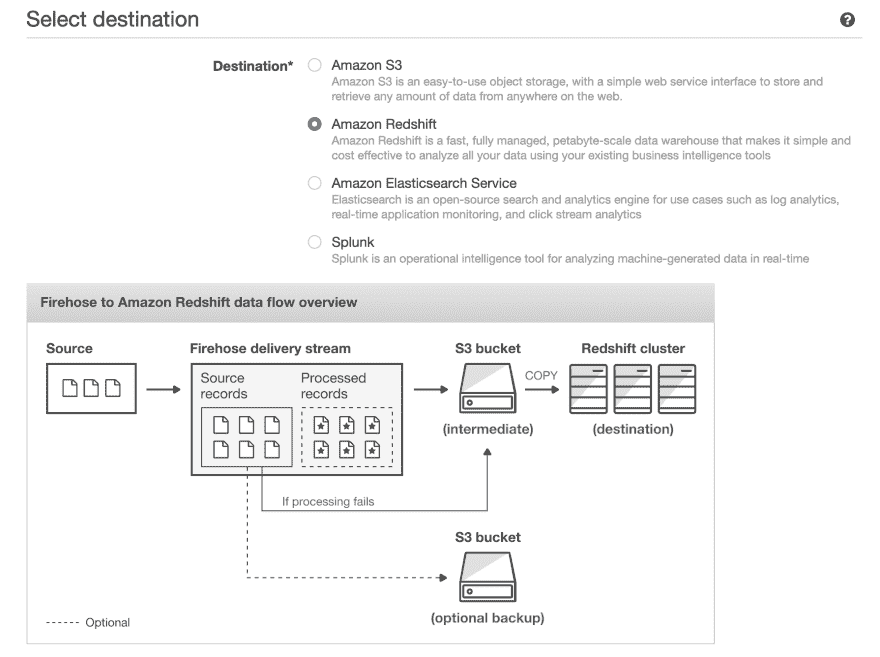
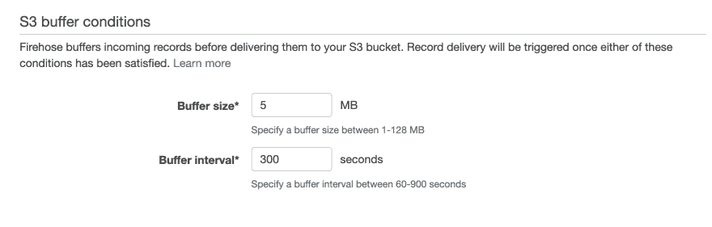

# Tableau 操作仪表板和 DynamoDB 报告-评估红移和 Athena

> 原文：<https://dev.to/rocksetcloud/tableau-operational-dashboards-and-reporting-on-dynamodb-evaluating-redshift-and-athena-311a>

*作者[Ari Ekmekji](https://www.linkedin.com/in/ekmekji/)T3】*

组织将[运营报告和分析](https://rockset.com/blog/from-good-to-great-operational-analytics-real-time-edge/)视为改进业务流程和效率的下一个技术挑战。在一个[每个人都成为分析师](https://a16z.com/2019/05/16/everyone-is-an-analyst-opportunities-in-operational-analytics/)的世界里，实时仪表盘呈现最新的见解，并操作实时数据，为组织的多个领域提供及时的决策支持。我们将看看如何使用标准数据可视化工具来构建操作仪表板和报告，如 [Tableau](https://www.tableau.com/) 、 [Grafana](https://grafana.com/) 、 [Redash](https://redash.io/) 和 [Apache 超集](https://superset.incubator.apache.org/)。具体来说，我们将重点关注对存储在 [DynamoDB](https://aws.amazon.com/dynamodb/) 中的数据使用这些 BI 工具，因为我们发现从 DynamoDB 到数据可视化工具的路径是操作仪表板用户的常见模式。

使用现有的 BI 工具(如 Tableau)创建数据可视化可能非常适合资源较少、UI 要求不太严格或者希望快速启动和运行仪表板的组织。它还有一个额外的好处，那就是该公司的许多分析师已经熟悉如何使用该工具。我们考虑了几种方法，它们都使用 DynamoDB 流，但在如何提供仪表板方面有所不同:

**1。DynamoDB Streams+Lambda+Kinesis fire hose+Redshift**

**2。dynamo db Streams+Lambda+Kinesis fire hose+S3+雅典娜**

**3。DynamoDB Streams + Rockset**

我们将评估每种方法的设置/维护简易性、数据延迟、查询延迟/并发性和系统可伸缩性，以便您可以根据这些标准中哪些对您的用例最重要来判断哪种方法最适合您。

## 使用标准 BI 工具构建运营仪表板的注意事项

构建实时仪表盘并非易事，因为任何[解决方案](https://rockset.com/blog/operational-analytics-what-every-software-engineer-should-know/)都需要支持高并发、低延迟的查询，以实现快速加载时间(或者降低使用率/效率)，并从数据源进行实时同步，以实现低数据延迟(或者导致错误操作/错失机会)。低延迟要求排除了直接对 OLTP 数据库中的数据进行操作，OLTP 数据库针对事务性查询而非分析性查询进行了优化。低数据延迟需求排除了基于 ETL 的解决方案，这些解决方案会将数据延迟增加到实时阈值以上，并且不可避免地导致“ETL 地狱”。

DynamoDB 是由 AWS 提供的完全托管的 NoSQL 数据库，它使用分区键针对点查找和小范围扫描进行了优化。虽然对于这些用例来说，DynamoDB 具有很高的性能，但是对于分析查询来说， [DynamoDB 并不是一个很好的选择，因为分析查询通常涉及大范围的扫描和复杂的操作，比如分组和聚合。AWS 知道这一点，并通过创建](https://aws.amazon.com/blogs/database/dynamodb-streams-use-cases-and-design-patterns/) [DynamoDB 流](https://docs.aws.amazon.com/amazondynamodb/latest/developerguide/Streams.html)回应了客户的请求，这是一个更改数据捕获系统，可用于通知其他服务 DynamoDB 中新的/修改的数据。在我们的例子中，我们将利用 DynamoDB 流将 DynamoDB 表与更适合服务于分析查询的其他存储系统同步。

要在现有 BI 工具的基础上构建您的实时仪表板，本质上意味着您需要在实时数据源上提供 SQL API，然后您可以使用您选择的 BI 工具 Tableau、Superset、Redash、Grafana 等。–插入它并在 DynamoDB 数据上创建所有数据可视化。因此，在这里我们将重点关注创建一个具有 SQL 支持的实时数据源，而将这些工具的细节留给另一篇文章。

## Kinesis 消防软管+红移

我们将考虑使用 [Kinesis Firehose](https://aws.amazon.com/kinesis/data-firehose/) 来同步 DynamoDB 表和红移表，在此基础上，您可以运行您选择的 BI 工具。 [Redshift](https://aws.amazon.com/redshift/) 是 AWS 的数据仓库产品，专为超大型数据集上的 OLAP 工作负载量身定制。大多数 BI 工具都有明确的红移集成，也可以使用标准的 JDBC 连接。

首先要做的是[创建一个新的红移集群](https://docs.aws.amazon.com/redshift/latest/gsg/rs-gsg-launch-sample-cluster.html)，并在其中创建一个新的数据库和表，用于保存从 DynamoDB 获取的数据。您可以通过支持 JDBC 连接和 PostgreSQL 方言的标准 SQL 客户端连接到 Redshift 数据库。在继续下一步之前，您必须用所有字段名称、数据类型和列压缩类型显式定义您的表。

接下来，您需要转到 [Kinesis 仪表板](https://us-west-2.console.aws.amazon.com/firehose/home?region=us-west-2#/intro)并创建一个新的 Kinesis Firehose，这是 AWS 提供的变体，用于将事件流式传输到 S3 的目标桶或 Redshift 中的目标表。我们将选择源选项*直接上传或其他源*，我们将选择我们的红移表作为目的地。在这里，它为您提供了一些有用的优化，您可以启用这些优化，如在执行复制命令到 Redshift 之前将数据转移到 S3(这会导致对 Redshift 的更少、更大的写入，从而保留 Redshift 集群上的宝贵计算资源，并在 S3 为您提供备份，以防复制期间出现任何问题)。我们可以配置缓冲区大小和缓冲区间隔来控制 Kinesis 在一个块中写入的次数。例如，100MB 的缓冲区大小和 60 秒的缓冲区间隔将告诉 Kinesis Firehose 在接收到 100MB 的数据时进行写入，或者在 60 秒后进行写入，以先到者为准。

最后，您可以设置一个 Lambda 函数，该函数使用 DynamoDB Streams API 来检索对 DynamoDB 表的最新更改。这个函数将缓冲这些更改，并使用它的 PutRecord 或 PutRecordBatch API 将一批更改发送到 Kinesis Firehose。该函数类似于