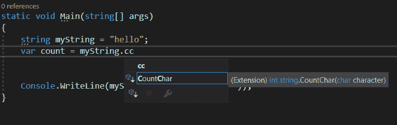

# 如何组织你的 Asp.net 核心启动文件

> 原文：<https://dev.to/ahdbk/how-to-organize-and-cleanup-your-startup-cs-2d3j>

如果你是一个 ASP.NET 核心人员，你应该熟悉启动文件组织的噩梦。每个 Asp 核心应用程序启动文件可以包括配置、中间件声明、依赖注入定义、认证配置、策略等等。长话短说:繁重的应用程序有大量混乱不可读的启动文件，其中有数百行难以滚动的代码。

[](https://res.cloudinary.com/practicaldev/image/fetch/s--GUISa13P--/c_limit%2Cf_auto%2Cfl_progressive%2Cq_66%2Cw_880/https://thepracticaldev.s3.amazonaws.com/i/0c2n0j35spjptszx8of7.gif)

# 认识扩展方法，你的新闺蜜

所以，正如你可能已经猜到的，这里是**扩展方法**来拯救的地方。学习组织你的 Startup.cs 是成为一名优秀 C#程序员的一部分，在你的武器库中拥有扩展方法是必须的。到本文结束时，您将学会一个整洁而简单的技巧来改进启动文件的组织，并在未来的项目中免去无休止的启动文件滚动的痛苦。

“扩展方法”是用 C# 3.0 引入的，从那以后，太阳的光芒就亮了一点。

扩展方法可用于扩展现有类型，而无需创建派生类型、重新编译或修改原始类型。

举个简单的例子，假设我们想使用扩展方法向类字符串添加一个特殊的方法`CountChar`。`CountChar`将简单地计算特定字符在给定字符串中出现的次数。

```
namespace ExtensionMethods
{
    public static class MyExtensions
    {
        public static int CountChar(this String str,Char character)
        {
            return str.Count(x=> x == character);
        }
    }
} 
```

现在要使用它，我们只需要在我们的项目中导入名称空间`ExtensionMethods`，瞧！感谢智能感知的魔力，我们的新方法`CountChar`现在可用于任何 String 类型的对象。

[](https://res.cloudinary.com/practicaldev/image/fetch/s--SQ9CNy-i--/c_limit%2Cf_auto%2Cfl_progressive%2Cq_auto%2Cw_880/https://thepracticaldev.s3.amazonaws.com/i/lmeunp39purre38rq6ox.PNG)

查看微软文档页面了解更多示例[点击这里](https://docs.microsoft.com/en-us/dotnet/csharp/programming-guide/classes-and-structs/extension-methods)。

## 释放扩展方法的全部潜力

现在让我们做一些更复杂的事情:我们将扩展`IServiceCollection`和`IApplicationBuilder`。

为此，我们需要:

*   创建一个静态类:

这个类将包括我们所有的扩展方法

*   创建我们的扩展方法，用关键字 this 作为参数传递我们的类型。

在我们的例子中，我们将以 Swagger 配置为例:

```
 namespace ExtensionMethods
{

    public static class SwaggerConfigurationExtension
    {

        public static void AddSwaggerConfig(this IServiceCollection services)
        {
          services.AddSwaggerGen(c =>
            {
            c.SwaggerDoc("v1", new OpenApiInfo { Title = "My API", Version = "v1" });
            });
        }

        public static void UseCustomSwaggerConfig(this IApplicationBuilder app)
        {

            // Enable middleware to serve generated Swagger as a JSON endpoint.
            app.UseSwagger();

            // Enable middleware to serve swagger-ui (HTML, JS, CSS, etc.),
            // specifying the Swagger JSON endpoint.
            app.UseSwaggerUI(c =>
            {
                c.SwaggerEndpoint("/swagger/v1/swagger.json", "My API V1");
            });
        }
    }
} 
```

在上面的代码中，我们创建了两个扩展方法:

*   `AddSwaggerConfig`扩展`IServiceCollection`以添加 swagger 发电机配置。

*   `UseCustomSwaggerConfig`扩展了`IApplicationBuilder`来启用用于 swagger 服务器生成和 swagger UI 的中间件。

启动文件中的调用将如下进行:

```
 public class Startup
    {
         public void ConfigureServices(IServiceCollection services)
        {
                services.AddSwaggerConfig()
        }

        public void Configure(IApplicationBuilder app, IHostingEnvironment env, ILoggerFactory loggerFactory)
        {
               app.UseCustomSwaggerConfig()
        }
    } 
```

就创业推广组织而言，有两种可能性:

*   在一个类中重新分组所有的扩展(例如称为 StartupExtension)。

*   为添加到 IServiceCollection 的每个功能或服务创建一个类。

就个人而言，我更喜欢第二种解决方案。通常我会创建一个名为 Extensions 的文件夹，并将所有的类放在那里。有了这个结构，我可以在其他项目中重用扩展，只复制我需要的文件，而不是复制代码。

因此，使用这些方法，我们将有一个类似于这样的启动文件:

```
 public class Startup
    {
         public void ConfigureServices(IServiceCollection services)
        {
                services.AddSwaggerConfig()
                services.AddCustomAuthentification()
                services.AddCustomSettingsFile()
                services.AddHttpClients()
                ...
        }

        public void Configure(IApplicationBuilder app, IHostingEnvironment env, ILoggerFactory loggerFactory)
        {
                app.UseCustomSwaggerConfig()
                ...
        }
    } 
```

祝贺你，现在你已经掌握了扩展方法的力量。

[](https://res.cloudinary.com/practicaldev/image/fetch/s--dOyIqefy--/c_limit%2Cf_auto%2Cfl_progressive%2Cq_66%2Cw_880/https://thepracticaldev.s3.amazonaws.com/i/wixviapai3cbgw7bi1z9.gif)

每个开发人员都需要一些燃料，而咖啡是我的

我希望你喜欢这篇文章。

[](https://www.buymeacoffee.com/OvyCT7IdJ)