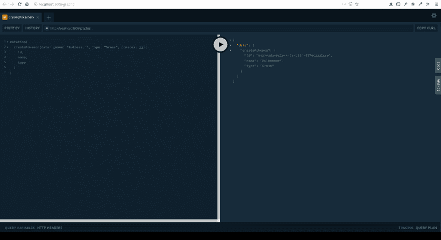
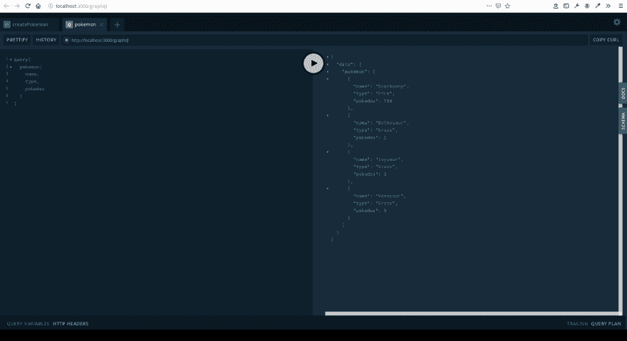

# 带有 TypeORM 和 Postgres 的 NestJS GraphQL API

> 原文：<https://dev.to/rohanfaiyazkhan/nestjs-graphql-api-with-typeorm-and-postgres-2866>

***免责声明:此文最初发布于我的[博客](https://rohanfaiyaz.com/post/nest-graphql.html)***

在之前的[帖子](https://dev.to/rohanfaiyazkhan/nestjs-crud-with-postgres-cho)中，我介绍了如何使用 TypeORM 和 Postgres 制作一个 **NestJS** REST API。虽然在 NestJS 中设置 REST API 是一个相对简单的过程，但是我们仍然会受到 REST API 的限制。REST 依赖于明确定义的端点，这通常是使用前端作为指南来完成的，因为显然我们希望提供前端需要的准确数据。

但这是个问题。如果前端需求发生变化，我们需要一个额外的数据字段，而该字段只能通过一个单独的端点获得，该怎么办？现在，我们必须发出两个 HTTP 请求，我们将有额外的数据，这对于移动互联网的使用是一种浪费。另一个解决方案是在后端创建一个新的端点，这是很昂贵的。

本质上，REST api 太低级了。我们需要提供更高抽象层次的东西，那就是 **GraphQL** 。

GraphQL 是一种查询语言规范，最初由脸书创建，作为上述问题的解决方案。GraphQL 为前端提供了一种描述所需确切数据和数据形状的方法。数据在后端被定义为 GraphQL 模式。一个 GraphQL 请求(称为*查询*)看起来像这样:

```
{
    pokemon(id: 4) {
        name,
        types
    }
} 
```

Enter fullscreen mode Exit fullscreen mode

这将返回如下所示的 JSON 响应:

```
{  "data":  {  "pokemon":  {  "name":  "Charmander",  "types":  ["Fire"]  }  }  } 
```

Enter fullscreen mode Exit fullscreen mode

您可能会注意到，发回的数据与查询的形状完全一致。那么添加数据呢？我们使用 GraphQL *突变*来实现，它看起来像这样:

```
mutation{
    addPokemon(name: "Scorbunny", types: "Fire") {
        id,
        name,
        types
    }
} 
```

Enter fullscreen mode Exit fullscreen mode

这将给出类似这样的响应:

```
{  "data":  {  "pokemon":  {  "id":  912,  "name":  "Scorbunny",  "types":  ["Fire"]  }  }  } 
```

Enter fullscreen mode Exit fullscreen mode

当然，GraphQL 远不止这些。如果你想更深入地了解 GraphQL 的能力，没有比官方文档更好的地方了。这篇文章的其余部分将集中在使用 NestJS 和 TypeORM 在服务器端创建一个 GraphQL API。

## 设置项目

我们将首先使用 *NPM* 安装 **NestJS** (如果你还没有安装的话)，并使用 Nest CLI 搭建一个新的 Nest 项目

```
$ npm i -g @nestjs/cli 
$ nest new nest-app 
```

Enter fullscreen mode Exit fullscreen mode

我将选择集成的数据库是 **Postgres** ，尽管您可以使用自己选择的任何数据库。我们将使用**类型的 ORM** 作为我们的 *ORM(对象关系映射)*，这实质上消除了编写原始 SQL 的负担，因为我们的 ORM 将处理与数据库的通信。

如果您没有安装 Postgres，请按照步骤在您的操作系统上安装 Postgres。例如，你可以使用 Windows 的官方安装程序，[在 MacOS 上使用自制软件](https://gist.github.com/ibraheem4/ce5ccd3e4d7a65589ce84f2a3b7c23a3)或者 Ubuntu 上使用[apt](https://wiki.postgresql.org/wiki/Apt)。安装 postgres 后，我们将使用 Postgres CLI 创建一个新的数据库。在 Linux 和 MacOS 上，步骤如下:

```
$ sudo -u postgres psql
postgres=# createdb rohan
postgres=# \q
$ psql
rohan=# \password
rohan=# Enter new password:
rohan=# Retype new password: 
```

Enter fullscreen mode Exit fullscreen mode

## 设置依赖关系和配置

首先，我们将安装必要的依赖项。TypeORM 是推荐的 ORM，非常适合与 Postgres 连接。NestJS 也有自己的配置 GraphQL 的方法，它在幕后使用了 *apollo-server* 。

```
yarn add pg typeorm @nestjs/typeorm @nestjs/graphql apollo-server-express graphql-tools type-graphql graphql 
```

Enter fullscreen mode Exit fullscreen mode

接下来，我们将在项目的根目录下创建一个配置文件，并将其命名为 **ormconfig.json** 。这个文件是由 TypeORM 自动拉入的。

```
//  ormconfig.json  {  "type":  "postgres",  "host":  "localhost",  "port":  5432,  "username":  "rohan",  "password":  "password",  "database":  "rohan",  "entities":  ["dist/**/*.entity.js"],  "synchronize":  true,  "logging":  true  } 
```

Enter fullscreen mode Exit fullscreen mode

在 NestJS 中，每个组件都有自己的模块，我们封装了与模块相关的所有东西，包括提供者、控制器和其他模块。根模块文件是 **app.module.ts** ，在这里我们将指定整个应用程序可以访问的外部模块，即 GraphQL 和 TypeORM。我们将使用它为一个*口袋妖怪*组件建立一个模式，我们将很快定义这个组件。

```
// src/app.module.ts

import { Module } from '@nestjs/common'
import { AppController } from './app.controller'
import { TypeOrmModule } from '@nestjs/typeorm'
import { AppService } from './app.service'
import { GraphQLModule } from '@nestjs/graphql'
import { PokemonModule } from './pokemon/pokemon.module'
@Module({
    imports: [
        TypeOrmModule.forRoot(),
        GraphQLModule.forRoot({
            autoSchemaFile: 'schema.gpl'
        }),
        PokemonModule
    ],
    controllers: [ AppController ],
    providers: [ AppService ]
})
export class AppModule {} 
```

Enter fullscreen mode Exit fullscreen mode

## 设置 GraphQL 端点

我们将会有一个单独的实体叫做口袋妖怪。在 **src** 文件夹中制作一个目录，命名为**口袋妖怪**。在里面我们会制作一个**口袋妖怪。** 

```
// src/pokemon/pokemon.entity.ts

import { Entity, PrimaryGeneratedColumn, Column } from 'typeorm'

@Entity('pokemon')
export class PokemonEntity {
    @PrimaryGeneratedColumn('uuid') id: string

    @Column('varchar', { length: 500, unique: true })
    name: string

    @Column('varchar', { length: 500 })
    type: string

    @Column('numeric') pokedex: number
} 
```

Enter fullscreen mode Exit fullscreen mode

现在我们有了我们的实体，我们可以把它注入到我们的口袋妖怪模块。接下来，我们将创建一个 *DTO(数据传输对象)*，它是一个定义我们期望发送的数据形状的模型。在*口袋妖怪*里面做一个名为 **dto** 的文件夹，创建一个名为 **add-pokemon.dto.ts** 的文件。

```
// stc/pokemon/dto/create-pokemon.dto.ts

import { Field, ObjectType} from 'type-graphql'

@ObjectType()
export class CreatePokemonDto {
    @Field() readonly id?: string
    @Field() readonly name: string
    @Field() readonly type: string
    @Field() readonly pokedex: number
} 
```

Enter fullscreen mode Exit fullscreen mode

类似地，我们将设置一个*输入*对象，它将为我们的*变异查询*定义输入参数的形状。在一个**输入**文件夹中创建**口袋妖怪.输入. ts** 。

```
// src/pokemon/input/pokemon.input.ts

import { Field, InputType } from 'type-graphql'

@InputType()
export class inputPokemon {
    @Field() readonly name: string
    @Field() readonly type: string
    @Field() readonly pokedex: number
} 
```

Enter fullscreen mode Exit fullscreen mode

接下来我们将建立我们的口袋妖怪服务类。*服务*是*提供者*的一种，它们是 NestJS 中的基本部分，因为它们处理**注入依赖**的任务。我们可以使用嵌套 CLI 直接创建服务。

```
$ nest generate service pokemon 
```

Enter fullscreen mode Exit fullscreen mode

所有的提供者前面都有一个`@Injectable`装饰符。服务通常是我们从 ORM 注入数据存储库的地方，并设置与数据的交互。在我们的例子中，我们将创建两个方法，`createPokemon`和`getPokemon`。

```
// src/pokemon/pokemon.service.ts

import { Injectable } from '@nestjs/common'
import { InjectRepository } from '@nestjs/typeorm'
import { PokemonEntity } from './pokemon.entity'
import { Repository } from 'typeorm'
import { CreatePokemonDto } from './dto/create-pokemon.dto'

@Injectable()
export class PokemonService {
    constructor (@InjectRepository(PokemonEntity) private readonly PokemonRepository: Repository<PokemonEntity>) {}

    async createPokemon (data: CreatePokemonDto): Promise<PokemonEntity> {
        let pokemon = new PokemonEntity()
        pokemon.name = data.name
        pokemon.pokedex = data.pokedex
        pokemon.type = data.type

        await this.PokemonRepository.save(pokemon)

        return pokemon
    }

    async getPokemons () {
        return await this.PokemonRepository.find()
    }
} 
```

Enter fullscreen mode Exit fullscreen mode

接下来我们将创建一个*解析器*类。解析器将 GraphQL 请求解析为函数。虽然有许多方法可以制作 GraphQL 解析器，但我们将使用 NestJS GraphQL 库中的`@Resolver`装饰器。在我们的 resolver 类中，我们将把我们的查询和变异映射到我们的服务类中创建的函数。

```
// src/pokemon/pokemon.resolver.ts

import { Resolver, Query, Mutation, Args } from '@nestjs/graphql'
import { PokemonEntity } from './pokemon.entity'
import { CreatePokemonDto } from './dto/create-pokemon.dto'
import { PokemonService } from './pokemon.service'
import { inputPokemon } from './inputs/pokemon.input'

@Resolver((of) => PokemonEntity)
export class PokemonResolver {
    constructor (private readonly pokemonService: PokemonService) {}

    @Query(() => [ CreatePokemonDto ])
    async pokemon () {
        return this.pokemonService.getPokemon()
    }

    @Mutation(() => CreatePokemonDto)
    async createPokemon (@Args('data') data: inputPokemon) {
        return this.pokemonService.createPokemon(data)
    }
} 
```

Enter fullscreen mode Exit fullscreen mode

最后，我们将封装口袋妖怪模块内的一切。

```
// src/pokemon/pokemon.module.ts

import { PokemonResolver } from './pokemon.resolver'
import { Module } from '@nestjs/common'
import { PokemonService } from './pokemon.service'
import { TypeOrmModule } from '@nestjs/typeorm'
import { PokemonEntity } from './pokemon.entity'

@Module({
    imports: [ TypeOrmModule.forFeature([ PokemonEntity ]) ],
    providers: [ PokemonResolver, PokemonService ]
})
export class PokemonModule {} 
```

Enter fullscreen mode Exit fullscreen mode

## 测试操场上的端点

就是这样！我们可以使用`yarn start:dev`来测试我们的应用程序，我们的应用程序将默认托管在端口 3000 上。我们可以导航到*localhost.com:3000*来查看“Hello World”消息，但是如果我们导航到*localhost . com:3000 . graph QL*我们将会看到 graph QL playground(NestJS 使用的默认测试 GUI 工具)。我们可以在这里测试我们的突变和查询。

[](https://res.cloudinary.com/practicaldev/image/fetch/s--08zmqHzp--/c_limit%2Cf_auto%2Cfl_progressive%2Cq_auto%2Cw_880/https://thepracticaldev.s3.amazonaws.com/i/pwdrnkssk3dqdp6l2klj.png)

[](https://res.cloudinary.com/practicaldev/image/fetch/s--VoGGD9G4--/c_limit%2Cf_auto%2Cfl_progressive%2Cq_auto%2Cw_880/https://thepracticaldev.s3.amazonaws.com/i/1hjfesj4mxwp2g0hc5nk.png)