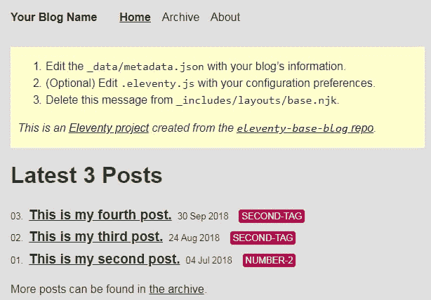

# 定制 11ty 博客

> 原文：<https://dev.to/xanderyzwich/customizing-11ty-blog-1hm8>

在 Twitter 上与 [Brob](https://dev.to/brob) 简单接触后，我开始走上这条路，他建议我开始在 [dev.to](http://dev.to/) 上写博客，甚至说我应该考虑在自己的网站上发帖，并通过 [dev.to](http://dev.to/) 进行联合。那时我有了一个自定义域，却不知道该如何处理它。

## 但如何

幸运的是，Brob 继续指引我[这里](https://t.co/ervT8kEx1k?amp=1)有一个简单的工具，可以使用 GitHub 页面和 TravisCI 发布个人博客。这些说明真的很简单，在通过 GitHub 页面设置了我的自定义域名后，我在一个小时内就“启动并运行”了。这是真正暂时停滞的地方。此时，我已经建立并运行了我的构建过程，并且可以从我的自定义 url 查看示例博客。

[](https://res.cloudinary.com/practicaldev/image/fetch/s--UHm19WG1--/c_limit%2Cf_auto%2Cfl_progressive%2Cq_auto%2Cw_880/https://coreydmccarty.dev/img/Generic11ty.jpg)

## 开始使用

让这件事停滞太久会让你觉得越来越难完成。这一页清楚地说明了最初的步骤。

> 1.  Edit _data/metadata.json with your blog information.
> 2.  (Optional) Edit eleventy.js according to your configuration preference.
> 3.  从 _ 包含/布局/基础。njk。
> 
> 中删除此消息

## 编辑 _ 数据/元数据. json

```
{  "title":  "Your Blog Name",  "url":  "https://myurl.com/",  "description":  "I am writing about my experiences as a naval navel-gazer.",  "feed":  {  "subtitle":  "I am writing about my experiences as a naval navel-gazer.",  "filename":  "feed.xml",  "path":  "/feed/feed.xml",  "url":  "https://myurl.com/feed/feed.xml",  "id":  "https://myurl.com/"  },  "author":  {  "name":  "Your Name Here",  "email":  "youremailaddress@example.com"  }  } 
```

Enter fullscreen mode Exit fullscreen mode

这东西真的很简单。我开始为等了这么久才着手这项工作感到惭愧。这里的所有数据都可以在 5 分钟内汇总起来。

## 从 _includes/layouts/base.njk 中删除此消息

```
<main class="tmpl-post">
      <div class="warning">
        <ol>
          <li>Edit the <code>_data/metadata.json</code> with your blog’s information.</li>
          <li>(Optional) Edit <code>.eleventy.js</code> with your configuration preferences.</li>
          <li>Delete this message from <code>_includes/layouts/base.njk</code>.</li>
        </ol>
        <p><em>This is an <a href="https://www.11ty.io/">Eleventy project</a> created from the <a href="https://github.com/11ty/eleventy-base-blog"><code>eleventy-base-blog</code> repo</a>.</em></p>
      </div>

    </main> 
```

Enter fullscreen mode Exit fullscreen mode

砍掉那个分区。同样，我也不确定在这种情况下我会遇到什么困难。

## 关于

为了自定义顶部导航窗格中链接的“关于”页面，您需要编辑 about/index.md。虽然 markdown 规范非常通用，但如果您有在 Reddit、Discord 或 GitHub 上使用 markdown 的经验，那么它非常容易使用。就我个人而言，我是通过 IntelliJ Community Edition 和 Markdown Support 插件编写的，我可以实时看到输出。输入一些你希望显示在页面上的基本信息。

## 开始写博客

完成这些事情后，你就可以开始写你的第一篇博客了。当我完成我所描述的工作时，我写下了这篇文章。在工作时，我让 Eleventy 以`npx eleventy --server --watch`的身份运行，这样构建就可以获得我所做的任何更改，并自动在浏览器中查看它们(我讨厌在没有首先测试它的工作情况下发布这些内容)。

在写这篇文章的时候，我用包含的 html 模板语言和`<center></center>`得到了一张图片

为你的文章创建标签就像在 markdown 文件的标题中默认的“post”之后添加标签一样简单。

```
title: Customizing 11ty Blog  
description: Cleaning up after forking  
date: 2019-08-13  
tags:  
  - post
  - 11ty  
  - travisci  
  - meta  
layout: layouts/post.njk 
```

Enter fullscreen mode Exit fullscreen mode

## 仍在进行中的工作

在这一点上，我已经用我的自定义信息运行了 blorunning，这样感觉起来更像是我的，而不像是我分叉并忘记的一些代码。虽然我不完全是前端开发人员，但我计划分享一些自定义 css 以及我的在线简历生成器的未来工作。