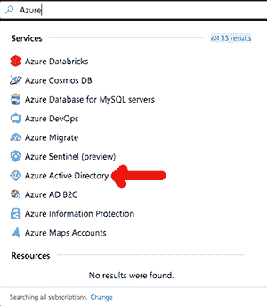
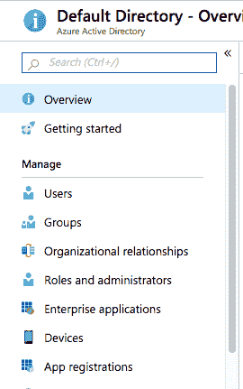

# 使用 Azure 门户检查配置的权限

> 原文：<https://dev.to/azure/using-the-azure-portal-to-check-configured-privileges-1go8>

我经常使用 *az* 命令行工具来探索我的 Azure 资源。有时候，当我试图同时管理几个资源时，我想使用 GUI(又名 Azure portal)。

我发现，如果我在 Azure 门户中按名称搜索服务主体,它不会显示为资源。相反，要找到主体，请搜索 Azure Active Directory 服务。

从 Azure Active Directory 窗格中，单击应用程序注册。

从那个窗格中，我可以选择查看*所有应用程序*或*拥有的应用程序*。

这里的术语“应用程序”并不意味着它是一个实际的应用程序。相反，这些是与应用程序相关联的组件。在这种情况下，应用注册窗格显示所有的[应用对象和服务主体](https://docs.microsoft.com/en-us/azure/active-directory/develop/active-directory-how-applications-are-added?WT.mc_id=devto-blog-jedavis)。从这里，可以搜索特定的服务主体。

想要了解更多关于 Azure 的真实场景，请访问 Azure 提示和技巧网站。