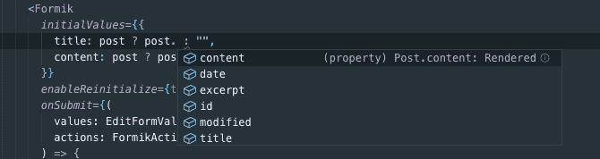

# 当我讨厌打字稿的时候

> 原文：<https://dev.to/loq24/when-i-hated-typescript-3kl>

我之前一直告诉自己，我没有必要学习 Typescript，并且通过我阅读的一些文章确信，这只会减缓我的开发进度。当我读了它的文档并且读完了 2-3 页之后，我对自己说，我不可能在我的项目中尝试这个东西，因为它对我来说看起来真的很复杂。几个月过去了，我甚至没有一天看不到任何文章说它有多好，这是 Javascript 发生的最好的事情。我试了一下...再一次...但这次我投入了这么多时间来学习它，甚至在网上买了一门课程来真正掌握 Typescript。

我开始用它开发个人项目，从 React 到 React Native。尝试的第一天非常艰难，我的开发进度真的慢了下来，但这让我意识到它有多好。以前，如果没有 Typescript，我很容易迷失在自己的代码中，但是有了 Typescript，它使我的代码自文档化。在调用它来检查它的参数后，我不需要回头查看我的其他组件，因为如果我错过了一个必需的参数，Typescript 会通知我。这无疑让我更好地构建了我的代码。

## VSCode 智能感知

这是使用 Typescript 的另一大优势。在编码时看到这些建议会让您意识到，如果不在 javascript 代码中使用 Typescript，您会错过很多东西。

### 我的 React 项目带打字稿

WP React Typescript 是一个使用 Wordpress REST API 的简单管理功能。我开发这个是为了帮助其他 ReactJS 开发人员构建他们项目的管理部分。我认为这个项目最复杂的部分是集成 Typescript 和 React Redux。我在自述文件中添加了一些关于如何实现这一点的说明。希望有一天这能帮助到某个人。

这是我在 Dev.to 的第一篇文章，也是我的第一篇在线文章。非常感谢您的反馈:)