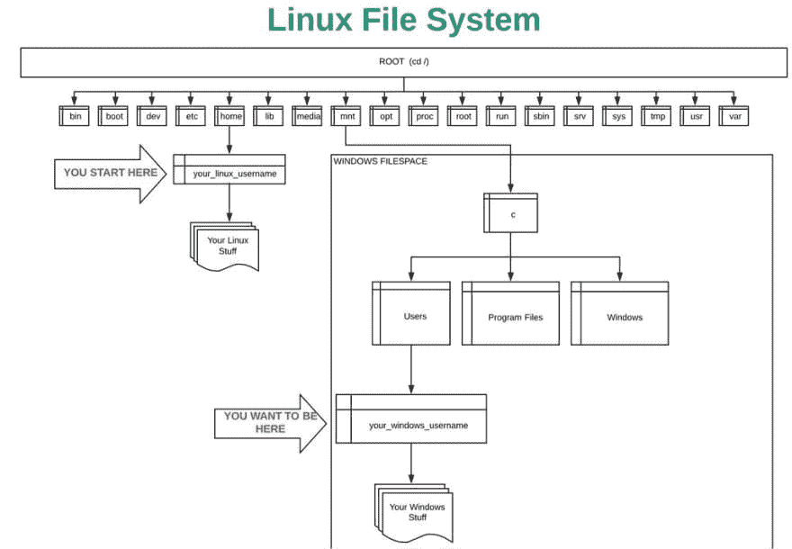
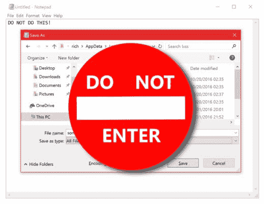

# 用于 Linux 的 WSL -Windows 子系统

> 原文：<https://dev.to/gbs4ever/wsl-windows-subsystem-for-linux-4ekp>

**更新！！WSL 2.0 已经到来，它允许用户同时运行 WSL1 和 WSL 2。让我们看看
它是如何工作的[了解更多](https://docs.microsoft.com/en-us/windows/wsl/wsl2-about)**

似乎大多数程序员喜欢 mac，并拒绝看 PC，这是真的，因为 Mac 预装了许多东西来设置本地环境。但是，您可能需要编写一些仅基于 windows 的程序。或者您未来的客户需要只在 pc 上运行的业务软件。

**现在怎么样了？但是 windows 没有 bash 或者许多基于 Linux 的命令，所以我需要继续使用基于 Unix 的 mac。嗯，我们可以试试 windows 上的双引导或 VirtualBox，我想光是提到这些就能让我们所有人发疯！！

嗯，Windows 10 中的微软已经用 Linux 的 WSL -Windows 子系统想通了。我不会解释所有无聊的东西，但基本上，它让我们安装 Ubuntu 并使用基于 Linux 的命令，编程语言解释器，如 Ruby 和 Python 以及其他一些很酷的东西。我们两全其美！！！

我们还是要明白这是怎么回事，基本上，从 Linux 的 MNT 目录到 windows 的 C: drive 有一个连接或者一个*隧道*。但是您的 Linux 用户名和程序都在 Linux 的主目录中。需要记住非常重要的一点，那就是我们只想把这种设置用作单行道。我们应该只在我们的 windows 目录中存储我们的项目和文件，**我们使用 Linux 来工作或翻译这些文件**(我们的 gems 和 Linux 代码将保存在 Linux 主目录中)在 win 10 的新版本中，他们确实打开了一条双向街道，但这可能很快变得非常混乱。[如需了解更多信息，请点击此处](https://blogs.msdn.microsoft.com/commandline/2016/11/17/do-not-change-linux-files-using-windows-apps-and-tools/)**

概括地说，我们只使用 Linux 来操作我们的 windows 文件，因此我们的文本编辑器和我们使用的大多数程序应该只安装 Windows 版本。如果您[点击此处](https://github.com/micahshute/wsl-setup)，它会一步一步地指导您如何进行设置，并且您可以在本地环境下进行 learn.co 实验。最后要记住的一点是，如果你现在有不止一个硬盘或者分区硬盘，**你只能在你的主操作系统所在的 c:盘上使用 bash。**

编码可以是有趣的，同时也是令人沮丧的，听起来很奇怪，就像你要么喜欢它，要么讨厌它。欢迎成为一名真正的开发人员，令人沮丧的是我们的大脑试图学习和保留一个新概念，而乐趣来自于看到我们可以用编程做多少事情。**对于所有未来的开发者，我重复一遍，不要让挫折扼杀你对编码的热爱和热情！！随着你的前进，希望挫折会少一些。**

**SIM**

链接:

1.  [Micahshute wsl-setup](https://github.com/micahshute/wsl-setup)
2.  [基本 linux 命令](https://maker.pro/linux/tutorial/basic-linux-commands-for-beginners)
3.  [微软](https://docs.microsoft.com/en-us/windows/wsl/install-win10)

​