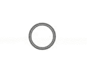

# 有助于纯装载机的反应

> 原文：<https://dev.to/wps13/contributing-to-react-pure-loaders-136d>

你好，我想分享我的开源经验，所以我写了这篇文章来解释它并谈论 react 纯加载器。让我们开始吧！

**我在开源世界的状态**

我的第一个开源贡献是 hacktoberfest，那是一个开源庆祝期，持续了一个月。这个庆典主要是由数字海洋推动的，奖励那些对开源项目做出贡献的人。我是通过当地社区听说的，然后我在官方网站上注册，开始寻找可以贡献的项目。为了帮助新的贡献者，有“好的第一期”的标签，也有庆祝活动本身的标签，以帮助过滤问题，一些储存库被列在官方网站上。在这次庆祝活动中，我在几个项目中做了一些小贡献，主要是帮助提供新数据。

在那之后，我在寻找如何为任何开源项目做贡献，所以当我在 github explore 中搜索时，react pure loaders endup 显示出来，因为它非常好，所以我决定尝试一下。

**我是如何做出贡献的**

查看存储库，该项目有几个问题未解决，还有其他需要改进的地方，比如故事书和其他需要创建的东西，比如网站。

我做的第一件事是更新故事书，增加了一个选项，允许在实时模式下编辑颜色，这个选项是故事书的一个插件，名为 knob，允许动态编辑道具。之后，我和店主谈了谈，我们讨论了为这个包创建一个网站，展示它是什么，如何使用等等。

**项目**

React Pure Loaders 是一个开源包，旨在创建一个可定制的加载器组件，允许改变颜色和状态。创建的加载器可以很容易地集成到 react 项目中。这个包是使用 typescript react 构建的，也使用 storybook。它使用一些机器人来帮助解决问题，如 codeclimate，codebeat，codacy，这有助于检查代码的质量，也检查是否有一些问题，并帮助部署过程。

一些装载机:

*之字形偏转*

*刻度波纹倍数*

**为项目做贡献**

这些加载器是使用 typescript react 创建的，并且受 MIT 许可，可以在这里贡献。加载器和[网站](https://reactpureloaders.io/)都是开源的，有问题需要解决，所以需要任何帮助。