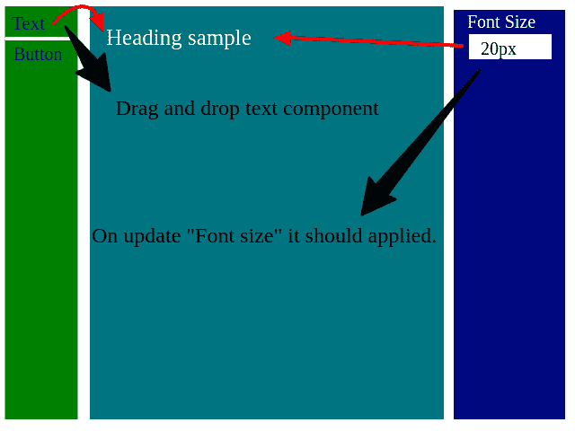

# 如何在 React 中复制和移动组件？

> 原文：<https://dev.to/sunildora94/how-copy-and-move-the-component-in-react-3655>

我是一个反应和还原的新手，我有一个问题，并试图找到它，但仍然无法找到它的解决方案。

目前，我正在开发一个拖放功能的系统，使用表单、文本、按钮等组件生成页面。请注意，我没有为拖放使用任何 npm 库。目前，我已经使用 javascript 拖动事件完成了拖放部分，但问题是我现在拖放的是 HTML 内容而不是组件。我不想为此使用任何外部插件。

我的需求:我的需求是我想拖放组件，这样我就可以在它上面应用所有的 React 特性。请检查更多细节的附加图像。

抱歉，如果我问了你们一些愚蠢的问题。

希望有人能帮我这个忙。

提前感谢。