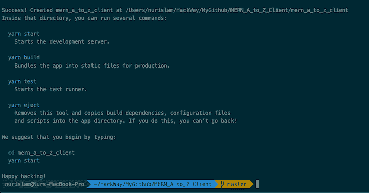
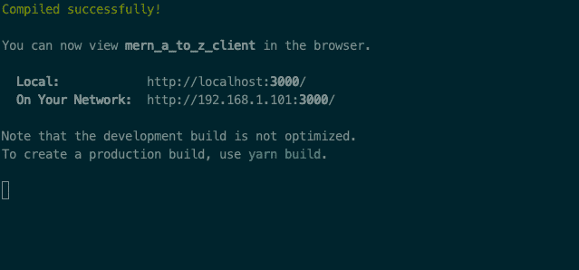
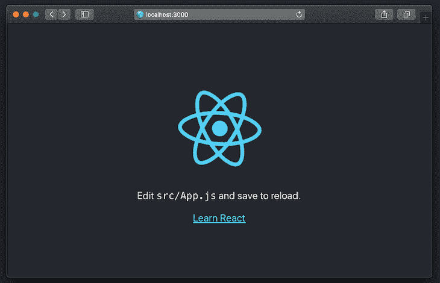
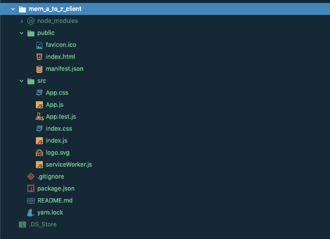
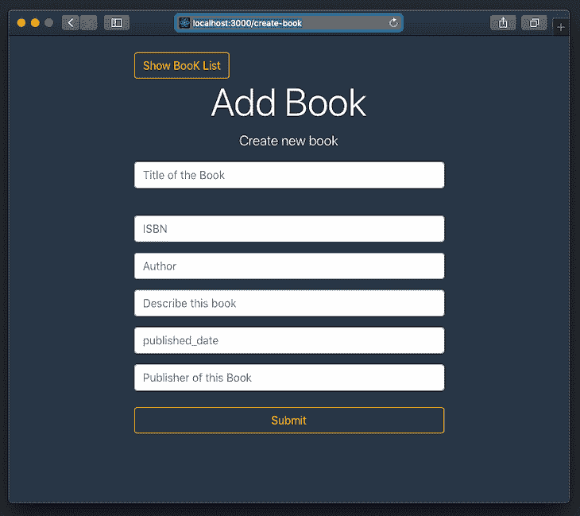
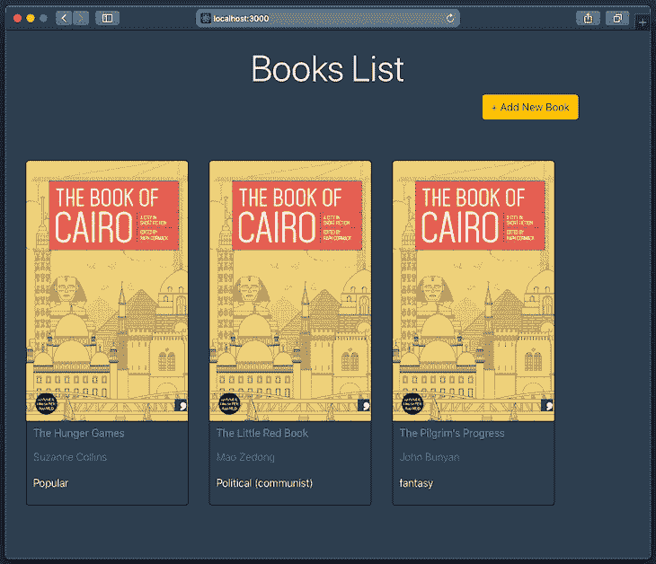
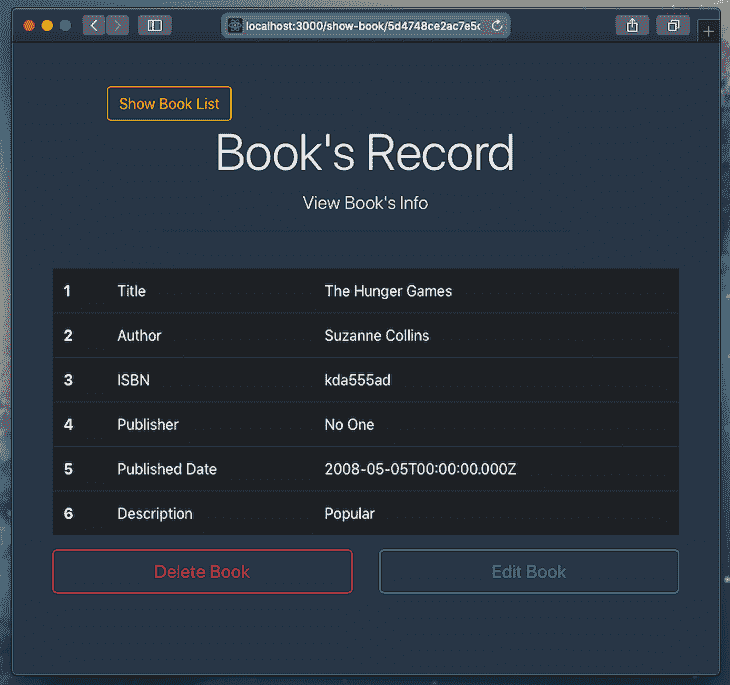
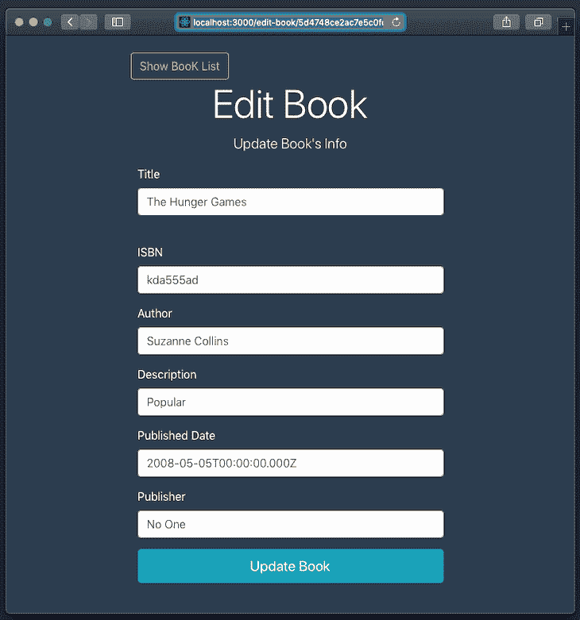

# MERN 堆栈 A 到 Z:第二部分

> 原文：<https://dev.to/bnevilleoneill/mern-stack-a-to-z-part-2-26pi>

**由[努尔伊斯拉姆](https://blog.logrocket.com/author/nurislam/)✏️**撰写

欢迎来到我们从头构建 MERN 堆栈应用教程的第二部分。在我们之前的文章“MERN 堆栈 A 到 Z:第 1 部分”中，我们用 Node.js、Express.js 和 MongoDB 完成了后端部分，并创建了我们的 Rest APIs。这里，我们将使用这些 API。

在这一部分，我们将与 React 一起构建应用程序的前端部分。React 是一个用于构建用户界面的 JavaScript 库。它由脸书和一个由个人开发者和其他公司组成的社区维护。

## 先决条件和项目要求

我们将使用 create-react-app 来生成初始文件设置。CRA 是学习 React 的舒适环境，也是开始在 React 中构建应用程序的最佳方式。它提供了一个没有配置的现代构建设置。

我们还将分别使用 webpack 和 Babel 来捆绑我们的模块和编译我们的 JavaScript。不太了解 webpack 或者 Babel？没问题！

你不需要安装或配置像 webpack 或 Babel 这样的工具。它们是预先配置和隐藏的，因此您可以专注于代码。只要创建一个项目，你就可以开始了。

您还需要在本地开发机器上安装任何高于 8.10 的 Node 版本和任何高于 5.6 的 npm 版本。

[](https://logrocket.com/signup/)

## 设置创建-反应-应用

使用终端设置您想要保存该项目的所有文件的任何目录，并运行以下命令获得初始设置文件:

```
$ npx create-react-app my-app 
```

您可以用您喜欢的项目名称来替换`my-app`。比如我的项目名是`mern_a_to_z_client`，我的命令是:

```
$ npx create-react-app mern_a_to_z_client 
```

**注意:**项目名称必须是小写字母。

如果一切正常，您将会看到类似下图的内容，在这里您将会找到一些指令和命令。

[](https://res.cloudinary.com/practicaldev/image/fetch/s--ZQ9IF19V--/c_limit%2Cf_auto%2Cfl_progressive%2Cq_auto%2Cw_880/https://i0.wp.com/blog.logrocket.com/wp-content/uploads/2019/08/project-created-cra.png%3Fresize%3D730%252C383%26ssl%3D1)

在使用任何内置命令之前，我们需要进入项目文件夹。

```
$ cd mern_a_to_z_client 
```

现在我们在项目目录中，我们可以使用这些可用的命令。如果你用的是纱线:

```
$ yarn start 
```

或者，如果使用 npm:

```
$ npm start 
```

要在开发模式下运行应用程序，您可以使用上述任何命令，您将在终端中看到以下消息。

[](https://res.cloudinary.com/practicaldev/image/fetch/s--Y_F8whVU--/c_limit%2Cf_auto%2Cfl_progressive%2Cq_auto%2Cw_880/https://i1.wp.com/blog.logrocket.com/wp-content/uploads/2019/08/run-app-development-mode.png%3Fresize%3D639%252C298%26ssl%3D1)

现在打开 [http://localhost:3000](http://localhost:3000) 在浏览器中查看。如果您对代码进行了更改，此页面将自动重新加载。

[](https://res.cloudinary.com/practicaldev/image/fetch/s--wf239CIv--/c_limit%2Cf_auto%2Cfl_progressive%2Cq_auto%2Cw_880/https://i1.wp.com/blog.logrocket.com/wp-content/uploads/2019/08/viewing-app-in-browser.png%3Fresize%3D730%252C470%26ssl%3D1)

## 初始项目结构

在项目目录中，我们的初始文件结构应该如下所示:

[](https://res.cloudinary.com/practicaldev/image/fetch/s--OtKhq8i4--/c_limit%2Cf_auto%2Cfl_progressive%2Cq_auto%2Cw_880/https://i2.wp.com/blog.logrocket.com/wp-content/uploads/2019/08/initial-project-structure.png%3Fresize%3D662%252C479%26ssl%3D1)

### 添加自举和字体牛逼

我们已经得到了前端部分的初始设置文件。现在，我们可以开始将后端与前端集成在一起。不过，在此之前，我想将 Bootstrap 和 Font Awesome 的 CDN 添加到我们的项目中。

打开公共文件夹`mern_a_to_z_client/public/index.html`中名为`index.html`的文件，将所有内容替换为以下代码:

```
<!DOCTYPE html>
<html lang="en">
  <head>
    <meta charset="utf-8" />
    <link rel="shortcut icon" href="%PUBLIC_URL%/favicon.ico" />
    <meta name="viewport" content="width=device-width, initial-scale=1" />
    <meta name="theme-color" content="#000000" />
    <!--
      manifest.json provides metadata used when your web app is installed on a
      user's mobile device or desktop. See https://developers.google.com/web/fundamentals/web-app-manifest/
    -->
    <link rel="manifest" href="%PUBLIC_URL%/manifest.json" />
    <!--
      Notice the use of %PUBLIC_URL% in the tags above.
      It will be replaced with the URL of the `public` folder during the build.
      Only files inside the `public` folder can be referenced from the HTML.

      Unlike "/favicon.ico" or "favicon.ico", "%PUBLIC_URL%/favicon.ico" will
      work correctly both with client-side routing and a non-root public URL.
      Learn how to configure a non-root public URL by running `npm run build`.
    -->

    <!-- bootstrap css cdn -->
    <link rel="stylesheet" href="https://maxcdn.bootstrapcdn.com/bootstrap/4.0.0/css/bootstrap.min.css" integrity="sha384-Gn5384xqQ1aoWXA+058RXPxPg6fy4IWvTNh0E263XmFcJlSAwiGgFAW/dAiS6JXm" crossorigin="anonymous">

    <!-- fontawesome cdn -->
    <link rel="stylesheet" href="https://use.fontawesome.com/releases/v5.2.0/css/all.css" integrity="sha384-hWVjflwFxL6sNzntih27bfxkr27PmbbK/iSvJ+a4+0owXq79v+lsFkW54bOGbiDQ" crossorigin="anonymous">

    <title>MERN A to Z</title>
  </head>
  <body>
    <noscript>You need to enable JavaScript to run this app.</noscript>
    <div id="root"></div>
    <!--
      This HTML file is a template.
      If you open it directly in the browser, you will see an empty page.

      You can add webfonts, meta tags, or analytics to this file.
      The build step will place the bundled scripts into the <body> tag.

      To begin the development, run `npm start` or `yarn start`.
      To create a production bundle, use `npm run build` or `yarn build`.
    -->

    <!-- bootstrap JS cdn -->
    <script src="https://code.jquery.com/jquery-3.2.1.slim.min.js" integrity="sha384-KJ3o2DKtIkvYIK3UENzmM7KCkRr/rE9/Qpg6aAZGJwFDMVNA/GpGFF93hXpG5KkN" crossorigin="anonymous"></script>
    <script src="https://cdnjs.cloudflare.com/ajax/libs/popper.js/1.12.9/umd/popper.min.js" integrity="sha384-ApNbgh9B+Y1QKtv3Rn7W3mgPxhU9K/ScQsAP7hUibX39j7fakFPskvXusvfa0b4Q" crossorigin="anonymous"></script>
    <script src="https://maxcdn.bootstrapcdn.com/bootstrap/4.0.0/js/bootstrap.min.js" integrity="sha384-JZR6Spejh4U02d8jOt6vLEHfe/JQGiRRSQQxSfFWpi1MquVdAyjUar5+76PVCmYl" crossorigin="anonymous"></script>

  </body>
</html> 
```

## 前端任务和功能

我们将使用五种不同的功能:

1.  添加、创建或保存新书
2.  显示我们存储在数据库中的所有书籍
3.  显示单本书
4.  更新书籍
5.  删除一本书

### 依赖包安装

现在，使用下面的命令添加一些必要的依赖项:

```
$ npm install --save react-router-dom
$ npm install --save axios 
```

#### 为什么是 Axios？

Axios 是一个轻量级的 HTTP 客户端，类似于 Fetch API。Axios 是一个基于 promise 的异步/等待库，用于可读的异步代码。我们可以轻松地与 React 集成，在任何前端框架中使用都毫不费力。

我们将通过 Axios 调用我们的 API。

### Package.json 文件

在这一点上，我们的`package.json`文件应该和这个差不多；版本可以相似也可以不同:

```
// MERN_A_to_Z_Client - package.json

{
  "name": "mern_a_to_z_client",
  "version": "0.1.0",
  "private": true,
  "dependencies": {
    "axios": "^0.19.0",
    "react": "^16.8.6",
    "react-dom": "^16.8.6",
    "react-router-dom": "^5.0.1",
    "react-scripts": "3.0.1"
  },
  "scripts": {
    "start": "react-scripts start",
    "build": "react-scripts build",
    "test": "react-scripts test",
    "eject": "react-scripts eject"
  },
  "eslintConfig": {
    "extends": "react-app"
  },
  "browserslist": {
    "production": [
      ">0.2%",
      "not dead",
      "not op_mini all"
    ],
    "development": [
      "last 1 chrome version",
      "last 1 firefox version",
      "last 1 safari version"
    ]
  }
} 
```

### 创建组件文件

在`src`文件夹(`mern_a_to_z_client/src/`)中，创建另一个名为`components`的文件夹，并在其中创建五个不同的文件:

1.  `CreateBook.js`
2.  `ShowBookList.js`
3.  `BookCard.js`
4.  `ShowBookDetails.js`
5.  `UpdateBookInfo.js`

稍后我们将处理这五个文件。

### 设置路线

打开`src`文件夹(`mern_a_to_z_client/src/App.js`)内名为`App.js`的文件夹，替换为以下代码:

```
import React, { Component } from 'react';
import { BrowserRouter as Router, Route } from 'react-router-dom';
import './App.css';

import CreateBook from './components/CreateBook';
import ShowBookList from './components/ShowBookList';
import ShowBookDetails from './components/ShowBookDetails';
import UpdateBookInfo from './components/UpdateBookInfo';

class App extends Component {
  render() {
    return (
      <Router>
        <div>
          <Route exact path='/' component={ShowBookList} />
          <Route path='/create-book' component={CreateBook} />
          <Route path='/edit-book/:id' component={UpdateBookInfo} />
          <Route path='/show-book/:id' component={ShowBookDetails} />
        </div>
      </Router>
    );
  }
}

export default App; 
```

在这里，我们定义所有的路线。对于特定的路径定义，将呈现其对应的组件。我们还没有实现这些文件/组件——只是完成了路径设置。

### 更新 CSS 文件

用下面的代码更新`src`文件夹中名为`App.css`的 CSS 文件:

```
.App {
  text-align: center;
}

.App-logo {
  animation: App-logo-spin infinite 20s linear;
  height: 40vmin;
  pointer-events: none;
}

.App-header {
  background-color: #282c34;
  min-height: 100vh;
  display: flex;
  flex-direction: column;
  align-items: center;
  justify-content: center;
  font-size: calc(10px + 2vmin);
  color: white;
}

.App-link {
  color: #61dafb;
}

@keyframes App-logo-spin {
  from {
    transform: rotate(0deg);
  }
  to {
    transform: rotate(360deg);
  }
}

.CreateBook {
  background-color: #2c3e50;
  min-height: 100vh;
  color: white;
}

.ShowBookDetails {
  background-color: #2c3e50;
  min-height: 100vh;
  color: white;
}

.UpdateBookInfo {
  background-color: #2c3e50;
  min-height: 100vh;
  color: white;
}

.ShowBookList {
  background-color: #2c3e50;
  height: 100%;
  width: 100%;
  min-height: 100vh;
  min-width: 100px;
  color: white;
}

/* BookList Styles */
.list {
  display: grid;
  margin: 20px 0 50px 0;
  grid-template-columns: repeat(4, 1fr);
  grid-auto-rows: 1fr;
  grid-gap: 2em;
}

.card-container {
  width: 250px;
  border: 1px solid rgba(0,0,.125);
  margin: 0 auto;
  border-radius: 5px;
  overflow: hidden;
}

.desc {
  height: 130px;
  padding: 10px;
}

.desc h2 {
  font-size: 1em;
  font-weight: 400;
}

.desc h3, p {
  font-weight: 300;
}

.desc h3 {
  color: #6c757d;
  font-size: 1em;
  padding: 10px 0 10px 0;
} 
```

## 添加我们的功能组件

### 创建新书

我们的`CreateBook.js`文件负责添加、创建或保存一本新书或一本书的信息。因此，用下面的代码更新`CreateBook.js`:

```
import React, { Component } from 'react';
import { Link } from 'react-router-dom';
import '../App.css';
import axios from 'axios';

class CreateBook extends Component {
  constructor() {
    super();
    this.state = {
      title: '',
      isbn:'',
      author:'',
      description:'',
      published_date:'',
      publisher:''
    };
  }

  onChange = e => {
    this.setState({ [e.target.name]: e.target.value });
  };

  onSubmit = e => {
    e.preventDefault();

    const data = {
      title: this.state.title,
      isbn: this.state.isbn,
      author: this.state.author,
      description: this.state.description,
      published_date: this.state.published_date,
      publisher: this.state.publisher
    };

    axios
      .post('http://localhost:8082/api/books', data)
      .then(res => {
        this.setState({
          title: '',
          isbn:'',
          author:'',
          description:'',
          published_date:'',
          publisher:''
        })
        this.props.history.push('/');
      })
      .catch(err => {
        console.log("Error in CreateBook!");
      })
  };

  render() {
    return (
      <div className="CreateBook">
        <div className="container">
          <div className="row">
            <div className="col-md-8 m-auto">
              <br />
              <Link to="/" className="btn btn-outline-warning float-left">
                  Show BooK List
              </Link>
            </div>
            <div className="col-md-8 m-auto">
              <h1 className="display-4 text-center">Add Book</h1>
              <p className="lead text-center">
                  Create new book
              </p>

              <form noValidate onSubmit={this.onSubmit}>
                <div className='form-group'>
                  <input
                    type='text'
                    placeholder='Title of the Book'
                    name='title'
                    className='form-control'
                    value={this.state.title}
                    onChange={this.onChange}
                  />
                </div>
                <br />

                <div className='form-group'>
                  <input
                    type='text'
                    placeholder='ISBN'
                    name='isbn'
                    className='form-control'
                    value={this.state.isbn}
                    onChange={this.onChange}
                  />
                </div>

                <div className='form-group'>
                  <input
                    type='text'
                    placeholder='Author'
                    name='author'
                    className='form-control'
                    value={this.state.author}
                    onChange={this.onChange}
                  />
                </div>

                <div className='form-group'>
                  <input
                    type='text'
                    placeholder='Describe this book'
                    name='description'
                    className='form-control'
                    value={this.state.description}
                    onChange={this.onChange}
                  />
                </div>

                <div className='form-group'>
                  <input
                    type='date'
                    placeholder='published_date'
                    name='published_date'
                    className='form-control'
                    value={this.state.published_date}
                    onChange={this.onChange}
                  />
                </div>
                <div className='form-group'>
                  <input
                    type='text'
                    placeholder='Publisher of this Book'
                    name='publisher'
                    className='form-control'
                    value={this.state.publisher}
                    onChange={this.onChange}
                  />
                </div>

                <input
                    type="submit"
                    className="btn btn-outline-warning btn-block mt-4"
                />
              </form>
          </div>
          </div>
        </div>
      </div>
    );
  }
}

export default CreateBook; 
```

### 显示所有书籍

组件将负责显示我们已经存储在数据库中的所有书籍。用代码
更新`ShowBookList.js`

```
import React, { Component } from 'react';
import '../App.css';
import axios from 'axios';
import { Link } from 'react-router-dom';
import BookCard from './BookCard';

class ShowBookList extends Component {
  constructor(props) {
    super(props);
    this.state = {
      books: []
    };
  }

  componentDidMount() {
    axios
      .get('http://localhost:8082/api/books')
      .then(res => {
        this.setState({
          books: res.data
        })
      })
      .catch(err =>{
        console.log('Error from ShowBookList');
      })
  };

  render() {
    const books = this.state.books;
    console.log("PrintBook: " + books);
    let bookList;

    if(!books) {
      bookList = "there is no book record!";
    } else {
      bookList = books.map((book, k) =>
        <BookCard book={book} key={k} />
      );
    }

    return (
      <div className="ShowBookList">
        <div className="container">
          <div className="row">
            <div className="col-md-12">
              <br />
              <h2 className="display-4 text-center">Books List</h2>
            </div>

            <div className="col-md-11">
              <Link to="/create-book" className="btn btn-outline-warning float-right">
                + Add New Book
              </Link>
              <br />
              <br />
              <hr />
            </div>

          </div>

          <div className="list">
                {bookList}
          </div>
        </div>
      </div>
    );
  }
}

export default ShowBookList; 
```

### 每本书的卡片

这里我们使用一个名为`BookCard.js`的功能组件，它从`ShowBookList.js`获取一本书的信息，并为每本书制作一张卡片。编写以下代码来更新您的`BookCard.js`文件:

```
import React from 'react';
import { Link } from 'react-router-dom';
import '../App.css';

const BookCard = (props) => {
    const  book  = props.book;

    return(
        <div className="card-container">
            
            <div className="desc">
                <h2>
                    <Link to={`/show-book/${book._id}`}>
                        { book.title }
                    </Link>
                </h2>
                <h3>{book.author}</h3>
                <p>{book.description}</p>
            </div>
        </div>
    )
};

export default BookCard; 
```

**注意:**在这里，我对每本书都使用了相同的`img src`，因为每本书各自的图像可能并不总是可用的。改变图像来源，你也可以为每本书使用不同的图像。

### 显示一本书的信息

组件只有一个任务:显示我们拥有的任何一本书的所有信息。我们在这里有删除和编辑按钮来分别访问。

```
import React, { Component } from 'react';
import { Link } from 'react-router-dom';
import '../App.css';
import axios from 'axios';

class showBookDetails extends Component {
  constructor(props) {
    super(props);
    this.state = {
      book: {}
    };
  }

  componentDidMount() {
    // console.log("Print id: " + this.props.match.params.id);
    axios
      .get('http://localhost:8082/api/books/'+this.props.match.params.id)
      .then(res => {
        // console.log("Print-showBookDetails-API-response: " + res.data);
        this.setState({
          book: res.data
        })
      })
      .catch(err => {
        console.log("Error from ShowBookDetails");
      })
  };

  onDeleteClick (id) {
    axios
      .delete('http://localhost:8082/api/books/'+id)
      .then(res => {
        this.props.history.push("/");
      })
      .catch(err => {
        console.log("Error form ShowBookDetails_deleteClick");
      })
  };

  render() {

    const book = this.state.book;
    let BookItem = <div>
      <table className="table table-hover table-dark">
        {/* <thead>
          <tr>
            <th scope="col">#</th>
            <th scope="col">First</th>
            <th scope="col">Last</th>
            <th scope="col">Handle</th>
          </tr>
        </thead> */}
        <tbody>
          <tr>
            <th scope="row">1</th>
            <td>Title</td>
            <td>{ book.title }</td>
          </tr>
          <tr>
            <th scope="row">2</th>
            <td>Author</td>
            <td>{ book.author }</td>
          </tr>
          <tr>
            <th scope="row">3</th>
            <td>ISBN</td>
            <td>{ book.isbn }</td>
          </tr>
          <tr>
            <th scope="row">4</th>
            <td>Publisher</td>
            <td>{ book.publisher }</td>
          </tr>
          <tr>
            <th scope="row">5</th>
            <td>Published Date</td>
            <td>{ book.published_date }</td>
          </tr>
          <tr>
            <th scope="row">6</th>
            <td>Description</td>
            <td>{ book.description }</td>
          </tr>
        </tbody>
      </table>
    </div>

    return (
      <div className="ShowBookDetails">
        <div className="container">
          <div className="row">
            <div className="col-md-10 m-auto">
              <br /> <br />
              <Link to="/" className="btn btn-outline-warning float-left">
                  Show Book List
              </Link>
            </div>
            <br />
            <div className="col-md-8 m-auto">
              <h1 className="display-4 text-center">Book's Record</h1>
              <p className="lead text-center">
                  View Book's Info
              </p>
              <hr /> <br />
            </div>
          </div>
          <div>
            { BookItem }
          </div>

          <div className="row">
            <div className="col-md-6">
              <button type="button" className="btn btn-outline-danger btn-lg btn-block" onClick={this.onDeleteClick.bind(this,book._id)}>Delete Book</button><br />
            </div>

            <div className="col-md-6">
              <Link to={`/edit-book/${book._id}`} className="btn btn-outline-info btn-lg btn-block">
                    Edit Book
              </Link>
              <br />
            </div>

          </div>
            {/* <br />
            <button type="button" class="btn btn-outline-info btn-lg btn-block">Edit Book</button>
            <button type="button" class="btn btn-outline-danger btn-lg btn-block">Delete Book</button> */}

        </div>
      </div>
    );
  }
}

export default showBookDetails; 
```

### 更新图书信息

`UpdateBookInfo.js`顾名思义，负责更新一本书的信息。一个**编辑书**按钮将触发这个组件执行。点击**编辑书籍**后，我们会看到一个包含旧信息的表单，我们可以编辑或替换它。

```
import React, { Component } from 'react';
import { Link } from 'react-router-dom';
import axios from 'axios';
import '../App.css';

class UpdateBookInfo extends Component {
  constructor(props) {
    super(props);
    this.state = {
      title: '',
      isbn: '',
      author: '',
      description: '',
      published_date: '',
      publisher: ''
    };
  }

  componentDidMount() {
    // console.log("Print id: " + this.props.match.params.id);
    axios
      .get('http://localhost:8082/api/books/'+this.props.match.params.id)
      .then(res => {
        // this.setState({...this.state, book: res.data})
        this.setState({
          title: res.data.title,
          isbn: res.data.isbn,
          author: res.data.author,
          description: res.data.description,
          published_date: res.data.published_date,
          publisher: res.data.publisher
        })
      })
      .catch(err => {
        console.log("Error from UpdateBookInfo");
      })
  };

  onChange = e => {
    this.setState({ [e.target.name]: e.target.value });
  };

  onSubmit = e => {
    e.preventDefault();

    const data = {
      title: this.state.title,
      isbn: this.state.isbn,
      author: this.state.author,
      description: this.state.description,
      published_date: this.state.published_date,
      publisher: this.state.publisher
    };

    axios
      .put('http://localhost:8082/api/books/'+this.props.match.params.id, data)
      .then(res => {
        this.props.history.push('/show-book/'+this.props.match.params.id);
      })
      .catch(err => {
        console.log("Error in UpdateBookInfo!");
      })
  };

  render() {
    return (
      <div className="UpdateBookInfo">
        <div className="container">
          <div className="row">
            <div className="col-md-8 m-auto">
              <br />
              <Link to="/" className="btn btn-outline-warning float-left">
                  Show BooK List
              </Link>
            </div>
            <div className="col-md-8 m-auto">
              <h1 className="display-4 text-center">Edit Book</h1>
              <p className="lead text-center">
                  Update Book's Info
              </p>
            </div>
          </div>

          <div className="col-md-8 m-auto">
          <form noValidate onSubmit={this.onSubmit}>
            <div className='form-group'>
              <label htmlFor="title">Title</label>
              <input
                type='text'
                placeholder='Title of the Book'
                name='title'
                className='form-control'
                value={this.state.title}
                onChange={this.onChange}
              />
            </div>
            <br />

            <div className='form-group'>
            <label htmlFor="isbn">ISBN</label>
              <input
                type='text'
                placeholder='ISBN'
                name='isbn'
                className='form-control'
                value={this.state.isbn}
                onChange={this.onChange}
              />
            </div>

            <div className='form-group'>
            <label htmlFor="author">Author</label>
              <input
                type='text'
                placeholder='Author'
                name='author'
                className='form-control'
                value={this.state.author}
                onChange={this.onChange}
              />
            </div>

            <div className='form-group'>
            <label htmlFor="description">Description</label>
              <input
                type='text'
                placeholder='Describe this book'
                name='description'
                className='form-control'
                value={this.state.description}
                onChange={this.onChange}
              />
            </div>

            <div className='form-group'>
            <label htmlFor="published_date">Published Date</label>
              <input
                type='date'
                placeholder='published_date'
                name='published_date'
                className='form-control'
                value={this.state.published_date}
                onChange={this.onChange}
              />
            </div>
            <div className='form-group'>
            <label htmlFor="publisher">Publisher</label>
              <input
                type='text'
                placeholder='Publisher of this Book'
                name='publisher'
                className='form-control'
                value={this.state.publisher}
                onChange={this.onChange}
              />
            </div>

            <button type="submit" className="btn btn-outline-info btn-lg btn-block">Update Book</button>
            </form>
          </div>

        </div>
      </div>
    );
  }
}

export default UpdateBookInfo; 
```

## 再后端(服务器端)！

我们刚刚实现了所有的组件！现在我们需要对我们的服务器端(后端)项目做一点改变。

### 我们后端需要的变化

如果我们试图从前端部分调用我们的后端 API，它会得到一个错误:“从来源[http://localhost:8082/API/books](http://localhost:3000)访问位于[的 XMLHttpRequest http://localhost:3000](http://localhost:8082/api/books)已被 CORS 策略阻止:对预检请求的响应未通过访问控制检查:请求的资源上不存在‘Access-Control-Allow-Origin’头。”

为了解决这个问题，我们需要在我们的后端(服务器端)项目中安装`cors`。转到项目文件夹(如`MERN_A_to_Z`)并运行:

```
$ npm install cors 
```

现在，用下面的代码更新`app.js`(后端的入口点:

```
// app.js

const express = require('express');
const connectDB = require('./config/db');
var cors = require('cors');

// routes
const books = require('./routes/api/books');

const app = express();

// Connect Database
connectDB();

// cors
app.use(cors({ origin: true, credentials: true }));

// Init Middleware
app.use(express.json({ extended: false }));

app.get('/', (req, res) => res.send('Hello world!'));

// use Routes
app.use('/api/books', books);

const port = process.env.PORT || 8082;

app.listen(port, () => console.log(`Server running on port ${port}`)); 
```

## 前端和后端都运行

### 运行服务器

现在，运行服务器(在项目文件夹内):

```
$ npm run app 
```

如果你得到任何错误，然后按照下面的命令(在项目文件夹内):

```
$ npm install
$ npm run app 
```

### 运行客户端

从前端项目目录中，运行下面的命令:

```
$ npm start 
```

如果您再次遇到错误，请遵循以下相同的命令:

```
$ npm install
$ npm start 
```

## 结论

让我们在浏览器中检查所有内容。在浏览器中打开 [http://localhost:3000](http://localhost:3000) 。现在，您可以添加图书、删除图书、显示图书列表以及编辑图书。下列路线应相应执行:

**添加新书:**[http://localhost:3000/create-book](http://localhost:3000/create-book)

[](https://res.cloudinary.com/practicaldev/image/fetch/s--b9h4a-LL--/c_limit%2Cf_auto%2Cfl_progressive%2Cq_auto%2Cw_880/https://i1.wp.com/blog.logrocket.com/wp-content/uploads/2019/08/add-book-page.png%3Fresize%3D730%252C649%26ssl%3D1)

**展示图书列表:**[http://localhost:3000/](http://localhost:3000/)

[](https://res.cloudinary.com/practicaldev/image/fetch/s--p3Ubh713--/c_limit%2Cf_auto%2Cfl_progressive%2Cq_auto%2Cw_880/https://i2.wp.com/blog.logrocket.com/wp-content/uploads/2019/08/books-list-page.png%3Fresize%3D730%252C628%26ssl%3D1)

**显示任意一本书的信息:**[http://localhost:3000/Show-book/:id](http://localhost:3000/show-book/:id)

[](https://res.cloudinary.com/practicaldev/image/fetch/s--0l9kpCVJ--/c_limit%2Cf_auto%2Cfl_progressive%2Cq_auto%2Cw_880/https://i2.wp.com/blog.logrocket.com/wp-content/uploads/2019/08/book-details-page.png%3Fresize%3D730%252C685%26ssl%3D1)

**更新一本书的信息:**[http://localhost:3000/edit-book/:id](http://localhost:3000/edit-book/:id)

[](https://res.cloudinary.com/practicaldev/image/fetch/s--gbrqveEC--/c_limit%2Cf_auto%2Cfl_progressive%2Cq_auto%2Cw_880/https://i0.wp.com/blog.logrocket.com/wp-content/uploads/2019/08/edit-book-page.png%3Fresize%3D730%252C781%26ssl%3D1)

恭喜你！我们已经成功地完成了 MERN 堆栈 A 到 Z 教程。你可以[访问我的 GitHub](https://github.com/nurislam03/) 来查看项目的[服务器端](https://github.com/nurislam03/MERN_A_to_Z)和[客户端](https://github.com/nurislam03/MERN_A_to_Z_Client)部分。

* * *

**编者按:**看到这个帖子有问题？你可以在这里找到正确的版本。

## Plug: [LogRocket](https://logrocket.com/signup/) ，一款适用于网络应用的 DVR

[](https://res.cloudinary.com/practicaldev/image/fetch/s--6FG5kvEL--/c_limit%2Cf_auto%2Cfl_progressive%2Cq_auto%2Cw_880/https://i2.wp.com/blog.logrocket.com/wp-content/uploads/2017/03/1d0cd-1s_rmyo6nbrasp-xtvbaxfg.png%3Fresize%3D1200%252C677%26ssl%3D1)

[log rocket](https://logrocket.com/signup/)是一个前端日志工具，让你重放问题，就像它们发生在你自己的浏览器中一样。LogRocket 不需要猜测错误发生的原因，也不需要向用户询问截图和日志转储，而是让您重放会话以快速了解哪里出错了。它可以与任何应用程序完美配合，不管是什么框架，并且有插件可以记录来自 Redux、Vuex 和@ngrx/store 的额外上下文。

除了记录 Redux 动作和状态，LogRocket 还记录控制台日志、JavaScript 错误、stacktraces、带有头+体的网络请求/响应、浏览器元数据、自定义日志。它还使用 DOM 来记录页面上的 HTML 和 CSS，甚至为最复杂的单页面应用程序重新创建像素级完美视频。

[免费试用](https://logrocket.com/signup/)。

* * *

帖子 [MERN 堆栈 A 到 Z:第二部分](https://blog.logrocket.com/mern-stack-a-to-z-part-2/)首先出现在[日志博客](https://blog.logrocket.com)上。