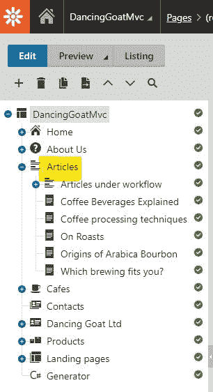
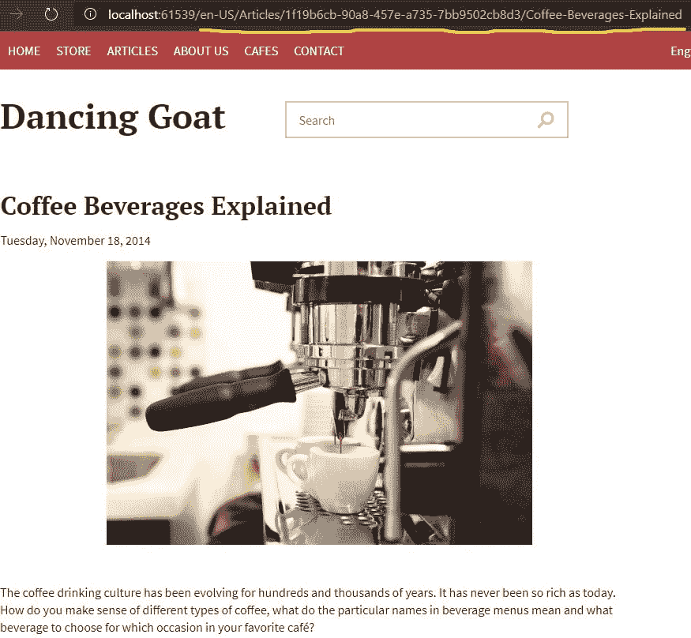
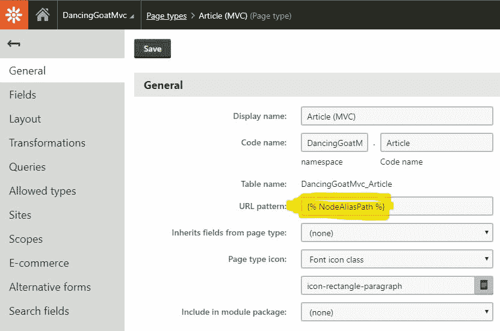

# Kentico 12:设计模式第 10 部分——使用 NodeAliasPath 的 MVC 路由

> 原文：<https://dev.to/seangwright/kentico-12-design-patterns-part-10-mvc-routing-with-nodealiaspath-22l3>

<figure>

[](https://res.cloudinary.com/practicaldev/image/fetch/s--PYeNLJXt--/c_limit%2Cf_auto%2Cfl_progressive%2Cq_auto%2Cw_880/https://thepracticaldev.s3.amazonaws.com/i/ojg9hpamdx8mab6qmh3g.jpg)

<figcaption>Photo by [George Hiles](https://unsplash.com/@hilesy) on [Unsplash](https://unsplash.com)</figcaption>

</figure>

> 庆祝我的 *Kentico 12 -设计模式*系列的第 10 名🎉，我写了一篇长文，描述了一种在我们的 Kentico 12 MVC 应用程序中释放传统门户引擎路由功能的酷方法。请继续阅读！

使用 ASP.NET MVC 技术栈构建 Kentico CMS 应用程序使开发人员能够使用一个很好的框架，并完全控制在 Kentico 内管理的所有内容的交付和呈现。

与该平台以前的版本相比，Kentico 12 MVC 有许多优势(你可以[在这里](https://www.kentico.com/product/kentico12)了解更多信息)，但 Kentico 以前基于 Web 表单的门户引擎架构有一些特性在 MVC 中没有明确的对应项。

有过 Kentico 经验的开发人员可能会发现自己正在寻找的一个特性是，让他们的 MVC 应用程序中的路由与 CMS 内容树中页面的`NodeAliasPath`值一起工作。

对于 Kentico 提供的现成产品来说，这是不可能的😟，但是通过 MVC 框架中的一些关键集成点，我们可以有效地复制这种行为，并构建具有非常动态的路由的站点🙌。

让我们来看一个使用 Kentico demo Dancing Goat 站点的例子，看看默认情况下是如何构建的，然后我们来看看如何实现`NodeAliasPath`驱动的 MVC 路由。

## MVC 驱动的基于约定的路由

### CMS 内容树中的文章

如果我们查看跳舞的山羊演示的内容树，我们可以看到一个名为`Articles`的节点，它是自定义页面类型`Article section (MVC)`的一个实例。

这个页面的存在只是为了组织内容树中的内容——因为它没有“页面”选项卡——并且它在 MVC 应用程序中并不表示为可导航的项目。

[](https://res.cloudinary.com/practicaldev/image/fetch/s--Wyso6VQn--/c_limit%2Cf_auto%2Cfl_progressive%2Cq_auto%2Cw_880/https://thepracticaldev.s3.amazonaws.com/i/a3i9c1ukyn4pgdpxf9w3.jpg)

子页面是自定义页面类型`Article (MVC)`的实例，它们启用了“页面”选项卡——这意味着它们可以通过特定的 URL 模式在 MVC 应用程序中被路由到。

如何处理该页面及其下嵌套内容的路由？

让我们来看看...

### MVC 中的文章

首先，我们注意到在`DancingGoat`应用程序
的`App_Start\RouteConfig.cs`中定义了一条显式路由

```
var route = routes.MapRoute(
    name: "Article",
    url: "{culture}/Articles/{guid}/{pageAlias}",
    defaults: new 
    { 
        culture = defaultCulture.Name, 
        controller = "Articles", 
        action = "Show" 
    },
    constraints: new 
    { 
        culture = new SiteCultureConstraint(), 
        guid = new GuidRouteConstraint() 
    }
); 
```

<svg width="20px" height="20px" viewBox="0 0 24 24" class="highlight-action crayons-icon highlight-action--fullscreen-on"><title>Enter fullscreen mode</title></svg> <svg width="20px" height="20px" viewBox="0 0 24 24" class="highlight-action crayons-icon highlight-action--fullscreen-off"><title>Exit fullscreen mode</title></svg>

该内容的路由配置使用基于 [MVC 约定的路由](http://www.dotnetfunda.com/articles/show/3029/different-types-of-routing-in-aspnet-mvc)(与[属性路由](https://devblogs.microsoft.com/aspnet/attribute-routing-in-asp-net-mvc-5/)相对)。

> 假设我们为这个内容定义了一个显式的路由，它只使用了一个控制器，这不是非常基于约定的——这感觉更像是配置。这很正常——MVC 的路由约定在没有定制的情况下只能走这么远🤷‍♀️.

我们已经可以看到内容的 URL 是如何与 MVC 应用程序路由配置联系在一起的。站点中的所有文章都可以在一个`{culture}/Articles/{guid}/{pageAlias}`路径模式下找到。

我们可以看到，路由参数`{guid}`，也就是树中`Article (MVC)`页面实例的`NodeGuid`，被包含进来是为了确保 MVC 应用程序能够找到正确的页面。

<figure>

[](https://res.cloudinary.com/practicaldev/image/fetch/s--rx5bV18m--/c_limit%2Cf_auto%2Cfl_progressive%2Cq_auto%2Cw_880/https://thepracticaldev.s3.amazonaws.com/i/q47oyq4wmkf15sq90oua.jpg)

<figcaption>An example of a URL for the Article - "Coffee Beverages Explained"</figcaption>

</figure>

> 我们需要用`NodeGuid`来唯一标识一个页面的情况是，在不同的父页面下有多个`Article (MVC)`页面，但是有相同的名称(`{pageAlias}`)，因为`{pageAlias}`表示`NodeAlias`——页面友好名称的“简化”版本。
> 
> `Guid`有点强迫我们去桥接🌉CMS 中的内容管理和 MVC 中的内容交付之间的差距。

我们网站中`Article (MVC)`内容的渲染控制器由`Controllers\ArticlesController.cs`独家处理。

这并不是一件坏事——事实上，对于大多数用例来说，这是有意义的——无论`Article (MVC)`的实例在内容树中的什么位置，我们都希望从数据库中检索它，映射到视图模型，并在 MVC 端以相同的方式呈现。

我希望我们从这个示例中注意到的主要内容如下:

1.  我们使用基于约定的路由，但它看起来更像是基于配置的。
2.  CMS 中的内容编辑器无法配置我们的 URL 模式——上面 URL 模式的`/Articles/`部分是硬编码的。
3.  我们需要在 URL 中插入一个`Guid`值，使它足够独特，以便 MVC 应用程序找到正确的`Article (MVC)`实例- `Guid`对用户来说不是很友好，感觉像是不可避免的。

> 公平地说，Kentico 提供了一种绕过上述#2 的方法，即使用 [MVC 替代 URL](https://docs.kentico.com/k12sp/developing-websites/configuring-page-urls-on-mvc-sites/enabling-alternative-urls-for-pages)，但是这种特性最好用于为营销目的生成好看的 URL，而不是作为所有网站内容的主要 URL 生成。

## 但是规模大吗？

这个由 Kentico 在跳舞的山羊演示现场**呈现的路由设计模式就是一个很好的模式**！它会为你工作得很好！💪

ASP.NET MVC 开发者已经用这种方法开发应用程序十年了，如果它符合你的需求，那么这篇文章的其余部分将只针对教育。

请允许我假设一个场景，上面的路由架构将无法工作。

假设我们的网站上有两个文章作者，Axel 和 Rose，他们都想要自己的虚荣心 URL，其中包含他们的名字，如下所示:

`/axels-coffee-corner/{articleName}`
T1】

Axel 很少写他的文章，所以把他所有的文章嵌套在`/axels-coffee-corner/`下就足够了。

然而，罗斯每天写两次关于咖啡的文章，甚至在周末也是如此(她真的很喜欢咖啡☕和写作📝！)，所以我们想在她的 URL 中添加一个`{month}-{year}`模式，让她的读者知道她的内容有多新鲜。

罗斯还提到，公司里的其他一些人也开始对写咖啡感兴趣，可能想在网站上开辟自己的文章板块...😨

我们现有的 MVC 路由架构存在一些问题。

*   ❌:我们没有很好的方法通过 URL 来区分一个作者的文章和另一个作者的文章——我们只有一种模式:`{culture}/Articles/{guid}/{pageAlias}`。
*   ❌:如果我们在 CMS 中使用一个页面容器(`{month}-{year}`)来组织 Rose 的文章，在 MVC 端解析出这些 URL，然后使用这些值在数据库中查询正确的项目，这将是一件棘手的事情。我们*将*需要使用它们进行查询，因为它们有效地取代了使用`NodeGuid`来保证唯一性。
*   ❌用他们自己的虚荣心 URL 向站点添加任何新的作者都需要在 MVC 应用程序中部署新的路由模式。

我们的要求看起来越来越像 CMS 中的内容组织应该匹配我们用来导航到它的 URL。

我们不想将 URL 解析成逻辑段进行查询，因为一个“完整”的 URL 已经存在于数据库中——即`NodeAliasPath`。

同时，我们希望在 MVC 站点上以同样的方式轻松、一致地呈现内容，而不需要不断地部署路由配置更新。😒

MVC 完全是关于内容交付，而不是内容组织，那么我们如何真正从内容在 CMS 中的组织和 URL 标识中抽象出内容在 MVC 中的呈现呢？🤔

## [用`IRouteConstraint`路由`NodeAliasPath`](#routing-by-raw-nodealiaspath-endraw-with-raw-irouteconstraint-endraw-)

让我们从定义我们需要完成的任务开始:

1.  ✅配置了一条匹配任意`NodeAliasPath`的路由。
2.  如果与给定的`NodeAliasPath`相关联的页面是特定页面类型的实例，则✅只有我们的路由匹配。
3.  ✅将此路由连接到特定的`Controller`和`Action`，它们被编码为处理所需页面类型的页面。

### 配置我们的路线

所有这些需求都可以通过实现`System.Web.Routing.IRouteConstraint`接口来满足。

`IRouteConstraint`有一个方法`Match`，当请求和路由的上下文与我们的需求匹配时，它返回`true`，当不匹配时，返回【T3:】

```
bool Match(
    HttpContextBase httpContext, 
    Route route, 
    string parameterName, 
    RouteValueDictionary values, 
    RouteDirection routeDirection) 
```

<svg width="20px" height="20px" viewBox="0 0 24 24" class="highlight-action crayons-icon highlight-action--fullscreen-on"><title>Enter fullscreen mode</title></svg> <svg width="20px" height="20px" viewBox="0 0 24 24" class="highlight-action crayons-icon highlight-action--fullscreen-off"><title>Exit fullscreen mode</title></svg>

我们将实现`IRouteConstraint`的类的实例分配给我们传递给`constraints`参数的对象中基于约定的路由定义。

```
routes.MapRoute(
    name: "default",
    url: "{controller}/{action}/{id}",
    defaults: new
    {
        controller = "Home",
        action = "Index",
        id = UrlParameter.Optional
    },
    constraints: new
    {
        id = new MyCustomConstraint()
    }); 
```

<svg width="20px" height="20px" viewBox="0 0 24 24" class="highlight-action crayons-icon highlight-action--fullscreen-on"><title>Enter fullscreen mode</title></svg> <svg width="20px" height="20px" viewBox="0 0 24 24" class="highlight-action crayons-icon highlight-action--fullscreen-off"><title>Exit fullscreen mode</title></svg>

在上面的例子中，我们通过实现`MyCustomConstraint`来约束`{id}`路由参数。

它的`Match`方法将作为`string parameterName`参数的值被传递给`"id"`，该值可用于在`RouteValueDictionary values`参数中查找值。

让我们首先定义我们的路线，然后为下面的用例实现`IRouteConstraint`:

```
routes.MapRoute(
    name: "Articles",
    url: "{*nodeAliasPath}",
    defaults: new
    {
        controller = "Articles",
        action = "Show"
    },
    constraints: new
    {
        nodeAliasPath = new NodeAliasPathConstraint(Article.CLASS_NAME)
    }); 
```

<svg width="20px" height="20px" viewBox="0 0 24 24" class="highlight-action crayons-icon highlight-action--fullscreen-on"><title>Enter fullscreen mode</title></svg> <svg width="20px" height="20px" viewBox="0 0 24 24" class="highlight-action crayons-icon highlight-action--fullscreen-off"><title>Exit fullscreen mode</title></svg>

上面我们用非常宽松的 URL 模式`{*nodeAliasPath}`定义了一条路线，它有效地匹配了*每一个 URL* 。

这通常是不好的，因为只有文章的 URL 应该由`ArticlesController.Show`处理，但是这里我们的`NodeAliasPathConstraint`帮助了我们。

该约束以`Article` ( `Article (MVC)`页面类型)类的 Kentico `CLASS_NAME`作为参数，并约束路由模式模板的`nodeAliasPath`令牌以满足其要求。👍

### 定义我们的约束

下面是我们的约束尚未完成的实现:

```
public class NodeAliasPathConstraint : IRouteConstraint
{
    private readonly string nodeClassName;

    public NodeAliasPathConstraint(string nodeClassName) => 
        this.nodeClassName = nodeClassName;

    public bool Match(
        HttpContextBase httpContext, 
        Route route, 
        string parameterName, 
        RouteValueDictionary values, 
        RouteDirection routeDirection)
    {
        // ❗ If we didn't configure the route correctly and no
        // nodeAliasPath was defined in the route URL template
        // we can't match

        if (!values.TryGetValue(parameterName, out object nodeAliasPathObj))
        {
            return false;
        }

        // Converts nodeAliasPathObj into a TreeNode.NodeAliasPath
        // by prefixing with a /

        string nodeAliasPath = $"/{nodeAliasPathObj}";

        // TODO: Determine if nodeAliasPath matches any page in the CMS
        // with a TreeNode.NodeClassName matching our nodeClassName

        return false;
    }
} 
```

<svg width="20px" height="20px" viewBox="0 0 24 24" class="highlight-action crayons-icon highlight-action--fullscreen-on"><title>Enter fullscreen mode</title></svg> <svg width="20px" height="20px" viewBox="0 0 24 24" class="highlight-action crayons-icon highlight-action--fullscreen-off"><title>Exit fullscreen mode</title></svg>

上图中的`NodeAliasPathConstraint`，采用了一个`nodeClassName`，并根据路线值构建了一个`nodeAliasPath`。

我们现在需要查询数据库来检查两个条件:

1.  CMS 中存在一个页面，它的`TreeNode.NodeAliasPath`与当前请求的路由参数捕获的`nodeAliasPath`相匹配。
2.  该页面有一个`TreeNode.NodeClassName`，它与我们的路由可以处理的页面类型相匹配，如`nodeClassName`所定义的。

我们来添加查询数据库的逻辑:

```
// Additional filters (e.g. culture) should be applied as needed

bool isPreview = HttpContext.Current.Kentico().Preview().Enabled;

var node = DocumentHelper.GetDocuments()
    .WhereEquals(nameof(TreeNode.NodeAliasPath), nodeAliasPath)
    .LatestVersion(isPreview)
    .Published(!isPreview)
    .OnSite(SiteContext.SiteName)
    .CombineWithDefaultCulture()
    .TopN(1)
    .Column(nameof(TreeNode.ClassName))
    .FirstOrDefault();

if (node is null)
{
    return false;
}

if (string.Equals(node.ClassName, nodeClassName, StringComparison.OrdinalIgnoreCase))
{
    // ❗ We replace the `nodeAliasPath` route value with the one we prefixed
    // above so that the ArticlesController.Show(string nodeAliasPath)
    // call is passed a correct TreeNode.NodeAliasPath value

    values[parameterName] = nodeAliasPath;

    return true;
}

return false; 
```

<svg width="20px" height="20px" viewBox="0 0 24 24" class="highlight-action crayons-icon highlight-action--fullscreen-on"><title>Enter fullscreen mode</title></svg> <svg width="20px" height="20px" viewBox="0 0 24 24" class="highlight-action crayons-icon highlight-action--fullscreen-off"><title>Exit fullscreen mode</title></svg>

我们想让我们的查询更快🏃‍♀️，因为它将在任何时候被调用，MVC 的路由过程需要知道我们的“任何”路由`"{*nodeAliasPath}"`是否匹配一个特定的 URL。

因此，我们将列限制为`ClassName`，并且只取第一个结果(我们应该只有 1 个)。

如果不存在带有与 URL 匹配的`NodeAliasPath`的页面，我们返回`false`。

如果上面的查询返回一个页面的节点，并且页面的`NodeClassName`与这个路由处理的页面类型不匹配，我们返回`false`。

只有当内容树中存在一个具有匹配的`NodeAliasPath`和`NodeClassName`的页面，并且该页面与提供给约束的构造函数的页面相匹配时，我们才返回`true`。

### 通过缓存优化我们的逻辑

目前，如果我们在多个路由上使用这个约束，所有的路由都使用相同的`"{*nodeAliasPath}"` URL 模板，我们的约束——因此我们的查询——将继续执行，直到成功为止 MVC 检查所请求的 URL 的每个路由执行一次。

例如，在最坏的情况下，有 15 个控制器，每个控制器处理不同的页面类型，我们将有 15 个路由用这个约束的唯一实例来定义。如果最后检查的路由是正确的，那么我们将运行这个查询 15 次。😝该死。

我们的约束也将在相同路由的每个后续 HTTP 请求上被调用(即，您发出一个请求，然后刷新页面)。

当结果已知时，我们不想重复这个不必要的查询！

解决这个性能可伸缩性问题的快速有效的方法是使用缓存。

Kentico 提供了一个`CacheHelper`类来帮助开发人员将项目添加到缓存中，并设置这些缓存项目的依赖关系。

下面是我们对`CacheHelper`的用法:

```
Func<TreeNode> query = () => DocumentHelper.GetDocuments()
    .WhereEquals(nameof(TreeNode.NodeAliasPath), nodeAliasPath)
    .LatestVersion(isPreview)
    .Published(!isPreview)
    .OnSite(SiteContext.SiteName)
    .CombineWithDefaultCulture()
    .TopN(1)
    .Column(nameof(TreeNode.ClassName))
    .FirstOrDefault();

string scope = nameof(NodeAliasPathConstraint);
string cacheItemName = $"{scope}|preview:{isPreview}|" +
    {SiteContext.SiteName}|{nodeAliasPath}" 
var node = CacheHelper.Cache(
    query,
    new CacheSettings(
        cacheMinutes: 5, 
        cacheItemNameParts: cacheItemName)
    {
        GetCacheDependency = () => CacheHelper.GetCacheDependency(new[]
        {
            $"node|{SiteContext.CurrentSiteName}|{nodeAliasPath}"
        })
    });

// Check if node is a match ... 
```

<svg width="20px" height="20px" viewBox="0 0 24 24" class="highlight-action crayons-icon highlight-action--fullscreen-on"><title>Enter fullscreen mode</title></svg> <svg width="20px" height="20px" viewBox="0 0 24 24" class="highlight-action crayons-icon highlight-action--fullscreen-off"><title>Exit fullscreen mode</title></svg>

使用`CacheHelper`将缓存我们查询匹配给定`nodeAliasPath`的`TreeNode`的结果 5 分钟，如果 CMS 更新当前站点匹配`nodeAliasPath`的任何节点，也将清除缓存。

我们现在有了一个可重用的`NodeAliasPathConstraint`类，可以用来约束哪些 URL 匹配我们的 MVC 应用程序定义的所有不同的路由。

由于我们在上面定义的路径匹配一个`Article (MVC)`页面的任何`NodeAliasPath`，我们的`ArticlesController`可以处理内容树中任何地方的任何文章，不管它是如何组织的或者 URL 看起来像什么——只要 URL 是页面的`NodeAliasPath`。

阿克塞尔和罗斯的文章网址都将按照他们预期的方式工作。🤸‍♂️

任何新作者只需要在树中创建一个容器页面，并开始在它下面嵌套新的`Article (MVC)`页面实例。

## 基于约定路由的注意事项

我们基于`NodeAliasPath`的路由正如我们所希望的那样工作，停在这里没有任何问题😅。

然而，按照目前的设计，我们将在 MVC 应用程序中以一堆`RouteCollection.MapRoute()`调用结束，这些调用有效地做着同样的事情，只是方式略有不同。

我们也有我在以前的帖子中提到的“分散的字符串”的问题:

```
defaults: new
{
    controller = "Articles",
    action = "Show"
} 
```

<svg width="20px" height="20px" viewBox="0 0 24 24" class="highlight-action crayons-icon highlight-action--fullscreen-on"><title>Enter fullscreen mode</title></svg> <svg width="20px" height="20px" viewBox="0 0 24 24" class="highlight-action crayons-icon highlight-action--fullscreen-off"><title>Exit fullscreen mode</title></svg>

如果我们把我们的`ArticlesController`重命名为`ArticleController`(不叫`s`)，我们的路线就会中断，除非我们把上面的线更新为`controller = "Article"`😢。

由于我们将约束应用于特定的控制器/动作对，以匹配特定的`NodeAliasPath` / `NodeClassName`对，因此在大多数情况下，我们需要为每个页面类型的“列表”视图和“细节”视图定义一个路由。

如果我们想使用名为`List`的方法而不是`Index`方法来显示文章列表，我们需要更新方法和路由配置😤。

如果我们只有少数几条使用这种约束的路线，那么上述模式将会很好地工作...

但是，这个设计有一个最终形式,它将在我们的应用中优雅地处理我们基于`NodeAliasPath`的跨许多控制器的路由——它将按照我们想要的那样扩展。

如果你敢，请继续阅读！🎃👻

## 终极方法！

### `PageTypeRouteAttribute`

首先，我们将创建一个不基于任何 MVC 类的自定义`Attribute`。

```
[AttributeUsage(AttributeTargets.Method)]
public class PageTypeRouteAttribute : Attribute
{
    public PageTypeRouteAttribute(params string[] classNames) =>
        ClassNames = classNames;

    public string[] ClassNames { get; }
} 
```

<svg width="20px" height="20px" viewBox="0 0 24 24" class="highlight-action crayons-icon highlight-action--fullscreen-on"><title>Enter fullscreen mode</title></svg> <svg width="20px" height="20px" viewBox="0 0 24 24" class="highlight-action crayons-icon highlight-action--fullscreen-off"><title>Exit fullscreen mode</title></svg>

该属性将作为我们所有控制器动作方法的标记，指示该方法支持呈现哪些自定义页面类型。

> 该属性允许多个类名，因为单个动作方法可能以一种非常通用和抽象的方式处理不同的页面类型，只使用它们共同的`TreeNode`属性，或者通过我们创建的自定义接口应用于所有页面类型🧐.

下面是我们如何使用这个属性的例子:

```
// ArticlesController.cs

[PageTypeRoute(Article.CLASS_NAME)]
public ActionResult Index(string nodeAliasPath)
{
    // ...
}

// or maybe HomeController.cs

[PageTypeRoute(Home.CLASS_NAME, "CMS.Root")]
public ActionResult Index(string nodeAliasPath)
{
    // ...
} 
```

<svg width="20px" height="20px" viewBox="0 0 24 24" class="highlight-action crayons-icon highlight-action--fullscreen-on"><title>Enter fullscreen mode</title></svg> <svg width="20px" height="20px" viewBox="0 0 24 24" class="highlight-action crayons-icon highlight-action--fullscreen-off"><title>Exit fullscreen mode</title></svg>

### 更新我们的`NodeAliasPathConstraint`

当我们找到一个`NodeAliasPath`匹配时，我们希望使用标准的 MVC 路由行为，除了我们希望`RouteValueDictionary`中的`"controller"`和`"action"`值来自控制器和带有正确`PageTypeRouteAttribute`的动作，由`NodeClassName`匹配。

我们可以首先移除上面定义的`NodeAliasPathConstraint`的构造函数，因为我们的新实现将用于所有定制页面类型。

我们将使用查询返回的`NodeClassName`值找到正确的控制器和动作来处理请求，使用`PageTypeRouteAttributeCacheHelper` :

```
if (!values.TryGetValue(parameterName, out object nodeAliasPathObj))
{
    return false;
}

string nodeAliasPath = $"/{nodeAliasPathObj as string}";

// Use the same CacheHelper.Cache call to query for matching Node

var node = ...

if (node is null)
{
    return false;
}

if (!PageTypeRouteAttributeCacheHelper
        .ClassNameLookup
        .TryGetValue(nodeClassName, out var pair))
{
    return false;
}

values["action"] = pair.ActionName;
values["controller"] = pair.ControllerName;
values[parameterName] = nodeAliasPath;
values["nodeClassName"] = node.ClassName;

return true; 
```

<svg width="20px" height="20px" viewBox="0 0 24 24" class="highlight-action crayons-icon highlight-action--fullscreen-on"><title>Enter fullscreen mode</title></svg> <svg width="20px" height="20px" viewBox="0 0 24 24" class="highlight-action crayons-icon highlight-action--fullscreen-off"><title>Exit fullscreen mode</title></svg>

> 这个`PageTypeRouteAttributeCacheHelper`类可以在[GitHub Gist 这里](https://gist.github.com/seangwright/d84ef3189d724359c291be2fa463f3b6)找到，因为它太长了，不能放在帖子里。
> 
> 它将反映应用程序中的所有类型，找到`Controller`实例，找到那些带有`PageTypeRouteAttribute` s 的控制器上的所有动作，最后将 ActionName/ControllerName `struct`添加到带有`PageTypeRouteAttribute.ClassNames`值作为键的`Dictionary`中。
> 
> 理想情况下，查找将由实现接口的服务来执行，该接口被注入到`NodeAliasPathRouteHandler`的构造函数中，以使其更具可测试性。我将把这个留给读者🤓！

### 登记我们的路线

我们现在只需要注册一条使用`NodeAliasPathConstraint`的路由。

```
routes.MapRoute(
    name: "NodeAliasPath",
    url: "{*nodeAliasPath}",
    defaults: null,
    constraints: new
    {
        nodeAliasPath = new NodeAliasPathConstraint()
    }); 
```

<svg width="20px" height="20px" viewBox="0 0 24 24" class="highlight-action crayons-icon highlight-action--fullscreen-on"><title>Enter fullscreen mode</title></svg> <svg width="20px" height="20px" viewBox="0 0 24 24" class="highlight-action crayons-icon highlight-action--fullscreen-off"><title>Exit fullscreen mode</title></svg>

### 更新 CMS 页面类型配置

我们要做的最后一件事是将`Article (MVC)`页面类型的“URL 模式”字段更改为``。

[](https://res.cloudinary.com/practicaldev/image/fetch/s--lvZD4Mfn--/c_limit%2Cf_auto%2Cfl_progressive%2Cq_auto%2Cw_880/https://thepracticaldev.s3.amazonaws.com/i/yp1kpellm5p235m5ld6p.jpg)

这将确保当我们在内容树中查看文章页面的“页面”选项卡时，它将向 MVC 应用程序发送正确的请求——使用`NodeAliasPath`作为 URL——并使用我们上面构建的所有内容呈现页面。

## 何去何从

我们可以在任意多的自定义页面类型上使用这种模式，并且我们可以保证，无论您将内容放在树的哪个位置，都会选择正确的控制器和动作👏。

我们还可以确信，CMS 内容树的组织结构和所有页面的名称将反映在用于访问 MVC 应用程序⚡.中的内容的 URL 中

我们在 [WiredViews](https://www.wiredviews.com) 中使用的一个模式是为每种内容页面类型的“列表页面”创建一个自定义页面类型。

因此，与上面的`Article (MVC)`示例类似，`Article section (MVC)`将启用“页面”选项卡。

我们将配置`ArticlesController`如下:

```
[PageTypeRoute(ArticleSection.CLASS_NAME)]
public ActionResult Index(string nodeAliasPath)
{
    // ...
} 
```

<svg width="20px" height="20px" viewBox="0 0 24 24" class="highlight-action crayons-icon highlight-action--fullscreen-on"><title>Enter fullscreen mode</title></svg> <svg width="20px" height="20px" viewBox="0 0 24 24" class="highlight-action crayons-icon highlight-action--fullscreen-off"><title>Exit fullscreen mode</title></svg>

MVC 应用程序中的每个文章部分都将由相同的逻辑呈现，但是可以在内容树中的任何地方创建不同的部分，每个部分都有自己的`NodeAliasPath`用作呈现其内容的 URL💪。

示例:

设想我们有一个“文章容器”->“文章作者”->“文章”的内容层次结构:

可以列出我最近写的前 10 篇文章。
`/Company-Articles/Moe-Tucker`会列出最近的十大萌。
`/Company-Articles/Moe-Tucker/How-To-Make-Coffee`将是门门的一篇具体文章。
`/Guest-Articles/Exene-Cervenka/Rock-And-Roll-Coffee`会显示 Exene 的客串文章。

对于相同的内容类型能够有多个“家”,并且不必担心调整 MVC 路由，这是一个非常强大的功能🚀🤘！

两个额外津贴，我不会在这里讨论，是:

*   能够通过使用页面的`NodeAliasPath`更容易地生成动态菜单，而不是通过 MVC 的 API 生成 URL。
*   使用`NodeAliasPath`为通常对生成 URL 有复杂要求的页面创建 XML 站点地图。使用`NodeAliasPath`还可以简化我们获取站点地图数据所需的查询——对于所有文档，URL、图像和修改日期*可以来自同一个`DocumentQuery`,而不管页面类型。*

## 总结

好吧，那很久了...但是如果你在知道我喜欢深入挖掘设计模式、Kentico 和 ASP.NET MVC 之前读过我的帖子——那么，抱歉#不抱歉🤣。

在我们的 Kentico 12 MVC 应用程序中，我们有一个基于`NodeAliasPath`的路由解决方案，但是我们到底完成了什么？

*   ✅我们将基于`NodeAliasPath`的 URL 功能从 Kentico CMS 门户引擎网站调整到了 Kentico 12 MVC，因此内容编辑可以控制 URL。
*   ✅我们使得页面类型在 CMS 中有多个主目录成为可能，而不会增加 MVC 路由配置的复杂性。
*   ✅:我们做了一个易于重用的`Attribute`，它清楚地定义了什么内容与哪个控制器动作相关联。
*   ✅:我们利用 Kentico 的缓存 API 来确保我们经常调用的路由约束不会影响站点性能。

我很乐意从所有正在构建 Kentico 12 MVC 应用程序的 Kentico 开发人员那里得到关于这种模式的反馈。

我知道 Kentico 计划在 Kentico 2020 年增加一个“动态路由”解决方案，但是因为我们不在那个美妙的瓦尔哈拉里🌞ASP.NET 核心 Kentico 还没有，我们 Kentico 开发人员有时需要发挥创造力。

感谢阅读🙏！

* * *

如果您正在寻找更多的 Kentico 内容，请在 DEV:

## # [肯蒂科](https://dev.to/t/kentico) <button name="button" type="button" data-info="{&quot;className&quot;:&quot;Tag&quot;,&quot;style&quot;:&quot;full&quot;,&quot;id&quot;:5339,&quot;name&quot;:&quot;kentico&quot;}" class="crayons-btn follow-action-button whitespace-nowrap c-btn--secondary fs-base " aria-label="Follow tag: kentico" aria-pressed="false">跟随</button>

或者我的 Kentico 博客系列:

*   [Kentico 12:设计模式](https://dev.to/search?q=Kentico%2012%20-%20Design%20Patterns)
*   [Kentico CMS 快速提示](https://dev.to/search?q=Kentico%20CMS%20Quick%20Tip)