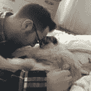

# 做出积极的小改变:5 个简单的例子

> 原文：<https://dev.to/cubiclebuddha/making-small-positive-changes-5-easy-examples-4ff6>

我们都知道这个交易——如果你想减掉 20 磅，从减掉 1 磅开始。但是我怎么减 1 斤呢？如果你想成为一名小提琴手，从学习一首歌开始。但是你会想，“我该怎么激励自己开始呢？”

有时候，做出改变的最佳方式是消除障碍。上例，不买小提琴怎么学小提琴？也许我一直告诉自己，我不能买小提琴，因为我需要存钱买更有价值的东西。那么，为什么不考虑租一把小提琴，这样你就有高回报低风险了？这释放了压力。

### 一小步就有回报的例子

最近，当我试图设定一个目标去读更多的书时，我体验到了解除路障的力量。我喜欢阅读。或者至少我告诉自己我喜欢。但是我真正坐下来阅读的频率是多少呢？大概一年两次。至少这是我过去阅读书的频率，直到我:

*   给自己买了一个书架
*   给自己买了一盏充电非常方便的阅读灯

现在我没有借口了，我一直在看书。在我抽出几分钟阅读时间的日子里，我变得更快乐、更放松——因为阅读帮助我平静我的心灵。这只花了我很少的钱，但它带来了更大的变化。

> “有了正念和专注能量，你可以迈出一步。如果你能迈出一步，你就能迈出一步又一步。”
> 
> ~一行禅师

### 其他小步骤的例子

所以，如果你想做一个大的改变，试着先做一个小的改变。

*   ***担心自己可怕的姿势？*** 一个生活帮包括起床，而不是以无精打采的姿势躺在床上看手机。所以诀窍是把你的手机插到一个插座上，这个插座离你的床很远，所以你必须起床关掉你的闹钟。
*   ***担心转行？参加一些你感兴趣的辅导课程，比如在线编程课程。障碍是课程的成本或材料，所以就这么做吧。不，我不是说要投入大量资金，但有时你必须投入一点现金，即使是 PluralSight(或任何在线课程网站)的试用会员。***
*   _ **感觉精力不足？** _ 在正确的时间吃早餐和晚餐。已经证明，每当你推迟平时的进食时间，皮质醇(压力荷尔蒙)就会被引入体内。因此，如果你经常感到饥饿，随身携带一盒低血糖能量棒。简单的购买食物的行为是一个简单的方法来实现你的目标。记住，你不只是一个罐子里的大脑。你必须吃东西，这样你才能照顾好你的身体！
*   ***感觉自己一天刷牙永远不会超过 2 次？*** 买一把牙刷和一支旅行用的牙膏，把它们放在你能放的每一个地方。如果你的办公桌上有一个，那么也许有一天你会记得在结对编程之前或者在你吃了臭鱼午餐之后使用它。
*   ***感觉酸痛？多穿几层。*** 这是对我不可思议的妻子的赞美，她比我先意识到我经常感冒。但有趣的是，我没有意识到轻微的寒冷对我的健康和幸福有着重大的负面影响，因为灵活性降低导致了我肩膀和脖子的肌肉拉伤。经过一个冬天的尝试，我穿了许多舒适、漂亮的多层连帽衫和羊毛衫，到了春天，我发现自己的健康状况好了很多。没有比这更小的了。
*   ***工作中失去信心？*** 报名参加网上课程或订阅。如果你发现自己对每月支付给 PluralSight、LinkedIn Learning 或 EggHead.io 的金额感到紧张，那么你可能会更有动力花时间自学。随着教育而来的是自信和骄傲。

### 犯错没关系

迈出一步感觉更好的最好方法之一是原谅自己的过去。这比看起来容易:

 [## 通过学会爱坏习惯来改正坏习惯:敏捷回顾

### 隔间佛 5 月 15 日 195 分钟阅读

#beginners #productivity #career #explainlikeimfive](/cubiclebuddha/fixing-bad-habits-by-learning-to-love-them-agile-retrospectives-1o2g)

### 你迈出的最好的一步是什么

这些只是一些想法。有时候你只需要一点点东西就可以开始，虽然它们可能只涉及很小的成本或对你一天的微小改变，但随着时间的推移，它们会产生巨大的影响。我们很乐意听到你有类似的经历，所以请通过[推特](https://twitter.com/cubiclebuddha)、[脸书](https://facebook.com/cubiclebuddha)和 [Instagram](https://instagram.com/cubiclebuddha) 联系我们。哪一小步帮助你做出了最大的改变？