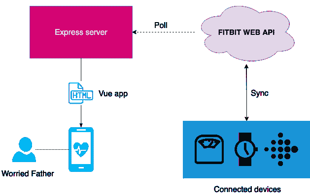
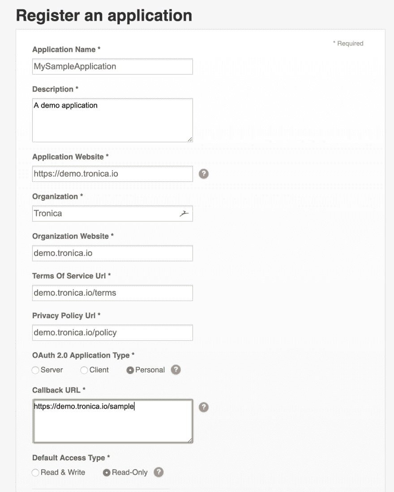
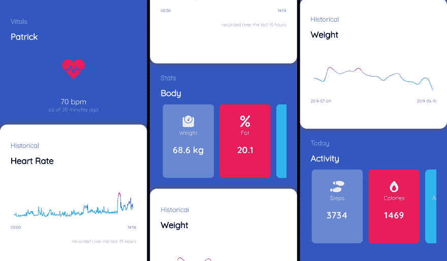
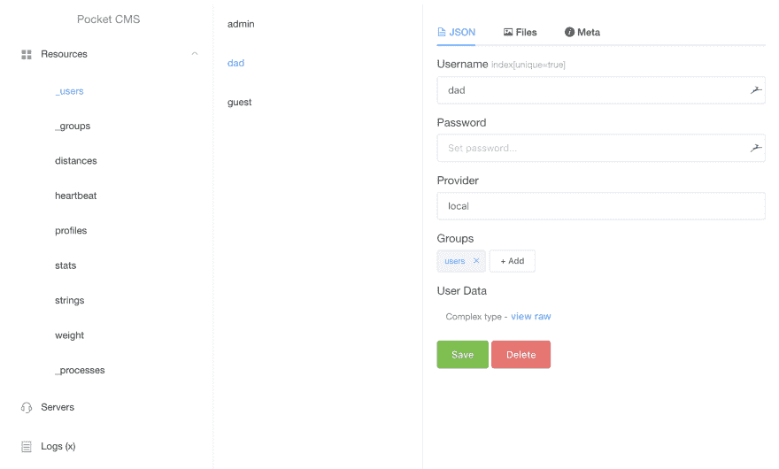

# 在云上发布我的生命体征

> 原文：<https://dev.to/patrixr/publishing-my-vitals-over-the-cloud-132e>

在一个过度保护和担忧的父亲的陪伴下长大，我的离开从来没有让他好过。

在多年回复定期评估我健康状况的短信后，我决定尝试一种不同的方法。

## 项目

这个想法是建立一个仪表板，我的父亲可以定期检查，以确保我活着，很好。希望减少他对我不可避免的厄运的焦虑和偏执。

我决定利用我对 Fitbit 产品的热情和我对云的理解来构建这个。

我选择了 VueJS + ExpressJS 技术栈来实现快速原型开发。详情随时可以在我的 [github](https://github.com/patrixr) 上找到。

这是这个概念的一个非常基本的图表

[](https://res.cloudinary.com/practicaldev/image/fetch/s--8Ls8LAlk--/c_limit%2Cf_auto%2Cfl_progressive%2Cq_auto%2Cw_880/https://files.tronica.io/manual-uploads/vitals_diagram.png)

## 使用 Fitbit API

有了连接的秤和腕带， [Fitbit API](https://dev.fitbit.com/build/reference/web-api/) 让我可以访问大量数据点:

*   心率
*   日常活动
*   步伐
*   身体(体重/脂肪/身体质量指数)
*   睡眠信息
*   还有更多

目标是让我们的服务器通过 api 定期检索数据。

### 第一步:注册应用程序

首先，让我们去 Fitbit 开发者控制台[注册一个应用程序](https://dev.fitbit.com/apps/new)。

这将为我们提供一个 **OAuth2** 认证所需的`CLIENT_ID/CLIENT_SECRET`密钥对。

**重要**:

**详细的**心率数据，也被称为*“心率日内时间序列”*，目前只能通过**个人** app 类型获得，我们今天正在使用。

鉴于此项目仅显示数据，应用程序应标记为**只读**。

[](https://res.cloudinary.com/practicaldev/image/fetch/s--l7uxszhm--/c_limit%2Cf_auto%2Cfl_progressive%2Cq_auto%2Cw_880/https://files.tronica.io/manual-uploads/vitals_fitbit_app_screenshot.png)

### 第二步:认证

为了快速、轻松地进行身份验证，我使用了 [passport-fitbit-oauth2](https://www.npmjs.com/package/passport-fitbit-oauth2) 模块。

#### 创建策略

```
 const Strategy = new FitbitStrategy({
  clientID:     config.CLIENT_ID,
  clientSecret: config.CLIENT_SECRET,
  callbackURL:  config.CALLBACK_URL,
  scope: [
    'sleep', 'weight', 'activity',
    'heartrate', 'location', 'profile',
    'nutrition', 'social'
  ]
}, (access_token, refresh_token, profile, done) => {
    // store the tokens
    done( ... );
}) 
```

<svg width="20px" height="20px" viewBox="0 0 24 24" class="highlight-action crayons-icon highlight-action--fullscreen-on"><title>Enter fullscreen mode</title></svg> <svg width="20px" height="20px" viewBox="0 0 24 24" class="highlight-action crayons-icon highlight-action--fullscreen-off"><title>Exit fullscreen mode</title></svg>

#### 挂接到 ExpressJS

```
passport.use(Strategy);

const authenticate = passport.authenticate('fitbit', {
  session: false,
  successRedirect: '/',
  failureRedirect: '/error'
});

app.get('/login', once, authenticate);
app.get('/callback', once, authenticate); 
```

<svg width="20px" height="20px" viewBox="0 0 24 24" class="highlight-action crayons-icon highlight-action--fullscreen-on"><title>Enter fullscreen mode</title></svg> <svg width="20px" height="20px" viewBox="0 0 24 24" class="highlight-action crayons-icon highlight-action--fullscreen-off"><title>Exit fullscreen mode</title></svg>

访问令牌最终**到期**，这可以通过从 API 返回一个`401`来检测。示意我们继续进行[令牌刷新](https://dev.fitbit.com/build/reference/web-api/oauth2/#refreshing-tokens)。

### 第三步:检索数据

现在我们有了 Fitbit **访问令牌**，我们可以开始调用他们的 Web API。

下面是一个如何检索今天的“当天心率时间序列”的示例:

```
GET https://api.fitbit.com/1/user/-/activities/heart/date/today/1d/1min.json 
```

<svg width="20px" height="20px" viewBox="0 0 24 24" class="highlight-action crayons-icon highlight-action--fullscreen-on"><title>Enter fullscreen mode</title></svg> <svg width="20px" height="20px" viewBox="0 0 24 24" class="highlight-action crayons-icon highlight-action--fullscreen-off"><title>Exit fullscreen mode</title></svg>

然后，服务器返回以下 JSON :

```
{  "activities-heart-intraday":  {  "dataset":  [  {  "time":  "00:01:00",  "value":  64  },  {  "time":  "00:02:00",  "value":  63  },  //...  ],  "datasetInterval":  1,  "datasetType":  "minute"  }  } 
```

<svg width="20px" height="20px" viewBox="0 0 24 24" class="highlight-action crayons-icon highlight-action--fullscreen-on"><title>Enter fullscreen mode</title></svg> <svg width="20px" height="20px" viewBox="0 0 24 24" class="highlight-action crayons-icon highlight-action--fullscreen-off"><title>Exit fullscreen mode</title></svg>

## 构建仪表板

由于这是一个充满激情的项目，我引入了一些我喜欢的库来快速启动。

*   [Vue](https://vuejs.org) 作为框架，舒适的选择
*   [Vue 趋势](https://github.com/QingWei-Li/vue-trend)显示光滑的图形
*   [字体牛逼](https://fontawesome.com)为图标，经典
*   [Animate.css](https://daneden.github.io/animate.css/) 专为心跳动画制作

经过一点布线，以下诞生了:

[](https://res.cloudinary.com/practicaldev/image/fetch/s--GbR-muT4--/c_limit%2Cf_auto%2Cfl_progressive%2Cq_auto%2Cw_880/https://files.tronica.io/manual-uploads/vitals_app_screenshot_montage_large.png)

## 保护应用程序

这个网络应用程序暴露了我的非常私人的数据，特别是我的脂肪百分比，可以看到在圣诞节前后飙升。

出于这个原因，我安装了自己的微型 CMS ( [Pocket](https://github.com/patrixr/pocket-cms) )，它为我提供了用户、访问控制和开箱即用的管理面板。

[](https://res.cloudinary.com/practicaldev/image/fetch/s--xrjQxweg--/c_limit%2Cf_auto%2Cfl_progressive%2Cq_auto%2Cw_880/https://files.tronica.io/manual-uploads/vitals_pocket_admin_screenshot.png)

## 改进思路

以下是我正在考虑或已经考虑的一些事情:

*   我的营养(需要我输入我吃的所有东西)
*   提醒我喝水的按钮
*   我的位置，这可能有点过了

## 结论

尽管这个项目非常小和简单，但我喜欢通过技术让家庭成员更幸福的概念。

我很想听听你在编写幸福代码方面的想法和经验。

干杯，

帕特里克(男子名)