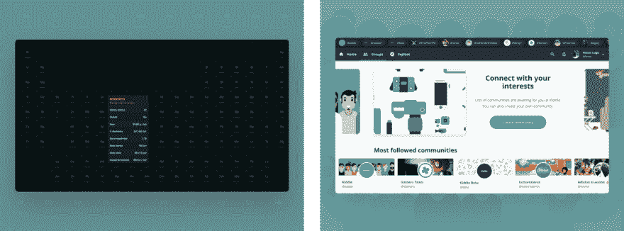
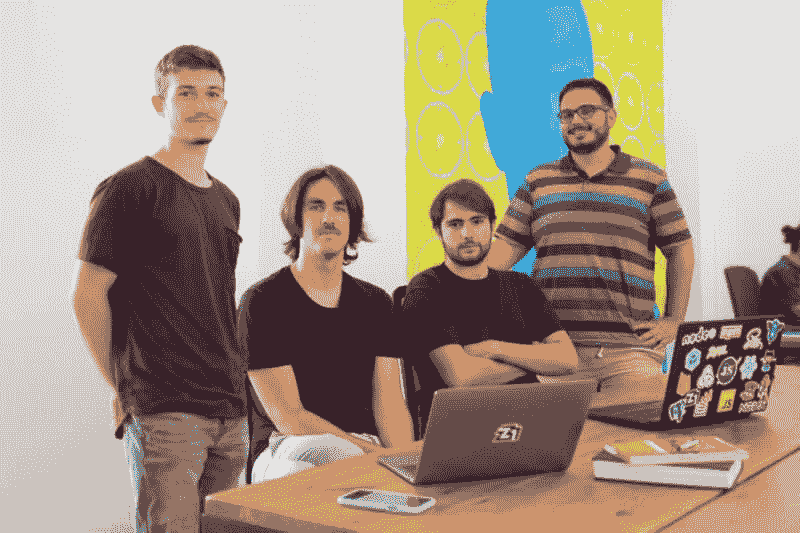

# 为你的软件实习选择一个酷公司的重要性

> 原文：<https://dev.to/horusgoul/the-importance-of-choosing-a-cool-company-for-your-software-internship-2n7p>

**我在完成职业培训之前就加入了 Z1 实验室团队，参与涉及初创公司的项目，并学到了技术之外的重要课程。**

我喜欢创业的场景，我认为小公司出现在市场上，用比大公司少得多的人力和资源提供更好的产品，这是令人惊讶的。这就是为什么我脑子里总是有几个关于成功创业的问题:

> 创始人是怎么做的？创业公司如何把创意变成令人惊艳的产品？我是否有足够的技能来参与这个过程？

这些问题让我在 2018 年 11 月，在塞维利亚寻找一家创业公司进行实习。

在我研究的初期，我发现自己迷失在一大堆过时的公司中，这些公司不符合我心目中的创业想法。日子一天天过去，我开始想，我最终会在一个庞大的层级结构中的底层公司工作，从事我不感兴趣的项目。

就在那时，我的一位老师提到了 [Z1](https://z1.digital) ，当时[将其命名为 Commite](https://medium.com/z1digitalstudio/we-are-z1-57754161359b) 。首先引起我注意的是他们的网站和展示的产品。**每样东西都很漂亮，而且做工精细**，他们甚至列出了每个项目使用的技术堆栈，这是我在其他本地公司不习惯看到的。看到这一切后，我做的下一件事是在 LinkedIn 上直接联系 Hector (Z1 的首席执行官)。

我开门见山地告诉他，我很想加入 Z1 团队。这可能看起来很时髦，但它确实有效，六个月后，我以实习生的身份加入了 Z1 实验室团队。

我与赫克托联系的方式，让他们很容易就在我的 LinkedIn 个人资料上列出了我创建的、我感到自豪的兼职项目。其中一个项目是 [Atom](https://atom.horuslugo.com) ，这是我在 2015 年开发的一个应用程序，从那以后已经有超过 4 万名学生在使用它，或者是 Kiddle，一个社交网络 Twitter——看起来像我多年来建立的。Atom 和 Kiddle 都带我面对了很多挑战，学习了不同的技术，比如 Typescript、React、Redux、Node.js 和 PostgreSQL。

### 加入团队

我于 2019 年 3 月开始与[伊万·科罗纳多](https://medium.com/@ivancoronado) (Z1 的实验室负责人)在*城市逃生*中直接合作，这是一个试图利用增强现实将城市改造成逃生室的项目(仍在进行中！！).

几周后，[路易斯·阿达姆](https://www.linkedin.com/in/luis-adame-rodriguez/)、[赫苏斯·巴斯克斯](https://www.linkedin.com/in/jes%C3%BAs-v%C3%A1zquez-rosa/)和[坎迪多·巴奎罗](https://www.linkedin.com/in/candidobaquero/)分别以全栈开发者和 UX 设计师的身份加入了实习计划。从那以后，我们在《城市逃亡》中合作，也在修改版的[制作一个应用程序](https://howmuchtomakeanapp.netlify.com)，以及像 [Moodboads](https://moodboards.z1.digital) 或 [Ganttify](https://gantt.z1.digital) 这样的内部工具中合作。

> 制作数字产品很有趣，因为你有机会在使用技术的同时解决各种问题。

### 前沿技术

为了完成这些项目，我们选择了 React 和 Serverless 以及 Now.sh 和 Firebase 等。在 Z1 实验室，我们不断尝试新技术。在将它们直接用于客户之前，这是检查它们性能的好方法。**现在我们正在用 TensorFlow 研究机器学习，GraphQL 是我们的下一个目标**。

> 你绝对应该看看这个由护航队网络平台负责人詹姆斯·雷吉欧的演讲👇

[https://www.youtube.com/embed/IxmrRiA9Gso](https://www.youtube.com/embed/IxmrRiA9Gso)

### 软硬兼施。

但不仅仅是技术。在实习期间，我还学到了三个重要的经验:

*   **属于多学科团队**，设计师的工作量和开发人员一样大，每个人的工作都同样重要，
*   知道如何使用技术**让你快速迭代，同时创造高质量的体验**，这对客户和最终用户来说是至关重要的，
*   并且**不害怕表达我对项目**的想法。我可能刚刚离开学校，但我的想法一直在考虑。

除此之外，Z1 提供英语课程，因此我们可以练习口语，同时就哲学、趋势、新闻等进行有趣的对话。我认为这很酷，因为除了提高你的英语水平，你还能真正了解你的同事。

[")](https://res.cloudinary.com/practicaldev/image/fetch/s--NCi4KYWW--/c_limit%2Cf_auto%2Cfl_progressive%2Cq_auto%2Cw_880/https://thepracticaldev.s3.amazonaws.com/i/kf0s30gs4x345yz63j9v.jpeg)

由于团队的一部分人是远程工作的(我们在纽约、温哥华、卡斯特利翁或穆尔西亚都有同事)，Z1 还负责为您拍摄精美的照片，您可以在 Slack(我们的主要沟通渠道)和其他社交媒体平台上使用。

这很棒，因为一开始，我很难把名字和面孔联系起来(到目前为止，这是一个 40 人的团队！)，所以每次我对某人的名字有疑问时，我只需看看他们在 Slack 上的照片。

我想强调的另一件事是**Z1 重视通过定期组织活动在工作场所进行社交**。在过去的三个月里，他们举行了一次烧烤、一次肉菜饭、一些早餐、一次足球锦标赛，以及每周五 13:15 举行的每周一次的活动:“San Litro y Papas”，在这里，每个人都停下工作去喝啤酒、吃薯片😂。

我真的很喜欢在 Z1 工作的经历，我建议任何寻找实习机会的人联系这家工作室，因为它将帮助你在享受乐趣的同时提升你的职业生涯**(你可以在 [Z1 职业页面](https://z1.digital/careers)查看当前有哪些职位空缺，或者直接发电子邮件到 [careers@z1.digital](mailto:careers@z1.digital) )。**

最后但并非最不重要的建议:Z1 在社交媒体上非常活跃。他们在 [Twitter](https://twitter.com/z1digitalstudio) 、 [LinkedIn](https://www.linkedin.com/company/z1digitalstudio/) 、 [Instagram](https://www.instagram.com/z1digitalstudio/) 、 [GitHub](https://github.com/z1digitalstudio) 和 [Dribbble](https://dribbble.com/z1) 。开始关注他们，寻找有趣的资源和关于烤箱里有什么的更新！

*也发表在 [Z1 的培养基](https://medium.com/z1digitalstudio/software-intern-z1lab-22f53971a3a0)上。*