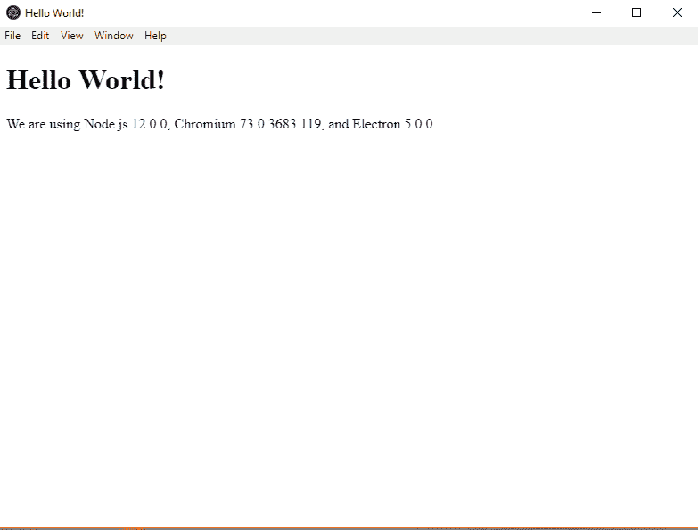

# Slack / GitKraken / Discord 电子加载屏幕教程

> 原文：<https://dev.to/nicolalc/slack-gitkraken-discord-electron-loading-screen-tutorial-3k5n>

# 电子浮屏

## 简介

本教程讲述了使用电子创建浮动屏幕，特别是一个不和谐/松弛/ GitKraken 一样的加载屏幕。

[Electron](https://electronjs.org/) 是一个创新的系统，允许您创建桌面/移动应用程序，充分利用 web 应用程序的所有功能、舒适性和质量。

## 作者

我的名字是[尼古拉·卡斯泰拉尼](https://www.linkedin.com/in/nicola-castellani-313b9084/)，我是一名来自 2018 年的自由职业 fullstack 开发者(BE 40% FE 60%)。我主要处理 REACT 和 Angular web 应用程序，但也处理 3D 内容，如游戏、多媒体应用程序和 webgl 内容。

## TL；速度三角形定位法(dead reckoning)

如果您想跳过本教程，可以从这个库的[开始。](https://github.com/NicolaLC/ElectronFloatingScreen)

## 入门

首先，遵循电子的官方指南，我们被建议从他们的**样板**开始:

1.  让我们克隆并构建基本的电子项目:

```
git clone https://github.com/electron/electron-quick-start 
```

1.  移动到根目录:

```
cd electron-quick-start 
```

1.  安装依赖项

```
npm install 
```

1.  启动项目

```
npm start 
```

如果一切顺利，一个电子窗口的 Hello World 将会打开！

[](https://res.cloudinary.com/practicaldev/image/fetch/s--M76wk6b8--/c_limit%2Cf_auto%2Cfl_progressive%2Cq_auto%2Cw_880/https://github.com/NicolaLC/ElectronFloatingScreen/blob/master/electron-quick-start/assets/tutorial/test01.PNG%3Fraw%3Dtrue)

## 创建加载屏幕

现在我们已经成功地开始了一切，我们只需要继续创建加载屏幕。

在项目文件夹中，在文件 **main.js** 中，你会发现一个方法 **createWindow** ，它负责通过加载项目的**index.html**文件来创建主*浏览器窗口*。

创建加载屏幕的过程非常简单，实际上需要创建第二个*浏览器窗口*，它加载一个单独的 **html** 文件，为了方便起见，我们称之为【loading.html】的**。**

 **让我们继续创建这个屏幕:

1.  为我们的加载屏幕创建一个单独的目录:

```
mkdir windows/loading
cd windows/loading 
```

1.  为加载屏幕创建 html 文件:

```
echo >> loading.html 
```

1.  我们可以复制并粘贴 index.html 文件中的内容，或者根据我们的需要创建一个 html 文档。在第一步中，我们复制 index.html 文件的内容:

```
<!DOCTYPE html>
<html>
  <head>
    <meta charset="UTF-8" />
    <title>Hello Loading World!</title>
  </head>
  <body>
    <h1>Hello Loading World!</h1>
    <!-- All of the Node.js APIs are available in this renderer process. -->
    We are using Node.js
    <script>
      document.write(process.versions.node);</script
    >, Chromium
    <script>
      document.write(process.versions.chrome);</script
    >, and Electron
    <script>
      document.write(process.versions.electron);</script
    >.

    <script>
      // You can also require other files to run in this process
      require('./renderer.js');
    </script>
  </body>
</html> 
```

1.  一旦创建了 loading.html 文件，我们需要修改 main.js 文件，以便它首先加载加载屏幕，然后加载主屏幕:

```
/// Before
app.on('ready', createWindow); 
```

```
/// After
app.on('ready', () =>
  createLoadingScreen();
  /// for now, let's comment this
  /// createWindow();
); 
```

通过这种方式，应用程序在准备就绪时将调用 **createLoadingScreen** 方法，这将在后面定义。

1.  **createLoadingScreen** 方法的定义。这个方法允许我们实例化一个二级窗口，用于加载:

```
/// create a global var, wich will keep a reference to out loadingScreen window
let loadingScreen;
const createLoadingScreen = () => {
  /// create a browser window
  loadingScreen = new BrowserWindow(
    Object.assign({
      /// define width and height for the window
      width: 200,
      height: 400,
      /// remove the window frame, so it will become a frameless window
      frame: false,
      /// and set the transparency, to remove any window background color
      transparent: true
    })
  );
  loadingScreen.setResizable(false);
  loadingScreen.loadURL(
    'file://' + __dirname + '/windows/loading/loading.html'
  );
  loadingScreen.on('closed', () => (loadingScreen = null));
  loadingScreen.webContents.on('did-finish-load', () => {
    loadingScreen.show();
  });
}; 
```

在主目录(电子快速启动)中，如果我们启动命令 **npm start** ，应用程序将从加载屏幕开始呈现，目前没有样式，所以您将只能看到 html 文件的字符串。让我们继续我们教程中最有创意的部分，浮动加载屏幕的创建！

## 加载屏幕定制

在这一点上，我们只需要创建一个体面的加载屏幕。

1.  打开文件*loading.html*，为页面定义布局、样式等:

```
<!DOCTYPE html>
<html>
  <head>
    <meta charset="UTF-8" />
    <title>FLOATING LOADING SCREEN</title>
    <style>
      /* Define the main wrapper style */
      .LoaderWrapper {
        position: absolute;
        top: 0;
        left: 0;

        width: 100%;
        height: 100%;

        display: flex;
        align-content: center;
        justify-content: center;
        align-items: center;
        justify-items: center;

        box-sizing: border-box;
        background-color: black;
      }

      .LoaderContent {
        color: white;
      }
    </style>
  </head>
  <body>
    <div class="LoaderWrapper">
      <div class="LoaderContent">
        FLOATING SCREEN!
      </div>
    </div>

    <script>
      // You can also require other files to run in this process
      require('./renderer.js');
    </script>
  </body>
</html> 
```

结果如下:

[](https://res.cloudinary.com/practicaldev/image/fetch/s--beAvIls2--/c_limit%2Cf_auto%2Cfl_progressive%2Cq_auto%2Cw_880/https://github.com/NicolaLC/ElectronFloatingScreen/blob/master/electron-quick-start/assets/tutorial/test02.PNG%3Fraw%3Dtrue)

显然这是一个例子，你可以在不同的文件中分离样式和逻辑，为了简单起见，我们暂时把所有的东西都放在一个文件中。

**加**我强烈推荐使用单元 **rem** (Responsive em)，来管理任何与元素 **root** 的字体大小相关的响应行为；

1.  一旦我们创建了加载屏幕(把它想象成一个 html 页面，你可以做任何你想做的事情，添加预加载器、图像、svg、webgl 等等)，我们需要管理窗口的 **dispose** 事件，主窗口将在那里显示。

返回到文件 **main.js** ，在函数 **createWindow** 中，添加以下内容:

```
[...]
/// keep listening on the did-finish-load event, when the mainWindow content has loaded
mainWindow.webContents.on('did-finish-load', () => {
  /// then close the loading screen window and show the main window
  if (loadingScreen) {
    loadingScreen.close();
  }
  mainWindow.show();
}); 
```

为了确保窗口在加载时不会显示，我们需要回顾一下它的实例化方式:

```
mainWindow = new BrowserWindow({
  width: 800,
  height: 600,
  webPreferences: {
    nodeIntegration: true
  },
  /// show to false mean than the window will proceed with its lifecycle, but will not render until we will show it up
  show: false
})
[...] 
```

1.  一旦我们定义了加载屏幕和主窗口的创建和处理，我们需要恢复对 **createWindow** 函数的调用:

```
[...]
app.on('ready', () => {
  createLoadingScreen();
  /// add a little bit of delay for tutorial purposes, remove when not needed
  setTimeout(() => {
    createWindow();
  }, 2000);
})
[...] 
```

通过再次运行 **npm start** 命令，您可以检查加载屏幕操作，它保持可见大约 2 秒钟，然后被破坏，以显示主窗口。

## 结论

本教程到此结束，通过这种方式，你还可以创建对话框或辅助窗口，它们可以根据主窗口来创建和销毁。

例如，在我的上一个项目中，我重新访问了显示为 **alert()** 或 **confirm()** 的默认窗口，从主窗口中截取 javascript 事件，从而为托管应用程序的操作系统创建了更加漂亮和一致的窗口。**