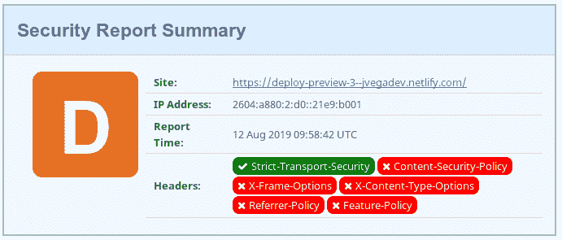
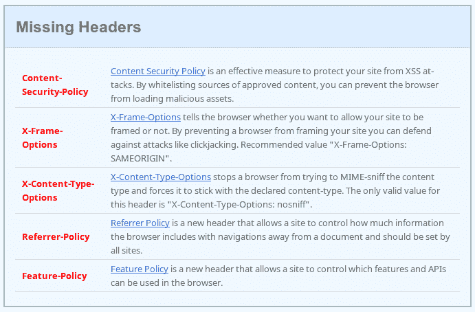
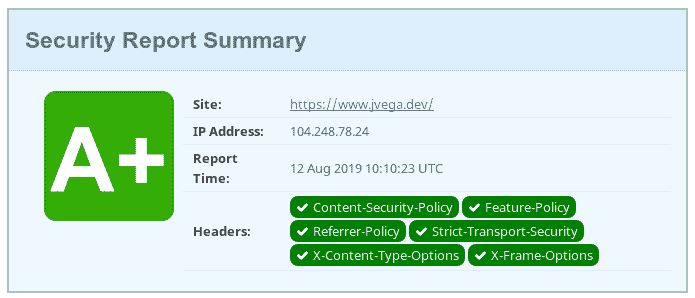

# 通过在 Netlify(和 Zeit Now)中添加额外的 HTTP 头来确保网站安全

> 原文：<https://dev.to/jvegadev/making-the-website-secure-by-adding-additional-http-headers-in-netlify-and-zeit-now-3mae>

当我开始考虑建立我的新网站时，我想确保即使它的内容是不合理的或隐私的，我也想确保它遵循一流的安全实践。

在第一次迭代中，我不想再费心管理后端基础设施，所以我决定将网站托管在第三方托管提供商处。有很好的选择，但是我决定暂时坚持使用 [Netlify](https://www.netlify.com/) ，我没有使用任何定制的特性，所以在服务之间进行迁移是很简单的。

我的目标是在[安全标题](https://securityheaders.com/)中获得最高分。如果你从未使用过这个网站，它是辉煌的；它会给你一个分数，并给出如何改进的建议。

这是您在 Netlify 中使用默认配置得到的分数:

[](https://res.cloudinary.com/practicaldev/image/fetch/s--z6HGdPT0--/c_limit%2Cf_auto%2Cfl_progressive%2Cq_auto%2Cw_880/https://thepracticaldev.s3.amazonaws.com/i/85svu7q28or0276xft6n.png)

不太好，不是吗？但是该网站会告诉您缺少什么，并提供链接让您了解更多信息:

[](https://res.cloudinary.com/practicaldev/image/fetch/s--xL3smey6--/c_limit%2Cf_auto%2Cfl_progressive%2Cq_auto%2Cw_880/https://thepracticaldev.s3.amazonaws.com/i/5kfx8ut2jb4sj52r6ema.png)

Netlify 很酷的一点是允许你毫不费力地设置你的自定义 HTTP 头。您需要添加一个带有标题的名为`_headers`的文件。

> 如果您使用 Webpack 或任何构建工具，请确保该文件最终位于您构建的文件夹中。

这是 **A+** 分数:
的`_headers`文件的内容

```
/*
  Content-Security-Policy: default-src 'none'; script-src 'self'; connect-src 'self'; img-src 'self';
  Feature-Policy: accelerometer 'none'; ambient-light-sensor 'none'; autoplay 'none'; camera 'none'; encrypted-media 'none'; fullscreen 'self'; geolocation 'none'; gyroscope 'none'; magnetometer 'none'; microphone 'none'; midi 'none'; payment 'none';  picture-in-picture 'none'; speaker 'none'; sync-xhr 'none'; usb 'none'; vr 'none';
  X-Frame-Options: DENY
  X-XSS-Protection: 1; mode=block
  Referrer-Policy: no-referrer
  X-Content-Type-Options: nosniff 
```

这就是我如何得到 A+分数的原因:

[](https://res.cloudinary.com/practicaldev/image/fetch/s--NfcX2OZt--/c_limit%2Cf_auto%2Cfl_progressive%2Cq_auto%2Cw_880/https://thepracticaldev.s3.amazonaws.com/i/ynrhdrxvztqyrg1qcf0g.png)

我将解释我是如何想出这些价值观的:

*   `X-Content-Type-Options: nosniff`应始终设置为该值。
*   `X-XSS-Protection: 1; mode=block`这是为了在不支持*内容安全策略(CSP)* 标准的旧浏览器中提供 XSS 保护。
*   这也是为了保护不支持 CSP 标准的浏览器。该值应该总是被设置为`DENY`，除非你计划在另一个网站的 iframe 中显示你的站点。这对于防范`Clickjack attacks`非常重要。

`CSP`值需要更多的解释。我不打算解释整个 CSP 标准；我将重点介绍如何设置值。

默认情况下，我总是从拒绝任何资源加载开始:

```
Content-Security-Policy: default-src 'none'; 
```

然后，我开始只添加必要的例外情况，以便网站正常工作。这种方法是最安全的方法，因为您不需要完全了解所有可用的当前指令(CSP 是一个活标准；定期添加新的指令)。

在这个网站的第一次迭代中，我只需要能够加载脚本和图像，所以我为两者添加了一个例外，只允许从同一个域*加载它们*。这意味着所有的内容都来自我的服务器，应该是安全的:

```
 Content-Security-Policy: default-src 'none'; script-src 'self'; img-src 'self'; 
```

随着网站的发展，我会继续添加更多的指令。例如，在某个时候，我将不得不允许加载样式，所以我将不得不改变策略如下:

```
 Content-Security-Policy: default-src 'none'; script-src 'self'; img-src 'self'; style-src 'self'; 
```

> **编辑:**预取请求有问题。作为 CSP v3 的一部分，将引入一个新的指令来定义它们的行为`prefetch-src`，但是它还没有在任何浏览器中可用。但是如果您将`default-src`设置为`none`，那么默认情况下预取查询都会被阻止。为什么？:(.因此，我只有两个选择:或者根本不使用预取，或者将默认值设置为`self`...我想这并没有那么糟糕，因为将默认值设置为`self`是可以的，但是如果我必须预取到另一个域，我需要将所有对该域的请求列入白名单吗？

对于`Feature-Policy`,我遵循了同样的方法:默认情况下我不允许所有的特性，当我需要它们的时候我会开始启用它们。不幸的是，目前的标准不支持默认拒绝所有，因此值的长度。

最后但同样重要的是，我禁用了参考信息`Referrer-Policy`，因为我现在不需要它。如果出于分析目的需要，我可能会在以后启用它。

**奖金:如何添加自定义标题到 Zeit 现在。**

[Zeit Now](https://zeit.co/now) 也支持添加自定义 HTTP 头。这是`now.json`文件的内容，实现同 Netlify:

```
{  "version":  2,  "name":  "jvegadev",  "routes":  [  {  "src":  "/.*",  "headers":  {  "Content-Security-Policy":  "default-src 'none'; script-src 'self'; connect-src 'self'; img-src 'self';",  "X-Frame-Options":  "DENY",  "X-XSS-Protection":  "1; mode=block",  "X-Content-Type-Options":  "nosniff",  "Referrer-Policy":  "no-referrer",  "Feature-Policy":  "accelerometer 'none'; ambient-light-sensor 'none'; autoplay 'none'; camera 'none'; encrypted-media 'none'; fullscreen 'self'; geolocation 'none'; gyroscope 'none'; magnetometer 'none'; microphone 'none'; midi 'none'; payment 'none';  picture-in-picture 'none'; speaker 'none'; sync-xhr 'none'; usb 'none'; vr 'none';"  }  }  ]  } 
```

**有趣链接:**

*   [点击劫持攻击——就在你面前的隐藏威胁](https://www.troyhunt.com/clickjack-attack-hidden-threat-right-in/)
*   [强化您的 HTTP 响应头](https://scotthelme.co.uk/hardening-your-http-response-headers/#x-frame-options)
*   [MDN CSP](https://developer.mozilla.org/en-US/docs/Web/HTTP/CSP)