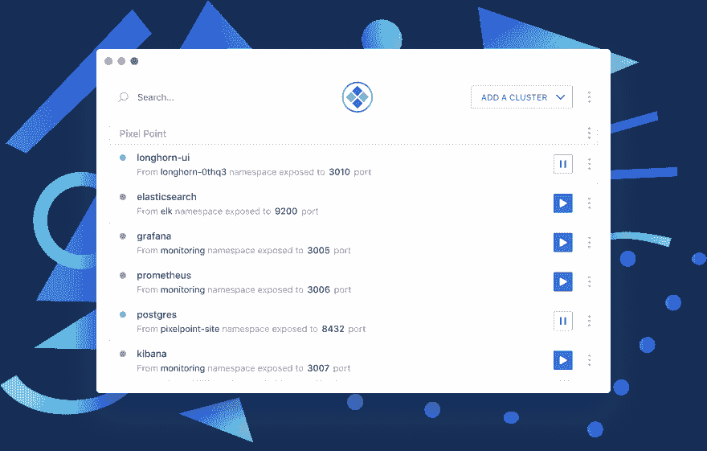
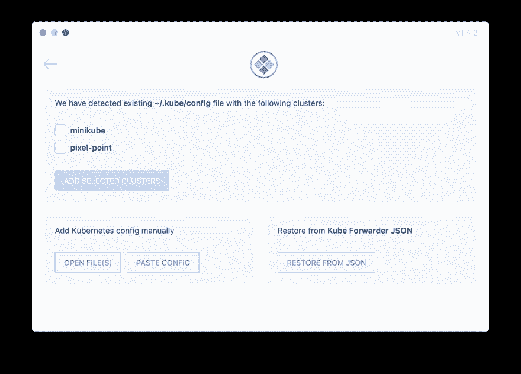
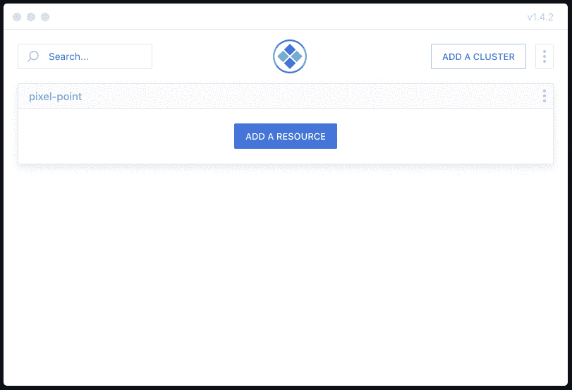

# 港口转运 Kubernetes 资源简单指南

> 原文：<https://dev.to/alex_barashkov/a-simple-guide-for-port-forwarding-kubernetes-resources-4d3j>

Kubernetes 改变了人们部署、协调和构建基础设施的方式。在本文中，我们将学习从本地机器访问内部 Kubernetes 资源的最简单方法。

## 💼用例

您将 PostgreSQL 部署到您的集群中，您不想公开暴露它，但是希望进行一些查询并访问 DB。

## 🎉解决办法

使用 Kubernetes 本地端口转发功能。特定的 Kubernetes API 允许通过单个 HTTP 连接创建从集群资源到本地主机的隧道。因此，您可以在本地主机 5432 端口从 Kubernetes 集群访问 PostgreSQL。

你可以用**库贝克**，
来做

```
kubectl port-forward -n default deployment/postgres 8432:5432 
```

<svg width="20px" height="20px" viewBox="0 0 24 24" class="highlight-action crayons-icon highlight-action--fullscreen-on"><title>Enter fullscreen mode</title></svg> <svg width="20px" height="20px" viewBox="0 0 24 24" class="highlight-action crayons-icon highlight-action--fullscreen-off"><title>Exit fullscreen mode</title></svg>

或者你可以使用非常简单的开源 GUI-**[Kube Forwarder](https://kube-forwarder.pixelpoint.io/)**。拥有 CLI 工具是很好的，但是它没有几个基本的特性

*   **自动重新连接**(如果您的连接不稳定，您将不得不手动重新运行该命令)
*   **自动完成**(你总是需要记住你的服务的名字，名称空间，我在笔记中有一些提示)
*   **多集群支持**(每次你想转发东西的时候切换上下文也不是什么好体验)

因此，牢记这一点，我们开发了[**Kube Forwarder——易于使用的 Kubernetes 端口转发管理器**](https://kube-forwarder.pixelpoint.io/) 。

[](https://res.cloudinary.com/practicaldev/image/fetch/s--OQYxwO9W--/c_limit%2Cf_auto%2Cfl_progressive%2Cq_auto%2Cw_880/https://thepracticaldev.s3.amazonaws.com/i/a6cppndcafdm7a1e3004.png)

我们拥有的其他重要功能:

*   kube 配置集群的**自动导入**
*   **导入/导出**所有加入书签的集群和资源(适合与团队共享)
*   **同时转发多个服务**
*   **零原生依赖**(无需 kubectl CLI 即可工作)

## **如何用库伯 Forwarder❓转发资源**

如果你第一次做，这是一个非常简单的三步过程

*   添加群集配置
*   查找要转发的资源
*   开始转发

**添加集群配置**

如果您已经有 kubeconfig 文件，Kube Forwarder 将建议您导入您拥有的集群:

[](https://res.cloudinary.com/practicaldev/image/fetch/s--Bdx986Iv--/c_limit%2Cf_auto%2Cfl_progressive%2Cq_auto%2Cw_880/https://thepracticaldev.s3.amazonaws.com/i/3eca25uneumkv34sze37.png)

我们还有其他选择:

*   通过选择一个或多个文件来添加集群
*   将您的配置粘贴为纯文本。如果您创建了一个新的集群，并且想要访问一些部署，这可能会很有用
*   从 Kube Forwarder JSON 恢复配置。当你作为一个开发者想要为你的不太熟悉 Kubernetes 的开发团队准备易于使用的转发时，这很有用。

**找到要转发的资源**

[](https://res.cloudinary.com/practicaldev/image/fetch/s--kqSuR2Sc--/c_limit%2Cf_auto%2Cfl_progressive%2Cq_66%2Cw_880/https://thepracticaldev.s3.amazonaws.com/i/vkm7ovita93vj5e1vsyd.gif)

Kube Forwarder 具有按名称空间、pod、部署自动完成的功能，因此它使得为转发添加新资源的过程变得非常简单。

设置为本地端口-本地机器的端口和资源端口-应用程序启动的端口。其他领域我觉得不需要额外澄清。添加资源后，按“播放”按钮，从本地机器访问您的服务。

## 🙏我们期待您的反馈

我们相信，像这样的应用程序可以让你更有效率，并吸引更多的人开始使用 Kubernetes。请让我们知道您对该应用程序的看法以及您对我们如何改进它的想法。

我们用 Electron 开发了这个应用程序，所以它可以在 macOS、Windows 和 Linux 上很好地运行。

https://github.com/pixel-point/kube-forwarder 的 Github - ⭐