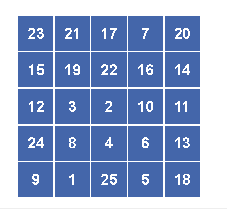

# 1 到 50 人对硒

> 原文：<https://dev.to/wrwruggiaman/1-to-50-human-vs-selenium-1ogo>

和一些朋友一起，我们发现了游戏[1 到 50](http://zzzscore.com/1to50/en/?ts=1565597472067#) 。

*游戏*

这个游戏由一个由 25 个盒子组成的格子组成，每个盒子里都有一个从 1 到 25 的数字。
点击方框后，里面的数字被替换为 26 到 50 之间的数字。
玩家应该按从 1 到 50 的递增顺序点击数字。
T3T5】

*人类问题*

人类玩家有以下问题:

1.  当这个人试图快速玩游戏时，他很难记住所有数字的顺序。
2.  这个人很难快速点击这些数字。
    *   移动光标需要时间
3.  在数字 26 之后，男人应该找到数字。

我朋友的成绩在 45 秒到 35 秒之间。
(我很糟糕，我的最好成绩是 43 秒)

挑战
为了打败我的朋友，我决定用 Selenium 来自动化这个游戏。

首先要做的是打开页面。(我用的是火狐[geckodriver]):

```
driver = webdriver.Firefox(executable_path=path_geckodriver)
driver.get("http://zzzscore.com/1to50/en/?ts=1565597472067#") 
```

打开页面后，我需要找到所有数字所在的网格

```
grid = driver.find_element_by_id('grid') 
```

最后一件事是循环点击网格中的所有数字

```
for number in range(1, 51):
    grid.find_element_by_xpath('//div[text()={}]'.format(number)).click() 
```

搞定了。使游戏自动化的最终代码是:

```
from selenium import webdriver
path_geckodriver = r"path_where_is_the_geckodriver"

driver = webdriver.Firefox(executable_path=path_geckodriver)
driver.get("http://zzzscore.com/1to50/en/?ts=1565597472067#")
grid = driver.find_element_by_id('grid')
for number in range(1, 51):
    grid.find_element_by_xpath('//div[text()={}]'.format(number)).click()
driver.close() 
```

所有的人类问题都解决了。

软件的最终成绩是:
****5.802 秒****

35 秒的差异(时间减少 80%)

**新方式看**
你知道不同的游戏自动化方式吗？
快还是慢？
我们来谈谈。我对了解和学习新事物很好奇。