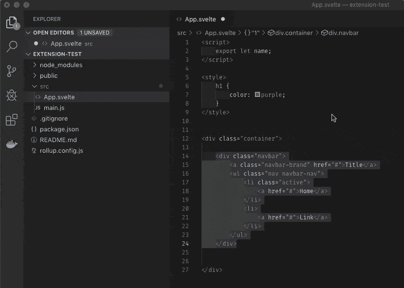

# 细长的 vscode 组件提取工具

> 原文：<https://dev.to/proverbialninja/svelte-vscode-component-extractor-tool-4jjh>

做了这个 vscode 扩展来帮助提取一个组件

1.  突出显示要提取的代码
2.  Ctrl + Shift + P 运行命令调色板
3.  选择“苗条提取物成分”
4.  输入新组件名称
5.  您的新组件被创建并导入

你可以在这里找到
https://marketplace.visualstudio.com/items?[itemName = proverbialninja . svelte-extractor](https://marketplace.visualstudio.com/items?itemName=proverbialninja.svelte-extractor)