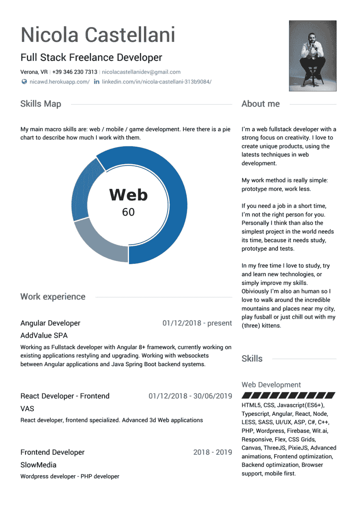

# 我的简历准备好接受国际工作了吗？

> 原文：<https://dev.to/nicolalc/is-my-cv-ready-for-international-jobs-1mok>

大家好！

这是我个人简历的预览:

你可以看一下完整的简历[这里](https://www.visualcv.com/nicola-castellani/)。

在你看来，对于美国/欧洲以外的工作，这是一个好的简历格式吗？如果没有，你建议如何改进我的简历？

提前感谢！