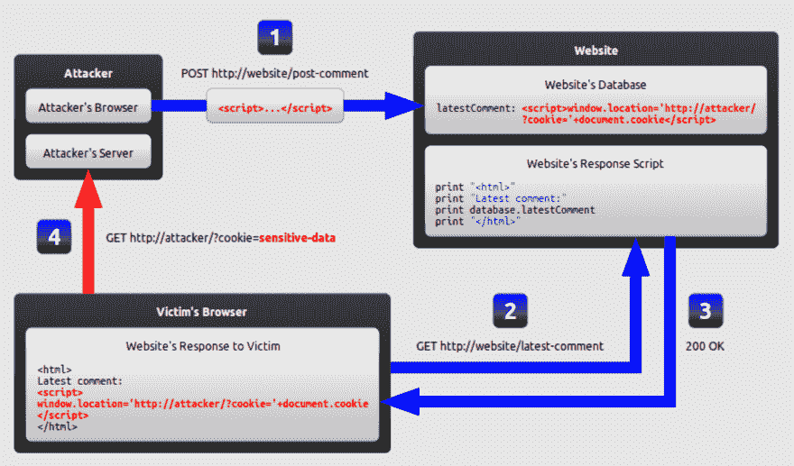
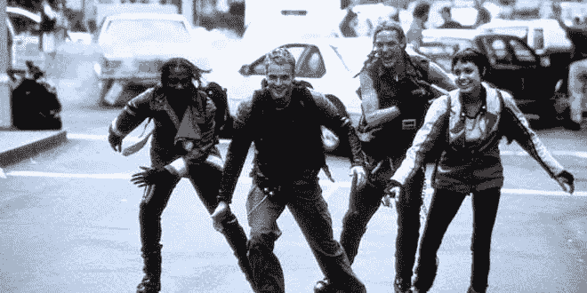

# 零度酷。XSS 袭击的背景。

> 原文：<https://dev.to/geoffreyianward/zero-cool-the-context-of-xss-attacks-2j6b>

好了，伙计们，本周我们将介绍一些 XSS 袭击的基本知识。首先，一些背景。**代表**跨站脚本**。这是一种“注入”攻击，黑客使用输入字段向网站注入他们自己的恶意代码。然后这些代码被加载到用户的浏览器上，调用代码并*犯罪*。**

 **这些攻击可能有许多邪恶的目的，包括 cookie 盗窃、键盘记录、网络钓鱼或劫持用户会话。有许多网站不恰当地利用 cookies 来存储用户数据。XSS 攻击可以被用来获取这些信息，让一个雄心勃勃的黑客获得各种工具的数字犯罪。

这张图借用了 https://excess-xss.com/,的《难以置信的资源》,让我们了解了典型的 XSS 攻击是如何运作的。首先，黑客使用直接输入字段将他们的恶意脚本发布到网站上。这个脚本评论然后被发送到网站的数据库。当用户试图访问网站时，会加载该脚本注释，但浏览器会将其解释为合法代码，而不是注释，攻击者可以利用这一点获得对用户信息的各种访问权限。

那么，我们能做些什么来防止这些攻击呢？一般来说，响应分为两类:**编码**和**验证**。编码是确保从输入字段接收的所有数据被正确“转义”的实践，这意味着代码被编译成不再类似于工作代码。你可能以前见过这种转义，没有意识到代码的目的。例如，许多网站会用类似& lt 和& gt 的东西替换 HTML 代码。验证是增强编码能力的一种方式。使用验证技术，我们可以加强编码实践的能力。验证将使用过滤来删除提交给网站的全部或部分恶意代码。做到这一点的一个方法是实施一个**黑名单**。黑名单会创建一个无效输入格式的列表。然而，这并不总是审查输入的最有效方式，因为有许多避免黑名单的变通办法。这就是为什么最佳实践是**加入白名单**。相反，白名单创建了一个接受的*输入列表，只有符合这种格式的输入才被允许填充站点。这些更容易实施和维护，因为你可以完全控制什么可以发布到你的网站上。*

所以我们有它。XSS 是黑客的一个非常常见的策略，所以值得你花时间用 XSS 保护你的网站。混合使用编码*和*验证技术，以最大化您拥有的保护范围。这将确保您的用户免受讨厌的黑客攻击。**