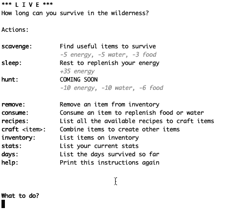

# 学习 Rust:使用线程

> 原文：<https://dev.to/codegram/learning-rust-working-with-threads-4kh0>

我曾经生活在单线程 JavaScript 的乐土中，在那里，我做过的最接近线程的事情就是在网站和 Chrome 扩展之间进行通信。因此，当人们谈论并行和并发的困难时，我从来没有真正理解这有什么大惊小怪的。

你可能已经在之前看过[了，几周前我开始学习 Rust，重写了我之前用 Vue 做的一个基于文本的游戏。这是一个生存游戏，你必须收集和制作食物和饮料。除了尽可能多的存活下来，它没有获胜的条件。我设法让大多数游戏功能正常工作，但有一个恼人的错误:如果用户让游戏闲置几个小时，它不会检查统计数据，直到用户再次互动。你可以什么都不做，活几百天！](https://www.codegram.com/blog/learning-rust-my-way)

我知道这可以用线程解决，所以我终于鼓起勇气，读了 Rust 编程语言的章节[无畏并发](https://doc.rust-lang.org/book/ch16-00-concurrency.html)。

[](https://res.cloudinary.com/practicaldev/image/fetch/s--C4F3OIKm--/c_limit%2Cf_auto%2Cfl_progressive%2Cq_auto%2Cw_880/https://thepracticaldev.s3.amazonaws.com/i/lu9f9ivi1h1uos64vg48.png)

让我们回顾一下:我需要的是能够每隔几秒钟跟踪统计数据和天数，并在统计数据达到 0 时通知玩家。生成一个每 10 秒运行一次代码的新线程很容易:

```
 thread::spawn(move || loop {
        thread::sleep(Duration::from_secs(10));
        println!("Now we should decrease stats and update day count…");
    }); 
```

但是，我怎样才能在不遇到所有权问题的情况下修改该线程的统计数据和天数呢？

结果比我想象的要容易得多。您可以创建一个互斥体(互斥)，这样一次只有一个线程可以访问该数据。多个线程需要拥有那个互斥体，所以你需要把它包装在一个`Arc`(原子引用计数)中，以便代码正常工作(所有这些在[共享状态并发章节](https://doc.rust-lang.org/book/ch16-03-shared-state.html)中有更好的解释)。代码看起来像这样:

```
 fn main() {
        let stats = Arc::new(Mutex::new(Stats {
            water: Stat::new(100.0),
            food: Stat::new(100.0),
            energy: Stat::new(100.0),
        }));

        let days = Arc::new(Mutex::new(0));

        control_time(&days, &stats);

        // ...
    }

    fn control_time(days: &Arc<Mutex<i32>>, stats: &Arc<Mutex<Stats>>) {
        let now = Instant::now();
        let days = Arc::clone(&days);
        let stats = Arc::clone(&stats);
        thread::spawn(move || loop {
            thread::sleep(Duration::from_secs(10));

            let elapsed_time = now.elapsed().as_secs();
            let mut elapsed_days = days.lock().unwrap();
            *elapsed_days = elapsed_time as i32 / 60;

            let mut stats_lock = stats.lock().unwrap();
            decrease_stats(&mut stats_lock, 10.0);
        });
    } 
```

主线程可以像以前一样继续使用`days`和`stats`，只需添加`.lock()`即可。

这工作很好，但是嘿，等等…我仍然有同样的问题:主线程忙于等待用户输入！尽管 stats 和 day count 每 10 秒钟成功更新一次，但主线程并不知道。

是时候添加另一个线程了！

[](https://res.cloudinary.com/practicaldev/image/fetch/s--4H6SogTV--/c_limit%2Cf_auto%2Cfl_progressive%2Cq_auto%2Cw_880/https://thepracticaldev.s3.amazonaws.com/i/en7mginojr1d0qwa0a8p.png)

这个线程应该处理用户输入，并将动作发送给主线程。对于这一点，使用 Rust 编程书解释的线程间通信的另一种方式感觉更好:[消息传递](https://doc.rust-lang.org/book/ch16-02-message-passing.html)。

我需要一个通道来向主线程发送动作，但是主线程也需要让输入线程知道它何时准备好接收动作(因为有些动作需要时间)。Rust 在标准库中提供的通道是*多个生产者，单个消费者*(意思是通道之间没有双向通信)，所以我最后创建了两个通道。

```
 let (tx, rx) = mpsc::channel();
    let (tx2, rx2) = mpsc::channel(); 
```

<small>(名字没什么创意)</small>

然后，生成一个新线程，它将等待主线程信号，请求用户输入，并将其发送回主线程。注意，使用`rx2.recv()` **会阻塞**线程，直到收到消息:这将允许我们控制*何时*应该提示用户。

```
 thread::spawn(move || loop {
        let _ = rx2.recv();

        let action = request_input("\nWhat to do?");

        tx.send(action).ok();
    }); 
```

然后，从主线程中，我们发送一条请求输入的消息，并继续创建一个循环，该循环将持续检查统计数据和使用`rx.try_recv()`的用户输入(这不会阻塞线程)。如果统计数据已经达到 0，循环将中断，结束游戏；如果没有，我们再次请求输入。

```
 tx2.send(String::from("Ready for input")).ok();

    loop {
        if let Ok(action) = rx.try_recv() {
            match action.trim() {
                // handle all possible actions
            }
        }
        if is_game_over(&stats.lock().unwrap()) {
            break;
        } else {
            tx2.send(String::from("Ready for input")).ok();
        }
    } 
```

这对我来说很自然:就像用 JavaScript 调度事件一样，对吗？嗯，没有。

当您用 JavaScript 调度一个事件时，没有人会关心是否有人在监听该事件。你发送它，如果没有听众，这个信息就永远丢失了。

在铁锈地带，如果一棵树倒在森林里，那么**就有**在旁边听它发出的声音。否则，森林会恐慌并自我燃烧，世界会爆炸。如果周围的人在忙着做其他事情，所有的树都会排队等候，直到那个人停下来听他们说话，它们才会倒下。

事情是这样的:

[](https://res.cloudinary.com/practicaldev/image/fetch/s--y8_DG-EV--/c_limit%2Cf_auto%2Cfl_progressive%2Cq_66%2Cw_880/https://thepracticaldev.s3.amazonaws.com/i/lrwzjvs18cxoem62v9xp.gif)

正如你所看到的，看起来好像输入线程并没有等待来自主线程的*就绪*消息。然而，问题是主线程在不断地发送消息(记住，`action`是通过`try_recv`被监听的，所以它不是阻塞的)。即使当用户输入`sleep`时，主线程确实会休眠几秒钟，因为我们之前已经发送了大量消息，输入线程会一个接一个地获取消息*。如果你习惯于其他语言，这可能会感觉很自然，但来自 JavaScript，它让我大吃一惊，花了我一些时间来理解它。*

 *最终，解决方案就像在最后一条消息被接收和处理之后才发送*就绪*消息一样简单:

```
 tx2.send(String::from("Ready for input")).ok();

    loop {
        if let Ok(action) = rx.try_recv() {
            match action.trim() {
                // handle all possible actions
            }
            // now we are ready for another action:
            tx2.send(String::from("Ready for input")).ok();
        }
        if is_game_over(&stats.lock().unwrap()) {
            break;
        }
    } 
```

所有问题都解决了！

正如我在过去几周所看到的，Rust 真正困难的不是语言本身，而是抛弃了 JavaScript 的思维方式(随意用你喜欢的语言替换 JavaScript)。然而，那才是我最喜欢的，走出舒适区！

你可以在这里查看游戏代码:[https://github.com/codegram/live-rust](https://github.com/codegram/live-rust)

*封面照片由 [Geran de Klerk](https://unsplash.com/@geran?utm_source=unsplash&utm_medium=referral&utm_content=creditCopyText) 拍摄 T3】**