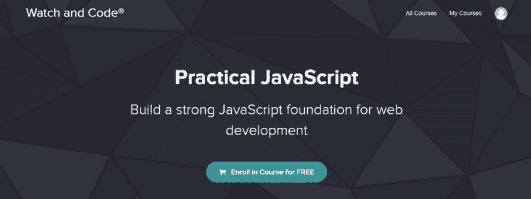
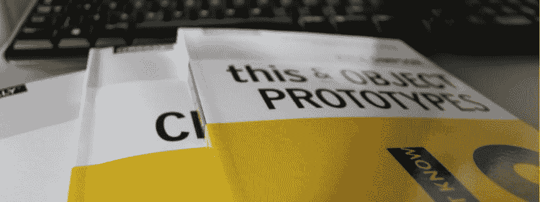

# 我最喜欢的学习 JavaScript 的 5 个资源

> 原文：<https://dev.to/vladimir_dev/my-5-favorite-resources-for-learning-javascript-56k0>

有几次我在 Instagram 上被问到关于学习资源的问题，因为我已经写了一些关于 CSS 和一些很酷的工具的文章，所以我决定把这篇文章献给我正在(或者仍然在)使用的 JavaScript 资源。

自从我几年前开始学习以来，其中一些可能被认为是过时的，或者使用一些已经更新的工具或方法；我仍然把它们包括在内，因为它不仅仅是关于代码，而是教授一些可以应用于大多数编程语言和工具的非常重要的原则。

所以这里是我学习 JavaScript 最喜欢的 5 个资源 :
(事实上有 5 个纯粹是巧合:)

# 1。JavaScript & JQuery

*由乔恩·达克特*
[javascriptbook.com](http://javascriptbook.com/)

即使它可能被认为是“旧的”，它仍然是我学习过的最好的布局，组织和插图的书之一。

它设计精美，有图表、插图和视觉教具，对理解要点有很大帮助。非常适合视觉学习者，也是你需要重温基础知识时的参考书！

值得注意的一点是，如果你得到了这本书，一定要得到最新的版本，因为早期的版本有一些错误。

# 2。实用 JavaScript

*由戈登朱*

一个很棒的免费在线课程，它很好地解释了一些最重要的概念，如函数、对象和条件逻辑。

它强调了提前规划你的应用的特性的重要性(而不是直接进入编码)，并且将你的代码分组到对象中——为了更好的可读性和组织性，以及慢慢地带领我们进入 OOP 的世界。

# 3。YouTube 教程

*乘旅行传媒*
[youtube.com/techguyweb](https://www.youtube.com/TechGuyWeb)

我最喜欢的 YouTube 教程是由 Brad Traversy 制作的，又名 Traversy Media，但当然，还有许多其他的教程。

Brad 有一个巨大的高质量视频库，包含前端开发人员可能需要的所有内容，以及一些其他主题。

# 4。#JavaScript30

*由韦斯博斯*
[javascript30.com](https://javascript30.com/)

这是一个非常有趣和更高级的 30 个练习和很酷的小项目的集合，每个都专注于不同的 JS 特性。

Wes Bos 已经成为前端开发领域的大师级人物。他的教学风格很有趣，但也比我习惯的要快一点，也更先进一些，所以我肯定会建议在开始学习之前先学习 JavaScript 的基础知识。

# 5。你不懂 JavaScript

*由凯尔·辛普森*
[github.com/getify/You-Dont-Know-JS](https://github.com/getify/You-Dont-Know-JS)

这是一个 6 本书的系列，每本书都深入探讨了 JavaScript 的一个核心概念，并对其进行了深入的描述，帮助您更好地理解 JS 在“幕后”是如何工作的。

和上一个一样，我推荐之前的 JS 基础知识。

一如既往，欢迎给我发送更多帖子的问题或建议。关于 JS 或其他工具的任何问题，我会尽我所能回答。

祝你一周愉快！