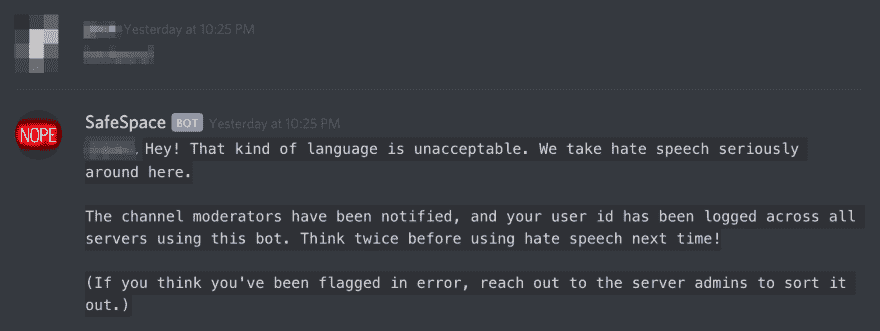
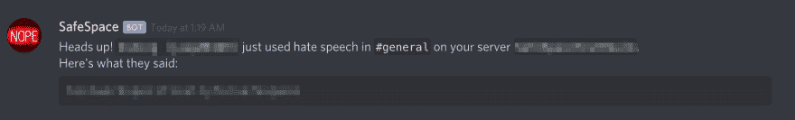
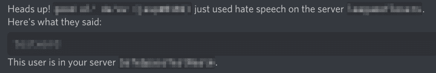
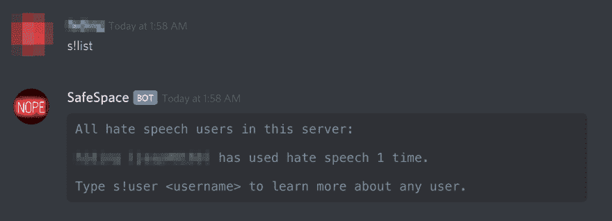
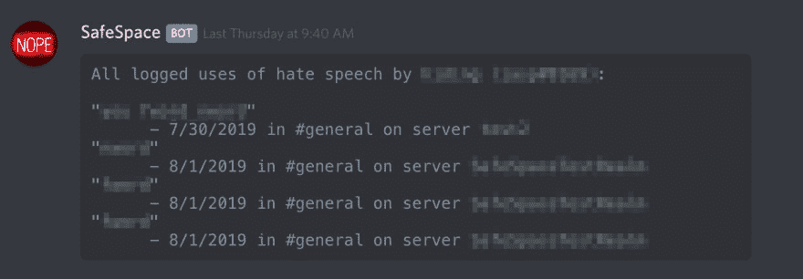
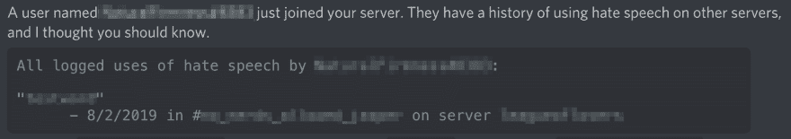
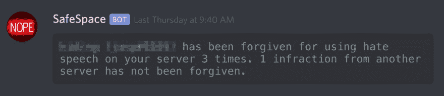

# 我做了一个不和谐机器人来阻止仇恨言论进入你的服务器...还有其他人的！

> 原文：<https://dev.to/midblue/i-made-a-discord-bot-to-keep-hate-speech-out-of-your-server-and-everyone-else-s-53>

将安全空间添加到您的服务器中！

“回到你来的地方”是我写这篇文章的主要标题；看起来毫不掩饰的尖酸刻薄和偏见在 10 年代后期很流行。最近看新闻的时候我很难过，当我对一种情况感到难过的时候，我想做些事情来改变它。所以，我建立了一个机器人，它可以跟踪整个 Discord 平台上的仇恨言论和仇恨言论用户。

* * *

我最近受到了一个 Reddit 机器人的启发。

它在 Reddit 上搜索任何给定用户的评论历史，寻找 N 字，并公开地把它们叫出来。我认为这是一个绝妙的主意。为了建立一个宽容、接纳的社区，重要的是让人们对自己的言论负责，并明确声明仇恨言论是不可以的。

然后我想到了[最近在超级粉碎兄弟现场的惨败](https://www.dailydot.com/parsec/bocchi-smash-bros-racial-slur/)。一个崭露头角的竞争者被发现在不和谐中使用种族诽谤。

她被立即取消了职务，这是理所当然的。

然而，截图中的这些消息不得不手动搜索。谁知道有多少仇恨言论在不和谐中被忽视，仅仅是因为从来没有人费心去寻找它？

* * *

...等等，听起来不像是机器人能做的事吗？这个想法让我开始思考，不久我就看到了一些机会:

1.  Reddit 是一个大规模的生态系统，一切都是公开的，但在 Discord 上有许多离散的服务器，这使得仇恨言论用户很容易隐藏。制作一个可以在整个 Discord 系统中跟踪仇恨言论用户的机器人不是很酷吗？
2.  Reddit 机器人只能通过请求获得。在你的服务器上自动跟踪仇恨言论，而不需要知道具体要找谁，不是更好吗？
3.  最重要的是，如果当一个仇恨言论的用户加入你的服务器时，或者当你的服务器中有人在其他地方使用仇恨言论时，你可以得到警告，这不是很好吗？

带着这些主要的设计目标，我开始工作。

### 明晰与对抗

当有人在使用 SafeSpace 的服务器上使用仇恨言论时，该机器人会立即记录违规行为，删除消息，并予以严厉回复。

该服务器的管理员也会立即得到通知。

用户所在的其他服务器(也运行 SafeSpace)的管理员会在 24 小时后收到通知，除非违规者在此期间得到了管理员的原谅。

另一方面，如果一个普通的服务器成员想检查服务器上的仇恨言论用户，他们可以。

他们也有能力看到他们的服务器成员在什么时候使用了什么样的仇恨言论。

### 跨服务器跟踪

安全空间保留了一个与服务器无关的罪犯数据库。仅这一点就使它有别于大多数调节机器人，因为它可以警告管理员和其他成员关于仇恨言论用户，即使他们还没有在特定的服务器上使用仇恨言论。

这个机器人的美妙之处在于，使用它的服务器越多，它就能越好地根除整个不和谐网络中的仇恨言论用户。每增加一个服务器，仇恨言论用户就越有可能被抓住，当其成员使用仇恨言论时，就有越多的服务器可以得到通知，当仇恨言论用户加入时，就有越多的服务器知道。它的有效性随着采用而成指数级增长，所以[将其添加到您的服务器中！你永远不知道它会抓到什么。](https://discordapp.com/oauth2/authorize?client_id=605039242309140483&scope=bot&permissions=76800)

### 想尽办法

当安全空间被添加到服务器时，它会在聊天记录中搜索仇恨言论。这些过去的违规行为也悄悄地保存。

### 脚步轻柔

并不是服务器中的每个用户都需要让别人的仇恨言论在他们面前炫耀；事实上，这可能会给服务器整体带来更负面的影响。在不同服务器中的服务器成员发表仇恨言论，或者被跟踪的罪犯加入服务器的情况下，机器人只会向服务器管理员发送消息，并允许他们对罪犯使用自己的判断力。词语有上下文，总会有不应该严厉对待违规行为的时候。这就是为什么机器人也允许服务器管理员原谅用户在他们的服务器上使用的仇恨言论。

* * *

[立即将 SafeSpace 添加到您的 Discord 服务器！](https://discordapp.com/oauth2/authorize?client_id=605039242309140483&scope=bot&permissions=76800)

如果你很好奇，整个项目都是开源的，那么你可以[在 Github 上查看一下这个资源库。](https://github.com/midblue/safespace-bot)

如果你觉得自己很慷慨，你也可以[捐赠服务器费用。](https://www.paypal.com/cgi-bin/webscr?cmd=_s-xclick&hosted_button_id=EPH9CL25C3LLA) :)

此外，如果你喜欢这个机器人，检查我的[时区机器人不和谐！](https://www.jasperstephenson.com/posts/timezonebot)

感谢阅读！

*(交叉发布自[我的个人网站。](https://www.jasperstephenson.com/) )*