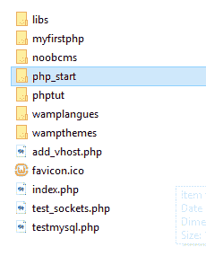
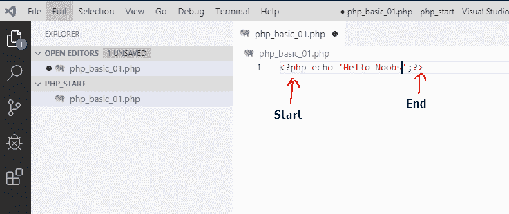
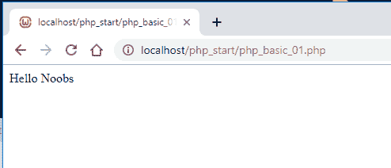
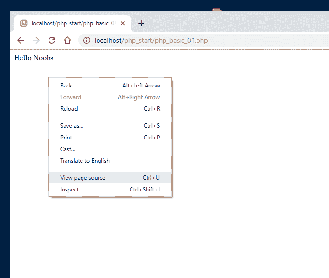
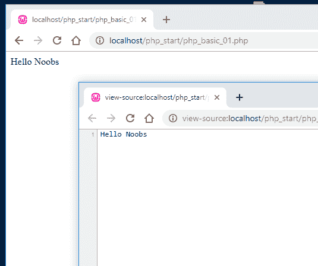
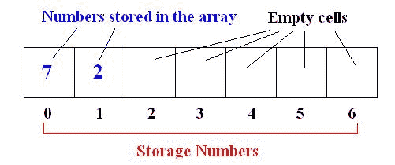

# PHP Noob 基础

> 原文：<https://dev.to/th3n00bc0d3r/php-basics-64>

现在启动您的 web 服务器，在 www 文件夹中创建一个 php_start 目录。

[](https://res.cloudinary.com/practicaldev/image/fetch/s--ohvKVY_i--/c_limit%2Cf_auto%2Cfl_progressive%2Cq_auto%2Cw_880/https://thepracticaldev.s3.amazonaws.com/i/dn0hoyboyc7ewulpumcc.png)

现在在其中创建一个名为 php_basic_01.php 的文件，并添加以下代码。

```
<?php echo 'Hello Noobs';?> 
```

<svg width="20px" height="20px" viewBox="0 0 24 24" class="highlight-action crayons-icon highlight-action--fullscreen-on"><title>Enter fullscreen mode</title></svg> <svg width="20px" height="20px" viewBox="0 0 24 24" class="highlight-action crayons-icon highlight-action--fullscreen-off"><title>Exit fullscreen mode</title></svg>

[](https://res.cloudinary.com/practicaldev/image/fetch/s--h5OC67YB--/c_limit%2Cf_auto%2Cfl_progressive%2Cq_auto%2Cw_880/https://thepracticaldev.s3.amazonaws.com/i/lt7tt1ejfu7w1a1wldmq.png)

现在打开[http://localhost/PHP _ start/PHP _ basic _ 01 . PHP](http://localhost/php_start/php_basic_01.php)

[](https://res.cloudinary.com/practicaldev/image/fetch/s--M-fzXRQT--/c_limit%2Cf_auto%2Cfl_progressive%2Cq_auto%2Cw_880/https://thepracticaldev.s3.amazonaws.com/i/54vkj6k0qa16spda5hnj.png)

现在右键单击白色区域，然后单击查看页面源代码。

[](https://res.cloudinary.com/practicaldev/image/fetch/s--zYlVz6zR--/c_limit%2Cf_auto%2Cfl_progressive%2Cq_auto%2Cw_880/https://thepracticaldev.s3.amazonaws.com/i/8e7xbqqh45ug5lzjqmkd.png)

我们只看到文本，其他什么也看不到，所有的标签和代码都被剥离了，或者说被转换成了纯文本。

[](https://res.cloudinary.com/practicaldev/image/fetch/s--0CaZOxws--/c_limit%2Cf_auto%2Cfl_progressive%2Cq_auto%2Cw_880/https://thepracticaldev.s3.amazonaws.com/i/by6a66a8dbplg5d3827k.png)

## 什么是 PHP？

PHP 代表个人主页，现在被称为超文本预处理器。现在在 PHP 中，代码在服务器上运行，输出显示在查看者的计算机上。在我们上面的例子中，我们的计算机既是服务器又是查看器，因为在查看器例子中，我们在查看页面源代码中看不到任何代码。

*T4？php* 这是我们如何开始一个 php 代码块
"？>“这就是我们结束 PHP 代码块的方式

```
<?php
// All your code goes in here
?> 
```

<svg width="20px" height="20px" viewBox="0 0 24 24" class="highlight-action crayons-icon highlight-action--fullscreen-on"><title>Enter fullscreen mode</title></svg> <svg width="20px" height="20px" viewBox="0 0 24 24" class="highlight-action crayons-icon highlight-action--fullscreen-off"><title>Exit fullscreen mode</title></svg>

## PHP 快速 Gothrough

**变量**
变量是一个值的持有者，在 PHP 中它以$(美元)符号开始。

```
<?php
  $word = 'You Noobs'; // This is a String Variable
  $a = 1; // This is an Integer Variable
  $a = 1.0; // This is a Float Variable
  $a = true; // This is a Boolean Variable
?> 
```

<svg width="20px" height="20px" viewBox="0 0 24 24" class="highlight-action crayons-icon highlight-action--fullscreen-on"><title>Enter fullscreen mode</title></svg> <svg width="20px" height="20px" viewBox="0 0 24 24" class="highlight-action crayons-icon highlight-action--fullscreen-off"><title>Exit fullscreen mode</title></svg>

**递增和递减**
您可以使用下面的代码
自动在一个数字上加 1 和减 1

```
<?php
 $a = 1;
 $a++;
 echo $a; //Output 2
?> 
```

<svg width="20px" height="20px" viewBox="0 0 24 24" class="highlight-action crayons-icon highlight-action--fullscreen-on"><title>Enter fullscreen mode</title></svg> <svg width="20px" height="20px" viewBox="0 0 24 24" class="highlight-action crayons-icon highlight-action--fullscreen-off"><title>Exit fullscreen mode</title></svg>

```
<?php
 $a = 1;
 $a--;
 echo $a; //Output 0
?> 
```

<svg width="20px" height="20px" viewBox="0 0 24 24" class="highlight-action crayons-icon highlight-action--fullscreen-on"><title>Enter fullscreen mode</title></svg> <svg width="20px" height="20px" viewBox="0 0 24 24" class="highlight-action crayons-icon highlight-action--fullscreen-off"><title>Exit fullscreen mode</title></svg>

**如果..Else 循环**
这是一段简单的基于比较值来放置条件的代码。

```
<?php
  $a = true;
  if ($a == true) {
    echo 'I am not a Noob';
  } else {
    echo 'Noob Here';
  }
?> 
```

<svg width="20px" height="20px" viewBox="0 0 24 24" class="highlight-action crayons-icon highlight-action--fullscreen-on"><title>Enter fullscreen mode</title></svg> <svg width="20px" height="20px" viewBox="0 0 24 24" class="highlight-action crayons-icon highlight-action--fullscreen-off"><title>Exit fullscreen mode</title></svg>

现在同样的也可以写成如下:

```
<?php
  $a = true;
  if ($a) {
    echo 'I am not a Noob';
  } else {
    echo 'Noob Here';
  }
?> 
```

<svg width="20px" height="20px" viewBox="0 0 24 24" class="highlight-action crayons-icon highlight-action--fullscreen-on"><title>Enter fullscreen mode</title></svg> <svg width="20px" height="20px" viewBox="0 0 24 24" class="highlight-action crayons-icon highlight-action--fullscreen-off"><title>Exit fullscreen mode</title></svg>

**While 循环**
它一直运行一段代码，直到不满足某个条件。

```
<?php
 $a = 1;
 while ($a <= 3) {
  echo $a;
  $a++;
 }
?> 
```

<svg width="20px" height="20px" viewBox="0 0 24 24" class="highlight-action crayons-icon highlight-action--fullscreen-on"><title>Enter fullscreen mode</title></svg> <svg width="20px" height="20px" viewBox="0 0 24 24" class="highlight-action crayons-icon highlight-action--fullscreen-off"><title>Exit fullscreen mode</title></svg>

while 之间的代码将运行 3 次，直到$a 变为 3，然后它将停止。

**For 循环**
该循环将一段代码运行设定的次数，直到满足条件。

```
<?php
  for ($a = 0; $a <=3; $a++) {
   echo $a;
  }
?> 
```

<svg width="20px" height="20px" viewBox="0 0 24 24" class="highlight-action crayons-icon highlight-action--fullscreen-on"><title>Enter fullscreen mode</title></svg> <svg width="20px" height="20px" viewBox="0 0 24 24" class="highlight-action crayons-icon highlight-action--fullscreen-off"><title>Exit fullscreen mode</title></svg>

这将产生与 while 循环相同的输出，但是在处理数组时非常方便。

**数组**
数组是一个可以存储多个值的变量；

```
<?php
  $numbers = array(1,2,3);
  echo $numbers[0];
  echo $numbers[1];
  echo $numbers[2];
?> 
```

<svg width="20px" height="20px" viewBox="0 0 24 24" class="highlight-action crayons-icon highlight-action--fullscreen-on"><title>Enter fullscreen mode</title></svg> <svg width="20px" height="20px" viewBox="0 0 24 24" class="highlight-action crayons-icon highlight-action--fullscreen-off"><title>Exit fullscreen mode</title></svg>

这里的[0]是数组的索引，它总是从 0 开始。如图所示，这是一个阵列的图形表示。

[](https://res.cloudinary.com/practicaldev/image/fetch/s--47Vhr_3E--/c_limit%2Cf_auto%2Cfl_progressive%2Cq_auto%2Cw_880/https://thepracticaldev.s3.amazonaws.com/i/jrywnvo4j9svb7rujxm1.jpg)

**功能**
一个功能是一段预置的代码，你可以多次使用。

```
<?php
  function sayNoob() {
   echo 'You Noob';
  }

  sayNoob();
  sayNoob();
?> 
```

<svg width="20px" height="20px" viewBox="0 0 24 24" class="highlight-action crayons-icon highlight-action--fullscreen-on"><title>Enter fullscreen mode</title></svg> <svg width="20px" height="20px" viewBox="0 0 24 24" class="highlight-action crayons-icon highlight-action--fullscreen-off"><title>Exit fullscreen mode</title></svg>

现在，这个备忘单实际上是我们构建应用程序的语法基础。

[Noob 指数](https://dev.to/th3n00bc0d3r/noob-guides-index-4mne)