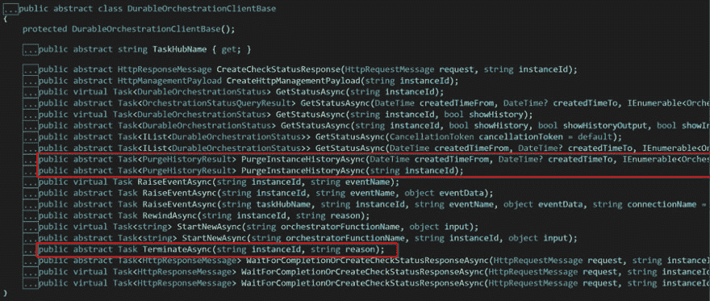

# 发现持久功能 API -清除和终止编排(DurableOrchestrationClient 第 3 部分)

> 原文：<https://dev.to/xpirit/discovering-the-durable-functions-api-purge-terminate-orchestrations-durableorchestrationclient-part-3-59g6>

[](https://res.cloudinary.com/practicaldev/image/fetch/s--9xzbG-m0--/c_limit%2Cf_auto%2Cfl_progressive%2Cq_auto%2Cw_880/https://blog.marcduiker.nl/assets/2019/08/12/purge-terminate-cover.png)

## durableorchestration client(Base)class-Purge&终止

这篇文章是探索持久函数 API 系列博客的第三部分。

在下面链接的视频中，我正在查看来自 [`DurableOrchestrationClient` ( `Base` )](https://github.com/Azure/azure-functions-durable-extension/blob/master/src/WebJobs.Extensions.DurableTask/DurableOrchestrationClientBase.cs) 类的功能，该类用于:

*   清除业务流程实例的历史记录
*   终止正在运行的业务流程

### 吹扫

清除编排实例的历史意味着从表存储中删除记录。我建议定期这样做，例如使用定时器触发功能，这样你就不会在你的存储帐户中塞满你可能不需要的千兆字节的数据。我通常会删除所有超过一周的已完成的实例，但保留失败的、取消的和终止的实例稍长一点。确保您不会无意中清除正在运行和挂起的实例！

有两种方法可以清除业务流程实例的历史记录。下面列出的第一种方法删除多个业务流程实例的历史记录。该方法需要一个日期时间范围和一组`OrchestrationStatus`枚举值。这些参数充当过滤器，因此只清除日期时间范围内的实例历史记录和选定的状态:

```
Task<PurgeHistoryResult> PurgeInstanceHistoryAsync(
    DateTime createdTimeFrom, 
    DateTime? createdTimeTo, 
    IEnumerable<OrchestrationStatus> runtimeStatus); 
```

<svg width="20px" height="20px" viewBox="0 0 24 24" class="highlight-action crayons-icon highlight-action--fullscreen-on"><title>Enter fullscreen mode</title></svg> <svg width="20px" height="20px" viewBox="0 0 24 24" class="highlight-action crayons-icon highlight-action--fullscreen-off"><title>Exit fullscreen mode</title></svg>

第二种方法删除单个编排实例的历史:

```
Task<PurgeHistoryResult> PurgeInstanceHistoryAsync(
        string instanceId); 
```

<svg width="20px" height="20px" viewBox="0 0 24 24" class="highlight-action crayons-icon highlight-action--fullscreen-on"><title>Enter fullscreen mode</title></svg> <svg width="20px" height="20px" viewBox="0 0 24 24" class="highlight-action crayons-icon highlight-action--fullscreen-off"><title>Exit fullscreen mode</title></svg>

### 终止

终止业务流程实例意味着停止正在运行的业务流程。您只需更改实例的状态。实例历史仍然可以在表存储中获得。只有在特殊情况下才应该使用这种方法。也许您有一个带有 bug 的编排，所以它一直在运行，而您希望它停下来。

该方法需要一个业务流程实例 ID 以及停止该实例的原因:

```
Task TerminateAsync(string instanceId, string reason); 
```

<svg width="20px" height="20px" viewBox="0 0 24 24" class="highlight-action crayons-icon highlight-action--fullscreen-on"><title>Enter fullscreen mode</title></svg> <svg width="20px" height="20px" viewBox="0 0 24 24" class="highlight-action crayons-icon highlight-action--fullscreen-off"><title>Exit fullscreen mode</title></svg>

### 视频

这是视频，如果你喜欢，请竖起大拇指，如果你还没有订阅我的频道，请订阅:

[https://www.youtube.com/embed/ePPEcNOzlnk](https://www.youtube.com/embed/ePPEcNOzlnk)

### 资源

*   GitHub 回购:[github.com/marcduiker/demos-azure-durable-functions](https://github.com/marcduiker/demos-azure-durable-functions)。

### 链接到本系列的其他帖子

*   [开始编排(持续编排客户端第 1 部分)](https://dev.to/marcduiker/discovering-the-durable-functions-api-starting-orchestrations-durableorchestrationclient-part-1-52ic)
*   [检索业务流程状态(DurableOrchestrationClient 第 2 部分)](https://dev.to/marcduiker/discovering-the-durable-functions-api-retrieving-the-orchestration-status-durableorchestrationclient-part-2-40kc)
*   清除和终止业务流程(DurableOrchestrationClient 第 3 部分)