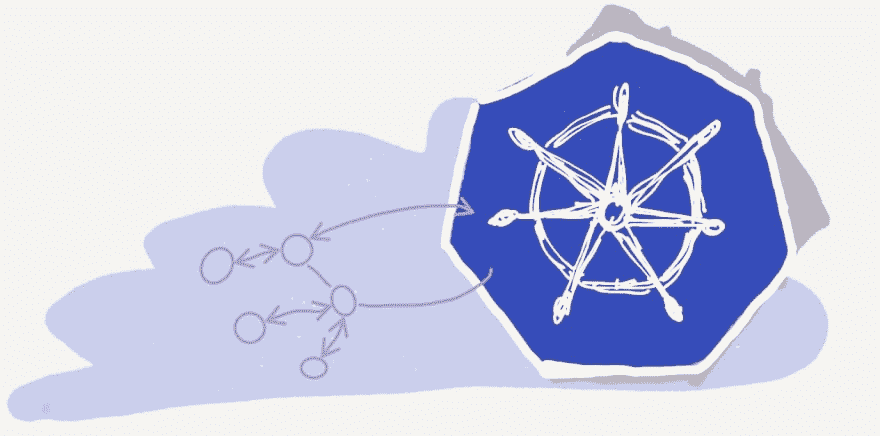
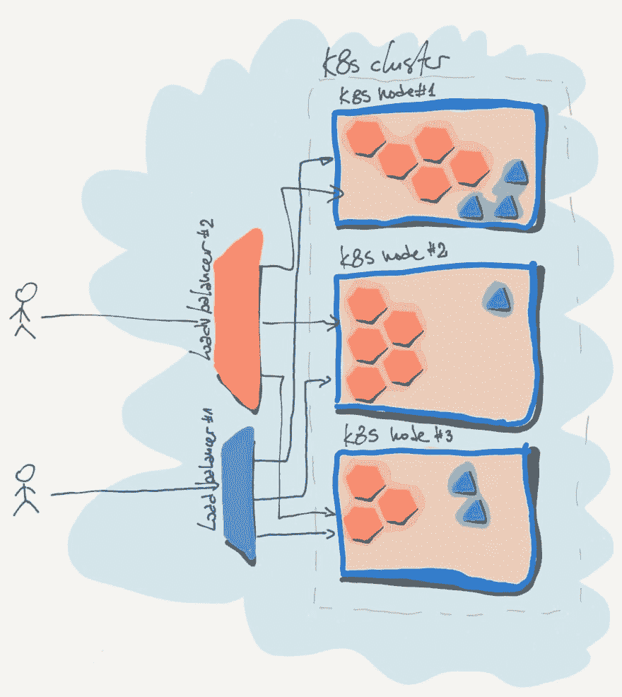
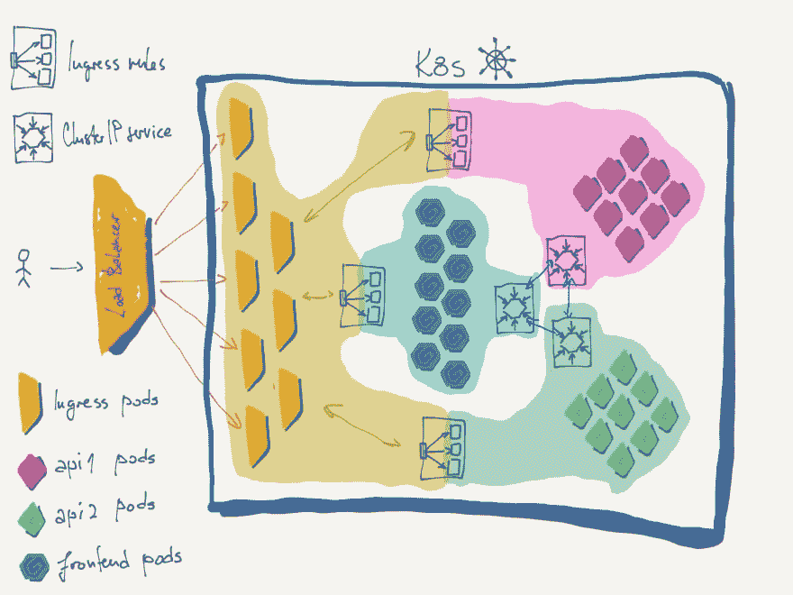

# Kubernetes 空间的内部和外部连接

> 原文：<https://dev.to/metaphorical/internal-and-external-connectivity-in-kubernetes-space-1mj9>

# 服务和网络—从集群 IP 到入口

[](https://res.cloudinary.com/practicaldev/image/fetch/s--vE2amNk8--/c_limit%2Cf_auto%2Cfl_progressive%2Cq_auto%2Cw_880/https://miro.medium.com/max/1400/1%2AyvSj52Q7s3V70LaT59QoCA%402x.jpeg)

当你在你的应用程序开发的所有阶段都取得进展，并且你(不可避免地)开始考虑使用 Kubernetes 时，是时候了解你的应用程序组件在部署到 Kubernetes 时是如何相互连接以及与外部世界连接的了。

> 您将从本文中获得的知识还涵盖了 [CKAD 考试](https://www.cncf.io/certification/ckad/)的“服务和网络”部分，该部分目前占认证考试课程的 13%。

## 服务

**Kubernetes 服务**提供集群内不同组件之间以及与外部世界(开放互联网、其他应用程序、网络等)的联网。

有不同种类的服务，这里我们将介绍一些:

*   *节点端口* —通过节点上的端口公开 Pod 的服务
*   *ClusterIP* —在集群内创建虚拟 IP 的服务，使集群内的不同服务能够相互通信。
*   *负载平衡器* —为 kubernetes 集群中的一组服务器创建(供应)负载平衡器。

### 节点端口

节点端口服务将 Pod 上的端口映射(公开)到节点上的端口。该过程实际上涉及 3 个端口:

*   *NodePort* 服务将部署(一组 pod)暴露给 k8s 节点的外部
*   *目标端口*—Pod 上的端口(您的应用程序监听的位置)。这是可选参数，如果不存在，则取端口
*   *端口* —服务本身的端口(通常与 pod 端口相同)
*   *节点端口* —节点上用于外部访问 web 服务器的端口。按照标准，节点端口可以在 30000 和 32767 之间。这是可选参数，如果不存在，将分配有效范围内的随机可用端口。

#### 创建节点端口服务

```
apiVersion: v1
kind: Service
metadata:
 name: k8s-nodeport-service
spec:
 type: NodePort
 ports:
 - targetPort: 6379
   port: 6379
   NodePort: 30666
selector:
 db: redis 
```

#### 将 pod 链接到服务

**选择器**是将服务引用(链接)到某组 pod 的方式。
当基于选择器选择了一组 pod 时(在几乎所有情况下，pod 来自同一部署)，**服务开始以随机方式向所有 pod 发送流量，有效地充当负载平衡器**。

> 如果所提到的单元分布在各个节点上，那么将在各个节点上创建服务，以便能够链接所有的单元。对于多节点服务，服务在所有节点上公开相同的端口。

### 集群 IP

如果应用程序由部署到不同组 pod 的多个层组成，则有必要在集群内的不同层之间建立通信。

例如，我们有:

*   5 盒 API 号
*   2 盒 API 号
*   1 盒缰绳
*   10 个前端应用单元

上述 18 个 pod 中的每一个都有自己独特的 IP 地址，但是通过这种方式进行通信将会是:

*   不稳定，因为豆荚可以随时死亡并被新的 IP 重新创造。
*   效率低下，因为我们必须在每个应用程序的集成部分进行负载平衡。

ClusterIP 服务为我们提供了访问每组 pod 的统一接口——它提供了一组具有内部名称/IP 的 pod。

```
apiVersion: v1
kind: Service
metadata:
 name: api-1
spec:
 type: ClusterIP
ports:
- targetPort: 9090
  port: 9090
selector:
 app: api-1
 type: backend 
```

**ClusterIP** 是默认的服务类型，所以如果没有指定服务类型，k8s 就采用 ClusterIP。

创建该服务时，集群中的其他应用程序可以通过服务 IP 或服务名称访问该服务。

### 负载平衡器

简而言之，负载平衡器类型的服务是在云空间中提供外部负载平衡器，这取决于提供商的支持。

部署的负载平衡器将充当节点端口，但将具有更高级的负载平衡功能，并且还将像在节点端口前获得额外的代理一样工作，以便获得新的 IP 和一些标准 web 端口映射(30666 > 80)。如您所见，它的特性使它成为直接向外界公开服务的主要方式。

[](https://res.cloudinary.com/practicaldev/image/fetch/s--oPh-vydQ--/c_limit%2Cf_auto%2Cfl_progressive%2Cq_auto%2Cw_880/https://miro.medium.com/max/1400/1%2ANcCpQOB5yFdb7rx-DkWdgw%402x.jpeg)

这种方法的主要缺点是，您公开的任何服务都需要它自己的负载平衡器，过一段时间后，这会对复杂性和价格产生重大影响。

让我们简单回顾一下可能性:

```
apiVersion: v1
kind: Service
metadata:  
 name: lb1
spec:  
 externalTrafficPolicy: Local  
 type: LoadBalancer  
 ports:  
 - port: 80    
   targetPort: 80    
   protocol: TCP    
   name: http  
 - port: 443    
   targetPort: 443    
   protocol: TCP    
   name: https  
 selector:    
   app: lb1 
```

上面创建了外部负载平衡器，并提供了所有必要的网络设置，以便对节点的流量进行负载平衡。

> **k8s 文档中的注释**:使用新功能，外部流量将不会在 pod 之间均衡负载，而是在节点级别均衡(因为 GCE/AWS 和其他外部 LB 实现不具备指定每个节点的权重的能力，所以它们在所有目标节点之间均衡，而不管每个节点上的 pod 数量)。

如果要将 AWS ELB 添加为外部负载平衡器，需要向负载平衡器服务元数据添加以下注释:

```
annotations:    
 service.beta.kubernetes.io/aws-load-balancer-backend-protocol:"tcp"    
 service.beta.kubernetes.io/aws-load-balancer-proxy-protocol:"*" 
```

## 入口

### 现实生活中的集群设置

当我们进入管理多个 web 服务器和多个不同组的空间时，上面提到的服务在大多数实际情况下变得非常复杂。

让我们回顾一下之前的例子——两个 API，redis 和 frontend，想象一下 API 拥有比前端服务更多的消费者，因此它们需要暴露于开放的互联网。

要求如下:

*   前端住在*T1】www.example.comT3】*
*   API 1 是在的搜索 API
*   API 2 是位于的通用(其他)API

使用上述服务所需的设置:

*   **ClusterIP** 服务，使集群中的组件可以方便地相互访问。
*   **节点端口**服务，用于在节点外部公开一些服务，或者可能
*   **LoadBalacer** 服务，如果在云中，或者
*   代理服务器如 nginx，正确连接和路由一切(30xxx 端口到端口 80，不同的服务到代理上的路径等)
*   **决定在哪里实施 SSL，并在整个过程中维护它**

### 如此

ClusterIP 是必要的，我们知道它必须存在——它是唯一一个处理内部网络的工具，所以它尽可能简单。
然而，外部流量是另一回事，我们必须为每个组件设置至少一个服务，外加一个或多个补充服务(负载平衡器和代理)，以达到要求。

> ## The number of configurations/definitions to be maintained has increased dramatically, the entropy has increased, and the infrastructure settings are submerged in complexity …

### 解

Kubernetes 集群有**入口**作为上述复杂性的解决方案。入口本质上是第 7 层负载平衡器。

> **第 7 层**负载平衡器是一种负载平衡器的名称，它覆盖了网络的第 5、6 和 7 层，分别是**会话**、**演示**和**应用**

Ingress 可以提供负载平衡、SSL 终止和基于名称的虚拟主机。

它涵盖了 HTTP，HTTPS。

> 除此之外，HTTP 和 HTTPS 服务将不得不通过特殊的入口设置或通过节点端口或负载平衡器进行不同的发布，但现在这是一个单一位置的一次性配置。

#### 入口设置

为了设置入口，我们需要两个组件:

*   **入口控制器** —根据提供的规则管理入口的组件
*   **入口资源** —入口 HTTP 规则

#### 入口控制器

可供选择的选项很少，其中有 nginx、GCE(谷歌云)和 Istio。目前 k8s 官方只支持两个——nginx 和 GCE。

我们将选择 **nginx** 作为入口控制器解决方案。为此，我们当然需要新部署。

```
apiVersion: extensions/v1beta1
kind: Deployment
metadata:
 name: nginx-ingress-controller
spec:
 replicas: 1
 selector:
  matchLabels:
   name: nginx-ingress
 template:
  metadata:
   labels:
    name: nginx-ingress
  spec:
   containers:
   - name: nginx-ingress-controller
     image: quay.io/kubernetes-ingress-controller/nginx-ingress-controller
     args:
     - /nginx-ingress-controller
     - configMap=$(POD_NAMESPACE)/ingress-config
     env:
     - name: POD_NAME
       valueFrom:
         fieldRef:
          fieldPath: metadata.name
     - name: POD_NAMESPACE
       valueFrom:
        fieldRef:
         fieldPath: metadata.namespace
     ports:
     - name: http
       containerPort: 80
     - name: https
       containerPort: 443 
```

部署配置图以便更容易地控制入口参数:

```
apiVersion: v1
kind: ConfigMap
metadata:
  name: nginx-configuration 
```

现在，有了基本部署和 ConfigMap，我们可以更容易地控制入口的参数，我们需要设置服务以将入口暴露给开放的互联网(或其他一些较小的网络)。

为此，我们在顶部设置了代理/负载平衡器的节点端口服务(裸机/本地示例)或负载平衡器服务(云示例)。

在上述两种情况下，都需要第 4 层和第 7 层负载平衡器:

*   节点端口和可能的自定义负载平衡器在顶层作为 L4，入口作为 L7。
*   负载平衡器为 L4，入口为 L7。

> *第 4 层负载平衡器* —根据 IP 地址或 TCP 端口引导来自网络层的流量，也称为传输层负载平衡器。

入口 yaml 的节点端口，以说明上述内容:

```
apiVersion: v1
kind: Service
metadata:
 name: nginx-ingress
spec:
 type: NodePort
 ports:
 -targetPort: 80
  port: 80
  protocol: TCP
  name: http
 -targetPort: 433
 port: 433
 protocol: TCP
 name: https
selector:
 name: nginx-ingress 
```

这个节点端口服务被部署到包含入口部署的每个节点，然后负载平衡器在节点之间分配流量

入口控制器与常规代理或负载均衡器的区别在于额外的底层功能，该功能监控集群的入口资源并相应地调整 nginx。为了让入口控制器能够做到这一点，需要具有正确权限的服务帐户。

```
apiVersion: v1
kind: ServiceAccount
matadata:
 name: nginx-ingress-serviceaccount 
```

> 上述服务帐户需要集群和命名空间的特定权限，以便 ingress 正确运行，有关在 [RBAC](https://kubernetes.io/docs/reference/access-authn-authz/rbac/) 启用集群[上权限设置的细节，请查看 nginx ingress 官方文档](https://kubernetes.github.io/ingress-nginx/deploy/rbac/)中的此文档。

当我们设置好所有权限后，我们就可以开始设置应用程序入口了。

#### 入口资源

入口资源配置允许您微调传入流量(或精细路由)。

让我们首先举一个简单的 API 例子。假设我们只有一组通过端口 8080 上名为 simple-api-service 的服务部署和公开的 pod，我们可以创建 *simple-api-ingress.yaml* 。

```
apiVersion: extensions/v1beta1
kind: Ingress
metadata:
 name: simple-api-ingress
spec:
 backend:
  serviceName: simple-api-service
  servicePort: 8080 
```

当我们**ku bectl create-f simple-API-ingress . YAML**时，我们设置了一个入口，将所有传入的流量路由到 simple-api-service。

#### 规则

规则提供了基于特定条件路由传入数据的配置。例如，基于子域或路径将流量路由到群集中的不同服务。

现在让我们来看最初的例子:

*   前端生活在**[www.example.com](http://www.example.com)**和一切**不/api**
*   api 1 是在的搜索 api
*   api 2 是位于的通用(其他)api

因为所有的东西都在同一个域中，所以我们可以通过一个规则来处理它们:

```
apiVersion: extensions/v1beta1
kind: Ingress
metadata:
 name: proper-api-ingress
spec:
 rules:
 -http:
   paths:
   -path: /api/search
    backend:
     serviceName: search-api-service
     servicePort: 8081
   -path: /api
    backend:
     serviceName: api-service
     servicePort: 8080
   -path: /
    backend:
     serviceName: frontend-service
     servicePort: 8082 
```

还有一个**默认**后端，用于提供默认页面(如 404 ),它可以单独部署。在这种情况下，我们将不需要它，因为前端将涵盖 404。

您可以在[https://kubernetes . io/docs/concepts/services-networking/ingress/](https://kubernetes.io/docs/concepts/services-networking/ingress/)了解更多信息

[](https://res.cloudinary.com/practicaldev/image/fetch/s--1nK8ZsYv--/c_limit%2Cf_auto%2Cfl_progressive%2Cq_auto%2Cw_880/https://miro.medium.com/max/2000/1%2AkwzSoapGCmltYvOKW45-Yw%402x.jpeg)

#### 奖励—更多规则、子域和路由

如果我们将示例改为:

*   前线生活在**app.example.com**
*   api 1 是在**api.example.com/search**的搜索 api
*   api 2 是位于**api.example.com**上的通用(其他的)api

在规则定义中引入新的结构也是可能的:

```
apiVersion: extensions/v1beta1
kind: Ingress
metadata:
 name: proper-api-ingress
spec:
 rules:
 -host: api.example.com
  http:
   paths:
   -path: /search
    backend:
     serviceName: search-api-service
     servicePort: 8081
   -path: /
    backend:
     serviceName: api-service
     servicePort: 8080
 -host: app.example.com
  http:
   paths:
   -path: /
    backend:
     serviceName: frontend-service
     servicePort: 8082 
```

> **注意(超出范围)**:您可以从上一幅图中注意到，有多个 ingress pods，这意味着 ingress 可以扩展，而且确实可以。Ingress 可以像任何其他部署一样进行扩展，您也可以让它根据内部或外部指标进行自动扩展(外部指标，如处理的请求数可能是最佳选择)。
> 
> **注 2(超出范围)**:在某些情况下，可以将入口部署为 DaemonSet，以确保跨节点的规模和分布。

#### 换行

这是我们第一次了解 k8s 服务和网络功能的结构和使用，我们需要这些功能来构建集群内外的通信。

我一如既往地试图提供点和战斗测试的现实指南…上面写的东西应该给你足够的知识来部署入口和设置基本规则集，以路由流量到你的应用程序，并给你的设置进一步微调的背景。

> **重要建议:**确保将所有设置作为代码保存在文件中，保存在您的 repo 中——作为代码的基础架构是使您的应用程序可靠的重要组成部分。