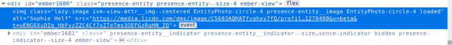
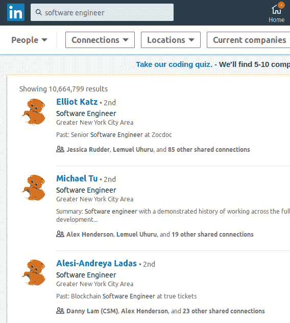

# 编写您的第一个浏览器扩展教程-第 2 部分

> 原文：<https://dev.to/yechielk/writing-your-first-browser-extension-tutorial-part-2-3g9p>

*本教程基于我在 2019 年纽约 Codeland 会议上举办的研讨会。*

出于本教程的目的，我们将使用 Firefox，尽管大多数概念也适用于其他浏览器。

*本教程的代码可以在[这里](https://github.com/achasveachas/codeland)找到*

## 我们在哪里？

在本教程的第一部分中，我们创建了一个有趣的小扩展，每十分钟提醒你离开 Twitter。

这非常有趣(如果你和我一样，也非常有用🤐)，但当你想到浏览器扩展时，想到的可能是对网页做了什么的那些。要么增加点什么，要么去掉点什么，要么换个样子。

在第 2 部分中，我们将重点讨论这种扩展。

## 操纵你的 DOM？

对网页进行修改的 JavaScript 程序使用了一种叫做 DOM 操纵的东西。

DOM(域对象模型)是 HTML 页面的 JavaScript 表示。

JavaScript 内置了用于添加、删除和修改 DOM 的函数，从而导致底层 HTML 页面也发生变化。这个过程称为 DOM 操作。

我们将在下一个扩展中使用 DOM 操作。

## 解除偏见

科技招聘过程面临的一个主要问题是招聘中的隐性偏见。

招聘人员通常花不到半分钟的时间看简历，并且必须在很短的时间内做出很多非常快速的决定。在这种情况下，我们的大脑会尝试走捷径，默认它认为“安全”的选项，这是有道理的。问题是，这些捷径并不一定植根于现实。

相当多的研究表明，给出两份相同的简历，唯一的区别是其中一份有白人男性的照片和姓名，另一份有传统上在技术领域代表性不足的人口统计数据的照片和姓名，白人男性的简历会比 URM 的简历得到更多的回应。

这并不一定是因为研究中的招聘经理试图种族主义/性别歧视，更有可能是因为我们生来就有的隐性偏见，很难纠正，尤其是在你没有意识到的情况下。

*(如果你还没有，我建议你参加[内隐联想测验(IAT)](https://implicit.harvard.edu/implicit/takeatest.html) 。我发现结果令人大开眼界)*

马丁·华克创建了一个有趣的扩展来处理这个问题，叫做[解除偏置](https://www.unbiasify.com)。看看他们的网站看看它是做什么的。

我们将实现其中的一小部分。我们将改变 LinkedIn 的外观，这样我们就看不到任何候选人的照片。相反，我们将把个人资料图片换成一只小猫的图片！

(最初的 Unbiasify 扩展将个人资料图片换成了一个普通的灰色圆圈，但这很无聊。再说，互联网永远不能有太多的小猫；)

## 我们开始吧！

***注意:**如果你不想丢失我们在第一部分中写的任何代码，你可以在这里创建一个新的分支。我们写的所有代码都在[这个回购](https://github.com/achasveachas/codeland)里。*

*   我们需要做的第一件事是转到我们的`manifest.json`并更改`"matches"`键，告诉我们的扩展在 LinkedIn 上运行:

```
 "content_scripts": [
        {
-            "matches": ["*://*.twitter.com/*"], +            "matches": ["*://*.linkedin.com/*"],
             "js": ["first-extension.js"]
        }
    ] 
```

<svg width="20px" height="20px" viewBox="0 0 24 24" class="highlight-action crayons-icon highlight-action--fullscreen-on"><title>Enter fullscreen mode</title></svg> <svg width="20px" height="20px" viewBox="0 0 24 24" class="highlight-action crayons-icon highlight-action--fullscreen-off"><title>Exit fullscreen mode</title></svg>

*   如果我们在“about:debugging”中重新加载我们的扩展，并前往[LinkedIn.com](https://linkedin.com)，我们应该看到我们的警告在那里弹出。这只是为了确保一切都还在工作。

*   让我们去掉`first-extension.js`中的所有代码。

*   在我们写任何代码之前，我们需要弄清楚我们想要编辑页面的哪些部分。既然我们想交换个人资料照片，我们需要去 LinkedIn，看看我们是否能找到所有个人资料照片的共同点。

*   让我们前往[LinkedIn.com](https://linkedin.com)，在搜索栏中键入“软件工程师”，然后点击“人员”标签。这应该会给我们一份有才华的软件工程师的名单。我们要做的是交换侧面照片。

*   打开“检查”工具(`ctrl+shift+i`或右击页面并选择“检查元素”)。

*   导航到一个个人资料图片，它应该是这样的:
    [](https://res.cloudinary.com/practicaldev/image/fetch/s--oeEvs-tM--/c_limit%2Cf_auto%2Cfl_progressive%2Cq_auto%2Cw_880/https://thepracticaldev.s3.amazonaws.com/i/nskrkildapplupk5b59t.png)

*   我们正在寻找一个类名，这个类名是所有的个人资料图片共有的，但是页面上的其他元素都没有。

*   随便玩了一下，好像我们要的类名是这个:`EntityPhoto-circle-4`。

*   事实上，假设 LinkedIn 上的**所有的**个人资料图片将共享格式`EntityPhoto-[shape]-[size]`(为了节省你的精力，我验证了这个假设是正确的)，这似乎是合理的，这意味着我们不必做任何额外的工作来扩展整个 LinkedIn！我们所要做的就是找到一种方法来选择类名包含`EntityPhoto`的所有图像！

*   让我们编写代码来实现这一点。将以下内容添加到`first-extension.js` :

```
let images = document.querySelectorAll('img[class*="EntityPhoto"]') 
```

<svg width="20px" height="20px" viewBox="0 0 24 24" class="highlight-action crayons-icon highlight-action--fullscreen-on"><title>Enter fullscreen mode</title></svg> <svg width="20px" height="20px" viewBox="0 0 24 24" class="highlight-action crayons-icon highlight-action--fullscreen-off"><title>Exit fullscreen mode</title></svg>

*   我们使用 JavaScript 的`querySelectorAll`函数来获取类名中包含子串`"EntityPhoto"`的所有`img`元素(CSS 选择器`class*`选择类名中包含所提供值的任何类)。这将给我们一个由`img`元素组成的数组，我们将它赋给了变量`images`。

*   我们需要做的下一件事是将我们的个人资料图片的`src`属性(目前指向实际的个人资料图片)换成一张普通的猫图片。

*   可以用自己猫咪的图片，也可以用这张[clipratix](https://clipartix.com/kitten-clipart-image-28859/):
    [](https://res.cloudinary.com/practicaldev/image/fetch/s--owe1kVpz--/c_limit%2Cf_auto%2Cfl_progressive%2Cq_auto%2Cw_880/https://clipartix.com/wp-content/uploads/2016/08/Kitten-cats-gato-clipart-on-laminas-para-decoupage-kitty.jpg)的免费图片

*   无论你选择使用哪张图片，把它以`kitten.jpg`的名称保存到你的电脑中，并把它放在我们的`first-extension`目录下一个叫做`images`的子目录中。

*   接下来，我们需要告诉我们的扩展关于我们的小猫图片。将以下键/值对添加到`manifest.json` :

```
 "content_scripts": [
        {
             "matches": ["*://*.linkedin.com/*"],
             "js": ["first-extension.js"]
        }
-   ] +   ],
+   "web_accessible_resources": ["images/kitten.jpg"] 
```

<svg width="20px" height="20px" viewBox="0 0 24 24" class="highlight-action crayons-icon highlight-action--fullscreen-on"><title>Enter fullscreen mode</title></svg> <svg width="20px" height="20px" viewBox="0 0 24 24" class="highlight-action crayons-icon highlight-action--fullscreen-off"><title>Exit fullscreen mode</title></svg>

(记得在`"content_scripts"`数组后添加逗号)

*   现在我们可以迭代之前创建的`images`数组，并将所有的`img`指向我们的小猫图片！我们将使用一个`for`循环来实现。将以下内容添加到`first-extension.js`:

```
for (i = 0; i < images.length; i++) {
    images[i].src = browser.runtime.getURL("images/kitten.jpg")
} 
```

<svg width="20px" height="20px" viewBox="0 0 24 24" class="highlight-action crayons-icon highlight-action--fullscreen-on"><title>Enter fullscreen mode</title></svg> <svg width="20px" height="20px" viewBox="0 0 24 24" class="highlight-action crayons-icon highlight-action--fullscreen-off"><title>Exit fullscreen mode</title></svg>

*   我们正在做的是检查我们的`images`数组，对于其中的每个图像，我们调用它的`img.src`属性，并将其分配给一个新的 URL 我们的小猫图片的 URL(`browser.runtime.getURL`部分是获取我们的扩展的根 URL，它在每次加载扩展时都会改变)。

*   我们现在准备看看我们的扩展是否有效！转到“关于:调试”并重新加载我们的扩展，然后返回 LinkedIn 并刷新页面。如果我们做对了一切，它应该是这样的:

[](https://res.cloudinary.com/practicaldev/image/fetch/s--dRKUMgVn--/c_limit%2Cf_auto%2Cfl_progressive%2Cq_auto%2Cw_880/https://thepracticaldev.s3.amazonaws.com/i/nc7gj1ne8fl58caeal1u.png)

***故障排除:**如果你不能让它工作，你可以试着将你的代码与[这个分支](https://github.com/achasveachas/codeland/tree/aa2956743f98375dac264d69132f501020732105)中的代码进行比较。*

*   这看起来应该可以，但是如果你刷新页面，试着向下滚动，你可能会注意到并不是所有的个人资料图片都变成了猫！页面后半部分的个人资料仍然包含个人资料图片！

*   原因是 LinkedIn(像许多其他网站一样)使用了一种叫做“惰性加载”的东西。简而言之，为了在页面加载时节省时间，LinkedIn 不会一次加载整个页面，它只加载页面的一部分，并在你向下滚动时加载其余部分。问题是，我们的扩展中的脚本只在页面加载时运行一次，因此脚本运行时不在页面上的任何内容都不会受到影响。

*   我们可以使用一个相对较新的 JavaScript 特性来解决这个问题，这个特性叫做 [MutationObserver](https://developer.mozilla.org/en-US/docs/Web/API/MutationObserver) ，它“观察”页面(或页面的一部分)的任何变化，或者“突变”，当它注意到有变化时，它会执行传递给它的函数(回调函数)。

***注意:**`MutationObserver`API 相对较新，可能无法在所有浏览器中工作*

*   我们要做的第一件事是将我们现有的逻辑封装在一个函数中，以便更容易传递:

```
+ function imageSubstituter(){
      let images = document.querySelectorAll('img[class*="EntityPhoto"]')

      for (i = 0; i < images.length; i++) {
          images[i].src = browser.runtime.getURL("images/kitten.jpg")
      }
+ } 
```

<svg width="20px" height="20px" viewBox="0 0 24 24" class="highlight-action crayons-icon highlight-action--fullscreen-on"><title>Enter fullscreen mode</title></svg> <svg width="20px" height="20px" viewBox="0 0 24 24" class="highlight-action crayons-icon highlight-action--fullscreen-off"><title>Exit fullscreen mode</title></svg>

*   接下来，让我们创建一个新的`MutationObserver`对象，并将我们的函数作为回调传递给它:

```
const observer = new MutationObserver(imageSubstituter) 
```

<svg width="20px" height="20px" viewBox="0 0 24 24" class="highlight-action crayons-icon highlight-action--fullscreen-on"><title>Enter fullscreen mode</title></svg> <svg width="20px" height="20px" viewBox="0 0 24 24" class="highlight-action crayons-icon highlight-action--fullscreen-off"><title>Exit fullscreen mode</title></svg>

*   我们创建的`MutationObserver`对象有一个带两个参数的`observe`函数:一个要观察的 DOM 元素和一些作为 JavaScript 对象传递的配置选项。

*   让我们先写下我们的配置选项:

```
const config = { childList: true, subtree: true } 
```

<svg width="20px" height="20px" viewBox="0 0 24 24" class="highlight-action crayons-icon highlight-action--fullscreen-on"><title>Enter fullscreen mode</title></svg> <svg width="20px" height="20px" viewBox="0 0 24 24" class="highlight-action crayons-icon highlight-action--fullscreen-off"><title>Exit fullscreen mode</title></svg>

这将告诉我们的观察者不仅要观察我们告诉它的元素，还要观察任何子元素。

*   我们现在准备调用我们的`observer` s `observe`函数。我们将传递给它我们 HTML 页面的整个主体，以及我们编写的配置选项:

```
observer.observe(document.body, config) 
```

<svg width="20px" height="20px" viewBox="0 0 24 24" class="highlight-action crayons-icon highlight-action--fullscreen-on"><title>Enter fullscreen mode</title></svg> <svg width="20px" height="20px" viewBox="0 0 24 24" class="highlight-action crayons-icon highlight-action--fullscreen-off"><title>Exit fullscreen mode</title></svg>

*   我们现在准备看看我们改进的扩展是否有效。转到“关于:调试”，重新加载扩展，然后返回 LinkedIn 并重新加载页面。当您向下滚动时，您应该会看到加载的所有个人资料图片到卡特彼勒图片！

***故障排除:**如果扩展不工作，请再次检查您是否一切正常(检查代码[此处](https://github.com/achasveachas/codeland/tree/unbiasify)供参考)。*

*如果你确定一切正常，但**仍然**不工作，很可能你的浏览器不支持`MutationObserver` API。如上所述，这是一个相对较新的特性，并没有得到普遍支持。*

## 恭喜恭喜！

恭喜你！我们现在已经创建了两个可用的浏览器扩展！

我希望我给了你足够的信息来开始开发你自己的浏览器扩展。

如果我确实启发了你去做一些很棒的东西，请在这里或者在 [Twitter](https://twitter.com/yechielk) 上联系我，分享你做的东西！