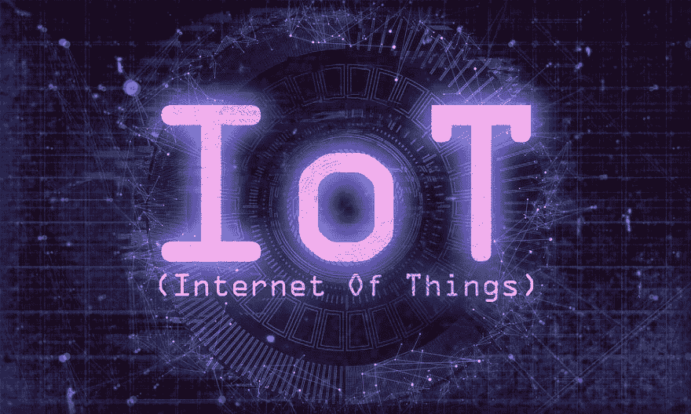
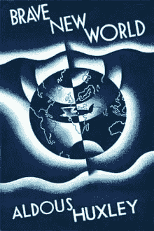
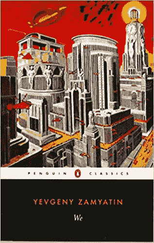
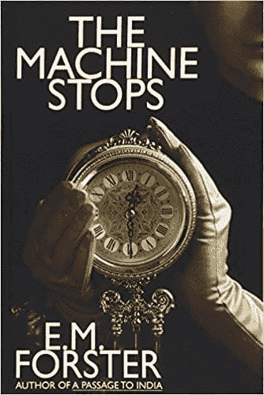
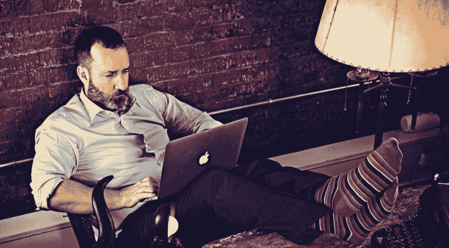

# 物联网(物联网):未来的技术

> [https://dev . to/berkakcay/对象到互联网的未来技术 bj6】](https://dev.to/berkayakcay/nesnelerin-i-nterneti-iot-gelecegin-teknolojisi-bj6)

### 【机器停止】物联网(物联网):未来的技术

从根本上改变了我们的网络生活:交友和保持关系的方式、新闻和信息的内在化、娱乐化等。现在，物联网(物联网)是所有这些的最后一步，它要求对我们的环境和我们的身体进行真正的监控和控制。如果这种新型的聚合网络如预期般发展的话，我们就可以在日常生活中采取一些简单的行动，比如开灯，调节恒温器，然后进行大规模的购物只有通过智能手机的屏幕，我们才能做得更好。如果你仔细看的话，你可以说这种技术正在改进或降低你的工作。

就像所有的新技术一样，我们无法准确预测什么样的变化会导致什么样的变化。但 20 世纪的小说家和《t0》**霍华德的结尾** 和 ***的段落是印度的*** M.我们可以从福斯特(T9)那里得到灵感。他也曾预言过类似的宇宙末日机器 1(1909 年)的到来。科技可以满足人类的所有需求。

福斯特不喜欢汽车和航空公司在他那个时代被认为是重大的技术变革。1908 年，

> “如果我活到老，我会发现天空就像道路一样危险……而不是让科学家们自由。”
> 把他变成了机器的奴隶

他说的。福斯特的这种反应表明他作品的基调是反乌托邦。评论家兼政治作家乔治伍德考克**第一篇文章《被选择的评论》T2、**第四篇《在否定中的乌托邦》**第七篇《机器停止》这些是***我们*** (1920)和**奥尔德斯·赫胥黎**中的植物基因**

 **

福斯特对“机器停止”的悲观看法是由于著名的“仅限于融合”阶段引起的。福斯特对于机器的崛起和他自己一样的“灵魂”的消失所产生的恐惧也塑造了他对科技对人类的影响的看法

福斯特的故事和第一个版本的物件在网际网路上有很多相似之处。1999 年，英国技术专家凯文·艾许朋(t0)**首次使用“物联网”【T3”时，该术语包含了一个基本概念:组装带所需的发光材料这样每个“东西”都可以通过互联网在时间和空间上被追踪。Ashton 认为，对企业和消费者有用的资源和产品的授权管理将有助于对象的互联网技术。但他后来发现了更广泛的意义和深度，可用于指导计算机和真实世界。他写道:**

> 我们就像我们的环境一样。经济、社会和生活的斗争不是建立在观念或信息上，而是建立在对象上。你不能吃昆虫，你不能烧掉它们。想法和信息很重要，但物体更重要。

现在我们以福斯特想象中的方式来管理现实世界中的物体。物联网技术现在包括了对环境、健康和隐私产生积极影响的设备。这些设备之间的远程控制光源、自动调节温度的恒温器和监控通信量的摄像头可以作为这些设备的示例。麻省理工学院的工程教授 sanjay sarma 认为每个灯泡、风扇和设备最终都会成为物联网的一部分这种趋势是显而易见的。

Google、Apple 和其他公司正在努力在对象的互联网技术中发掘潜在的潜力，并提高其能力。韩国电子公司 LG，在您的牛奶或鸡蛋减少时自动订购，制造出“互联网冰箱”，以帮助您的生活更轻松。

另一方面，成功的对象(例如互联网恒温器)也有互联网设备，谷歌在 2014 年购买了 32 亿美元。这是一种可以在使用过程中学习的方式。因此，此设备能够根据机箱的填充率和每天的时间自动调节机箱温度，从而最大限度地提高舒适度并节省散热成本经过最初的一些问题，这款恒温器现在很受欢迎，至少能节省一半的能源。虽然比传统的恒温器贵很多。

物联网也是人工照明新技术的自然发展伙伴。在 2014 年诺贝尔奖得主的研究中，这些固态器件作为低功耗光源被推出。几年后，彩色和白色的光可以通过互联网传播和控制。城市(如哥本哈根)的新的城市 LED 灯(带有家庭或内置传感器)完全照亮了城市，这取决于创建救护车或通过互联网实时控制交通

通过将温度或光照的环境因素融入物联网技术我们可以捕捉到未来福斯特在"机器停止"中所展示的人类未来和其他人一样福斯特的主要角色是一个人住在一个很少离开的地下房间里。这是因为它可以通过一种黑暗的智慧和一种机器来满足所有的需求。

机器为这个地下世界提供了照明和空调即使人们实际上是在机器内部分离的机器也把它们连接在一起。虽然瓦实提的房间很少但佛斯特只和世上最重要的人有过接触瓦实提可以通过视频和声音与任何人交流也可以与一群人交流。为了刺激或安慰，他可以通过机器做出选择，如文学或音乐。

这里的社交和娱乐神秘地预测了当今互联网通过 Facebook、Skype、iTunes 等平台提供的服务。但这机器所提供的远远超过了当今的科技能满足人类所有的物质需求食物衣服热水和冷水澡的需求。此外，本机种也提供各种个人化的医疗诊断及维护服务，并配备各种室内设备。

瓦实提已经完全接受了这种孤立和稳定的存在并且完全不知道这对人类自身和身体都造成了什么样的影响。就像一堆白面的蘑菇。虽然他很关心他的儿子 Kuno，但他拒绝和其他人直接交流。人类的触摸是从情感上和意义上完全从生活中剥离出来的，并被机器切割成小对进行性繁殖。

但不是每个人都接受这种生活。Kuno 医生曾经对自然产生了极大的兴趣他终于意识到人类已经消失了。但意识到这一点是一个很晚的行动，机器现在已经开始出故障了。他的音乐一开始会有一些停顿。然后，灯光，食物和医疗服务开始出现问题。在最后一幕里，机器不再完全停止了，瓦实提，Kuno 和其他绝望的人群在黑暗中死去。唯一的解决之道就是在地球上少数人的生命中重建人类。

福斯特的故事是一个灾难性的结局但无论物体的互联网技术将我们带到哪里人类都不会遭受地下灾难。乐观地说，当人们普遍接受和谨慎使用对象的互联网技术时，它可能会对人类有所帮助。否则，它可能会降低人类的潜能。但机器的种子已经在网上和网上证明了它的存在。比如说，它已经在快速、大规模地分发物品中生效了。我们大部分人都不会从商店里买东西带回家。而是我们在网上订购并等待发货。我们也不用等太久因为像亚马逊这样的零售商总是催得更快。当无人驾驶运载工具和飞行器加入物联网技术时，运送时间将会更短。

传播到食品行业。网上订购的快餐已经越来越普及了这不仅意味着很快就能吃到热披萨。通过在 15 个城市的 instacart 等公司的努力，现在可以在网上购物了。如果食物供应系统真的启动了比如说把食物送到世界粮食短缺的地方这也被认为是严重的全球粮食短缺

在医学领域，互联网和物联网技术的作用越来越大。这些服务可能永远无法取代与医生的面对面交谈，但可以通过无线连接监控设备(例如医疗记录和核磁共振成像)来监控心脏病患者的心跳此外，诸如活动水平、心率、睡眠习惯等可穿戴的个人设备也发生了巨大的爆炸。这些实时数据通过无线方式收集和分析，可以激励人们提高健康意识，并带来更好的医疗效果。

这些关于未来的可能性使得像厄尼·胡德的《环境健康展望》一书中写的那样的观察者们确信物体可以把人类带到一个更加可持续的世界。但我们也要考虑到福斯特对这项技术的看法同时也考虑到这项技术的黑暗和潜在的危险影响。

我们面临的两种可能性都是隐私问题和人身侵犯。即使是看起来无害的巢穴恒温器也会跟踪房子空出来的时间让私人信息潜在的脆弱。最极端的例子是一个电脑黑客可以接触到他的无线心脏系统来进行谋杀。此外，如果所有的物件(例如城市照明)都有网路安全漏洞的话，结果可能会像福斯特的故事一样糟糕。除非是针对强大的安全对象的 i̇nterneti 技术。

还有一件事。什么样的最终权力会控制互联网对象的技术？在"机器停止"的故事里，人类终于像上帝一样崇拜机器了。现在有些人对科技有着虔诚的信仰但我们对科技没有宗教信仰。但我们真的要把我们的生活交给谷歌吗？约瑟夫·詹尼斯在 google stops(谷歌停止)中问了这个问题。还是把我们的生命交给更大的科技公司 GAFA (Google、Apple、Facebook 和 Amazon)，简称为“上帝”？

物联网最不可预知的是人类的本性如何应对。在福斯特的故事中，一个像蘑菇一样白的身体代表了一个从未见过太阳的人。如果人们在某些文化中需要很大的努力才能生存，而在其他文化中，锻炼是选择性的(而且通常是被拒绝的话)，那么他们就必须用一个按键或一根手指**