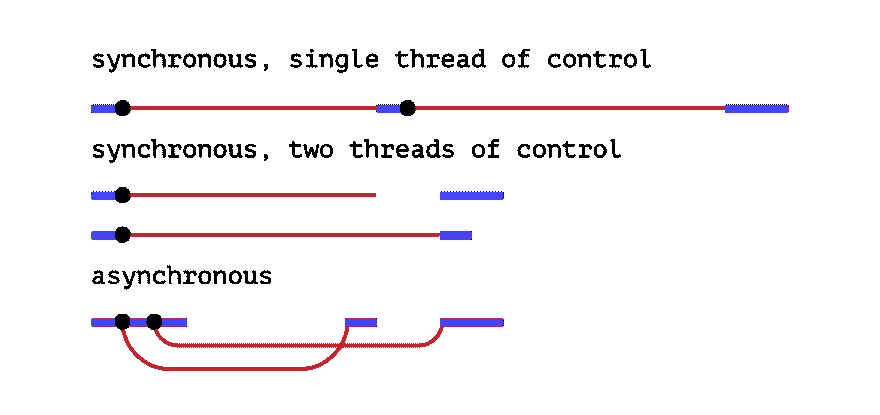

# JavaScript -异步和承诺

> 原文：<https://dev.to/scmmishra/javascript-async-and-promises-5coj>

世界上最容易被误解的编程语言，JavaScript 有很多真正了不起的工程。它本身就是万维网的语言。JavaScript 是为 web 设计的，这意味着它应该是异步的，这通常会给第一次尝试学习这种语言的大多数人带来困惑。

## 但是异步到底是什么？

在*同步*程序中，如果你有两行代码(L1 跟着 L2)，那么 L2 不能开始运行，直到 L1 完成执行。而在*异步*程序中，你可以有两行代码(L1 后面跟着 L2)，其中 L1 安排某个任务在未来运行，但 L2 在该任务完成之前运行。这不要与多线程执行相混淆。JavaScript 利用单线程来执行。

[](https://res.cloudinary.com/practicaldev/image/fetch/s--RaAPxaED--/c_limit%2Cf_auto%2Cfl_progressive%2Cq_auto%2Cw_880/https://thepracticaldev.s3.amazonaws.com/i/sjwy8hp7cyag1jvhpba5.png) 
*异步执行。来源:[https://eloquentjavascript.net](https://eloquentjavascript.net)T7】*

`setTimeout`函数可能是异步调度代码在未来运行的最简单方式:

```
// Say Hello.
console.log(Hello.);
// Say Goodbye two seconds from now.
setTimeout(function() {
        console.log(Googbye!);
}, 2000);
// Say Hello again!
console.log(Hello again!); 
```

<svg width="20px" height="20px" viewBox="0 0 24 24" class="highlight-action crayons-icon highlight-action--fullscreen-on"><title>Enter fullscreen mode</title></svg> <svg width="20px" height="20px" viewBox="0 0 24 24" class="highlight-action crayons-icon highlight-action--fullscreen-off"><title>Exit fullscreen mode</title></svg>

如果您只熟悉同步代码，您可能希望上面的代码以如下方式运行:

*   打个招呼。
*   两秒钟内什么都不做。
*   说再见！
*   再次问好！

但是`setTimeout`不会暂停代码的执行。它只安排未来发生的事情，然后马上继续下一行。

*   打个招呼。
*   再次问好！
*   两秒钟内什么都不做。
*   说再见！

### 为什么我们需要异步？

由于 JavaScript 构建的工作环境和它用来完成的交互类型，异步特性是必不可少的。当构建真实世界的应用程序时，您将需要访问资源或与外部的应用程序进行交互，例如，看看下面的代码。

```
// CoursePage.vue
mounted() {
    this.getCourseDetails().then(data => this.course = data);
    this.getTopics().then(data => this.topicData = data);
},
methods: {
    getCourseDetails() {
        return lms.call('get_course_details', {
            course_name: this.courseName
        });
    },
    getTopics() {
        return lms.call('get_course_topics', {
            course_name: this.courseName
        });
    }
} 
```

<svg width="20px" height="20px" viewBox="0 0 24 24" class="highlight-action crayons-icon highlight-action--fullscreen-on"><title>Enter fullscreen mode</title></svg> <svg width="20px" height="20px" viewBox="0 0 24 24" class="highlight-action crayons-icon highlight-action--fullscreen-off"><title>Exit fullscreen mode</title></svg>

从我一直从事的一个项目来看，它是一个使用`lms.call()`函数进行两次 API 调用的 [Vue](https://vuejs.org) 组件。一旦组件被安装，`getCourseDetails()`和`getTopics()`都应该被执行。现在，它们中的每一个都向 API 端点发出 HTTP 请求，该端点执行某些操作并返回一些数据。关于这些操作的事情是**它们需要时间**；在行动开始和反应之间总是有延迟。对于 JavaScript 来说，这是一个非常基本的问题。

由于 JavaScript 是单线程的，浏览器无法中断正在运行的脚本，即使脚本只是在等待服务器完成某个任务，浏览器也会简单的被卡住，它甚至无法渲染任何 UI，监听任何交互。

你甚至可以现在就在你的浏览器中模拟这种性质。[在浏览器](https://webmasters.stackexchange.com/a/77337)中打开 JS 控制台，输入以下代码:

```
function wait(ms) {
    let waitUntil = Date.now() + ms
    while (Date.now() < waitUntil) { continue }
} 
```

<svg width="20px" height="20px" viewBox="0 0 24 24" class="highlight-action crayons-icon highlight-action--fullscreen-on"><title>Enter fullscreen mode</title></svg> <svg width="20px" height="20px" viewBox="0 0 24 24" class="highlight-action crayons-icon highlight-action--fullscreen-off"><title>Exit fullscreen mode</title></svg>

现在你要做的就是调用这个函数。输入`wait(10000)`将会冻结你的浏览器 10 秒钟。在此期间尝试选择文本或单击任何链接。10 秒钟后，即使关闭标签也不起作用。由于这个原因，如果 JavaScript 是同步的，它就不能进行多任务处理。这就是 JavaScript **拥有**成为异步的原因。

### 了解回调

回调是作为一个参数发送给另一个函数的函数，并且在某个事件(如 HTTP 响应)发生时被调用。它本质上是一个存根或者一段代码，你将把它传递给函数，比如说`setTimeout()`，浏览器将保存它直到需要它的时候。然后当感兴趣的事件发生时，比如超时或 HTTP 响应，浏览器可以通过执行存储的回调函数来处理它。再次强调，当你启动一个操作，比如超时或者请求，浏览器不会等待它继续，脚本会继续执行。只有在原始脚本完全执行完之后**才会执行回调。下面可能是回调的最简单的例子:** 

```
function greeting(name) {
        alert('Hello ' + name);
}
function processUserInput(callback) {
        var name = prompt('Please enter your name. ');
    callback(name);
}
processUserInput(greeting); 
```

<svg width="20px" height="20px" viewBox="0 0 24 24" class="highlight-action crayons-icon highlight-action--fullscreen-on"><title>Enter fullscreen mode</title></svg> <svg width="20px" height="20px" viewBox="0 0 24 24" class="highlight-action crayons-icon highlight-action--fullscreen-off"><title>Exit fullscreen mode</title></svg>

回调在现实世界中的使用实际上会导致一些看起来很糟糕的代码，通常被称为回调地狱，如果你是 JS 开发人员已经有一段时间了，你可能听说过短语*回调地狱*。如果你想了解回调地狱，callbackhell.com 可能是最好的网站。

[](https://res.cloudinary.com/practicaldev/image/fetch/s--E8gi5loc--/c_limit%2Cf_auto%2Cfl_progressive%2Cq_auto%2Cw_880/v1img/async/callback-hell.png)

基于回调的代码不可避免地导致开发人员不得不编写几乎不可读甚至某种程度上不可维护的代码。在承诺到来之前，复杂的回调需要对 JavaScript 做任何有用的事情。

## 介绍承诺

承诺是表示异步操作的完成(成功或失败)及其结果值的对象。我们使用承诺的方式是，承诺是一个返回的对象，您可以将回调附加到该对象上，而不是将回调传递到函数中。

与旧式的*传递式*回调不同，承诺带有一些保证:

*   在 JavaScript 事件循环的当前运行完成[之前，不会调用回调。](https://developer.mozilla.org/en-US/docs/Web/JavaScript/EventLoop#Run-to-completion)
*   回调添加了与 [`then()`](https://developer.mozilla.org/en-US/docs/Web/JavaScript/Reference/Global_Objects/Promise/then) 甚至*异步操作成功或失败后，都会被调用，如上图。*
**   通过多次调用 [`then()`](https://developer.mozilla.org/en-US/docs/Web/JavaScript/Reference/Global_Objects/Promise/then) 可以添加多个回调。每个回调都按照插入的顺序依次执行。*

 *使用承诺的最大好处之一是**连锁**。这使我们能够编写按照您期望的顺序执行的代码。从语义上来说，这更具可读性和可维护性。

下面两个例子可以帮助你理解它们之间的明显区别。

```
// With traditional passed-in Callbacks

doSomething(function(result) {
    doSomethingElse(result ,function(newResult) {
        doFinalStep(newResult, function(finalResult) {
            console.log('Got the final result: ' + finalResult);
        }, failureCallback);
    }, failureCallback);
}, failureCallback);

// With Promises
doSomething()
    .then((result) => { return doSomethingElse(newResult) })
    .then((newResult) => { return doFinalStep(newResult) })
    .then((finalResult) => { console.log('Got the final result: ' + finalResult) })
    .catch(failureCallback) 
```

<svg width="20px" height="20px" viewBox="0 0 24 24" class="highlight-action crayons-icon highlight-action--fullscreen-on"><title>Enter fullscreen mode</title></svg> <svg width="20px" height="20px" viewBox="0 0 24 24" class="highlight-action crayons-icon highlight-action--fullscreen-off"><title>Exit fullscreen mode</title></svg>

承诺给你带来了异步代码的性能优势，同时又不失清晰。

### 书写承诺

承诺的语法很简单:`new Promise(executor);`。`executor`是一个通过参数`resolve`和`reject`传递的函数。

```
API.call = function(args) {
    return new Promise((resolve, reject) => {
        return axios.create({...args}).then(response => {
            if (response.ok) {
                resolve(response)
            } else {
                reject(new Error('error'))
            }
        });
    });
}; 
```

<svg width="20px" height="20px" viewBox="0 0 24 24" class="highlight-action crayons-icon highlight-action--fullscreen-on"><title>Enter fullscreen mode</title></svg> <svg width="20px" height="20px" viewBox="0 0 24 24" class="highlight-action crayons-icon highlight-action--fullscreen-off"><title>Exit fullscreen mode</title></svg>

> 还有一个更好的方法来写这个函数

### 异步-等待语法

另一种创造承诺的方式是`async-await`语法。没有明确写承诺。`async/await`可以说是编写异步代码的一种更优雅的方式，在语义上给人一种更同步的感觉。使用 async 和 await，您可以隐式地创建承诺并处理它们。

下面是它的语法

```
async function name([param[, param[, ... param]]]) {
    statements
} 
```

<svg width="20px" height="20px" viewBox="0 0 24 24" class="highlight-action crayons-icon highlight-action--fullscreen-on"><title>Enter fullscreen mode</title></svg> <svg width="20px" height="20px" viewBox="0 0 24 24" class="highlight-action crayons-icon highlight-action--fullscreen-off"><title>Exit fullscreen mode</title></svg>

让我们看下面的例子

```
// Using classic Promise Syntax
getData(args) {
    return asyncFunction(args)
        .then(result => doSomething(result))
        .then(nextResult => doSomethingElse(nextResult))
        .catch(err => {
                console.error('fetch error', err);
        })
} 
```

<svg width="20px" height="20px" viewBox="0 0 24 24" class="highlight-action crayons-icon highlight-action--fullscreen-on"><title>Enter fullscreen mode</title></svg> <svg width="20px" height="20px" viewBox="0 0 24 24" class="highlight-action crayons-icon highlight-action--fullscreen-off"><title>Exit fullscreen mode</title></svg>

```
// Using aync-await
async getData(args) {
    try {
        const result = await asyncFunction(args);
        const nextResult = await doSomething(result);
        const await doSomethingElse(nextResult);
    }
    catch (err) {
        console.error('fetch error', err);
    }
} 
```

<svg width="20px" height="20px" viewBox="0 0 24 24" class="highlight-action crayons-icon highlight-action--fullscreen-on"><title>Enter fullscreen mode</title></svg> <svg width="20px" height="20px" viewBox="0 0 24 24" class="highlight-action crayons-icon highlight-action--fullscreen-off"><title>Exit fullscreen mode</title></svg>

正如你所看到的，`async-await`在更复杂的场景中提供了更好的语法，包括循环或者像`try-catch`这样的结构。

这个新计划有许多好处。

1.  清除错误堆栈。
2.  **更好的调试。**断点可以很好地写在`.then`块中，但是在单步执行时，调试器不会移动到下一个`.then`，因为它只“单步执行”同步代码。
3.  **代码健全。**你可以用同一个构造处理异步和同步错误。这有助于减少重复并提高代码可读性。

如果你想了解这在幕后是如何运作的，我强烈推荐你在 SmashingConf 上观看由[杰克·阿奇博尔德](https://jakearchibald.com/)所做的这个[演讲](https://vimeo.com/254947206)，或许也可以在 MDN 上阅读这篇[的文章。](https://developer.mozilla.org/en-US/docs/Web/JavaScript/EventLoop)

了解异步编程可能是掌握 JavaScript 的第一步，本文涵盖了入门所需的所有内容。更多关于 JavaScript 的内容将在以后的博客中讨论。

最初发布于 [shivam.dev](https://shivam.dev/java-script-async-and-promises)*