# 通过 Ruby on Rails、DynamoDB(带流)、Kinesis Firehose、Athena 和 CloudWatch Dashboard 进行事件跟踪和分析！

> 原文：<https://dev.to/andrewbrown/event-tracking-and-analytics-via-ruby-on-rails-dynamodb-with-streams-kinesis-firehose-and-athena-and-cloudwatch-dashboard-1lma>

这不是一个端到端的指南，我记录了我的旅程，并认为我会用我有时间记录的内容来发布，而不是在我们的私人知识库中存储这些知识。然后，我碰巧把一个技术讲座放在一起，所以在下面的视频和内容之间，我希望它能帮助你在 AWS 上创建自己的事件跟踪和分析。

### AWS SDK 初始化器

因为我们只需要将 DynamoDB 添加到您的 Gemfile:

```
gem 'aws-sdk-dynamodb' 
```

Enter fullscreen mode Exit fullscreen mode

为了更容易地使用 SDK，我在初始化器中加入了`RAILS_ROOT/config/intializers/aws.rb`

你会注意到我正在积极地设置凭证。SDK 应该隐式地获取这些环境变量，但是在我写这篇文章的时候，我发现实际上并没有这样做。也许你不必像我这样啰嗦。

```
creds = Aws::Credentials.new(
   ENV['AWS_ACCESS_KEY_ID'],
   ENV['AWS_SECRET_ACCESS_KEY']
 )
Aws.config.update credentials: creds

module DynamoDB
  def self.resource
    @@dynamodb ||= Aws::DynamoDB::Resource.new({
     region: 'us-east-1',
     credentials: Aws::Credentials.new(
       ENV['AWS_ACCESS_KEY_ID'],
       ENV['AWS_SECRET_ACCESS_KEY']
    )})
    @@dynamodb
  end
end 
```

Enter fullscreen mode Exit fullscreen mode

可能应该将区域作为环境变量存储在 [Figaro](https://github.com/laserlemon/figaro) 中

当我们想要使用 DynamoDB 时，我们所要做的就是下面这些:

```
DynamoDB.resource.client.put_item({
  # ...
}) 
```

Enter fullscreen mode Exit fullscreen mode

### 初选和排序

非常独特的 id(如用户 id)是很好的主键，因为它更适合跨分区分布。

日期是非常好的排序关键字。查询时，您的表将根据您的排序关键字存储为 ASC。探索 DynamoDB 表资源管理器，这样您就可以了解如何过滤的局限性。

请注意，对于 Primary，我们只能执行`=`操作，对于 Sort，我们有许多选项。

[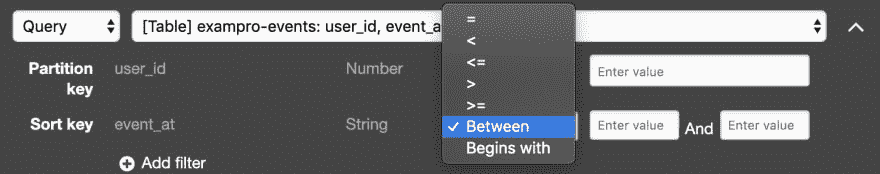](https://res.cloudinary.com/practicaldev/image/fetch/s--xKc0wW4j--/c_limit%2Cf_auto%2Cfl_progressive%2Cq_auto%2Cw_880/https://thepracticaldev.s3.amazonaws.com/i/mlaltjew7t6xaflcgyj9.png)

如果您能理解的话，文档中有更高级的过滤器选项。

### 追踪器

首先，在编写模块之前，我定义了如何使用我的跟踪器。因此，这将写入发电机

上传数据:

```
 Tracker::Put.event({
        user_id: user.id,
        event_type: 'login',
        user_agent: request.user_agent,
        ip_address: request.remote_ip
      }) 
```

Enter fullscreen mode Exit fullscreen mode

获取数据

```
 @recent_activity = Tracker::Get.recent_activity @model.id 
```

Enter fullscreen mode Exit fullscreen mode

对于 put 数据，可能希望将它放在 ActiveJob 中，因为在整个应用程序中分散这些事件调用可能会导致代码阻塞，从而导致团队经历延迟。我认为 DynamoDB 阻塞是因为它在等待响应，尽管我们并不需要响应。

我在我的 lib 目录中创建了一个新的模块

```
# This class is responsible for writing event data
# to various DynamoDB tables and fetching that data
# for display.

module Tracker
  class Entity
    include ActiveModel::Validations

    def initialize(opts={})
      opts.each { |k,v| instance_variable_set("@#{k}", v) }
    end

    attr_accessor :user_id,
                  :event_type,
                  :user_agent,
                  :ip_address,
                  :event_at,
                  :event_id

    validates :user_id        , presence: true, numericality: { only_integer: true }
    validates :event_type     , presence: true, inclusion: { in: %w(
  login
  material-view
)}
    validates :user_agent , presence: true
    validates :ip_address , presence: true
    validates :event_at   , presence: true

    def event_at
      @event_at || Time.now.iso8601
    end
  end

  class Put
    def self.event attrs={}
      entity = Tracker::Entity.new attrs
      unless entity.valid?
        raise ArgumentError, "Tracker Entity invalid permissions"
      end

      DynamoDB.resource.client.put_item({
        item: {
          'user_id'    => entity.user_id,
          'ip_address' => entity.ip_address,
          'user_agent' => entity.user_agent,
          'event_id'   => entity.event_id,
          'event_type' => entity.event_type,
          'event_at'   => Time.now.iso8601 # sort key
        },
        # We don't care about returning cosumed capactiy
        # We can handle looking event tracking data and
        # don't need to be alerted.
        return_consumed_capacity: 'NONE',
        table_name: 'exampro-events'
      })
    end
  end ## Put

  class Get
    def self.recent_activity user_id
      result =
      DynamoDB.resource.client.query({
        expression_attribute_values: {
          ":user_id"    => user_id
        },
        # https://docs.aws.amazon.com/amazondynamodb/latest/developerguide/Query.html#Query.KeyConditionExpressions
        key_condition_expression: "user_id = :user_id",
        limit: 50,
        projection_expression: 'ip_address,event_type,event_at,user_agent', # select statement
        scan_index_forward: false, # descending order
        table_name: 'exampro-events'
      }).items
      result.each do |t|
        t['event_at']   = DateTime.parse(t['event_at'])
        unless t['user_agent'].blank?
          t['user_agent'] = DeviceDetector.new(t['user_agent'])
        end
      end
      result
    end

    def self.logins user_id, event_type
      result =
      DynamoDB.resource.client.query({
        expression_attribute_values: {
          ":user_id"    => user_id,
          ":event_type" => event_type
        },
        key_condition_expression: "user_id = :user_id",
        filter_expression: "event_type = :event_type",
        limit: 10,
        projection_expression: 'ip_address,event_type,event_at,user_agent', # select statement
        scan_index_forward: false, # descending order
        table_name: 'exampro-events'
      }).items
      result.each do |t|
        t['event_at']   = DateTime.parse(t['event_at'])
        unless t['user_agent'].blank?
          t['user_agent'] = DeviceDetector.new(t['user_agent'])
        end
      end
      result
    end
  end ## Get
end 
```

Enter fullscreen mode Exit fullscreen mode

#### 跟踪器::实体

我有这个实体类。它的目的是验证参数的格式。将来我可能会用一个元数据属性来进一步丰富它。

#### 追踪器::放

我有一个用于写 DynamoDB 的类。目前，我只有一种方法，但将来可能会增加更多。

#### 追踪器::获取

我有另一个名为`Get`的类，它从`DyanmoDB`中查询数据

#### DateTime as String

另一件需要注意的事情是，我将时间转换成一个字符串`Time.now.iso8601`。DynamoDB 没有日期时间数据类型。

这个 StackOverflow 很好地解释了在选择日期格式时需要考虑的问题。

我关心可读性，所以 T2 的 ISO 8601 是一个好的格式。
我不在乎使用 TTL(生存时间),因为我不需要终止 DynamoDB 中的记录来清理 DB。
你有 DynamoDB 唯一的 TTL 事件流，这很有趣。
最重要的是在过滤日期时，我可以使用`BETWEEN`在两个范围之间过滤。

#### 扫描 _ 索引 _ 转发

我们使用`scan_index_forward: false`将排序从 ASC 改为 DESC。

#### 投影 _ 表情

我们只想从数据库中返回特定的属性，这就是:
`projection_expression: 'ip_address,event_type,event_at,user_agent'`

#### 退货 _ 已消费 _ 产能

我们使用`return_consumed_capacity: 'NONE'`是因为我不在乎得到回应。如果有容量问题，我会发出警报并采取措施。因为这是事件数据，所以我不跟踪某些事件。

#### 设备检测器

我们通过[device detector gem](https://github.com/podigee/device_detector)eg .
`DeviceDetector.new(t['user_agent'])`传递我们的用户代理

因此，在我们应用程序的仪表板中，我可以获得人类可读的值，例如它们是在手机/台式机、windows/mac 上还是使用特定的网络浏览器。

### DynamoDB

#### 启用动态模式流

我们需要打开 DynamoDB 流。

[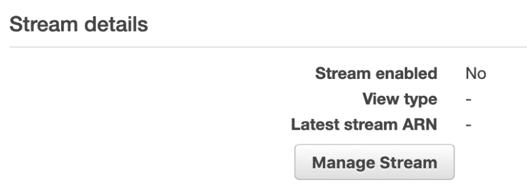](https://res.cloudinary.com/practicaldev/image/fetch/s--Ejrxh2HF--/c_limit%2Cf_auto%2Cfl_progressive%2Cq_auto%2Cw_880/https://thepracticaldev.s3.amazonaws.com/i/sb8j7nd2g7j0rcvins8g.png)

为了让流在 Triggers 选项卡下触发 lambda，我们将添加一个现有的函数。您可能需要单击更多来查找此触发器选项卡。

[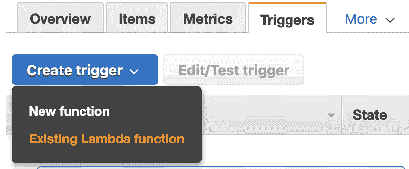](https://res.cloudinary.com/practicaldev/image/fetch/s--U_B7V1vS--/c_limit%2Cf_auto%2Cfl_progressive%2Cq_auto%2Cw_880/https://thepracticaldev.s3.amazonaws.com/i/nq8t4vwk7ey2yn2oqcgt.png)

当记录被插入 DynamoDB 时。Streams 将允许我们成批地将 put 传递给 Lambda 函数。

我们只想要新的图像。我相信一个记录，它首先把它的“旧图像”，并不包含所有的数据。然后，当所有数据都被写入时，它就是一个“新映像”。
[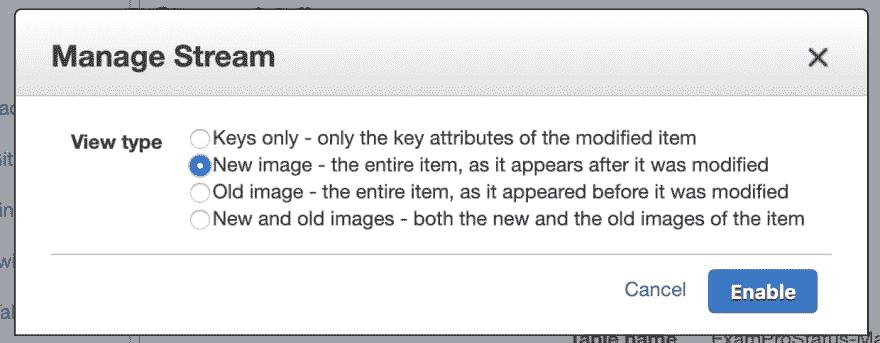T3】](https://res.cloudinary.com/practicaldev/image/fetch/s--gALW-s4r--/c_limit%2Cf_auto%2Cfl_progressive%2Cq_auto%2Cw_880/https://thepracticaldev.s3.amazonaws.com/i/2bm3hnb9hslmvt6b7d7n.png)

我们将把它留给每批 100 个。这并不意味着流会一直等到有 100 条记录要发送，但是一次最多可以发送 100 条。

[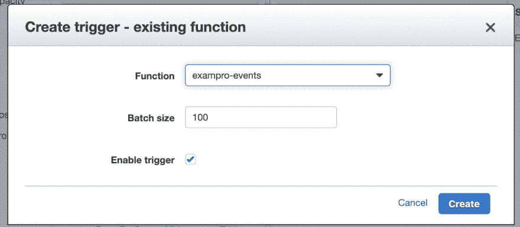](https://res.cloudinary.com/practicaldev/image/fetch/s---PNk7i09--/c_limit%2Cf_auto%2Cfl_progressive%2Cq_auto%2Cw_880/https://thepracticaldev.s3.amazonaws.com/i/9nzsexmftlysv61tpqks.png)

我们可以看到我们的 Lambda 是附加的。如果在这个 Lambda 上发生错误，有时在这里检查一下就知道 Lambda 是否失败是明智的。
[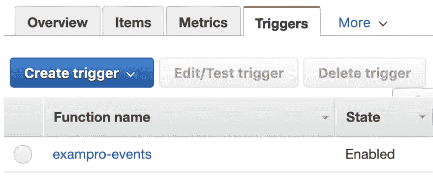T3】](https://res.cloudinary.com/practicaldev/image/fetch/s--NsL-XuBs--/c_limit%2Cf_auto%2Cfl_progressive%2Cq_auto%2Cw_880/https://thepracticaldev.s3.amazonaws.com/i/t10p1isb88ioccvmuhej.png)

这里我们可以看到 DynamoDB 表中的记录

[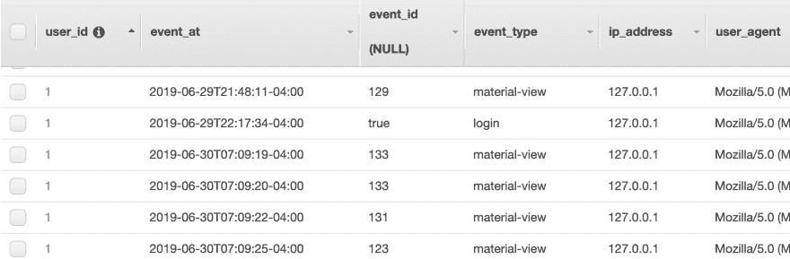](https://res.cloudinary.com/practicaldev/image/fetch/s--hhAS04Mi--/c_limit%2Cf_auto%2Cfl_progressive%2Cq_auto%2Cw_880/https://thepracticaldev.s3.amazonaws.com/i/f0wwk2rrazne2sc8k8na.png)

我们需要创建一个策略，允许 Lambda 接受来自特定 DynamoDB 流的数据。

```
{  "Version":  "2012-10-17",  "Statement":  [  {  "Sid":  "VisualEditor0",  "Effect":  "Allow",  "Action":  [  "dynamodb:GetShardIterator",  "dynamodb:DescribeStream",  "dynamodb:GetRecords"  ],  "Resource":  "arn:aws:dynamodb:us-east-1:ACCOUNT-ID:table/exampro-events/stream/2019-06-30T11:17:05.770"  },  {  "Sid":  "VisualEditor1",  "Effect":  "Allow",  "Action":  "dynamodb:ListStreams",  "Resource":  "*"  }  ]  } 
```

Enter fullscreen mode Exit fullscreen mode

我们需要允许我们的 lambda 函数将数据传输到我们的 Kinesis Firehose

```
{  "Version":  "2012-10-17",  "Statement":  [  {  "Sid":  "VisualEditor0",  "Effect":  "Allow",  "Action":  [  "firehose:PutRecord",  "firehose:PutRecordBatch"  ],  "Resource":  "arn:aws:firehose:us-east-1:ACCOUNT-ID:deliverystream/exampro-events"  }  ]  } 
```

Enter fullscreen mode Exit fullscreen mode

然后，我将这两个新策略附加到一个角色上，这个角色再附加到我的 Lambda 函数上。
[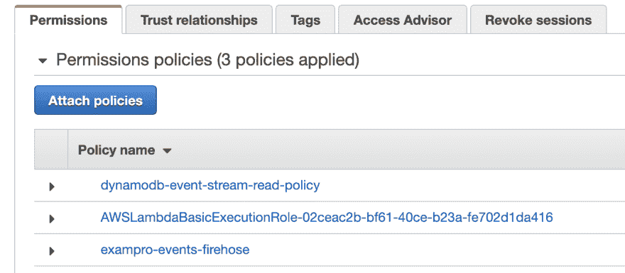T3】](https://res.cloudinary.com/practicaldev/image/fetch/s--RhJb-JmQ--/c_limit%2Cf_auto%2Cfl_progressive%2Cq_auto%2Cw_880/https://thepracticaldev.s3.amazonaws.com/i/ucjfbexg7g596kp7nbys.png)

## 将数据从 DynamoDB 传输到 Firehose 的 Lambda

由于 DynamoDB 流可以批量交付数据，我们将使用 [put_record_batch](https://docs.aws.amazon.com/sdk-for-ruby/v3/api/Aws/Firehose/Client.html#put_record_batch-instance_method)

我们需要供应`delivery_stream_name`。也许应该把这个**放在环境变量**中，而不是我在这里硬编码的方式。

即使我们永远不会更新 DynamoDB 记录，我们也只会将事件发布到流中进行插入

```
require 'json'
require 'aws-sdk-firehose'

def lambda_handler(event:, context:)
  records = []
  event['Records'].each do |t|
    if t['eventName'] == 'INSERT'
      records.push({data: {
        user_id: t['dynamodb']['NewImage']['user_id']['N'],
        event_at: t['dynamodb']['NewImage']['event_at']['S'],
        event_id: t['dynamodb']['NewImage']['event_id']['N'],
        event_type: t['dynamodb']['NewImage']['event_type']['S'],
        ip_address: t['dynamodb']['NewImage']['ip_address']['S'],
        user_agent: t['dynamodb']['NewImage']['user_agent']['S']
      }.to_json + "\n" })
    end
  end
  json = {records_size: records.size}.to_json
  puts json
  unless records.size.zero?
    firehose = Aws::Firehose::Resource.new
    resp = firehose.client.put_record_batch({
      delivery_stream_name: "exampro-events", # required
      records: records
    })
    json = {failed_put_count: resp.failed_put_count}.to_json
    puts json
  end

  return true
end 
```

Enter fullscreen mode Exit fullscreen mode

### Json 记录换行

你会注意到我在我们的 json 字符串中添加了一个新行。

`.to_json + "\n"`

这非常重要，因为当 Athena 读取我们的 json 文件时，它希望每个 json 记录都在自己的行上。如果它们都在一行上，它将只读取一条记录。

#### Json 日志事件

注意，我将我的散列转换成 json，然后使用`puts`来记录它。这是您记录 Json 事件的方式，这样我们就可以在以后使用度量过滤器。你不能只放一个 hash，你必须把它转换成 json。

```
 json = {records_size: records.size}.to_json
  puts json 
```

Enter fullscreen mode Exit fullscreen mode

#### SDK vs KPL

如果你想知道为什么我不使用 KPL (Kinesis Producer Library ),我可以，但我必须使用 Java Lambda，它的配置更复杂。KPL 更高效，但对于我们的使用情形，我们不需要 KPL。你可以在文档中了解更多关于 [KPL 的信息](https://docs.aws.amazon.com/streams/latest/dev/developing-producers-with-kpl.html)

## 公制过滤器

基于**下的[过滤器和模式语法](https://docs.aws.amazon.com/AmazonCloudWatch/latest/logs/FilterAndPatternSyntax.html)发布日志条目**中的数值，我们可以选择一个 JSON 日志事件的属性，然后记录它。

所以对于度量过滤器，我们想要过滤属性 records_size 大于 0 的 json 日志事件

```
{ $.records_size > 0 } 
```

Enter fullscreen mode Exit fullscreen mode

对于度量值，我们将提供我们希望它收集的属性

```
$.records_size 
```

Enter fullscreen mode Exit fullscreen mode

### 定义度量过滤器

[](https://res.cloudinary.com/practicaldev/image/fetch/s--JWGmvEV0--/c_limit%2Cf_auto%2Cfl_progressive%2Cq_auto%2Cw_880/https://thepracticaldev.s3.amazonaws.com/i/ar4cnvz5dduq059080fs.png)

### 查看创建的度量过滤器

[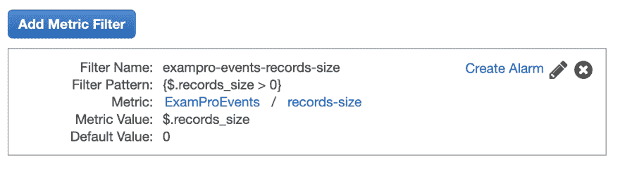](https://res.cloudinary.com/practicaldev/image/fetch/s--0fQEQ2fB--/c_limit%2Cf_auto%2Cfl_progressive%2Cq_auto%2Cw_880/https://thepracticaldev.s3.amazonaws.com/i/lufto7tdfoyopu16h77v.png)

在向 Cloudwatch 仪表板发布数据之前，您无法向其添加指标过滤器。

### 如何找到创建后的度量过滤器

如果您需要查找此过滤器指标，它会在日志表中的日志下显示为一列。

[](https://res.cloudinary.com/practicaldev/image/fetch/s--MhRKeh-Y--/c_limit%2Cf_auto%2Cfl_progressive%2Cq_auto%2Cw_880/https://thepracticaldev.s3.amazonaws.com/i/jj8fbesi2621eq0olhv6.png)

### Kinesis 消防软管

#### 定价

Kinesis Firehose 的价格非常实惠，每 GB 0.029 美元，因此 500 GB = 14 美元。其他身势可以有非常昂贵的基础费用。

### 但是 Kinesis 数据分析呢？

你会看到有另一个 AWS Kinesis 服务叫做 [Kinesis 数据分析](https://docs.aws.amazon.com/kinesisanalytics/latest/dev/how-it-works.html)，你会根据它的名字认为你需要这个昂贵的服务。

Kinesis 数据分析允许您对传入的流数据运行查询(SQL)。我认为 Kinesis 数据分析在主动产生实时分析方面可能更快，因为它在数据进来时就进行处理。

我们用消防水管把数据传送到 S3。当有人需要查看最新的仪表板时，我们只需用 Lamba 函数查询 Athena，将结果转储回 DynamoDB 或 json 文件，然后显示给用户。我们可以决定仅在最后一个编译版本过期 5 分钟时才生成新的分析。

#### 创建消防软管

仪表板有点混乱，所以你可以看看我创建消防水带流的地方。

[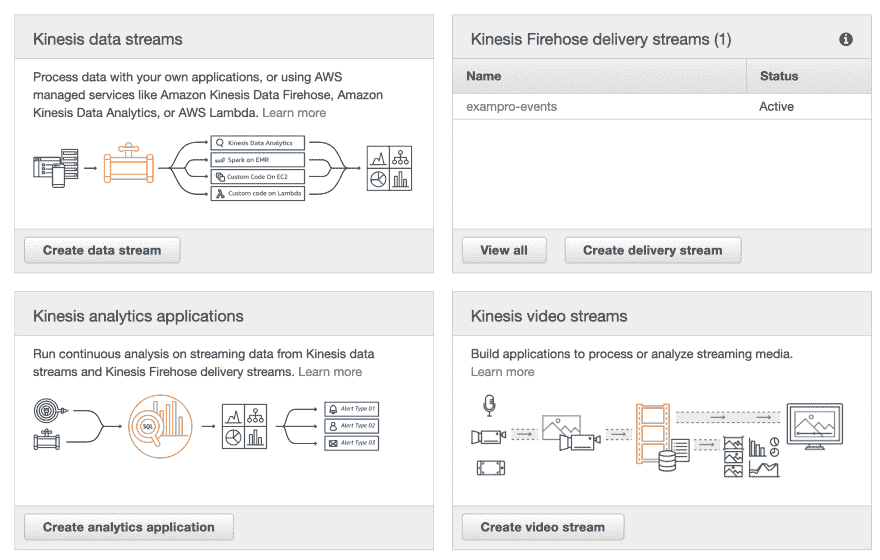](https://res.cloudinary.com/practicaldev/image/fetch/s--HFjRuQxU--/c_limit%2Cf_auto%2Cfl_progressive%2Cq_auto%2Cw_880/https://thepracticaldev.s3.amazonaws.com/i/m4v7q08fnxdkc5j69pf0.png)

我们可以通过 Kinesis 转换我们的数据，但对我们来说，这是不必要的，因为我们可以在 Lambda 之前应用我们的转换，我们也这样做了。如果您有来自多个来源的数据，您可能希望这个 lambda 将数据规范化，以保证其一致性。由于我们只从一个 lambda 函数中获取数据，这对我们来说是最小的风险。

[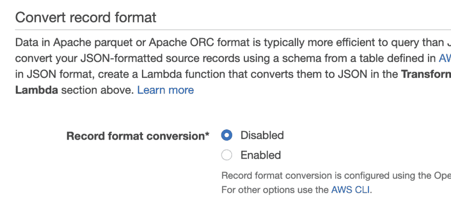](https://res.cloudinary.com/practicaldev/image/fetch/s--qf6S5Rfh--/c_limit%2Cf_auto%2Cfl_progressive%2Cq_auto%2Cw_880/https://thepracticaldev.s3.amazonaws.com/i/rn6cj95i80ahgay371dw.png)

我将此选项设置为禁用，但我只是想向您展示，数据可以通过 Glue 转换为拼花文件，这在使用 Athena 时性能会更好。这不是我们目前的一个痛点，所以我们将让数据保持原样，即 json。此外，我不想在这里大规模计算胶水的成本。
[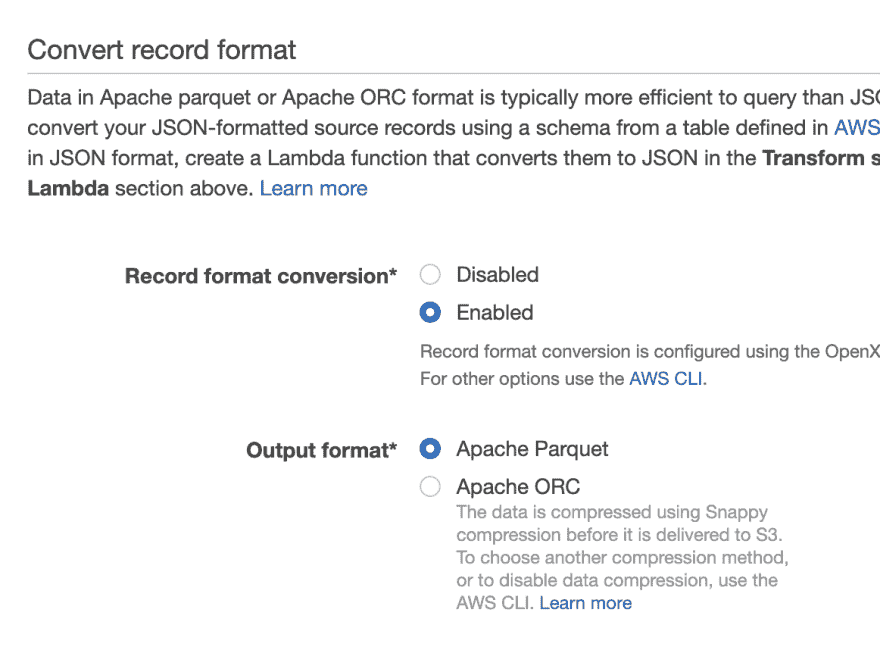T3】](https://res.cloudinary.com/practicaldev/image/fetch/s--JSvh2DOy--/c_limit%2Cf_auto%2Cfl_progressive%2Cq_auto%2Cw_880/https://thepracticaldev.s3.amazonaws.com/i/uzcntvu5wxizne0xhulv.png)

我在文档中读到过，在特定的用例中，加密需要压缩。当我使用 Glue create table 使用 crawler 进行 snappy 压缩时，它产生了一个奇怪的模式，所以我回滚到这个模式，并使用 KMS 加密。

[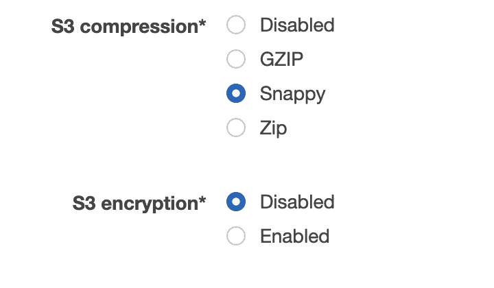](https://res.cloudinary.com/practicaldev/image/fetch/s--Kj9XddjI--/c_limit%2Cf_auto%2Cfl_progressive%2Cq_auto%2Cw_880/https://thepracticaldev.s3.amazonaws.com/i/mjf2741n72b54ijv1oyu.png)

因为我存储 IP 地址，我认为这是敏感数据。我们运行 Macie，所以不确定如果不加密它是否会报警。

我们收集点击事件数据的 IP 地址是为了检测用户的异常行为。例如帐户共享、刮擦等。

#### 雅典娜

我们需要一个数据库和[表](https://docs.aws.amazon.com/athena/latest/ug/create-table.html)。

##### 通过胶水目录和胶水爬虫实现数据库和表格

这是创建数据库和表的一种方法。
所以创建一个数据库。我不打算推荐这种方式，但向你展示这是可以做到的。
[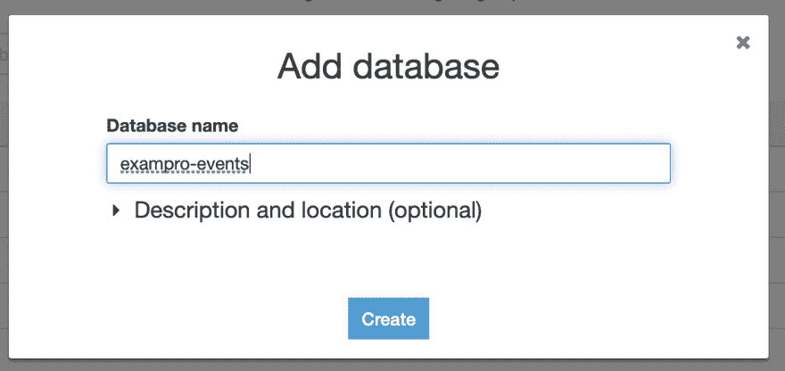](https://res.cloudinary.com/practicaldev/image/fetch/s--iXAiDxNW--/c_limit%2Cf_auto%2Cfl_progressive%2Cq_auto%2Cw_880/https://thepracticaldev.s3.amazonaws.com/i/5pfnak1mrp9ayuq3q20c.png)

我们还需要一张桌子。我们可以很容易地手动定义列，但是如果我们的 S3 存储桶中已经有数据，我们可以只使用一次爬虫来为我们确定模式。因此，您选择您的数据存储区作为 s3 存储区，它会完成剩下的工作。
[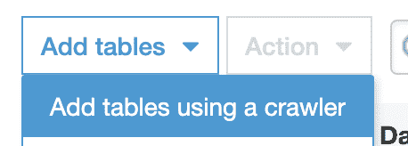T3】](https://res.cloudinary.com/practicaldev/image/fetch/s--xBFFe2ss--/c_limit%2Cf_auto%2Cfl_progressive%2Cq_auto%2Cw_880/https://thepracticaldev.s3.amazonaws.com/i/7q47ew44teqducxqi4ds.png)

如果我们检查表，它应该已经确定了我们的模式。

[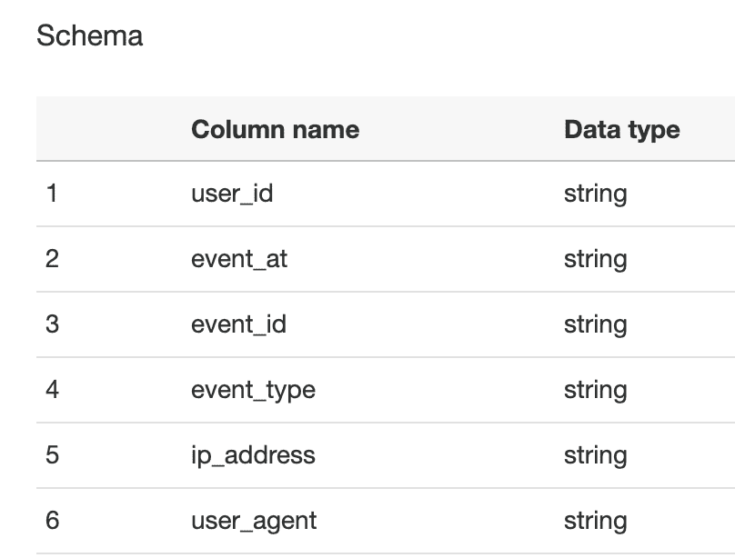](https://res.cloudinary.com/practicaldev/image/fetch/s--XaElvUdC--/c_limit%2Cf_auto%2Cfl_progressive%2Cq_auto%2Cw_880/https://thepracticaldev.s3.amazonaws.com/i/wa20tamxqeirvlabhw1a.png)

##### 数据库和雅典娜通过 SQL

当通过自动 cralwer 使用 Glue 时，它会猜测错误的列类型，并且不基于日期进行分区。我们可以直接在 Athena 中创建我们需要的东西。

创建我们的数据库

```
CREATE DATABASE exampro_events
LOCATION 's3://exampro-events/'; 
```

Enter fullscreen mode Exit fullscreen mode

[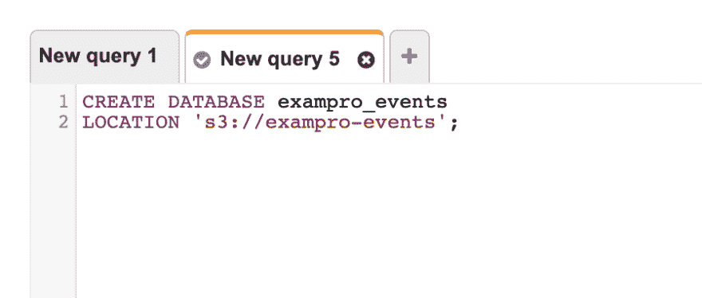](https://res.cloudinary.com/practicaldev/image/fetch/s--FAE1InOf--/c_limit%2Cf_auto%2Cfl_progressive%2Cq_auto%2Cw_880/https://thepracticaldev.s3.amazonaws.com/i/5unx2bk95s6y859dqj5f.png)

现在创建表格

```
CREATE EXTERNAL TABLE exampro_events.events (
  user_id    INT,
  event_at   STRING,
  event_id   INT,
  event_type STRING,
  user_agent STRING,
  ip_address STRING
) 
ROW FORMAT SERDE 'org.openx.data.jsonserde.JsonSerDe'
WITH SERDEPROPERTIES ('paths' = 'user_id,event_at,event_id,event_type,user_agent,ip_address')
LOCATION 's3://exampro-events/'; 
```

Enter fullscreen mode Exit fullscreen mode

确保位置以正斜杠结束，否则会出现路径错误。

`ROW FORMAT SERDE`告诉它数据将是 JSON 格式的。

SerDe(串行器/解串器)是 Athena 与各种格式的数据进行交互的一种方式。

[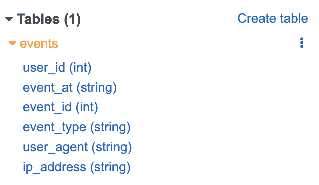](https://res.cloudinary.com/practicaldev/image/fetch/s--zQLdhy6u--/c_limit%2Cf_auto%2Cfl_progressive%2Cq_auto%2Cw_880/https://thepracticaldev.s3.amazonaws.com/i/c6v9ie9vsxaql2t927na.png)

注意，对于`event_at`,我将其设置为字符串而不是时间戳。iso8601 不是日期的正确格式，我们可以修改所有代码来符合它，但是因为 Athena 有这个 sql 函数`from_iso8601_timestamp`,所以我不担心，除非我遇到性能或查询能力的限制。

雅典娜期望这种格式:`2008-09-15 03:04:05.324`

##### 分区

你可以根据日期比如 2020 年来划分你的表。这可能是我将来想做的事情，但就目前而言，我忽略了分区。

##### 在雅典娜中查询

要开始，点击表格旁边的省略号和**预览表格**。它将创建查询并向您显示一些数据，因此您可以省去自己键入所有这些数据的麻烦。

[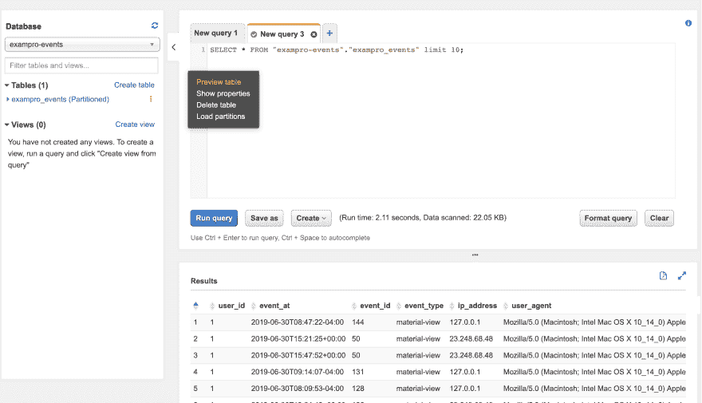](https://res.cloudinary.com/practicaldev/image/fetch/s--FJ8AQkiq--/c_limit%2Cf_auto%2Cfl_progressive%2Cq_auto%2Cw_880/https://thepracticaldev.s3.amazonaws.com/i/otu7vtsmypxfix6meh9u.png)

即使具备 SQL 知识，编写 Athena 查询也是一种痛苦的经历。[阅读文档帮助你学习 SQL 语法](https://docs.aws.amazon.com/athena/latest/ug/functions-operators-reference-section.html)

#### 云手表仪表盘

如果出现问题，我们希望有一个 CloudWatch 仪表板来获得一些洞察力。

[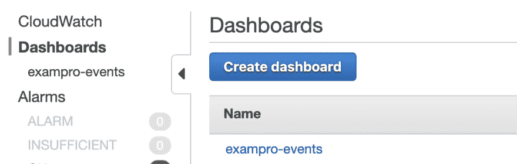](https://res.cloudinary.com/practicaldev/image/fetch/s--o661hA2H--/c_limit%2Cf_auto%2Cfl_progressive%2Cq_auto%2Cw_880/https://thepracticaldev.s3.amazonaws.com/i/g7l95cjh9scl0e8aw9nf.png)

我们将添加一个小部件

[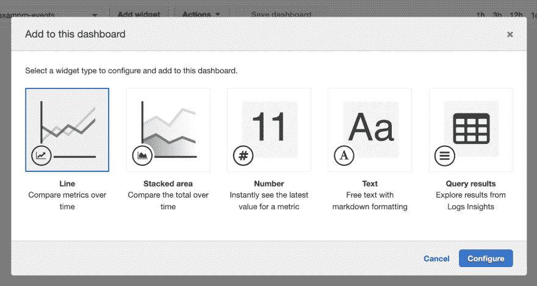](https://res.cloudinary.com/practicaldev/image/fetch/s--xmgDXB75--/c_limit%2Cf_auto%2Cfl_progressive%2Cq_auto%2Cw_880/https://thepracticaldev.s3.amazonaws.com/i/h05zswlev7flsqm6vsdr.png)

在这里，我们可以看到我们的自定义指标。如果您在这里看不到它，这是因为尚未收集数据，因此请确保记录数据，并正确过滤您的指标过滤器。
[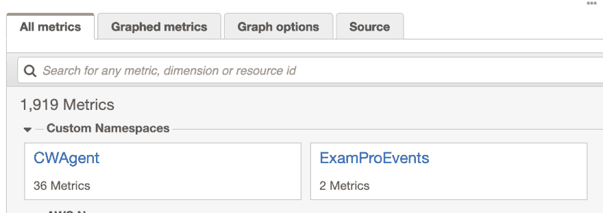T3】](https://res.cloudinary.com/practicaldev/image/fetch/s--CR8aegyB--/c_limit%2Cf_auto%2Cfl_progressive%2Cq_auto%2Cw_880/https://thepracticaldev.s3.amazonaws.com/i/11zbkcc4v8s3wvcga8ka.png)

这就是我们的记录尺寸。另一个过滤器只是一个旧的测试之一。

[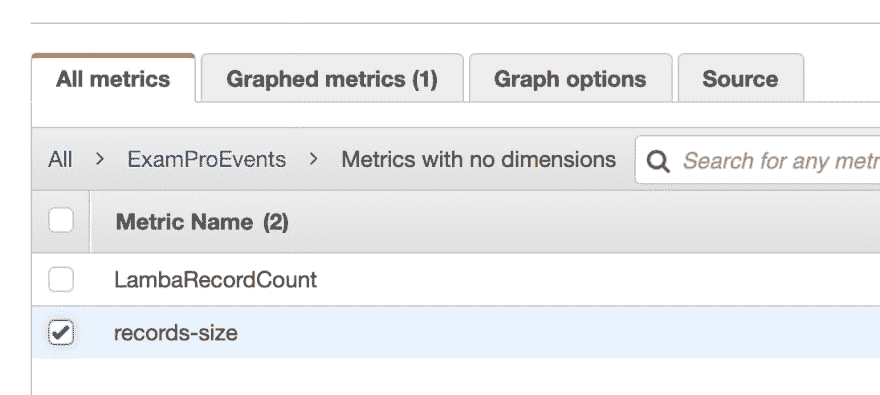](https://res.cloudinary.com/practicaldev/image/fetch/s--SDz3d__B--/c_limit%2Cf_auto%2Cfl_progressive%2Cq_auto%2Cw_880/https://thepracticaldev.s3.amazonaws.com/i/afqi15nbewb4jpdd5z3a.png)

这是我的线图。我不知道它有多有用，但只是在这里得到一些东西。记得**保存仪表板**！！！！

[](https://res.cloudinary.com/practicaldev/image/fetch/s--775EdpDp--/c_limit%2Cf_auto%2Cfl_progressive%2Cq_auto%2Cw_880/https://thepracticaldev.s3.amazonaws.com/i/jrmnzsi1i8oqgut0fpts.png)

在 DynamoDB 中，有一个指标可以用来与 Lambda 中过滤的记录进行比较。

[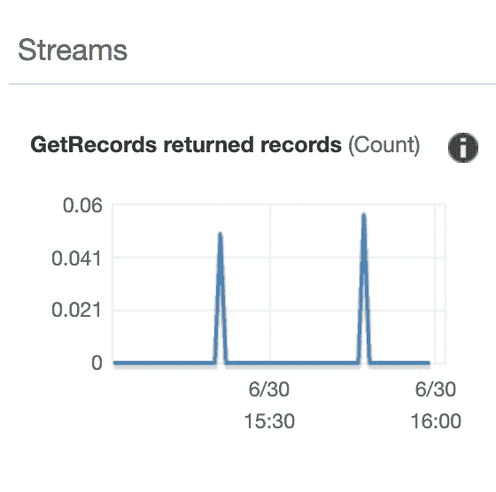](https://res.cloudinary.com/practicaldev/image/fetch/s--bb0hr1nW--/c_limit%2Cf_auto%2Cfl_progressive%2Cq_auto%2Cw_880/https://thepracticaldev.s3.amazonaws.com/i/9hih7imf1b2o2e0oll1n.png)

增加了一些小部件。我们可以看到有多少记录在流动，lambda 将多少记录传递给 Firehose，接收了多少传入的记录，以及有多少被传递给了 S3。仍然缺少雅典娜。我们会到达那里。

[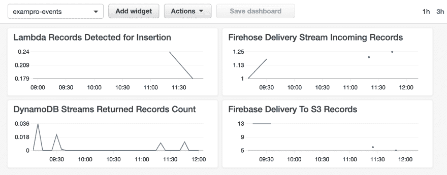](https://res.cloudinary.com/practicaldev/image/fetch/s--7Npiw6yt--/c_limit%2Cf_auto%2Cfl_progressive%2Cq_auto%2Cw_880/https://thepracticaldev.s3.amazonaws.com/i/scc1tej4d411nzdq93kj.png)

### 通过 Rake 命令伪造数据

我想要一些过去 7 天的登录数据，这样我就可以将我的 Athena 查询组合成一周内每天的组登录。

Rake 命令在这方面非常有用。另外，我想你可以用这种方法来测试你的读/写能力。

```
require 'faker'
namespace :track do
  namespace :put do
    task :login  => :environment do
      50.times.each do |t|
        ip_address = Faker::Internet.public_ip_v4_address
        user_agent = Faker::Internet.user_agent
        event_at   = rand(1..7).days.ago.iso8601

        v = [0..4].sample
        Tracker::Put.event({
          user_id: 1,
          event_type: 'login',
          user_agent: user_agent,
          ip_address: ip_address,
          event_at: event_at
        })

        puts "#{ip_address} - #{user_agent} - #{event_at}"
        sleep 0.2 # sleep 1/5th of a second
      end # x.times
    end #login
  end #put

  namespace :get do
    task :logins  => :environment do
      results = Tracker::Get.logins 1
      puts results
    end #logins
  end #get
end # track 
```

Enter fullscreen mode Exit fullscreen mode

因此，我在这里运行我的 rake 命令来创建登录:

```
~/Sites/exampro-projects/exampro[master]: rake track:put:login
11.174.250.238 - Mozilla/5.0 (Macintosh; Intel Mac OS X 10_9_3) AppleWebKit/537.75.14 (KHTML, like Gecko) Version/7.0.3 Safari/7046A194A - 2019-06-29T16:46:23Z
143.251.23.90 - Mozilla/5.0 (compatible; MSIE 9.0; AOL 9.7; AOLBuild 4343.19; Windows NT 6.1; WOW64; Trident/5.0; FunWebProducts) - 2019-06-23T16:46:24Z
57.161.250.74 - Mozilla/5.0 (Windows NT 6.1; WOW64; Trident/7.0; AS; rv:11.0) like Gecko - 2019-06-29T16:46:24Z
170.128.151.22 - Mozilla/5.0 (compatible; MSIE 9.0; AOL 9.7; AOLBuild 4343.19; Windows NT 6.1; WOW64; Trident/5.0; FunWebProducts) - 2019-06-29T16:46:24Z
65.166.116.179 - Mozilla/5.0 (Windows NT x.y; Win64; x64; rv:10.0) Gecko/20100101 Firefox/10.0 - 2019-06-29T16:46:25Z
54.85.94.162 - Mozilla/5.0 (Windows NT 6.1; WOW64; Trident/7.0; AS; rv:11.0) like Gecko - 2019-06-24T16:46:25Z
56.33.98.190 - Mozilla/5.0 (compatible; MSIE 9.0; AOL 9.7; AOLBuild 4343.19; Windows NT 6.1; WOW64; Trident/5.0; FunWebProducts) - 2019-06-23T16:46:25Z
139.173.42.58 - Mozilla/5.0 (Windows NT x.y; Win64; x64; rv:10.0) Gecko/20100101 Firefox/10.0 - 2019-06-29T16:46:25Z
107.234.132.121 - Mozilla/5.0 (compatible; MSIE 9.0; AOL 9.7; AOLBuild 4343.19; Windows NT 6.1; WOW64; Trident/5.0; FunWebProducts 
```

Enter fullscreen mode Exit fullscreen mode