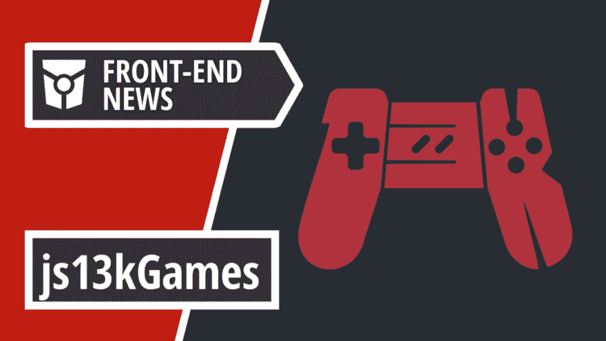
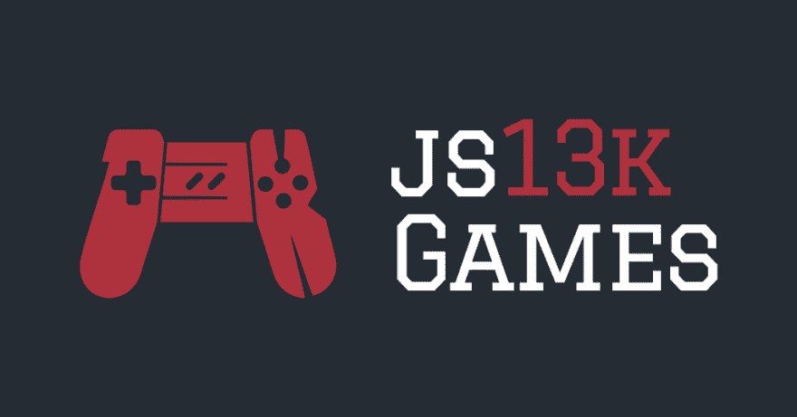

# js13kGames 第 8 版，自带 CI/CD 的原生懒人加载和 GitHub 动作|前端新闻#13

> 原文：<https://dev.to/adriansandu/8th-edition-of-js13kgames-native-lazy-loading-and-github-actions-with-ci-cd-front-end-news-13-4nki>

<figure> 

<figcaption>在 YouTube 上查看[https://youtu.be/3ixB9qqjjPI](https://youtu.be/3ixB9qqjjPI)</figcaption>

</figure>

大家好，欢迎收看新一轮的前端新闻。今天我有以下几个主要话题:

*   准备好 js13kGames 第八版
*   Chrome 76 为图像和 iframes 引入了本地惰性加载
*   GitHub Actions 现在支持 CI/CD(持续集成、交付和/或部署)
*   CodePen 为出口笔提供新的构建流程

我也有一些软件更新要提，还有一个本周的全新开发者。所以请陪我到最后，找出所有的细节。

一如既往，我也为那些喜欢听而不是读的人准备了视频版本。如果你喜欢这种格式，如果你也能订阅 YouTube 频道，我将不胜感激。

[https://www.youtube.com/embed/3ixB9qqjjPI](https://www.youtube.com/embed/3ixB9qqjjPI)

### 第八届年度 js13k 运动会挑战赛

Js13kGames 是面向 HTML5 游戏开发者的 JavaScript 编码竞赛，第八版即将推出。顾名思义，挑战在于仅使用 web 技术创建一个功能游戏，其中压缩在`.zip`档案中的最终代码占用不到 13kB 的空间。

活动将于 8 月 13 日 CEST 时间 13:00(格林威治时间 11:00)开始，届时将在官方网站上公布这一期的主题。参赛者有一个月的时间编写参赛作品，提交项目的截止时间是 9 月 13 日 CEST 时间 13:00(格林威治时间 11:00)。评审过程将持续三周多，获胜者将于 10 月 5 日公布。

游戏可以提交到以下任何甚至所有类别:桌面，移动，服务器，网络货币化和 WebXR。全套规则可在活动的网站上找到，以及前几届的获胜者。

因此，如果 HTML5 游戏开发是你的激情之一，请务必在 8 月 13 日查看 js13kgames.com，找到今年版本的主题。祝你好运，编码快乐！

*   [https://github . blog/2019-08-07-fifth-annual-js13k games-challenge/](https://github.blog/2019-08-07-eighth-annual-js13kgames-challenge/)
*   [https://js13kgames.com/](https://js13kgames.com/)

### 面向 web 的原生惰性加载

上一集讲了 Chrome 76。与此同时，Chrome 开发团队在他们的博客上发表了一篇关于原生延迟加载的新文章，这是他们在更新中打包的一个功能。

这个新特性是使用`loading`属性激活的，该属性有三个可能的值:

*   *auto* :切换浏览器的默认行为，等同于完全不包含属性。
*   *lazy* :推迟资源的加载，直到它到达离视口一个计算好的距离。
*   *急切的*:资源被立即加载，不管它位于页面的什么位置。

开发者现在可以利用新的`loading`属性并测试它的支持。通过这种方式，他们可以使用新的本地方法，或者退回到现有的替代方法之一。

关于该功能的更多细节可以在谷歌开发者博客的官方博客中找到。

*   [https://web.dev/native-lazy-loading](https://web.dev/native-lazy-loading)

### GitHub 动作现在支持 CI/CD

一年前，GitHub 推出了 Actions 的测试程序，这是一个自动化工作流程的 API。该软件包最近刚刚得到增强，增加了对持续集成、交付和/或部署的支持。这带来了矩阵构建、实时日志或多容器测试等新特性。

目前，所有参与者的行动都是免费的。一旦测试程序在 11 月结束，公共存储库将保持免费，而私人存储库将受制于现收现付系统。

未来的计划包括添加自托管跑步者和将动作引入 GitHub Enterprise Server。更多详情可在官方博客和 Actions 主页上找到。

*   [https://github . blog/2019-08-08-github-actions-now-supports-ci-CD/](https://github.blog/2019-08-08-github-actions-now-supports-ci-cd/)
*   [https://github.com/features/actions](https://github.com/features/actions)

### CodePen 为导出的笔提供了新的构建流程

CodePen 已经允许用户出口他们的笔很长时间了。如果您是专业版订户，现在可以继续从导出的软件包中更新预处理器代码。

对于 CodePen 来说，这并不是一种离线模式，因为导出过程到目前为止只是单向的，并且有很多限制，但是这是目前你能得到的最接近的模式了。有完整的文档可用，甚至有一个播客详细解释了新功能。

*   [https://blog . code pen . io/2019/08/08/new-build-process-for-exported-pens/](https://blog.codepen.io/2019/08/08/new-build-process-for-exported-pens/)
*   [https://blog . codepen . io/documentation/pro-features/export-with-build-process/](https://blog.codepen.io/documentation/pro-features/export-with-build-process/)

### 软件更新和发布

又是一周，又是一个软件更新和发布列表。像往常一样，每个包的发行说明都有链接。

**节点 v12.8.0**

NodeJS 获得了另一个版本提升，这次是 12.8.0 版。

*   [https://nodejs . org/en/blog/release/v 12 . 8 . 0/](https://nodejs.org/en/blog/release/v12.8.0/)

**反应 v16.9.0**

React 16.9 发布了，同时发布的还有产品路线图的更新。虽然钩子的更新是按照计划进行的，但是数据获取的并发模式和暂停已经被延迟。它们将捆绑在一个单独的版本中，计划在年底发布。

*   [https://reactjs.org/blog/2019/08/08/react-v16.9.0.html](https://reactjs.org/blog/2019/08/08/react-v16.9.0.html)

**Commander.js v3.0.0**

Commander.js 是 node.js 命令行界面的完整解决方案。最近发布了一个新的主要更新，将当前版本带到了 3.0.0。

*   [https://github.com/tj/commander.js/releases/tag/v3.0.0](https://github.com/tj/commander.js/releases/tag/v3.0.0)

**Visual Studio 代码 v1.37**

来自微软的流行的代码编辑器刚刚收到它的六月更新(1.37)。变化列表非常广泛，包括一组更新的图标、对终端搜索和远程开发教程的用户体验的改进等等。欲知详情，请查看官方发行说明。

*   [https://code.visualstudio.com/updates/v1_37](https://code.visualstudio.com/updates/v1_37)

### 一周的开发者

今天，这个头衔属于亨利·朱。他是 Babel 背后的主要维护者，Babel 是一个允许开发人员在保持向后兼容性的同时使用 JavaScript 最新进展的工具。作为最常见的依赖项之一，您可能会以这样或那样的方式使用 Babel，甚至在不知情的情况下。

Henry 将大部分时间用于巴别塔的维护，并在他的博客、Twitter 和两个讨论维护者生活的播客“希望之源”和“匿名维护者”上分享他的经验。

当 GitHub 推出赞助商计划时，他们也开始了一系列帖子，分享几个开源贡献者的故事。有一篇这样的文章是献给 Henry 的，这篇文章对他的故事、他作为开发人员和维护人员的旅程以及他对未来的计划提供了很多见解。

如果您或您的组织以任何方式使用 Babel，或者如果您在开源软件开发上有着相同的理想，那么请考虑在 GitHub 上赞助 Henry 并允许他继续他的工作。

谢谢你，亨利，你真棒，继续努力。

*   [https://twitter.com/left_pad](https://twitter.com/left_pad)
*   [https://github.com/users/hzoo/sponsorship](https://github.com/users/hzoo/sponsorship)
*   [https://github . blog/2019-06-14-maintainer-spot light-Henry-Zhu/](https://github.blog/2019-06-14-maintainer-spotlight-henry-zhu/)
*   [https://www.henryzoo.com/](https://www.henryzoo.com/)

### 今日问题

你希望看到谁被提名为下一个“本周开发人员”？请在评论区或在[https://twitter.com/frontendnexus.](https://twitter.com/frontendnexus.)上留下你的建议

这一版就这么多了。在 https://twitter.com/frontendnexus[的 Twitter 上关注 Front End Nexus](https://twitter.com/frontendnexus)，一旦有新的更新，我们将立即通知您。我还想鼓励你在 https://www.youtube.com/channel/UCgACtqiDmnSaskDIBsK54ww[的](https://www.youtube.com/channel/UCgACtqiDmnSaskDIBsK54ww)订阅 YouTube 频道。一旦该频道达到 100 名订户，我可以解锁更多的选项，因此非常感谢您的支持。

祝您度过愉快而富有成效的一周，我们下次再见！

* * *