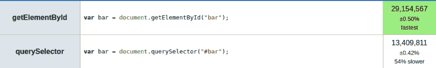

# 如何让你的电子应用更快🚀⚡

> 原文：<https://dev.to/xxczaki/how-to-make-your-electron-app-faster-4ifb>

> 所以你刚刚用电子制作了一个漂亮闪亮的新应用。它像预期的那样工作，有一个漂亮的用户界面，~~吃了很多内存~~，~~很慢~~，对吗？

## 简介

如果你还不知道的话， [Electron](https://electronjs.org/) 是一个使用 HTML、CSS & (duh) JavaScript 构建跨平台桌面应用的开源框架。它最初被称为 Atom Shell，由 Github 开发，用于支持他们的文本编辑器- [Atom](https://atom.io/) 。

一切听起来都很棒，对吧？你不需要学习另一种语言来创建跨平台的应用程序，而是利用你现有的知识。

不幸的是，电子也有一些缺点。为了呈现您的应用程序 UI，它使用 Chromium，Chromium 总是捆绑在您的最终应用程序中。正因为如此:

*   用电子构建的应用程序的大小通常约为 120 MB。
*   电子应用程序通常使用大量内存。
*   用户界面可能会感觉有点慢，尤其是在旧电脑上。

现在，即使我们不能从我们的应用中删除整个 Chromium 并减小它的大小，我们仍然可以对 RAM 的使用和速度做一些事情。

这就是为什么我想向你展示如何让你的电子应用程序更快的 4 个技巧！

## 1。使用 V8 引擎代码缓存

Chrome V8 基本上是一个 JavaScript 引擎，支持 Node.js 和 Chromium 浏览器。它的一个特点是[代码缓存](https://v8.dev/blog/code-caching)，可以加快你的应用程序的实例化时间。

为了确保这个特性被启用，我们将使用一个名为 [`v8-compile-cache`](https://github.com/zertosh/v8-compile-cache) 的包，由[安德烈斯·苏亚雷斯](https://github.com/zertosh) :
创建

```
# Install the package
$ npm install v8-compile-cache 
```

<svg width="20px" height="20px" viewBox="0 0 24 24" class="highlight-action crayons-icon highlight-action--fullscreen-on"><title>Enter fullscreen mode</title></svg> <svg width="20px" height="20px" viewBox="0 0 24 24" class="highlight-action crayons-icon highlight-action--fullscreen-off"><title>Exit fullscreen mode</title></svg>

然后，在您的条目模块中添加以下代码:

```
require('v8-compile-cache');

// or, using ES6 `import`:
// import 'v8-compile-cache'; 
```

<svg width="20px" height="20px" viewBox="0 0 24 24" class="highlight-action crayons-icon highlight-action--fullscreen-on"><title>Enter fullscreen mode</title></svg> <svg width="20px" height="20px" viewBox="0 0 24 24" class="highlight-action crayons-icon highlight-action--fullscreen-off"><title>Exit fullscreen mode</title></svg>

> 注意:看一看[基准](https://github.com/zertosh/v8-compile-cache#benchmarks)，看看`v8-compile-cache`如何加速流行的模块😄

## 2。使用模块捆扎机

这个建议在使用大量包的大型项目中特别有用。使用模块捆绑器，像 [Webpack](https://webpack.js.org/) 将启用像[树摇动](https://webpack.js.org/guides/tree-shaking/)和[代码分割](https://webpack.js.org/guides/code-splitting/)这样的特性，这将使你的代码更小&更快。

你也可以使用一些社区自制的[插件](https://webpack.js.org/plugins/) & [加载器](https://webpack.js.org/loaders/)。

## 3。使用更快的 JavaScript 方法，尤其是在使用 DOM 时

看下面 2 行代码:

```
const elementOne = document.getElementById('one');
const elementTwo = document.querySelector('#one'); 
```

<svg width="20px" height="20px" viewBox="0 0 24 24" class="highlight-action crayons-icon highlight-action--fullscreen-on"><title>Enter fullscreen mode</title></svg> <svg width="20px" height="20px" viewBox="0 0 24 24" class="highlight-action crayons-icon highlight-action--fullscreen-off"><title>Exit fullscreen mode</title></svg>

它们都做同样的事情——找到 DOM 元素。但是看一看[性能基准](https://jsperf.com/getelementbyid-vs-queryselector/11):

[](https://res.cloudinary.com/practicaldev/image/fetch/s--KU9fJKS9--/c_limit%2Cf_auto%2Cfl_progressive%2Cq_auto%2Cw_880/https://thepracticaldev.s3.amazonaws.com/i/5d04g3gnchv9ivv0648f.png)

如您所见，第一种方法比第二种方法快 2 倍以上。是的——这并不意味着第二种方法很慢——这两种方法在实际应用中都很快，但是当我们在应用程序中使用许多较慢的方法时，用更快的替代方法来代替它们真的会有所不同！

## 4。使用 WebAssembly(或本机插件)

这种改变确实可以加快你的应用程序，但它也需要大量的工作。

例如，如果您的应用程序必须快速计算大量数据或检查大量数据，JavaScript 可能会太慢😢

这正是 [WebAssembly](https://webassembly.org/) 和[原生插件](https://nodejs.org/api/addons.html)派上用场的时候！

看看我的电子应用- [elcalc](https://github.com/elcalc/elcalc) ，一个计算器。为了做更高级的数学，我使用了一个名为 [math.js](https://mathjs.org/) 的非常好的库。不幸的是，当我测试高级&复杂计算时，在点击评估按钮和显示结果之间有明显的超时。不好...

我决定写一个简单的 Rust 代码，它将处理数学运算并将其转换为 WASM(web assembly 的简写)。我使用了一个名为 [`meval`](https://crates.io/crates/meval) 的箱子(类似于 npm 包，但是是为了防止生锈)，它解析数学表达式并对它们求值。

为了实际生成 WASM，我使用了 [wasm-pack](https://rustwasm.github.io/wasm-pack/) 和 it[rust-web pack-template](https://github.com/rustwasm/rust-webpack-template/tree/master/template)。

我还使用了一个 Webpack 插件，名为[optimize-wasm-web pack-plugin](https://github.com/jlegrone/optimize-wasm-webpack-plugin) ，它(正如它的名字所说)使用 [binaryen](https://github.com/WebAssembly/binaryen) 优化 WebAssembly 文件。

为了在我的 JavaScript 代码中延迟加载 WASM 函数，我使用了[动态导入](https://developer.mozilla.org/en-US/docs/Web/JavaScript/Reference/Statements/import#Dynamic_Imports)提议:

```
import('../crate/pkg').then(async module => {
    // do something
}); 
```

<svg width="20px" height="20px" viewBox="0 0 24 24" class="highlight-action crayons-icon highlight-action--fullscreen-on"><title>Enter fullscreen mode</title></svg> <svg width="20px" height="20px" viewBox="0 0 24 24" class="highlight-action crayons-icon highlight-action--fullscreen-off"><title>Exit fullscreen mode</title></svg>

现在我的计算器计算数学表达式的速度快多了

## 加成:5。如果你关心应用程序的大小，用别的东西

如果你非常关心你的应用程序的大小，有一个电子的替代品，叫做 [Carlo](https://github.com/GoogleChromeLabs/carlo) 。它使用用户电脑上本地安装的谷歌 Chrome 浏览器，而不是将 Chrome 包含在你的应用捆绑包中。

不幸的是，这意味着当用户没有安装谷歌浏览器时，你的应用程序不会启动，它会显示一个错误。

## 学分

这篇帖子中列出的一些建议摘自
[菲利克斯·里瑟伯格的](https://medium.com/@felixrieseberg) Medium 文章，名为[《桌面上的 JavaScript，快与慢》](https://medium.com/@felixrieseberg/javascript-on-the-desktop-fast-and-slow-2b744dfb8b55)。强烈推荐去看看！

谢谢你看我的帖子！希望你会觉得有用；)