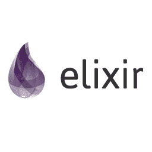
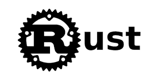

# 5 种强大的编程语言来拓展你的大脑

> 原文：<https://dev.to/jacobherrington/5-programming-languages-to-stretch-your-brain-mmg>

今年早些时候，我与安迪·亨特和迪夫·托马斯·T1 进行了一次对话(《T2》的联合作者、《务实的程序员》的联合作者、《T4》敏捷宣言的最初签署者)。他们建议(过去也曾建议)每年至少学习一门新的编程语言。

这种做法背后的原因与推销自己甚至使用这种语言都没有什么关系。事实上，学习一门新的编程语言最大的好处是拓展思维，创造新的神经通路，让你用新的独特的方式看待问题。

我编辑了这个语言列表，主要是因为它们是我有兴趣花更多时间学习的语言，但也因为它们很好地体现了特定的语言特征和编程思想。

所以，事不宜迟，这里列出了一些你应该学习的语言，来拓展你的大脑:

### 1。红宝石

[](https://res.cloudinary.com/practicaldev/image/fetch/s--IXBm3K7f--/c_limit%2Cf_auto%2Cfl_progressive%2Cq_auto%2Cw_880/https://thepracticaldev.s3.amazonaws.com/i/w77suanbgkiwigz92gpx.png)

Ruby 是为了程序员的快乐而构建的。对不同的人来说，这可能意味着不同的事情，但这是我开始喜欢的第一种编程语言。

Ruby 有趣的地方在于它被设计成支持面向对象编程。

OOP 是由[艾伦·凯](https://en.wikipedia.org/wiki/Alan_Kay)博士创造的，[曾经说过](http://userpage.fu-berlin.de/~ram/pub/pub_jf47ht81Ht/doc_kay_oop_en):“面向对象编程对我来说只意味着消息传递、封装和隐藏状态，以及所有东西的极端后期绑定。”Ruby 很擅长这个。

由于 Ruby 对消息发送的痴迷，这是一个学习真正 OOP 的不可思议的环境。我推荐 Sandi Metz 在 Ruby 中精彩的[实用面向对象设计](https://www.poodr.com/)作为 Ruby 在设计对象和消息发送方面的优势介绍。

Ruby 的另一个拓展思维的特性可以说比 OOP 更具争议性。Ruby 支持元编程，元编程可以被宽泛地定义为能够推理和生成其他代码的代码。

能够通过元编程操纵程序，虽然有时令人沮丧，但可能需要在程序员和编程语言之间的关系的思维模式上进行极端的范式转变。

```
# FizzBuzz in Ruby
# https://github.com/zenware/FizzBuzz/blob/master/ruby.rb

def fizz_buzz(num)
  result = ''
  result += 'Fizz' if (num % 3).zero?
  result += 'Buzz' if (num % 5).zero?
  puts result.empty? ? num : result
end

(1..100).each { |x| fizz_buzz x } 
```

<svg width="20px" height="20px" viewBox="0 0 24 24" class="highlight-action crayons-icon highlight-action--fullscreen-on"><title>Enter fullscreen mode</title></svg> <svg width="20px" height="20px" viewBox="0 0 24 24" class="highlight-action crayons-icon highlight-action--fullscreen-off"><title>Exit fullscreen mode</title></svg>

资源:

*   [红宝石塔帕斯](https://www.rubytapas.com/)
*   [红宝石 Koans](http://www.rubykoans.com/)
*   [为什么是 Ruby 的辛酸指南](https://poignant.guide/)

### 2。长生不老药

[](https://res.cloudinary.com/practicaldev/image/fetch/s--LoCgOU0h--/c_limit%2Cf_auto%2Cfl_progressive%2Cq_auto%2Cw_880/https://thepracticaldev.s3.amazonaws.com/i/tydx0u64kkrwc16ljxej.png)

虽然 Elixir 可能看起来有点像 Ruby，但它非常不同。这是一种函数式编程语言。

Elixir 是一种语言，它包含了一个叫做“演员模型”的概念，这个概念是由 T2 的卡尔·休伊特博士发明的。在演员模式中，一切都是演员。

(“一切都是演员”听起来很像“一切都是物体”，但我会把这种比较留给学者)

学会思考演员是一项具有挑战性的精神训练，它会让你以新的眼光看待问题。

Elixir 的另一个令人费解的特性是它与 Erlang 的关系。Elixir 在 Erlang VM (BEAM)上运行，这意味着大多数 Elixir 开发人员在某种程度上必须对 Erlang 有所了解。

在这里，我很容易跑题，但是 Erlang 最有趣的地方(在我看来)是它在并发性方面令人难以置信的能力。编写灵药意味着学习并行思考，这是一种可以应用于多种编程环境的技能。

最后，Elixir 是一个叫做模式匹配的概念的完美范例。模式匹配是一种非常强大的函数式语言特性，它使您能够以一种非常简洁和安全的方式与数据进行交互。模式匹配并不是 Elixir 独有的，所以在你的 Elixir 代码中对模式匹配的深刻理解将会很容易转化到其他语言和问题中。

```
# FizzBuzz in Elixir
# https://github.com/zenware/FizzBuzz/blob/master/elixir.exs

fizzbuzz = fn n ->
  cond do
    rem(n, 15)== 0 -> "FizzBuzz"
    rem(n, 3) == 0 -> "Fizz"
    rem(n, 5) == 0 -> "Buzz"
    true           -> to_string n
  end
end

Enum.each 1..100, &IO.puts(fizzbuzz.(&1)) 
```

<svg width="20px" height="20px" viewBox="0 0 24 24" class="highlight-action crayons-icon highlight-action--fullscreen-on"><title>Enter fullscreen mode</title></svg> <svg width="20px" height="20px" viewBox="0 0 24 24" class="highlight-action crayons-icon highlight-action--fullscreen-off"><title>Exit fullscreen mode</title></svg>

资源:

*   [仙丹之乐](https://joyofelixir.com/)
*   [仙丹 Koans](http://elixirkoans.io/)

### 3。锈

[](https://res.cloudinary.com/practicaldev/image/fetch/s--zthR1QBs--/c_limit%2Cf_auto%2Cfl_progressive%2Cq_auto%2Cw_880/https://thepracticaldev.s3.amazonaws.com/i/hfwyyn3xdrrvzovflvba.png)

Rust 是一种新兴的系统语言。这意味着当性能很重要时，它特别适合编写软件。

Rust 是一种快速的编译语言，它带来了一些新的想法。它的明确意图是解决编写 C++时出现的大量内存安全问题，c++经常用于解决类似的系统编程问题。

在 Rust 中，你可以学习编写与硬件直接交互的底层代码，你可以学习并发性，你可以学习一些不同的范例，你可以相对安全地学习所有这些。

Rust 语言最吸引人的一点是，它打开了一个问题空间，这个问题空间通常与因其缺陷和神秘特质而臭名昭著的语言联系在一起。

学习 Rust 迫使你了解运行你的代码的机器，而不强迫你担心已解决的问题。

Rust 的另一个大脑放大功能叫做宏。宏是元编程的一种形式，它使开发人员能够编写更少的代码，并且在方便的时候不那么具体。并非没有警告，宏很难推理，因此可以帮助你从不同的角度看待你在 Ruby 等语言中见过的元编程。

```
// FizzBuzz in Rust
// https://github.com/zenware/FizzBuzz/blob/master/rust.rs

fn fizzbuzz(i: u8) {
  if i % 15 == 0 {
    println!("FizzBuzz");
  } else if i % 3 == 0 {
    println!("Fizz");
  } else if i % 5 == 0 {
    println!("Buzz");
  } else {
    println!("{}", i.to_string());
  }
}

fn main() {
  for i in 1..101 {
    fizzbuzz(i);
  }
} 
```

<svg width="20px" height="20px" viewBox="0 0 24 24" class="highlight-action crayons-icon highlight-action--fullscreen-on"><title>Enter fullscreen mode</title></svg> <svg width="20px" height="20px" viewBox="0 0 24 24" class="highlight-action crayons-icon highlight-action--fullscreen-off"><title>Exit fullscreen mode</title></svg>

资源:

*   [Rust 编程语言](https://doc.rust-lang.org/stable/book/title-page.html)

### 4。以打字打的文件

[](https://res.cloudinary.com/practicaldev/image/fetch/s--3tw_uCQ7--/c_limit%2Cf_auto%2Cfl_progressive%2Cq_auto%2Cw_880/https://thepracticaldev.s3.amazonaws.com/i/h1cbmoxiwuz4twnffjux.png)

你可以说 TypeScript 不是一种语言；这是一种语言的“超集”。那很好。它仍然在我的清单上。

对于那些不熟悉的人来说(考虑到它的受欢迎程度，这很难理解)，TypeScript 是一种直接编译成 JavaScript 的语言。它给 JavaScript 语言增加了一些额外的特性，但感觉还是像 JavaScript。

TypeScript 中的大脑伸展来自于可以采用的增量方法及其对静态类型的关注。如果你和我一样，来自于使用 Python、Ruby 或 PHP 等语言的 web 背景，静态类型通常是一个陌生的概念。然而，TypeScript 是向您介绍这种方便的语言特性的一种友好方式。

学习 TypeScript 将加深您对 JavaScript 生态系统的理解，让您对 JavaScript 的未来有一个强烈的愿景，并向您介绍静态类型的好处。

```
// FizzBuzz in TypeScript
// https://github.com/zenware/FizzBuzz/blob/master/typescript.ts

function fizzbuzz(num: number): string | number {
  if (num % 15 === 0) return 'FizzBuzz';
  if (num % 5 === 0) return 'Buzz';
  if (num % 3 === 0) return 'Fizz';
  return num;
}

for (let i: number = 1; i <= 100; i++) console.log(fizzbuzz(i)); 
```

<svg width="20px" height="20px" viewBox="0 0 24 24" class="highlight-action crayons-icon highlight-action--fullscreen-on"><title>Enter fullscreen mode</title></svg> <svg width="20px" height="20px" viewBox="0 0 24 24" class="highlight-action crayons-icon highlight-action--fullscreen-off"><title>Exit fullscreen mode</title></svg>

资源:

*   [打字稿深潜](https://basarat.gitbooks.io/typescript/)

### 5。哈斯克尔

[](https://res.cloudinary.com/practicaldev/image/fetch/s--14lDu10j--/c_limit%2Cf_auto%2Cfl_progressive%2Cq_auto%2Cw_880/https://thepracticaldev.s3.amazonaws.com/i/6ckv3kefxwpnz7uzrbps.png)

Haskell 是这个列表中最深奥的语言。它有崇高的目标和理想，这使它非常适合挑战你的大脑。

Haskell 被描述为“纯函数式的”,这意味着状态在这种编程语言中是完全不可变的。学习使用完全不可变的状态迫使你开发一种完全不同的方法来处理数据。

使用 Haskell 将会加深对 lambda 演算的理解，这与所有函数式编程都相关。

许多使用 Haskell 的开发人员也评论了阅读 Haskell 的意义和目的的清晰性。虽然这是主观的，但语言本身倾向于产生非常明确的代码，并且在许多情况下是显而易见的。当代码太明显时，没有人会不高兴。一般来说，Haskell 代码往往非常简洁。

Haskell 中最具挑战性的概念之一叫做单子。单子允许开发人员避免键入多余的代码和将多个计算串在一起。Haskell 文档经常将单子描述为“一种组合计算以产生更复杂计算的策略。”

单子并不完全是 Haskell 独有的，但是 Haskell 被认为是一种很好实现单子的语言。

```
-- FizzBuzz in Haskell
-- https://github.com/zenware/FizzBuzz/blob/master/haskell.hs

module Main where

fizzbuzz :: Int -> String
fizzbuzz x
    | x `mod` 15 == 0 = "FizzBuzz"
    | x `mod` 3  == 0 = "Fizz"
    | x `mod` 5  == 0 = "Buzz"
    | otherwise       = show x

main = mapM (putStrLn . fizzbuzz) [1..100] 
```

<svg width="20px" height="20px" viewBox="0 0 24 24" class="highlight-action crayons-icon highlight-action--fullscreen-on"><title>Enter fullscreen mode</title></svg> <svg width="20px" height="20px" viewBox="0 0 24 24" class="highlight-action crayons-icon highlight-action--fullscreen-off"><title>Exit fullscreen mode</title></svg>

资源:

*   [学一个 Haskell 对你有好处](http://learnyouahaskell.com/)
*   [哈斯克尔维基](https://wiki.haskell.org/Haskell)

虽然编程语言仅仅是工具，工具不应该代替使用它们的人受到指责或表扬，但不同的工具确实可以开启新的技术。

[](https://res.cloudinary.com/practicaldev/image/fetch/s--mPGZbSZZ--/c_limit%2Cf_auto%2Cfl_progressive%2Cq_66%2Cw_880/https://thepracticaldev.s3.amazonaws.com/i/waiu9ak8yy2on6u1hsdd.gif)

通过向自己介绍新工具和它们带来的技术，你可以成为一名更全面、更有创造力的工程师。如果你有足够的好奇心和冒险精神，你甚至可以找到语言特性和编程范例，你可以把它们带回你的首选语言。

我很想听听这个列表是否能激发你去研究这五种语言中的一种，或者是否有一种你认为我错过了！🤠