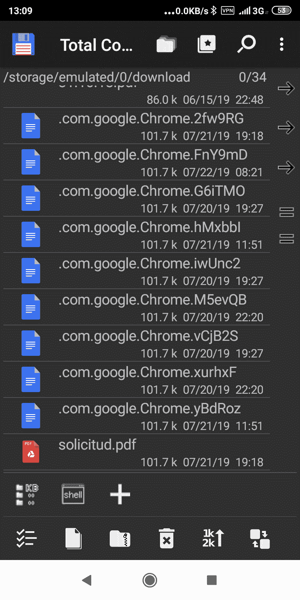
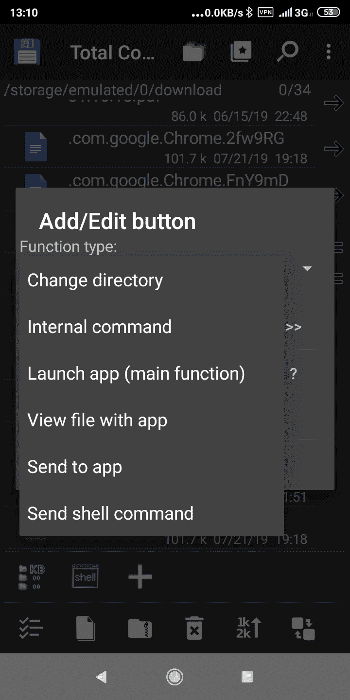
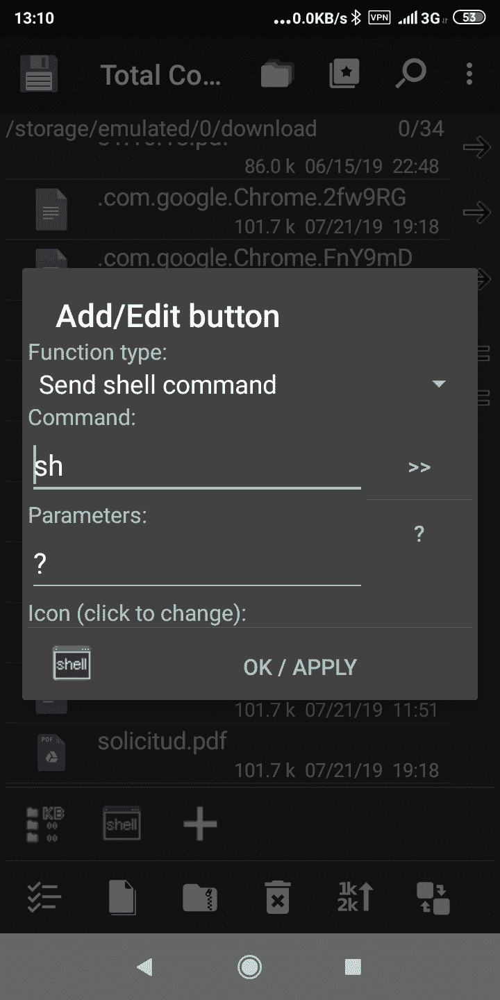
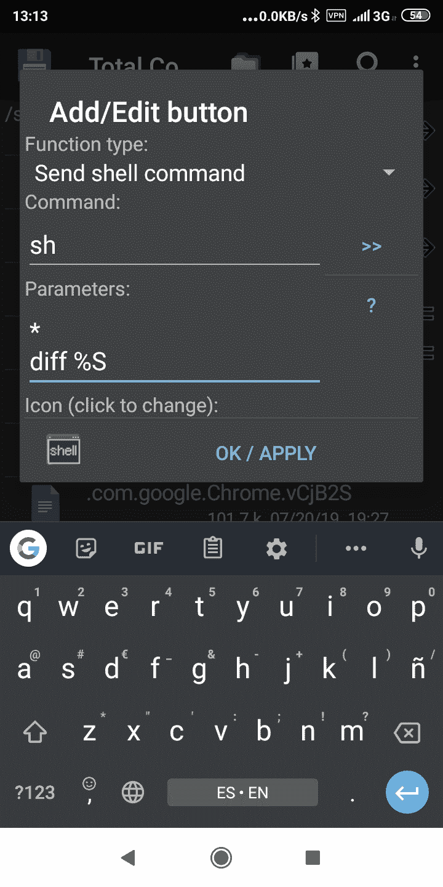
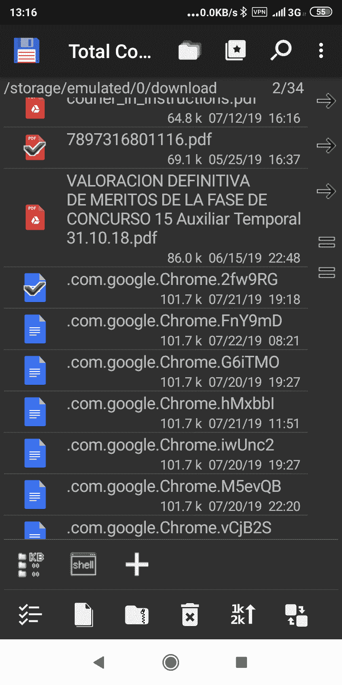
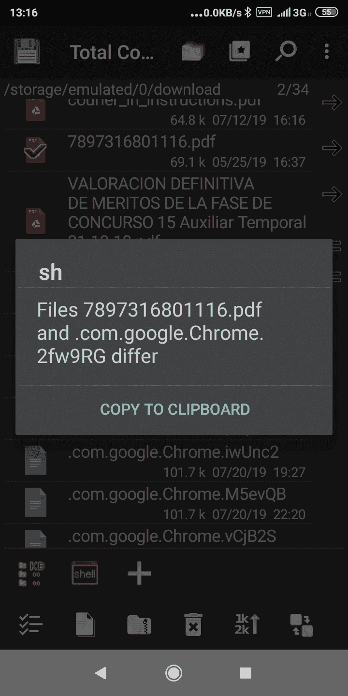
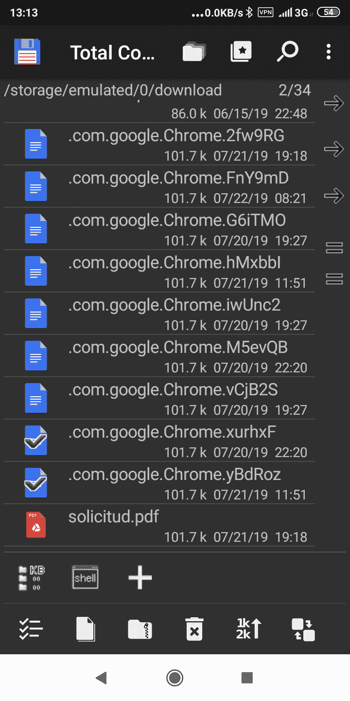
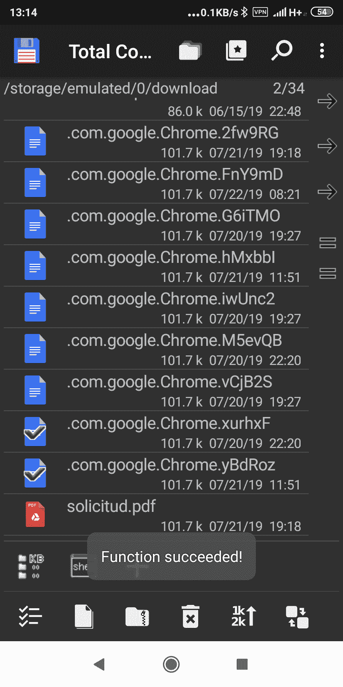

# 在 Android 中按内容比较文件

> 原文：<https://dev.to/jjtriff/comparing-files-by-content-in-android-4aoc>

这是一个需求的故事:

我遇到了一个简单的问题，很多文件(不是图片)看起来都一样，需要确保我删除它们时不会丢失任何东西。

我使用 Linux 已经有几年了，但是当我使用 Windows 的时候，我从来没有不使用[总指挥官](https://www.ghisler.com/)，一个伟大的并行 FS explorer 工具。充满了有用的东西。其中一个就是`Compare by content`。我将比较两个文件并声明它们是相同的，或者在一个特殊的界面上显示不同的输出。

在 Android 上，很高兴，我们也有总指挥官😄。是必须有的，说真的。但是现在和原来的版本一样打包了。无论如何，我的力量足以解决我的困境。

## 困境:一堆看起来一样的未知文件

我在内部浏览和清理时发现了这个:

[](https://res.cloudinary.com/practicaldev/image/fetch/s--G5ZciOcs--/c_limit%2Cf_auto%2Cfl_progressive%2Cq_auto%2Cw_880/https://thepracticaldev.s3.amazonaws.com/i/9gxlhshbs4i8lt7k8qw5.png)

从大小来看，很多文件看起来都一样。但是如何确定它们是相同的。

如果我在 Windows 中，我会有工具；如果我在 Linux 上，我会有`diff`，但是我在 Android 上...等待...Android 不就是 Linux 的一种形式吗？

## Android 上的 Diff，是 Linux 的一种(awwwwww，太酷了！)

于是我去我信任的[终端 app](https://play.google.com/store/apps/details?id=jackpal.androidterm&hl=en_US) 发出命令:

```
$ diff
See diff --help
diff: Need 2 arguments 
```

哇，在那里。所以，只需要用这个来比较文件，得到结果。但是有几个。

## 总指挥官来救援了！

总指挥官有能力添加按钮到它的工具栏(你可以在图像底部看到它)。按下`+`符号，你将得到一个类似于下一个的对话框，在这里你将按下`Function type:`

[](https://res.cloudinary.com/practicaldev/image/fetch/s--1ke5T6Um--/c_limit%2Cf_auto%2Cfl_progressive%2Cq_auto%2Cw_880/https://thepracticaldev.s3.amazonaws.com/i/1hhf0n6qtbg11nkqerk4.png)

在您可以选择的许多事情中，有一种选择是将参数传递给命令。选择`Send shell command`:

[](https://res.cloudinary.com/practicaldev/image/fetch/s--6KRfaIC2--/c_limit%2Cf_auto%2Cfl_progressive%2Cq_auto%2Cw_880/https://thepracticaldev.s3.amazonaws.com/i/02qi1ymx4586htbsiiby.png)

一旦有时间调整`Parameters:`字段。如果你点击`?`按钮，你会找到解释，但是继续:

*   该字段是多行字段:每行一个参数
*   如果第一个参数是一个`*`，它将在一个对话框中输出结果，该结果可以被复制到剪贴板。
*   使用`%S`将在参数行中包含所选文件的名称

因此，知道了这一点后,`Parameteres`字段是这样的:

```
*
diff %S 
```

[](https://res.cloudinary.com/practicaldev/image/fetch/s--PQcyw4DZ--/c_limit%2Cf_auto%2Cfl_progressive%2Cq_auto%2Cw_880/https://thepracticaldev.s3.amazonaws.com/i/p67e3hcf4mc56fj08bu9.png)

因此，让我们选择两个明显不同的文件并尝试一下:

[](https://res.cloudinary.com/practicaldev/image/fetch/s--nW5-DHLp--/c_limit%2Cf_auto%2Cfl_progressive%2Cq_auto%2Cw_880/https://thepracticaldev.s3.amazonaws.com/i/oc6s79l7d9xu39fb5a1l.png)

结果是:

[](https://res.cloudinary.com/practicaldev/image/fetch/s--pw-niMGr--/c_limit%2Cf_auto%2Cfl_progressive%2Cq_auto%2Cw_880/https://thepracticaldev.s3.amazonaws.com/i/rkwhuk448g3900ei6gv9.png)

这真是太棒了！

## 结果在相等的文件上

现在让我们来看看类似的文件:

[](https://res.cloudinary.com/practicaldev/image/fetch/s--dkDh_WNH--/c_limit%2Cf_auto%2Cfl_progressive%2Cq_auto%2Cw_880/https://thepracticaldev.s3.amazonaws.com/i/74szjz5mnjbfiaqtnjct.png)

现在请注意，因为结果会在屏幕上显示一小段时间，它是:

[](https://res.cloudinary.com/practicaldev/image/fetch/s--KqrOz5uO--/c_limit%2Cf_auto%2Cfl_progressive%2Cq_auto%2Cw_880/https://thepracticaldev.s3.amazonaws.com/i/kk1egldq0dez1do1vew6.png)

哇，你很幸运看到的是静态图像，否则你会错过它😆。

在这种情况下，当文件相同时，`diff`命令的输出是 *null，nada，zero* 。你懂我的意思吗？这就是为什么它不向对话框打印任何东西，只打印`Function succeeded!`覆盖消息。

嗯，大概就是这样。比较编码文件时要小心，因为整个 diff 输出都在对话框上，你知道它会很长。

如果你喜欢这篇文章，点击*像*或*心*或*你知道*按钮。谢谢大家！