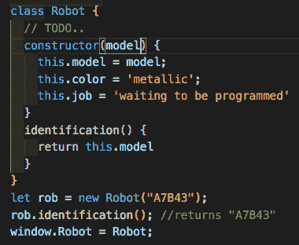
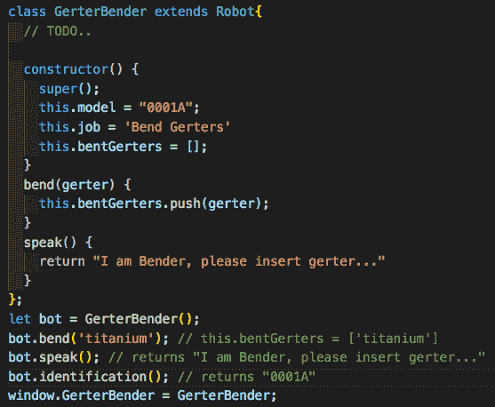
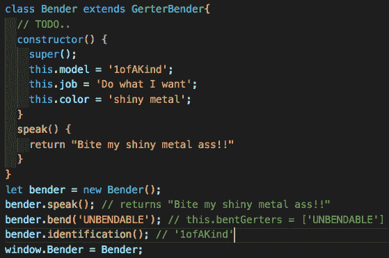
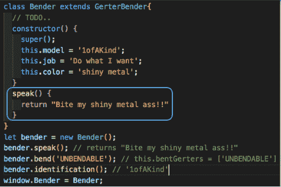

# 多态性和 ES6

> 原文：<https://dev.to/wtschmidt/polymorphism-and-es6-5b53>

多态性是面向对象编程(OOP)的核心概念。它不仅允许我们定义数据结构的数据类型，还允许我们定义在 javascript 中使用的操作类型。使用它可以在不同的对象上使用相同的方法。通过继承，我们可以共享或覆盖这些方法。

不同类型的继承包括:函数式、函数共享式、原型式、伪经典式和 ES6。例如，我们将使用 ES6 作为我们的首选继承类型。第一步是为我们的对象创建一个超类(或父类)来继承。这是通过使用 class 关键字并将我们想要的变量放在它的构造函数中来完成的。例如:

如你所见，我们为机器人的模型、颜色和工作创建了一个变量，并创建了一个返回模型的识别方法。太好了，现在我们可以创建一个机器人，让我们得到更具体的。这就是子类(或孩子)的用武之地。我们可以使用 extends 关键字在 ES6 中创建一个孩子。

通过使用 super()方法，我们可以从机器人类继承变量和方法，也可以创建全新的变量和方法。当改变这些继承的属性时，我们可以看到多态性在起作用！

为了更进一步，我们可以创建子类的一个子类(如果您愿意的话，也可以是孙类),以使用相同的格式创建额外的定制。

在这里，我们可以看到，我们甚至可以覆盖方法，在相同的方法名称下执行其他操作。

这只是多态性的另一个例子！

因此，总之，ES6 是一种创建彼此共享属性的对象的好方法。通过减少必要的打字量，同时删除冗余代码，它节省了内存和时间。当使用多态来精确地塑造您想要完成的东西时，这种定制甚至更进一步！