# 谷歌礼物

> 原文：<https://dev.to/praveen4232/google-gifts-1i0h>

谷歌礼物是谷歌的一些有趣的网站列表。

让我们开始吧

# 1。谷歌开发者

[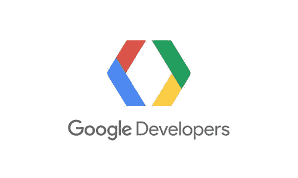](https://res.cloudinary.com/practicaldev/image/fetch/s--zNngoM03--/c_limit%2Cf_auto%2Cfl_progressive%2Cq_auto%2Cw_880/https://thepracticaldev.s3.amazonaws.com/i/sr1qvr0xf9rh3y5xe86n.jpg)
Google Developers 是谷歌提供软件开发工具、应用程序编程接口和技术资源的网站。
[了解更多](https://developers.google.com/)

# 2。用谷歌思考

 
通过数据报告、指南、信息图表和来自 Think with Google 的文章，揭示最新的营销研究和数字趋势。
[了解更多](https://developers.google.com/)

# 3。谷歌设计

 
谷歌设计是由谷歌的一群设计师、作家和开发人员领导的合作项目。
[了解更多](https://design.google/)

# 4。谷歌人工智能

在谷歌，他们认为人工智能可以有意义地改善人们的生活，当每个人都可以使用它时，最大的影响就会出现。了解更多关于他们的项目和工具。
[了解更多](https://ai.google/)

# 5。谷歌云平台

[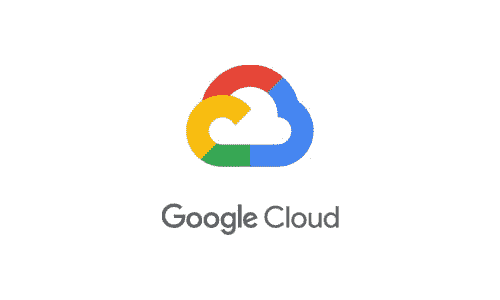](https://res.cloudinary.com/practicaldev/image/fetch/s--Ty53IdHO--/c_limit%2Cf_auto%2Cfl_progressive%2Cq_auto%2Cw_880/https://thepracticaldev.s3.amazonaws.com/i/40d65hvp9iayxr76qm6k.jpg) 
谷歌云平台由谷歌提供，是一套云计算服务，运行在谷歌内部为其最终用户产品使用的同一基础设施上。
[了解更多](https://cloud.google.com/)

# 6。谷歌开源

[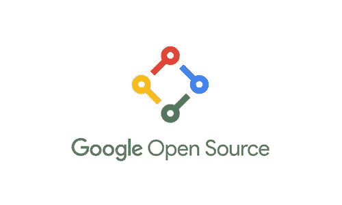](https://res.cloudinary.com/practicaldev/image/fetch/s--_2onRfsw--/c_limit%2Cf_auto%2Cfl_progressive%2Cq_auto%2Cw_880/https://thepracticaldev.s3.amazonaws.com/i/4vthf1q44inu9j6ksyt7.jpg) 
谷歌相信，通过开放和自由获取，它能够促进和鼓励协作和技术发展，解决现实世界的问题。
[了解更多](https://opensource.google.com/)

# 7。Google 企业应用套件脚本

 
Apps Script 是 G Suite 平台中轻量级应用开发的脚本框架。
[了解更多](https://www.google.com/script/start/)

# 8。谷歌 DeepMind

[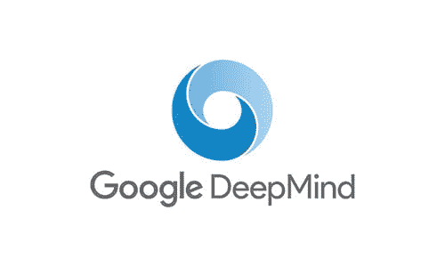](https://res.cloudinary.com/practicaldev/image/fetch/s--jwcmtxa---/c_limit%2Cf_auto%2Cfl_progressive%2Cq_auto%2Cw_880/https://thepracticaldev.s3.amazonaws.com/i/w4j1mynsaul92jn27c05.jpg) 
DeepMind 是人工智能研究及其应用产生积极影响的世界领导者。
[了解更多](https://deepmind.com/)

# 9。用代码制作

[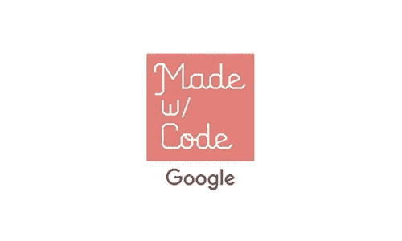](https://res.cloudinary.com/practicaldev/image/fetch/s--c9xLJ6Ig--/c_limit%2Cf_auto%2Cfl_progressive%2Cq_auto%2Cw_880/https://thepracticaldev.s3.amazonaws.com/i/67mxwdrn1g73rnhccks4.jpg) 
事情你编码你的第一个创意项目，遇到音乐制作人、服装设计师、人道主义者、动画师，他们正在编码他们想要看到的世界。
[了解更多](https://www.madewithcode.com/)

# 10。谷歌技术开发指南

 
无论你是学生、教育工作者，还是对软件工程感兴趣的人，计算机科学的新手还是更有经验的程序员。
[了解更多](https://techdevguide.withgoogle.com/)

# 11。谷歌教育

 
学校和大学正在使用谷歌的产品、项目和慈善事业来帮助他们提高学习和创新能力。
[了解更多](https://edu.google.com/)

# 12。谷歌开发人员培训

 
谷歌开发者培训是谷歌工程师打造的一套在线编码课程。
[了解更多](https://developers.google.com/training/)

# 13。初创公司的谷歌

[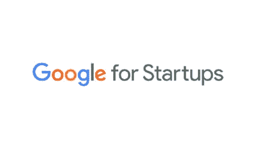](https://res.cloudinary.com/practicaldev/image/fetch/s--h0B8pPIa--/c_limit%2Cf_auto%2Cfl_progressive%2Cq_auto%2Cw_880/https://thepracticaldev.s3.amazonaws.com/i/clyzcszo8mzpac8jk1iz.jpg) 
想让你的新公司起步吗？Google for Startups 为您提供了有用的工具和最佳实践，为您指明正确的方向。
[了解更多](https://startup.google.com/)

# 14。在谷歌的演讲

 
谷歌演讲，一个常规的演讲系列，始于 2006 年，是谷歌独特文化的主要组成部分。
[了解更多](https://talksat.withgoogle.com/)

# 15。谷歌开发者博客

[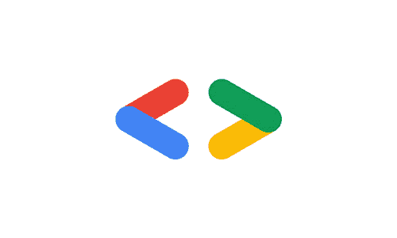](https://res.cloudinary.com/practicaldev/image/fetch/s--Zr5X4vej--/c_limit%2Cf_auto%2Cfl_progressive%2Cq_auto%2Cw_880/https://thepracticaldev.s3.amazonaws.com/i/2ptuy6y9sammt1rglk1l.jpg) 
关于谷歌平台、工具和事件的新闻和见解。
[了解更多](https://developers.googleblog.com/)

# 16。谷歌协议缓冲区

[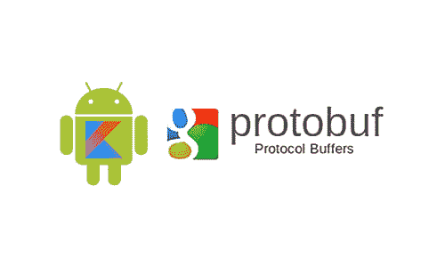](https://res.cloudinary.com/practicaldev/image/fetch/s--MY7ps9Df--/c_limit%2Cf_auto%2Cfl_progressive%2Cq_auto%2Cw_880/https://thepracticaldev.s3.amazonaws.com/i/gnudf6fcxy2xtd3xdwdc.jpg) 
协议缓冲区是一种语言中立、平台中立的可扩展机制，用于序列化结构化数据。
[了解更多](https://developers.google.com/protocol-buffers/)

# 17。谷歌代码实验室

[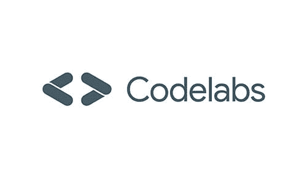](https://res.cloudinary.com/practicaldev/image/fetch/s--uKDz7GMl--/c_limit%2Cf_auto%2Cfl_progressive%2Cq_auto%2Cw_880/https://thepracticaldev.s3.amazonaws.com/i/abkmsv1fkfjthow2p61f.jpg) 
谷歌开发人员 Codelabs 提供了一个引导、教程、动手的编码体验。大多数 codelabs 会引导您完成构建小型应用程序的过程，或者向现有应用程序添加新功能。
[了解更多](https://codelabs.developers.google.com/)

# 18。与谷歌一起成长

 
与谷歌一起成长谷歌提供免费培训和工具，帮助你发展技能、职业或业务。探索计划并注册参加面对面的研讨会。
[了解更多](https://grow.google/)

# 19。谷歌我的生意

 
您在 Google My Business 上的免费商业档案可帮助您通过 Google 搜索和地图联系当地客户。
[了解更多](https://www.google.com/business/)

# 20。谷歌地球

 
谷歌地球是一个计算机程序，主要基于卫星图像呈现地球的 3D 表示。
[了解更多](https://www.google.com/earth/)

# 21。谷歌学术

 
【谷歌学术】是一个可免费访问的网络搜索引擎，它索引了一系列出版格式和学科的学术文献的全文或元数据。
[了解更多](https://scholar.google.co.in/)

# 22。谷歌数字车库

[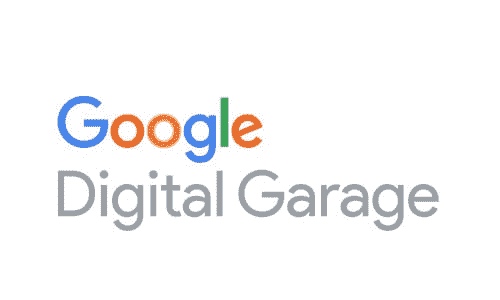](https://res.cloudinary.com/practicaldev/image/fetch/s--JJ3gA1V1--/c_limit%2Cf_auto%2Cfl_progressive%2Cq_auto%2Cw_880/https://thepracticaldev.s3.amazonaws.com/i/5oxorbyaux4q3oanbx08.jpg) 
通过免费课程培训学习在线营销，获得发展您的业务和职业所需的数字技能。成为数字专家的谷歌免费课程。
[了解更多](https://learndigital.withgoogle.com/)

# 23。谷歌代码之夏

[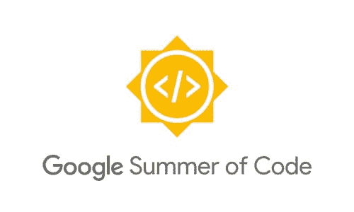](https://res.cloudinary.com/practicaldev/image/fetch/s--zml3JYcM--/c_limit%2Cf_auto%2Cfl_progressive%2Cq_auto%2Cw_880/https://thepracticaldev.s3.amazonaws.com/i/9j40i8tcgh67srykqjm4.jpg) 
谷歌代码之夏(Google Summer of Code)是一项全球计划，旨在吸引更多的学生开发者参与开源软件开发。学生与一个开源组织一起工作，进行为期 3 个月的编程项目。
[了解更多](https://summerofcode.withgoogle.com/)

# 24。谷歌趋势

[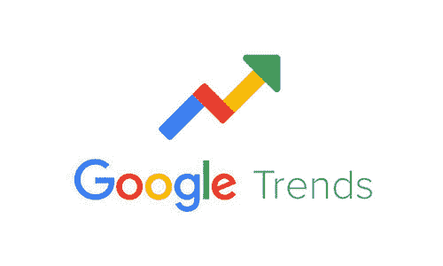](https://res.cloudinary.com/practicaldev/image/fetch/s--N3LPdzAu--/c_limit%2Cf_auto%2Cfl_progressive%2Cq_auto%2Cw_880/https://thepracticaldev.s3.amazonaws.com/i/idweeshj79vgr9pqgu5o.jpg) 
谷歌趋势(Google Trends)是谷歌旗下的一个网站，分析各地区、各种语言的谷歌搜索中热门搜索查询的受欢迎程度。
[了解更多](https://trends.google.com/trends/)

# 25。谷歌用户体验研究

[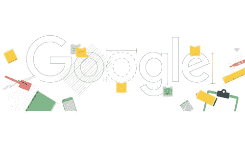](https://res.cloudinary.com/practicaldev/image/fetch/s--_wVMJ6wt--/c_limit%2Cf_auto%2Cfl_progressive%2Cq_auto%2Cw_880/https://thepracticaldev.s3.amazonaws.com/i/zsynaghtd0m2j5u4nvr2.jpg) 
谷歌用户体验研究是通过参与我们的用户调查研究，了解您对谷歌产品和功能的看法。你会得到我们的一点心意，还有机会去帮助建造你喜欢的东西。
[了解更多](https://userresearch.google.com/)

# 26。谷歌的实验

 
自 2009 年以来，编码人员已经使用 Chrome、Android、AI、WebVR、AR 等创建了数千个令人惊叹的实验。谷歌在这里展示项目，以及有用的工具和资源，以激励他人创造新的实验。
[了解更多](https://experiments.withgoogle.com/)

# 27。谷歌应用编程接口

[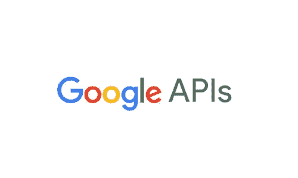](https://res.cloudinary.com/practicaldev/image/fetch/s---qBdGmXs--/c_limit%2Cf_auto%2Cfl_progressive%2Cq_auto%2Cw_880/https://thepracticaldev.s3.amazonaws.com/i/3bfq1902tiruxha2gnxx.jpg) 例如搜索、Gmail、翻译或谷歌地图。
[了解更多](https://developers.google.com/apis-explorer/)

完整的示例代码可以在 [Github](https://github.com/PraveenPal4232/Google-Gifts) 上找到。