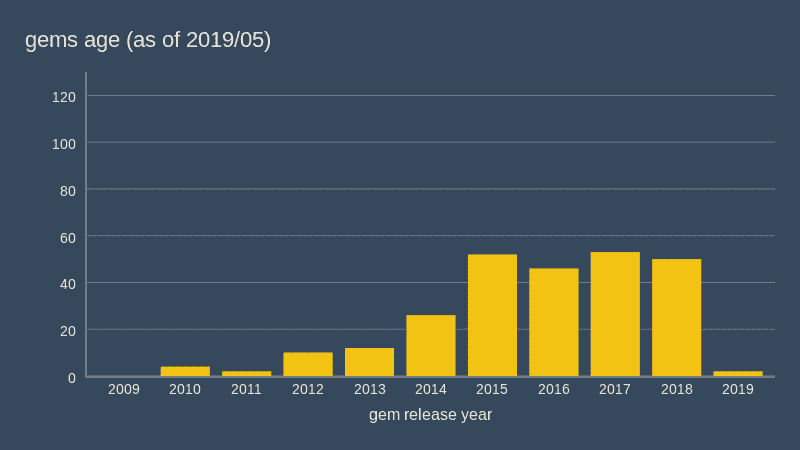
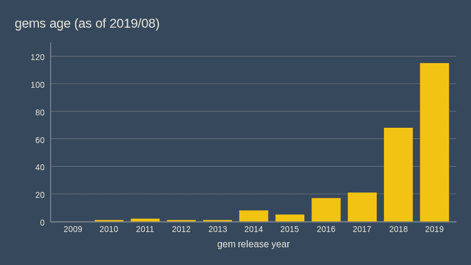

# 你的(ruby)项目中的依赖关系有多久了？

> 原文：<https://dev.to/nejremeslnici/how-old-are-dependencies-in-your-ruby-project-3jia>

最近，我们将 ruby on Rails 项目中的所有 Ruby 依赖项升级到了最新版本，包括 Rails 本身。关于 Rails 从 4.2 升级到 6.0，我已经[分享了一些推文](https://twitter.com/boramacz/status/1149590494738960384)，但是**我也想以某种方式将所有这些主要是技术上的和不可见的变化的要点可视化**，在一个简单的图表中，我可以向团队展示。

> 侧注:我们在大约四年后进行了这次升级，在此期间，我们优先部署新功能和新同事，而不是维护，所以这是一项相当大的努力。从中吸取了教训，我们现在已经使用可爱的[依赖机器人](https://twitter.com/boramacz/status/1149590494738960384)服务来帮助我们进行频繁的滚动更新，这样我们就再也不用处理这样的遗留依赖了！

### 那么我该如何想象*升级*？

本质上，升级意味着用新版本替换一些旧代码，但是软件**版本往往是一个非常抽象的度量**——人们不可能说出一个库从 3.2 版本到 5.1 版本的升级是一个重要的、期待已久的变化，还是只是一些相对较小的更新(甚至[语义版本系统](https://semver.org/)在这里也帮不上什么忙)。一些库，如`client_side_validations` gem，倾向于每几个月发布一个[新的主要版本](https://github.com/DavyJonesLocker/client_side_validations/blob/master/CHANGELOG.md),而其他库要花很多年才能做到。

如果跟踪依赖版本是不可行的，那么它们的**年龄**如何呢？年龄似乎是一个非常简单的度量，在许多方面都很有用——我们可以在项目中对依赖关系的年龄进行分布；我们可以很容易地显示异常值——非常旧的(可能没有维护过的)代码片段；我们可以简单地想象*进程*，通过绘制它们的年龄**之前的 T5】和升级**之后的 T7】来更新我们的依赖关系。

当然，年龄不能告诉我们太多关于升级的努力，也不能告诉我们邀请新的 bug 的风险，但是总比什么都没有好，而且它非常简单，每个人都会理解。

### 确定项目中红宝石的宝石年龄

在[捆绑器](https://bundler.io/)和 [rubygems 仓库](https://rubygems.org/)的帮助下，获取宝石年龄其实很容易。Bundler 将告诉我们**在我们的项目**中使用了哪些宝石以及它们的具体版本。 [Rubygems API](https://guides.rubygems.org/rubygems-org-api-v2/) 能够告诉我们关于特定 gem 版本信息，包括**它们被[构建](https://guides.rubygems.org/command-reference/#gem-build)** 的日期。

我制作了一个 **ruby 脚本 [`ruby_gems_age.rb`](https://gist.github.com/borama/4d52c4f97c918a363a1fc7019593bf86)** ，它收集了所有这些信息，并以两种详细程度打印出来:所有宝石的详细列表，首先是它们的版本和年龄，最后是宝石的年度分布。输出通常是这样的(应该很容易以 CSV 格式导入到您最喜欢的电子表格或图表程序中):

```
$ ruby ruby_gems_age.rb
actioncable,6.0.0.rc1,2019-04-24
actionmailbox,6.0.0.rc1,2019-04-24
actionmailer,6.0.0.rc1,2019-04-24
actionpack,6.0.0.rc1,2019-04-24
...
webpacker,3.5.5,2018-07-09
websocket-driver,0.7.1,2019-06-10
websocket-extensions,0.1.4,2019-06-10
will_paginate,3.1.7,2019-03-18
xpath,3.2.0,2018-10-15
zeitwerk,2.1.9,2019-07-16

Yearly summary:
2014,8,acts-as-dag ...
2015,6,coffee-script ...
...
2019,115,actioncable ... 
```

<svg width="20px" height="20px" viewBox="0 0 24 24" class="highlight-action crayons-icon highlight-action--fullscreen-on"><title>Enter fullscreen mode</title></svg> <svg width="20px" height="20px" viewBox="0 0 24 24" class="highlight-action crayons-icon highlight-action--fullscreen-off"><title>Exit fullscreen mode</title></svg>

请注意，该脚本打印项目中所有宝石的信息，而不仅仅是那些明确列在`Gemfile`中的宝石。

### 制图依赖升级

最后，为了可视化您的代码库的升级，您可以简单地在升级之前从*检查主分支，在*升级之后从*检查主分支，然后在两个版本中的每一个中运行`bundle`来安装所有 gems 的正确版本，并运行`ruby_gems_age.rb`脚本来获取年龄数据。根据所有这些，您现在可以制作两个图表，类似于我们自己项目中的下图:*

升级前:

[](https://res.cloudinary.com/practicaldev/image/fetch/s--Rf-Nxozb--/c_limit%2Cf_auto%2Cfl_progressive%2Cq_auto%2Cw_880/https://thepracticaldev.s3.amazonaws.com/i/f79cf1w4vlhoufl36er0.png)

升级后:

[](https://res.cloudinary.com/practicaldev/image/fetch/s--kX_ie5Q_--/c_limit%2Cf_auto%2Cfl_progressive%2Cq_auto%2Cw_880/https://thepracticaldev.s3.amazonaws.com/i/xi64ncw8xuf0m63l5vg2.png)

这些图表直接表明:

*   大多数“几年前”的宝石都**成功更新到它们当前/最近的版本**
*   在我们的代码库中仍然存在一些非常古老的瑰宝——这些是不容易替换的**遗留依赖关系**,它们要么非常稳定，要么不再维护(我们甚至将它们中的一些应用到我们自己的克隆中，并根据我们的需要对它们进行修改)
*   介于两者之间的是稳定且可以使用的宝石，但**可能会变得太陈旧，不适合我们未来的需求**
*   总的来说，升级后的曲线看起来“健康”,并且由于新的滚动更新，应该在很大程度上保持这种状态。

### 我们也可以估计未来可能的升级

你可能会说，在所有工作都已经完成之后，想象这样的*升级太容易了，也有点无聊。但是类似的图表可以被制作出来，以便**在升级开始之前就能估计出升级可能带来的结果**。您可以制作一个项目依赖关系当前状态的图表，然后使用 Rubygems API 确定所有 gems 的最新版本，并制作另一个图表(所需升级状态的图表)**来进行比较，并在下次讨论升级项目的必要性时向您的经理**展示。显然，我们没有做到这一点，但它应该不会太难实现。*

**更新**:实际上，正如评论中善意指出的，一个非常类似的东西已经被实现了，看看[立年项目](https://libyear.com/)！

那么，你的抚养年龄表会是什么样的呢？