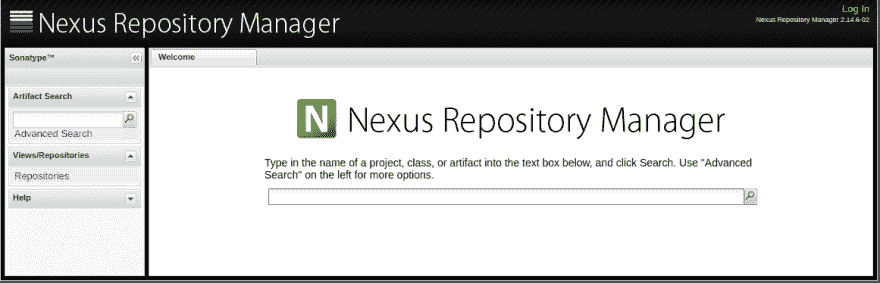

# Maven 定制原型

> 原文：<https://dev.to/iamjaveed59/a-maven-custom-archetype-p3c>

### 1。什么是 Maven 原型？

maven 原型是一个简单的工件，它包含您的项目相关的文件和配置。使用原型的主要好处是标准化项目开发，并使开发人员能够在更快地引导他们的项目的同时轻松地遵循最佳实践。

### 2。为什么我们需要定制原型？

当我们开发一个基于其他项目的应用程序时，我们需要一些文件来获取信息和访问它们的功能，这很简单。

如此多的配置文件可能存在于您的依赖项目中，如 **web.xml** 、 **pom.xml** 等..,

pom 文件包含其他项目所需的所有依赖项。

在这里，您的项目模板是固定的，您知道您需要什么文件以及您需要将这些文件放在哪里。起初是你自己创建的，但后来是你用相同的**项目模板**开发**新项目**时的**重复工作**。因此 maven 定制原型可以帮助您创建完全自动化的定制项目模板。

### 3。原型包含什么？

原型由一个名为 **archetype-metadata.xml** 的主要配置文件组成，它可以在**src/main/resources/META-INF/maven/**中找到，还有一个名为**src/main/resources/archetype-resources/**的文件夹，它包含所有您需要定制的项目相关文件。

甚至原型也是由项目创建的，所以我们在原型项目的基本位置也有一个根 **pom.xml** 。

**Maven 原型描述符**

```
<requiredProperties>
    <requiredProperty key="version">
        <defaultValue>1.0</defaultValue>
    </requiredProperty>
    <requiredProperty key="client-name"/>
</requiredProperties>

<fileSets>
    <fileSet filtered="true" packaged="true">
        <directory>src/main/java</directory>
        <includes>
            <include>**/*.java</include>
        </includes>
    </fileSet>
     <fileSet filtered="true" packaged="true">
        <directory>src/main/resources</directory>
        <includes>
            <include>**/*.xml</include>
            <include>**/*.properties</include>
        </includes>
    </fileSet>
</fileSets>

<modules>
    <module name="service-module"></module>
    <module name="web-module"></module>
</modules> 
```

***required properties***标签用于维护项目中需要的任何**可配置参数**。如果它被设置为默认值，它将被使用，否则它会在创建项目时提示。

***文件集*** 将用于维护文件夹。过滤后的文件意味着占位符将在生成过程中被提供的值替换。所以在我们的项目中 **client-name** 是必需的属性，我可以在过滤的文件集目录的任何文件中使用这个属性。

***模块*** 标签帮助你拥有一个**多模块**项目模板。

其他信息，请查看 [Apache 文档](https://maven.apache.org/guides/mini/guide-creating-archetypes.html)

### 4。让它可用

[](https://res.cloudinary.com/practicaldev/image/fetch/s--n9_j2M3j--/c_limit%2Cf_auto%2Cfl_progressive%2Cq_auto%2Cw_880/https://docs.releng.linuxfoundation.org/en/latest/_images/nexus2-ui.png) 
设置自定义原型后，您需要将其提供给其他员工。为此，我们在根 pom.xml 文件中有一个***distribution management***标签，您可以在其中维护您的存储库以部署生成的原型，最终它也可供其他人使用。

关于如何对 Nexus 进行配置的详细信息，请查看 Maven 中的站点[分发管理](https://maven.apache.org/pom.html#Distribution_Management)

### 5。创造原型的捷径

[](https://res.cloudinary.com/practicaldev/image/fetch/s--YK6AUFxD--/c_limit%2Cf_auto%2Cfl_progressive%2Cq_auto%2Cw_880/https://cdn.shopify.com/s/files/1/2780/3536/files/chaim-billingham-header_1024x1024.jpg%3Fv%3D1519303740) 
正如我之前所说的，第一次是你自己用 maven 用一般的方法创建项目。你已经准备好了你的项目模板，所以它非常简单，你只需要使用一个命令，那就是内置的 maven 插件 **mvn 原型:从项目中创建**。

转到您的项目模板根文件夹，执行上面的命令 maven 自动创建一个自定义原型，它将在基本项目模板的目标位置可用。

这就是这篇文章的全部内容，我会很快回来发布另一篇有用的文章。我想看看你的反馈和建议。

你可以在推特上关注我