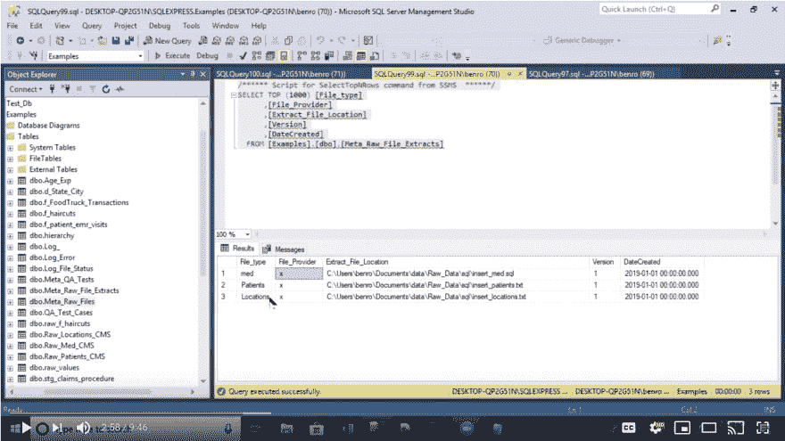

# 使用 Python 和 SQL 自动将文件加载到 SQL Server

> 原文：<https://dev.to/seattledataguy/automating-file-loading-into-sql-server-with-python-and-sql-1kh2>

将文件加载到数据库中并不是令人兴奋的工作。这可能是单调乏味的工作。通常情况下，它会受到像 SSIS 这样的工具的约束，当一个小的变化发生时，这些工具就会崩溃。

这是 BI 和数据工程团队的核心角色之一。他们需要将文件从操作数据库加载到数据仓库中。他们通过开发处理和转换数据的管道来做到这一点。

我们看到的一个问题是团队有多种文件类型、数据规范版本和数据提供者。每一个都需要不同的管道来加载到它们的原始数据库中。

这迫使团队管理 10 个、20 个甚至 50 个更小的管道，这些管道都受到数据提供者变化的影响。此外，每个新的数据提供者都需要开发全新的管道。它还需要管理每个管道周围的基础设施，以便记录和跟踪数据管道的状态。这很快会变得非常难以管理，构建起来也很繁琐。

另一个解决方案是开发一个中央系统来管理将数据插入每个不同的原始表所需的各种 insert 语句，而不是试图管理多个管道。就像我们在下面的视频中解释的那样。

该系统所做的实际上是充当一个查找系统，将平面文件与其插入查询相匹配。这减少了冗余地拥有同样需要 insert 语句的独立管道的需要。

相反，现在系统使用一个主系统来加载所有不同的表。理论上，你也可以给每个进来的文件标上版本号。这可以通过跟踪元数据表中的每个版本来设置，这将允许您将原始文件绑定到插入文件版本。

通过单独的管道加载多种文件类型需要大量繁琐的开发工作。无论是通过 SSIS 还是另一个系统，持续的开发很快给数据工程师带来了沉重的负担。而不是花时间开发为公司带来明确价值的分析管道。他们将受困于维护和开发运营管道。

这降低了它的影响，降低了它的整体价值。

如果你喜欢这个，请随时查看我们关于使用大容量插入的视频！

[如何使用 R 开发预测模型](https://www.youtube.com/watch?v=8cKeAH2aGVI&t=6s)
[用 Google Sheets 进行网页抓取](https://hackernoon.com/web-scraping-with-google-sheets-20d0dce323cc?source=activity---post_recommended_rollup)
[什么是决策树](http://www.acheronanalytics.com/acheron-blog/brilliant-explanation-of-a-decision-tree-algorithms)
[算法如何变得不道德和有偏见](http://www.acheronanalytics.com/acheron-blog/how-do-machines-learn-bias-data-science)
[如何开发健壮的算法](https://medium.com/@SeattleDataGuy/how-to-develop-a-robust-algorithm-c38e08f32201)
[4 数据科学家必须具备的技能](https://www.theseattledataguy.com/4-skills-data-scientist-must-have/)