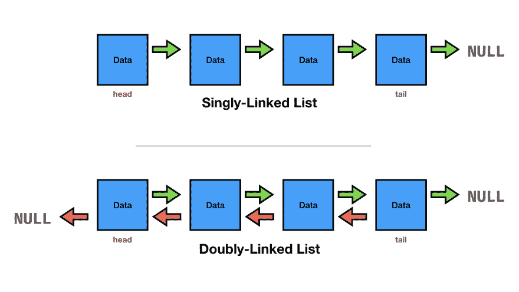

# Java 日常编码问题#006

> 原文：<https://dev.to/awwsmm/java-daily-coding-problem-006-2l98>

[日常编码问题](https://dailycodingproblem.com/)是一个网站，它会每天给你的收件箱发送一个编程挑战。我想向初学者展示如何使用 Java 解决这些问题，所以这将是我的一系列解决方案中的一个。欢迎在评论中把它们挑出来！

### 问题

> XOR 链表是一个更有内存效率的双向链表。不是每个节点保存`next`和`prev`字段，而是保存一个名为`both`的字段，它是下一个节点和前一个节点的异或。实现异或链表；它有一个`add(element)`将元素添加到末尾，还有一个`get(index)`返回索引处的节点。
> 
> 如果使用一种没有指针的语言(比如 Python)，你可以假设你可以访问在节点和内存地址之间转换的`get_pointer`和`dereference_pointer`函数。

### 策略

*剧透！*不要看下面，除非你想看我的解决方案！

* * *

#### 双向链表

所以，首先，我需要理解什么是双向链表。所以我读了维基百科的文章，我的理解是这样的:

一个*单链表*(或者只是一个*链表*)的每个元素包含:

*   一些数据
*   指向列表中下一个元素的指针或引用

*双向链表*的每个元素包含:

*   一些数据
*   指向列表中下一个元素的指针或引用
*   指向列表中前一个元素的指针或引用

你可以想象这些列表之间的区别，如下所示:

[](https://res.cloudinary.com/practicaldev/image/fetch/s--kuwbU5e8--/c_limit%2Cf_auto%2Cfl_progressive%2Cq_auto%2Cw_880/https://thepracticaldev.s3.amazonaws.com/i/vagix3khf5q0655ykyna.png)

单向链表只能向前遍历。列表中的一个元素不知道它前面是什么元素(如果有的话),也无法访问它。双向链表可以向前或向后双向遍历。当用户试图到达列表末尾之外(或者对于双向链表，到达列表开头之外)时，应该抛出某种错误，或者应该返回`null`。

然后...什么是异或列表？提示解释了这个概念，但是我不确定我理解了。我过一会儿会回到这个话题。

#### 严格解释提示

我发现[这个 SO 答案](https://stackoverflow.com/a/16139017/2925434)很好地解释了双向链表的优缺点。它也很好地解释了为什么我们可能想要使用它。如果我可以解释一下...

在“真正的”单链表或双向链表中，我们持有两个对象:

1.  数据
2.  指向列表中另一个元素的指针或引用

[指针只是另一个保存内存地址的变量。](https://stackoverflow.com/questions/57483/what-are-the-differences-between-a-pointer-variable-and-a-reference-variable-in)举个例子，假设我们有一个由 [C 语言`int`组成的双向链表，长度为 4 个字节](https://www.tutorialspoint.com/cprogramming/c_data_types)。在 64 位机器上，C 中的指针将有 8 个字节长，所以我们列表中的每个元素需要 20 个字节，用于`int`和两个指针。

让我们假设列表的第一个元素在地址`0x9A7D`...

> 前缀`0x`表示这是一个十六进制数。在 64 位机器上(其中`64-bit`指内存地址空间的大小)，表示任何地址都需要 8 个字节。一个字节(范围 0-255)可以用两个十六进制数字表示。所以 8 个字节需要 16 个十六进制数字。

在我们的例子中，这个地址引用了列表元素存储的值。由于*值*是一个`int`，它将占用四个字节的空间(八个十六进制数字)。接下来的 8 个字节(十六进制数字)将是指向列表中“下一个”元素的指针，最后的 8 个字节将是指向列表中“上一个”元素的指针，所以:

```
D0 C0 FF EE [ "next" address      ] [ "previous" address  ]
^^^^^^^^^^^
4-byte integer value (hex "D0 C0 FF EE" = decimal "3 502 309 358") 
```

<svg width="20px" height="20px" viewBox="0 0 24 24" class="highlight-action crayons-icon highlight-action--fullscreen-on"><title>Enter fullscreen mode</title></svg> <svg width="20px" height="20px" viewBox="0 0 24 24" class="highlight-action crayons-icon highlight-action--fullscreen-off"><title>Exit fullscreen mode</title></svg>

如果列表的第一个元素(这一个)在地址

```
0x9E7D6300BA679A7D 
```

<svg width="20px" height="20px" viewBox="0 0 24 24" class="highlight-action crayons-icon highlight-action--fullscreen-on"><title>Enter fullscreen mode</title></svg> <svg width="20px" height="20px" viewBox="0 0 24 24" class="highlight-action crayons-icon highlight-action--fullscreen-off"><title>Exit fullscreen mode</title></svg>

...然后，在
，下一个元素将被偏移 20 字节(假设列表的元素被存储在存储器的连续块中，这可能不是事实)

```
0x9E7D6300BA679A91 
```

<svg width="20px" height="20px" viewBox="0 0 24 24" class="highlight-action crayons-icon highlight-action--fullscreen-on"><title>Enter fullscreen mode</title></svg> <svg width="20px" height="20px" viewBox="0 0 24 24" class="highlight-action crayons-icon highlight-action--fullscreen-off"><title>Exit fullscreen mode</title></svg>

> `0x7D + 20 = 0x7D + 0x14 = 0x91`

```
D0 C0 FF EE 9E 7D 63 00 BA 67 9A 91 [ "previous" address  ]
            ^^^^^^^^^^^^^^^^^^^^^^^
             "next" memory address 
```

<svg width="20px" height="20px" viewBox="0 0 24 24" class="highlight-action crayons-icon highlight-action--fullscreen-on"><title>Enter fullscreen mode</title></svg> <svg width="20px" height="20px" viewBox="0 0 24 24" class="highlight-action crayons-icon highlight-action--fullscreen-off"><title>Exit fullscreen mode</title></svg>

类似地，对于列表中除了第一个元素之外的所有元素,“前一个”地址将以相反的方向偏移 20 个字节。因为第一个元素没有“前一个”地址，所以会有一些指示符表明那里没有元素(可能是指向内存地址`0x0`的[空指针](https://en.wikipedia.org/wiki/Null_pointer):

```
D0 C0 FF EE 9E 7D 63 00 BA 67 9A 91 00 00 00 00 00 00 00 00
                                    ^^^^^^^^^^^^^^^^^^^^^^^
                                   "previous" memory address 
```

<svg width="20px" height="20px" viewBox="0 0 24 24" class="highlight-action crayons-icon highlight-action--fullscreen-on"><title>Enter fullscreen mode</title></svg> <svg width="20px" height="20px" viewBox="0 0 24 24" class="highlight-action crayons-icon highlight-action--fullscreen-off"><title>Exit fullscreen mode</title></svg>

在 C 中，我们显然不会直接处理这些字节。相反，[我们会有类似](https://stackoverflow.com/a/506382/2925434) :

```
struct DLL {

  int data; // value
  struct DLL *next;
  struct DLL *previous;

} 
```

<svg width="20px" height="20px" viewBox="0 0 24 24" class="highlight-action crayons-icon highlight-action--fullscreen-on"><title>Enter fullscreen mode</title></svg> <svg width="20px" height="20px" viewBox="0 0 24 24" class="highlight-action crayons-icon highlight-action--fullscreen-off"><title>Exit fullscreen mode</title></svg>

...但是我们究竟如何用 Java 实现它呢？Java 从 C/C++中借用了很多语法，但是它没有`struct` s。所以在 Java 中，[我们可以改为](https://stackoverflow.com/a/5168216/2925434) :

```
class DLL {

  int value; 
  /* implement next */
  /* implement previous */

} 
```

<svg width="20px" height="20px" viewBox="0 0 24 24" class="highlight-action crayons-icon highlight-action--fullscreen-on"><title>Enter fullscreen mode</title></svg> <svg width="20px" height="20px" viewBox="0 0 24 24" class="highlight-action crayons-icon highlight-action--fullscreen-off"><title>Exit fullscreen mode</title></svg>

Java 也没有指针，但是请记住，提示声明:

> *如果使用一种没有指针的语言(比如 Python)，你可以假设你可以访问在节点和内存地址之间转换的`get_pointer`和`dereference_pointer`函数。*

Java，被设计成一种“安全”的语言，[不允许你乱搞内存地址](https://stackoverflow.com/a/1961150/2925434)。所以`get_pointer`和`dereference_pointer`方法纯属虚构。根据提示描述，它们应该有类似
的类型签名

```
DLL* get_pointer (DLL link)

DLL dereference_pointer (DLL* pointer) 
```

<svg width="20px" height="20px" viewBox="0 0 24 24" class="highlight-action crayons-icon highlight-action--fullscreen-on"><title>Enter fullscreen mode</title></svg> <svg width="20px" height="20px" viewBox="0 0 24 24" class="highlight-action crayons-icon highlight-action--fullscreen-off"><title>Exit fullscreen mode</title></svg>

...该函数将`DLL`对象转换成包含其在内存中的地址的指针，反之亦然。这个问题建议按照下面的思路去做:

```
public class DLL {

  public  int  data; // value
  private DLL  next;
  private DLL  previous;

  public  DLL* next()     { return get_pointer(next)     }
  public  DLL* previous() { return get_pointer(previous) }

} 
```

<svg width="20px" height="20px" viewBox="0 0 24 24" class="highlight-action crayons-icon highlight-action--fullscreen-on"><title>Enter fullscreen mode</title></svg> <svg width="20px" height="20px" viewBox="0 0 24 24" class="highlight-action crayons-icon highlight-action--fullscreen-off"><title>Exit fullscreen mode</title></svg>

这是丑陋的。这也是无效的 Java 语法。在现实生活中毫无用处。我认为继续这种假设性的解决方案不值得。

#### 重新解释提示

让我们重新解释一下，这样我们就可以真正抓住 Java 中 XOR 链表的精髓，而不是完全按照提示去做。

我们可以尝试使用 [`java.lang.instrument`](https://docs.oracle.com/javase/11/docs/api/java/lang/instrument/package-summary.html) 到[来确定 Java](https://stackoverflow.com/q/52353/2925434) 中对象的大小(以字节为单位),但是这种方法会产生不直观的结果(所有的`String`大小相同),这对我们的目的(知道对象在内存中的实际大小)没有用。

相反，让我们模拟内存地址。Java 允许[十六进制文字](https://docs.oracle.com/javase/tutorial/java/nutsandbolts/datatypes.html)，并且(默认情况下)在打印时将它们转换成十进制:

```
jshell> 0x10
$3 ==> 16

jshell> 0x20
$4 ==> 32

jshell> 0x10 + 0x10
$5 ==> 32 
```

<svg width="20px" height="20px" viewBox="0 0 24 24" class="highlight-action crayons-icon highlight-action--fullscreen-on"><title>Enter fullscreen mode</title></svg> <svg width="20px" height="20px" viewBox="0 0 24 24" class="highlight-action crayons-icon highlight-action--fullscreen-off"><title>Exit fullscreen mode</title></svg>

由于一个 Java `int`有一个`[-2e31, 2e31-1]` ( `[-2147483648, 2147483647]`)的范围，它的最大十六进制值是:

```
 jshell> 0x0
$31 ==> 0

jshell> 0x7FFFFFFF
$32 ==> 2147483647

jshell> 0x80000000
$33 ==> -2147483648

jshell> 0xFFFFFFFF
$34 ==> -1 
```

<svg width="20px" height="20px" viewBox="0 0 24 24" class="highlight-action crayons-icon highlight-action--fullscreen-on"><title>Enter fullscreen mode</title></svg> <svg width="20px" height="20px" viewBox="0 0 24 24" class="highlight-action crayons-icon highlight-action--fullscreen-off"><title>Exit fullscreen mode</title></svg>

因此，我们可以创建一个方法，在给定对象大小的情况下，为新对象“分配”内存地址。我们可以跟踪哪些“内存位置”正在被使用，这样我们就不会意外地“覆盖”旧数据。然后，我们最终可以用 Java 实现 XOR 链表(将在其实现过程中解释)。

### 代码

首先，让我们用 Java 创建一个简单的`Memory`类:

```
public class Memory {

  private static Random random = new Random();

  // return any address except "0x00000000", the "NULL" address
  public static String randomAddress() {
    int value = random.ints(1L, Integer.MIN_VALUE, Integer.MAX_VALUE).toArray()[0] + 1;
    return intToAddress(value);
  }

  public static int addressToInt(String address) {
    return (int)(Long.parseLong(address.substring(2), 16) + Integer.MIN_VALUE);
  }

  public static String intToAddress(int value) {
    long longValue = (long)value - (long)Integer.MIN_VALUE;
    return String.format("0x%8s", Long.toString(longValue, 16).toUpperCase()).replaceAll(" ", "0");
  }

} 
```

<svg width="20px" height="20px" viewBox="0 0 24 24" class="highlight-action crayons-icon highlight-action--fullscreen-on"><title>Enter fullscreen mode</title></svg> <svg width="20px" height="20px" viewBox="0 0 24 24" class="highlight-action crayons-icon highlight-action--fullscreen-off"><title>Exit fullscreen mode</title></svg>

这个类有三个函数:`intToAddress()`，它将任何`int`值作为参数，并将其转换为十六进制地址`String`、`addressToInt()`，它执行逆运算，以及`randomAddress()`，它生成一个随机地址`String`。托管这段代码的 GitHub 库添加了一些边界检查和注释。

```
jshell> Memory.randomAddress()
$195 ==> "0xB821DAE5"

jshell> Memory.addressToInt("0xB821DAE5")
$196 ==> 941742821

jshell> Memory.intToAddress(941742821)
$197 ==> "0xB821DAE5" 
```

<svg width="20px" height="20px" viewBox="0 0 24 24" class="highlight-action crayons-icon highlight-action--fullscreen-on"><title>Enter fullscreen mode</title></svg> <svg width="20px" height="20px" viewBox="0 0 24 24" class="highlight-action crayons-icon highlight-action--fullscreen-off"><title>Exit fullscreen mode</title></svg>

`intToAddress()`的最大值是`Integer.MIN_VALUE`和`Integer.MAX_VALUE` :

```
jshell> Memory.intToAddress(Integer.MIN_VALUE)
$198 ==> "0x00000000"

jshell> Memory.intToAddress(Integer.MAX_VALUE)
$199 ==> "0xFFFFFFFF" 
```

<svg width="20px" height="20px" viewBox="0 0 24 24" class="highlight-action crayons-icon highlight-action--fullscreen-on"><title>Enter fullscreen mode</title></svg> <svg width="20px" height="20px" viewBox="0 0 24 24" class="highlight-action crayons-icon highlight-action--fullscreen-off"><title>Exit fullscreen mode</title></svg>

...返回`addressToInt()` :
的最大值

```
jshell> Memory.addressToInt("0x00000000")
$200 ==> -2147483648

jshell> Integer.MIN_VALUE
$201 ==> -2147483648

jshell> Memory.addressToInt("0xFFFFFFFF")
$202 ==> 2147483647

jshell> Integer.MAX_VALUE
$203 ==> 2147483647 
```

<svg width="20px" height="20px" viewBox="0 0 24 24" class="highlight-action crayons-icon highlight-action--fullscreen-on"><title>Enter fullscreen mode</title></svg> <svg width="20px" height="20px" viewBox="0 0 24 24" class="highlight-action crayons-icon highlight-action--fullscreen-off"><title>Exit fullscreen mode</title></svg>

> 注意，我的“最大”和“最小”十六进制值的实现与 Java 的不同，Java 在`0x7FFFFFFF` / `0x80000000`换行。我重新安排了，让最小的十六进制值对应最低的内存地址，我觉得这样更直观一点。

接下来，我们需要在创建新对象(在本例中，我们的双向链表对象)时“分配内存”。当我们这样做时，我们需要指定我们需要的内存量。让我们为`Memory` :
创建一个类似 [`malloc`的函数](https://en.wikipedia.org/wiki/C_dynamic_memory_allocation)

```
 public static String malloc(long size) {

    // if object has zero size, return NULL address
    if (size < 1) return "0x00000000";

    // if object cannot fit in memory, throw error
    if (size > (long)Integer.MAX_VALUE - (long)Integer.MIN_VALUE )
      throw new IllegalArgumentException("insufficient memory");

    // if object can fit in memory, get largest possible address

    long first = Integer.MIN_VALUE;
    long last  = (long)Integer.MAX_VALUE - size;

    // if only one possible memory address, return that one
    if (first == last) return "0x00000001";

    // ...else, randomise over valid range
    int value = random.ints(1L, (int)first, (int)last).toArray()[0] + 1;

    // ...and return as address
    return intToAddress(value);

  } 
```

<svg width="20px" height="20px" viewBox="0 0 24 24" class="highlight-action crayons-icon highlight-action--fullscreen-on"><title>Enter fullscreen mode</title></svg> <svg width="20px" height="20px" viewBox="0 0 24 24" class="highlight-action crayons-icon highlight-action--fullscreen-off"><title>Exit fullscreen mode</title></svg>

当然，这是一种极其简单且低效的内存分配方式。有更好的解决方案，但是需要更多的工作。现在让我们使用这个简单的解决方案。最后，我们需要一种方法来“注册”内存，这样我们就不会意外地用另一个对象覆盖一个对象。

```
 // keep track of which int-indexed blocks are occupied by data
  private static HashSet<Integer> occupied = new HashSet<>(Arrays.asList(Integer.MIN_VALUE));

  // free memory within a certain range
  public static void free(String iAddress, String fAddress) {
    int iAdd = addressToInt(iAddress);
    int fAdd = addressToInt(fAddress);

    // remove all addresses in range
    occupied.removeAll(IntStream.range(iAdd, fAdd).boxed().collect(Collectors.toList()));

    // check that "NULL" is still "occupied"
    occupied.add(Integer.MIN_VALUE);
  }

  // free all memory
  public static void free() {
    free("0x00000001", "0xFFFFFFFF");
  }

  // list of objects in memory
  public static HashMap<String, Object> refTable = new HashMap<>();
  static { refTable.put("0x00000000", null); }

  // dereference object
  public static Object dereference(String address) {
    return refTable.get(address);
  } 
```

<svg width="20px" height="20px" viewBox="0 0 24 24" class="highlight-action crayons-icon highlight-action--fullscreen-on"><title>Enter fullscreen mode</title></svg> <svg width="20px" height="20px" viewBox="0 0 24 24" class="highlight-action crayons-icon highlight-action--fullscreen-off"><title>Exit fullscreen mode</title></svg>

当然，上面所说的并不真的有效，因为我们并不检查`malloc`内存是否被注册。为了有一个完全工作的、健壮的解决方案，我们需要一个更加复杂的内存分配引擎。不过不管怎么说，这大概够玩一会儿了:

```
jshell> Memory.occupied
$83 ==> [-2147483648]

jshell> Memory.malloc(1)
$84 ==> "0xB8B7087E"

jshell> Memory.occupied
$85 ==> [-2147483648, 951519358]

jshell> Memory.intToAddress(951519358)
$86 ==> "0xB8B7087E"

jshell> Memory.malloc(2)
$87 ==> "0x802AD3C8"

jshell> Memory.occupied
$88 ==> [-2147483648, 2806728, 2806729, 951519358] 
```

<svg width="20px" height="20px" viewBox="0 0 24 24" class="highlight-action crayons-icon highlight-action--fullscreen-on"><title>Enter fullscreen mode</title></svg> <svg width="20px" height="20px" viewBox="0 0 24 24" class="highlight-action crayons-icon highlight-action--fullscreen-off"><title>Exit fullscreen mode</title></svg>

**最后**我们可以开始讨论 XOR 链表了。

#### 异或链表

回想一下前面双向链表的定义:

*双向链表*的每个元素包含:

*   一些数据
*   指向列表中下一个元素的指针或引用
*   指向列表中前一个元素的指针或引用

所以我们需要一个列表元素的类`Node`和一个`DoublyLinkedList`类。一个简单的`Node`类可能看起来像:

```
 class Node<U> {

    // number of "bytes" to allocate for a DLL
    static final int size = 20;

    U      data; // data held by this DLL element
    String next; // address of next DLL element
    String prev; // address of previous DLL element
    String addr; // address of this DLL element

    // constructor with no "next" or "prev" elements
    public Node (U data) {

      this.data = data;
      this.next = "0x00000000"; // null
      this.prev = "0x00000000"; // null

      // allocate memory for this DLL element
      this.addr = Memory.malloc(size);

    }
  } 
```

<svg width="20px" height="20px" viewBox="0 0 24 24" class="highlight-action crayons-icon highlight-action--fullscreen-on"><title>Enter fullscreen mode</title></svg> <svg width="20px" height="20px" viewBox="0 0 24 24" class="highlight-action crayons-icon highlight-action--fullscreen-off"><title>Exit fullscreen mode</title></svg>

我们可以添加方法来获取和设置列表中`next`和`prev`(前一个)节点的地址:

```
 // method to get a "pointer" to this object ("get_pointer")
    String ptr() { return this.addr; }

    // getters for next and prev
    String next() { return this.next; }
    String prev() { return this.prev; }

    // setters for next and prev
    void next(String addr) { this.next = addr; }
    void prev(String addr) { this.prev = addr; } 
```

<svg width="20px" height="20px" viewBox="0 0 24 24" class="highlight-action crayons-icon highlight-action--fullscreen-on"><title>Enter fullscreen mode</title></svg> <svg width="20px" height="20px" viewBox="0 0 24 24" class="highlight-action crayons-icon highlight-action--fullscreen-off"><title>Exit fullscreen mode</title></svg>

最后，我们需要一种为这些对象“分配内存”的方法，给它们分配一个内存地址，并“取消引用”该地址。为了让我们的`DoublyLinkedList`和`Node`类访问我们的`Memory`类，我们需要将它们打包成一个`*.jar`。我将用所有这些代码创建一个 Maven 项目。然后，我们可以扩大`DoublyLinkedList`的对象...

```
public class DoublyLinkedList<T> {

  // List of Nodes
  private List<Node<T>> Nodes;

  // get number of Nodes in this List
  public int size() { return this.Nodes.size(); }

  // constructor
  public DoublyLinkedList() {
    this.Nodes = new ArrayList<>();
  }

  // add a Node to the end of the List
  public DoublyLinkedList<T> add(T t) {
    Node<T> newNode = new Node<>(t);

    // if this List already has Nodes
    if (this.size() > 0) {

      // get Node which previously was last Node
      Node<T> oldLastNode = this.Nodes.get(this.size()-1);

      // edit last Node in List to point to _new_ last Node
      oldLastNode.next = newNode.ptr();

      // edit new last Node to point to _old_ last Node
      newNode.prev(oldLastNode.ptr());
    }

    // add new last Node to end of List
    this.Nodes.add(newNode);

    // so add() can be chained
    return this;
  }

  /* Node inner class */

} 
```

<svg width="20px" height="20px" viewBox="0 0 24 24" class="highlight-action crayons-icon highlight-action--fullscreen-on"><title>Enter fullscreen mode</title></svg> <svg width="20px" height="20px" viewBox="0 0 24 24" class="highlight-action crayons-icon highlight-action--fullscreen-off"><title>Exit fullscreen mode</title></svg>

现在，我们可以使用`Node.ptr()`来获取一个`Node`元素的“地址”，并使用“`dereference()`地址来获取它们所引用的对象(注意，我还为`Node`和`DoublyLinkedList`使用了`@Override`默认的`toString()`方法):

```
$ jshell -cp target/006-1.0-SNAPSHOT.jar
|  Welcome to JShell -- Version 11.0.2
|  For an introduction type: /help intro

jshell> import DCP.*

jshell> DoublyLinkedList<Integer> dll = new DoublyLinkedList<>();
dll ==> 

jshell> dll.add(1)
$3 ==> 
0x00000000 <- 0xA0EAA2D0 -> 0x00000000
      null <-          1 ->       null

jshell> dll.add(2)
$4 ==> 
0x00000000 <- 0xA0EAA2D0 -> 0x29728E8A
      null <-          1 ->          2

0xA0EAA2D0 <- 0x29728E8A -> 0x00000000
         1 <-          2 ->       null

jshell> dll.add(3)
$5 ==> 
0x00000000 <- 0xA0EAA2D0 -> 0x29728E8A
      null <-          1 ->          2

0xA0EAA2D0 <- 0x29728E8A -> 0x5DBD6A3C
         1 <-          2 ->          3

0x29728E8A <- 0x5DBD6A3C -> 0x00000000
         2 <-          3 ->       null 
```

<svg width="20px" height="20px" viewBox="0 0 24 24" class="highlight-action crayons-icon highlight-action--fullscreen-on"><title>Enter fullscreen mode</title></svg> <svg width="20px" height="20px" viewBox="0 0 24 24" class="highlight-action crayons-icon highlight-action--fullscreen-off"><title>Exit fullscreen mode</title></svg>

覆盖`toString()`，我让每个`Node`给出它的地址，以及第一行的`next`和`prev` `Node`的地址，以及它们在第二行的值:

```
0xA0EAA2D0 <- 0x29728E8A -> 0x5DBD6A3C
         1 <-          2 ->          3 
```

<svg width="20px" height="20px" viewBox="0 0 24 24" class="highlight-action crayons-icon highlight-action--fullscreen-on"><title>Enter fullscreen mode</title></svg> <svg width="20px" height="20px" viewBox="0 0 24 24" class="highlight-action crayons-icon highlight-action--fullscreen-off"><title>Exit fullscreen mode</title></svg>

**使用 XOR 链表**，而不是保存`prev`和`next`两个地址的*，我们保存这些地址的 XOR:* 

```
jshell> Memory.addressToInt("0xA0EAA2D0")
$7 ==> 552248016

jshell> Memory.addressToInt("0x5DBD6A3C")
$8 ==> -574789060

jshell> $7 ^ $8
$9 ==> -44578580

jshell> Memory.intToAddress($9)
$10 ==> "0x7D57C8EC" 
```

<svg width="20px" height="20px" viewBox="0 0 24 24" class="highlight-action crayons-icon highlight-action--fullscreen-on"><title>Enter fullscreen mode</title></svg> <svg width="20px" height="20px" viewBox="0 0 24 24" class="highlight-action crayons-icon highlight-action--fullscreen-off"><title>Exit fullscreen mode</title></svg>

XOR 链表不允许随机访问。我们必须从列表的开头或结尾开始，然后沿着列表向下搜索。如果我们从上面列表的第一个`Node`开始，例如:

```
0x00000000 <- 0xA0EAA2D0 -> 0x29728E8A
      null <-          1 ->          2 
```

<svg width="20px" height="20px" viewBox="0 0 24 24" class="highlight-action crayons-icon highlight-action--fullscreen-on"><title>Enter fullscreen mode</title></svg> <svg width="20px" height="20px" viewBox="0 0 24 24" class="highlight-action crayons-icon highlight-action--fullscreen-off"><title>Exit fullscreen mode</title></svg>

```
jshell> int both = (Memory.addressToInt("0x00000000") ^ Memory.addressToInt("0x29728E8A"))
both ==> 695373450

jshell> Memory.intToAddress(both)
$12 ==> "0xA9728E8A" 
```

<svg width="20px" height="20px" viewBox="0 0 24 24" class="highlight-action crayons-icon highlight-action--fullscreen-on"><title>Enter fullscreen mode</title></svg> <svg width="20px" height="20px" viewBox="0 0 24 24" class="highlight-action crayons-icon highlight-action--fullscreen-off"><title>Exit fullscreen mode</title></svg>

> 要从某一点开始在任一方向上遍历列表，需要两个连续项目的地址。如果两个连续条目的地址颠倒，列表遍历将发生在相反的方向"
> - [Wiki](https://en.wikipedia.org/wiki/XOR_linked_list)

上面的维基百科引用指出，我们需要前一个元素的地址以及`both`来遍历列表:

```
jshell> Memory.intToAddress(both ^ Memory.addressToInt("0x00000000"))
$18 ==> "0x29728E8A" 
```

<svg width="20px" height="20px" viewBox="0 0 24 24" class="highlight-action crayons-icon highlight-action--fullscreen-on"><title>Enter fullscreen mode</title></svg> <svg width="20px" height="20px" viewBox="0 0 24 24" class="highlight-action crayons-icon highlight-action--fullscreen-off"><title>Exit fullscreen mode</title></svg>

对于上面列表中的第二个元素:

```
jshell> int both = (Memory.addressToInt("0xA0EAA2D0") ^ Memory.addressToInt("0x5DBD6A3C"))
both ==> -44578580

jshell> Memory.intToAddress(both)
$20 ==> "0x7D57C8EC"

jshell> Memory.intToAddress(both ^ Memory.addressToInt("0xA0EAA2D0"))
$21 ==> "0x5DBD6A3C" 
```

<svg width="20px" height="20px" viewBox="0 0 24 24" class="highlight-action crayons-icon highlight-action--fullscreen-on"><title>Enter fullscreen mode</title></svg> <svg width="20px" height="20px" viewBox="0 0 24 24" class="highlight-action crayons-icon highlight-action--fullscreen-off"><title>Exit fullscreen mode</title></svg>

我们可以看到，我们需要前一个地址和 XOR `both`来获得下一个地址，或者下一个地址和 XOR `both`来获得前一个地址。我们不必在每个`Node`中存储两个地址，但是我们需要跟踪某个地方`Node` *的地址。总而言之，[这是一个相当笨重的数据结构，没有什么好处](https://en.wikipedia.org/wiki/XOR_linked_list#Drawbacks)。在计算的早期，当内存非常珍贵的时候，它可能更有用，但是现在最好避免它。(且不说实际上不可能用 Java 实现。)*

### 讨论

这是一个有趣的练习，但主要是因为与实际提示无关的原因。学习 Java 中的十六进制文字，在它们和整数之间进行转换，用一个`NULL`地址实现一个假的 4GB 存储空间，伪造指针和解引用...这真的很有趣，也很有启发性。异或链表？没那么多。

将来，我可能会尝试用一个更好的`malloc`来重新实现我的假内存空间。我认为这将是一个非常有益的挑战。你怎么想呢?

* * *

我的日常编码问题解决方案的所有代码都可以在[github.com/awwsmm/daily](https://github.com/awwsmm/daily)获得。

建议？请在评论中告诉我。