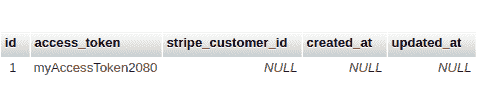

# 接受 React Native 中的付款

> 原文：<https://dev.to/wernancheta/accepting-payments-in-react-native-ln>

创建应用程序或网站的一个重要方面是接受客户付款的能力。web、Android 和 iOS 等平台已经为 Stripe 等支付网关提供了支持良好的 API。但是像 React Native 这样的跨平台框架呢？在本教程中，我们将了解如何在 React 原生应用中接受支付。

## 先决条件

需要 React Native 的基础知识。虽然我们将使用一点 PHP，但它是可选的，因为代码是自解释的。

### 开发环境

你需要在你的机器上安装 PHP 和 MySQL。获得开发环境最简单的方法是通过 [Laravel Homestead](https://laravel.com/docs/5.7/homestead) 。如果你在 Mac 上，你可以用 [Laravel 代客](https://laravel.com/docs/5.7/valet)更快地启动和运行。

您还需要一个 MySQL 数据库管理器来创建数据库:

*   [DBeaver](https://dbeaver.io/)——Windows，Linux，Mac
*   [Sequel Pro](https://www.sequelpro.com/) -仅限 Mac

您还需要一个 [ngrok 帐户](https://ngrok.com/)来将服务器暴露给互联网。

### 开发者账户

我们将使用 [Stripe](https://stripe.com) 来处理支付，因此需要一个 Stripe 帐户。

或者，如果您想在生产中使用 Google Pay 和 Apple Pay，您还需要具备以下条件:

*   [Google Play 开发者控制台账号](https://play.google.com/apps/publish/signup/#)——如果你使用测试环境，你实际上可以在没有开发者账号的情况下使用 Tipsi-Stripe 库。但是如果你想在生产中使用它，你需要有一个 Google Play 开发者控制台账户，这个账户可以[接受付款](https://support.google.com/googleplay/android-developer/answer/7161426?hl=en)。
*   [苹果开发者账户](https://developer.apple.com/programs/enroll/) -如果你想通过 Tipsi-Stripe 使用 Apple Pay，你需要这个。在写这篇教程的时候，只有少数几个国家支持 Apple Pay 的[沙盒测试](https://developer.apple.com/apple-pay/sandbox-testing/)。这意味着如果你不在这些国家生活，你将不得不使用真正的信用卡进行测试。由于本教程不会涉及如何在你的开发者账户上设置 Apple Pay，请务必阅读[Apple Pay](https://developer.apple.com/apple-pay/get-started/)入门指南。

### 包版本

应用程序中使用了以下包版本:

*   反应原生 0.57.8
*   Tipsi-stripe 6.1.2

而在后端使用以下内容:

*   流明框架 5.7
*   条纹 PHP 6.28

为了确保兼容性，请在升级到最新版本之前从上述版本开始。

## App 概述

我们将创建一个简单的应用程序，显示要购买的产品。然后，用户可以用他们添加到谷歌账户的信用卡支付。我们将使用 Google Pay 作为接受付款的方式，并使用 Stripe 进行处理。如果你以前使用过 Stripe for web，这个过程是非常相似的。Tipsi-Stripe 提供了一种使用 Google Pay、Apple Pay 或其自定义 React 组件来接受支付细节的方式。然后，您将使用这些方法中的任何一种来生成令牌，并将令牌提交给应用程序的后端。此令牌允许您对用户添加的卡进行充值。

这是该应用程序的外观:

[](https://res.cloudinary.com/practicaldev/image/fetch/s--USNJ2JOJ--/c_limit%2Cf_auto%2Cfl_progressive%2Cq_auto%2Cw_880/https://d2mxuefqeaa7sj.cloudfront.net/s_3CA98940AF9B4793A825164CAE759A509E56FF1ED72859549595992CDE8126B2_1546998663103_pay-app.jpeg)

你可以在这个 [GitHub repo](https://github.com/anchetaWern/RNPay) 上找到源代码。

## 构建 app

首先创建一个新的 React 本地项目并安装依赖项:

```
react-native init RNPay
cd RNPay
yarn add tipsi-stripe react-native-config axios
react-native link 
```

完成后，在`android/app/src/main/AndroidManifest.xml`文件中添加启用 Google Wallet API 的配置。这允许您在应用程序中使用 Google Pay:

```
<application>
  <meta-data
    android:name="com.google.android.gms.wallet.api.enabled"
    android:value="true" />
</application> 
```

接下来，更新`android/app/build.gradle`文件并添加 React 本地配置的路径:

```
apply from: project(':react-native-config').projectDir.getPath() + "/dotenv.gradle" 
```

对于 iOS，请参考文档:

*   [安装](https://tipsi.github.io/tipsi-stripe/docs/installation.html)
*   [链接](https://tipsi.github.io/tipsi-stripe/docs/linking.html)
*   [在真实设备中运行 Apple Pay](https://tipsi.github.io/tipsi-stripe/docs/running-apple-pay-in-a-real-device.html)

接下来，在项目目录的根目录下创建一个`.env`文件，并添加您的 Stripe 可发布密钥。如果您正在测试，这可以是 Stripe 提供的测试凭证。你可以在这里找到你的 [API 密匙。如果您想要您的测试证书:
，请务必切换**查看测试数据**](https://dashboard.stripe.com/account/apikeys)

```
STRIPE_PUBLISHABLE_KEY=YOUR_STRIPE_PUBLISHABLE_KEY 
```

一旦完成，现在就可以开始编写代码了。首先打开`App.js`文件，添加以下内容:

```
import React, { Component } from 'react';
import { View, Alert } from 'react-native';

import stripe from 'tipsi-stripe';
import Config from 'react-native-config';

import ItemBox from './src/components/ItemBox';
import pay from './src/helpers/pay';

stripe.setOptions({
  publishableKey: Config.STRIPE_PUBLISHABLE_KEY,
  androidPayMode: 'test', // test || production
}); 
```

上面代码中最重要的部分是 Stripe 选项的设置。`publishableKey`基本上和你在网上工作时放在 JavaScript 文件上的键是一样的。`androidPayMode`是 Google Pay 要使用的模式。`test`意味着使用它的要求不会像生产时那么严格。例如，应用程序不需要在谷歌 Play 商店上传。您的 Google Play 控制台开发者帐户也不需要启用 Google Pay。事实上，你甚至不需要一个开发者帐户来试用它。你可以在这里找到更多相关信息[。](https://developers.google.com/android/reference/com/google/android/gms/wallet/WalletConstants.html#ENVIRONMENT_TEST)

接下来，初始化要在整个应用程序中使用的数据。这包括用户的访问令牌，当我们点击终端创建收费时，该令牌用于验证用户的请求。为了简化，我们只需对数据库中已经存在的访问令牌进行硬编码。稍后当我们到达后端时，我将向您展示如何创建数据库:

```
export default class App extends Component {

  constructor(props) {
    super(props);
    this.access_token = "AN EXISTING USER'S ACCESS TOKEN FROM YOUR DB";
    this.currency_code = 'USD'; // the currency to be used for processing the transaction
    // item data
    this.item = {
      title: 'Loop 720',
      price: 1,
      image: require('./simg/loop720.jpg')
    };
  }

  state = {
    isPaying: false, // whether the user is currently paying for something
    canPay: false // whether the user's device has the ability to pay using Google Pay
  }

  // next: add componentDidMount
}

const styles = {
  container: {
    flex: 1,
    justifyContent: 'center',
    alignItems: 'center',
    backgroundColor: '#FFF',
  }
}; 
```

接下来，我们检查用户的设备是否可以使用 Google Pay 进行支付:

```
async componentDidMount() {
  const device_supported = await stripe.deviceSupportsAndroidPay();
  const can_make_android_pay_payments = await stripe.canMakeAndroidPayPayments();

  if (device_supported && can_make_android_pay_payments) {
    this.setState({
      canPay: true
    });
  }
} 
```

对于应用程序的用户界面，我们只需渲染一个项目:

```
render() {
  return (
    <View style={styles.container}>
      <ItemBox
        {...this.item}
        canPay={this.state.canPay}
        isPaying={this.state.isPaying}
        payAction={this.payItem} />
    </View>
  );
} 
```

下面是 ItemBox 组件的代码:

```
// src/components/ItemBox.js
import React, { Component } from 'react';
import { View, Text, Button, ActivityIndicator, Image } from 'react-native';

const ItemBox = ({ title, price, image, canPay, isPaying, payAction }) => {

  return (
    <View>
      <Image
        style={styles.image}
        source={image} />

      <View style={styles.textContainer}>
        <Text style={styles.title}>{title}</Text>
      </View>

      <View style={styles.textContainer}>
        <Text style={styles.price}>${price.toFixed(2)}</Text>
      </View>

      {
        isPaying &&
        <ActivityIndicator size="large" color="#0000ff" />
      }

      <View style={styles.buttonContainer}>
      {
        canPay && !isPaying &&
        <Button
          onPress={payAction}
          title="Buy Now"
          color="#841584"
        />
      }

      {
        !canPay &&
        <View style={styles.alertContainer}>
          <Text style={styles.errorText}>Can't accept payments</Text>
        </View>
      }
      </View>

    </View>
  );

}

export default ItemBox;

const styles = {
  image: {
    width: 170,
    height: 150
  },
  textContainer: {
    alignItems: 'center'
  },
  title: {
    fontSize: 20
  },
  price: {
    fontSize: 23,
    fontWeight: 'bold'
  },
  buttonContainer: {
    margin: 10
  },
  alertContainer: {
    width: 150
  },
  errorText: {
    color: 'red'
  }
}; 
```

回到`App.js`文件，添加支付物品的功能。当点击 ItemBox 组件中的 **Buy Now** 按钮时，就会执行这个命令:

```
// App.js
payItem = async () => {

  this.setState({
    isPaying: true // show loader instead of the button
  });

  const token = await stripe.paymentRequestWithNativePay({
    total_price: this.item.price.toFixed(2),
    currency_code: this.currency_code,
    line_items: [
      {
        currency_code: this.currency_code,
        description: this.item.title,
        total_price: this.item.price.toFixed(2),
        unit_price: this.item.price.toFixed(2),
        quantity: '1',
      }
    ]
  });

  // next: add code for committing the charge into the server
} 
```

如果您想要捕获运输信息，您需要设置`shipping_address_required`选项并将其值设置为`true`。或者，您也可以将`shipping_countries`设置为一组国家代码，以限制您要运送到的国家:

```
shipping_countries: ['US', 'PH', 'SG'] 
```

下面是请求成功时`token`的值:

```
{  
   "card":{  
      "currency":null,
      "fingerprint":"xxxxxxxxxx",
      "funding":"credit",
      "addressZip":null,
      "brand":"MasterCard",
      "cardId":"card_xxxxxxxxxxx",
      "number":null,
      "addressState":null,
      "country":"US",
      "cvc":null,
      "expMonth":7,
      "addressLine1":null,
      "expYear":3040,
      "addressCountry":null,
      "name":"Wern Ancheta",
      "last4":"11xx",
      "addressLine2":null,
      "addressCity":null
   },
   "created":1546997773000,
   "used":false,
   "extra":{  
      "shippingContact":{  
         "postalCode":"2500",
         "name":"Wern Ancheta",
         "locality":"San Juan",
         "countryCode":"PH",
         "administrativeArea":"La Union",
         "address1":"Forest street"
      },
      "billingContact":{  

      }
   },
   "livemode":false,
   "tokenId":"tok_xxxxxxxx"
} 
```

更多示例请参考 Tipsi-Stripe 的 GitHub repo 中的[示例文件夹](https://github.com/tipsi/tipsi-stripe/tree/master/example/src/scenes)。有关如何使用它们的更多信息，请查看以下内容:

*   [paymentRequestWithNativePay(Android)](https://tipsi.github.io/tipsi-stripe/docs/paymentrequestwithandroidpay.html)-使用 Android Pay 接受付款。
*   [paymentRequestWithNativePay(iOS)](https://tipsi.github.io/tipsi-stripe/docs/paymentrequestwithapplepayitemsoptions.html)-使用 Apple Pay 接受付款。
*   [paymentRequestWithCardForm](https://tipsi.github.io/tipsi-stripe/docs/paymentrequestwithcardform.html)-一个现成的接受付款的 React 表单。
*   [PaymentCardTextField](https://tipsi.github.io/tipsi-stripe/docs/paymentcardtextfield.html) -如果你想完全控制卡片字段的样式，使用这个。

请注意，如果您计划使用`paymentRequestWithNativePay`方法，您必须首先[确定应用程序运行的平台](https://facebook.github.io/react-native/docs/platform-specific-code)，因为您需要传递给该方法的选项会因平台而异。这是`paymentRequestWithCardForm`的一个优势，因为它具有平台无关的 API。

接下来，向服务器发送创建费用的请求:

```
const response = await pay(this.item.price, this.item.title, this.access_token, token.tokenId);
if (response) {
  Alert.alert("Done!", "Payment successful");
} else {
  Alert.alert("Error occurred", "Something went wrong while processing payment. Please try again.");
}

this.setState({
  isPaying: false // show the Buy Now button again
}); 
```

接下来，创建一个`src/helpers/pay.js`文件并添加以下内容。这将向服务器发送一个`POST`请求，其中包括支付交易的相关细节:

```
import axios from 'axios';

const endpoint = 'https://YOUR_NGROK_URL/charge';

const pay = async (amount, description, access_token, token_id) => {
  const data = {
    'amount': amount,
    'description': description,
    'access_token': access_token,
    'token_id': token_id // the token generated by Stripe
  };

  const headers = {
    'Content-Type': 'application/json',
  };

  let response = false;
  try {
    let response_data = await axios.post(endpoint, data, { headers });
    return true;
  } catch (e) {
    console.log('server error: ', e);
  }

  return response;
}

export default pay; 
```

在上面的代码中，我们只向服务器发送了四段数据。但是如果你喜欢，你可以发更多。请注意，您实际上可以通过向 Stripe API 发出请求来获取由服务器中的`stripe.paymentRequestWithNativePay`方法调用返回的相同数据。这意味着您实际上不需要在请求中提交送货地址或客户姓名等信息。因此，您在此提交的附加数据很可能是针对您的应用程序的。

## 添加后端代码

本部分假设您已经通过 Laravel Homestead 或 Laravel Valet 设置了您的机器。这将给你一个`composer`命令，下面使用它来生成一个新的 Lumen 项目:

```
composer create-project --prefer-dist laravel/lumen RNPayBackend 
```

如果你不能全局运行`composer`，一定要把它移到你本地的`bin`文件夹或者添加到你的`PATH`。

接下来，在生成的`RNPayBackend`目录中导航并添加数据库配置:

```
DB_CONNECTION=mysql
DB_HOST=127.0.0.1
DB_PORT=3306
DB_DATABASE=rnpay
DB_USERNAME=your_username
DB_PASSWORD=your_password 
```

上面的配置假设您已经使用自己选择的数据库管理器创建了一个数据库。所以一定要创建一个与赋予`DB_DATABASE`的值同名的。

此外，将您的条带密钥添加到`.env`文件:

```
STRIPE_SECRET_KEY=YOUR_STRIPE_SECRET_KEY 
```

接下来，创建一个新的数据库迁移文件。这些文件允许您编写一些代码来更新数据库结构:

```
php artisan make:migration create_users_table 
```

在`database/migrations`目录中导航，您将看到生成的文件。向其中添加以下代码:

```
<?php
use Illuminate\Support\Facades\Schema;
use Illuminate\Database\Schema\Blueprint;
use Illuminate\Database\Migrations\Migration;

class CreateUsersTable extends Migration
{
    public function up()
    {
        Schema::create('users', function (Blueprint $table) {
            $table->increments('id');
            $table->string('access_token'); // the user's access token
            $table->string('stripe_customer_id')->nullable();
            $table->timestamps(); // created_at and updated_at timestamp fields
        });
    }

    public function down()
    {
        Schema::dropIfExists('users');
    }
} 
```

使用新文件迁移数据库。这将创建一个包含您在上面指定的字段的`users`表:

```
php artisan migrate 
```

接下来，使用 MySQL 数据库管理器访问数据库，并在`users`表中添加一个虚拟数据。将`stripe_customer_id`留空，并将`access_token`复制到`App.js`文件中。

[](https://res.cloudinary.com/practicaldev/image/fetch/s--EcMNn7CF--/c_limit%2Cf_auto%2Cfl_progressive%2Cq_auto%2Cw_880/https://d2mxuefqeaa7sj.cloudfront.net/s_3CA98940AF9B4793A825164CAE759A509E56FF1ED72859549595992CDE8126B2_1547003164444_users-table.png)

接下来，安装 Stripe PHP 库:

```
composer require stripe/stripe-php 
```

在这样做的同时，更新`bootstrap/app.php`文件并取消对下面一行的注释。这使我们能够使用立面。简单来说，Facades 易于记忆类名，这允许我们访问底层功能，比如日志记录或从数据库中获取数据:

```
$app->withFacades(); 
```

接下来，将处理支付的路线添加到`routes/web.php`文件中。这是我们之前在应用中触及的终点。这使用一个控制器来处理请求:

```
$router->post('/charge', 'PaymentController@createCharge'); 
```

在`app/Http/Controllers/PaymentController.php`处创建控制器，并添加以下内容:

```
<?php

namespace App\Http\Controllers;
use DB; // for talking to the database
use Illuminate\Support\Facades\Log; // for logging
use Illuminate\Http\Request; // for getting request data

class PaymentController extends Controller
{

  public function __construct() {
    \Stripe\Stripe::setApiKey(getenv('STRIPE_SECRET_KEY'));
  }

  // next: add code for creating a charge
} 
```

在上面的代码中，我们添加了一个`__construct`方法。这将设置我们将要使用的 Stripe API 键。每次调用`PaymentController`中的任何一个方法时都会执行。

接下来，添加创建费用的方法。每当向`/charge`路线发出`POST`请求时，就会执行该操作。在这里，我们将来自应用程序的数据传递给 Stripe 的 API 方法，用于[创建费用](https://stripe.com/docs/api/charges/create)。如果充值成功，我们向 app 返回成功响应:

```
public function createCharge(Request $request) {

  // get the data that was passed from the app  
  $amount = (int) $request->input('amount') * 100; // amount should be in cents
  $description = $request->input('description');
  $access_token = $request->input('access_token');
  $token = $request->input('token_id');

  // get the Stripe customer ID based on the access token
  $user = DB::table('users')
      ->where('access_token', $access_token)
      ->select('id', 'stripe_customer_id')
      ->first();

  // construct the data required by Stripe for creating a charge
  $payment = [
    'amount' => $amount,
    'currency' => 'usd',
    'description' => $description,
    'customer' => $user->stripe_customer_id
  ];

  if (empty($user->stripe_customer_id)) {
    // next: add code for creating a Stripe customer
  }

  try {
    $charge = \Stripe\Charge::create($payment);
    return ['status' => 'ok']; // if the charge was successful
  } catch (\Exception $e) {
    Log::info("Cannot create charge for Stripe customer: " . $user->id);
  }

  return ['status' => 'not_ok']; // if the charge wasn't successful
} 
```

如果没有与该用户相关联的条带客户 ID，则意味着尚未为该用户创建条带客户。因此，要将客户与所提供的支付信息相关联，我们需要向 Stripe API 发出单独的请求，以[创建客户](https://stripe.com/docs/api/customers/create)。这是关联特定客户付款的必要步骤。尽管 Stripe API 允许您在创建费用时通过`$token_id`,但这并不是真正推荐的做法。特别是如果你希望将来收到同一个人的付款:

```
try {
  $customer = \Stripe\Customer::create([
    "source" => $token // the payment token received from the app
  ]);

  // update the user to include the Stripe customer ID
  DB::table('users')
    ->where('access_token', $access_token)
    ->update([
      'stripe_customer_id' => $customer->id
    ]);

  $payment['customer'] = $customer->id; // assign the ID of the newly created customer to the payment
} catch (\Exception $e) {
  Log::info("Cannot create Stripe customer for user: " . $user->id);
} 
```

最后，使用 ngrok 将服务器暴露给互联网。如果你使用 Laravel 代客，首先你必须改变默认的顶级域名，使之与我们正在使用的相同:

```
valet domain test 
```

接下来，导航到`RNPayBackend`的根目录并执行`valet park`。这将在您的本地主机上注册`rnpaybackend.test`，然后您可以使用 ngrok:
公开它

```
ngrok http -host-header=rewrite rnpaybackend.test:80 
```

如果您使用了 Laravel Homestead，您可以通过`vagrant ssh`登录到您的 Homestead 机器并运行`share rnpay.test`。这将使用 ngrok 来公开服务器。

一旦完成，你可以用 ngrok 的 HTTPS 网址更新应用程序中的`src/helpers/pay.js`文件。

此时，应用程序应该功能齐全。继续运行它:

```
react-native run-android 
```

## 结论

就是这样！在本教程中，您学习了如何使用 Tipsi-Stripe 库和 Lumen PHP 框架在 React 本机应用程序中接受支付。

你可以在这个 [GitHub repo](https://github.com/anchetaWern/RNPay) 上找到完整的源代码。

*原载于[推手教程枢纽](https://pusher.com/tutorials/react-native-payments)T3】*