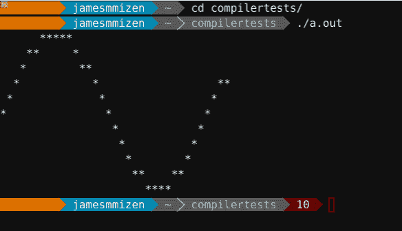
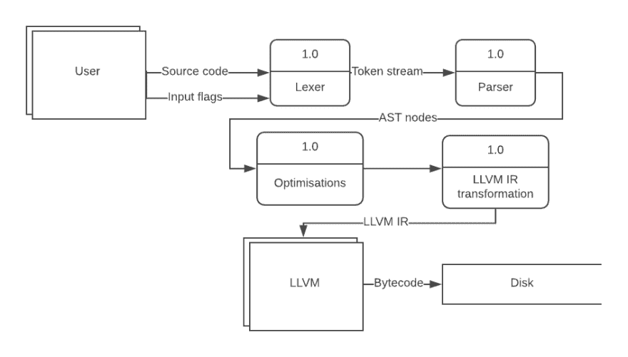

# 编译器系列第 4 部分:设计简单语言和编译器

> 原文：<https://dev.to/miiizen/compiler-series-part-4-designing-the-simple-language-and-compiler-82b>

出于不言而喻的原因，我选择称我为编译器设计的语言为 SIMPLE。这种语言是图灵完整的，因为它的特点是条件语句和变量。由于这个编译器是 MVP，所以只有一种数据类型:doubles。

## 程序结构

该程序应包含在`BEGIN..END`中。顶层应该包含以主函数作为入口点的函数定义。

```
BEGIN
   DEFINE average(x, y)
       (x + y) * 0.5
   ENDDEF

   DEFINE main()
       average(5, 8)
   ENDDEF
END 
```

## 功能

函数包含可重用的代码块。它们可以接受参数(必须是 double)并返回一个值(也是 double)

```
DEFINE average(x, y)
       (x + y) * 0.5
ENDDEF 
```

没有' return '关键字，最后一个表达式的求值是函数的返回值。

函数可以定义为外部函数。这意味着一个定义存在于别处，以后会被链接。

```
DEFINE EXT printd(x)
DEFINE EXT sin(x) 
```

这允许语言使用来自 c 标准库的函数和任何用户定义的函数，这些函数也可以被链接。

## If/else 语句

If 语句根据条件语句的结果决定执行哪个代码块。

```
IF 5 < 6 THEN
   ...
ELSE
   ...
ENDIF

IF 4==2 THEN
   ...
ENDIF 
```

## 为循环

For 循环采用标识符(循环变量)、结束条件和可选步长值的形式。

```
FOR i = 1, i < n, 1 IN
   ...
ENDFOR 
```

## 把所有的东西放在一起

一旦完成，编译器将能够发出这个程序的可执行文件。

```
BEGIN
 DEFINE EXT sin(x)
 DEFINE EXT putchard(x)

 DEFINE main()
   num = 7
   FOR y = 1, y >= -1, -0.2 IN
     FOR x = 0, x <= num, 0.2 IN
       s = sin(x)
       IF (0.1+y) >= s THEN
         IF (y-0.1) <= s THEN
           putchard(42) # “*“
         ELSE
           putchard(32) # “ ”
         ENDIF
       ELSE
         putchard(32) # “ “
       ENDIF
     ENDFOR
     putchard(10) # “\n”
   ENDFOR
 ENDDEF
END 
```

程序的输出是终端中一个正弦波的近似草图！
[T3】](https://res.cloudinary.com/practicaldev/image/fetch/s--x2dmbdlM--/c_limit%2Cf_auto%2Cfl_progressive%2Cq_auto%2Cw_880/https://thepracticaldev.s3.amazonaws.com/i/ha8pmzxsadze5gd8rm4k.png)

## 编译过程

编译器适合于模块化方法。人们可以将这一点发挥到极致，例如参见关于编译器设计的“纳米通道”方法的论文 <sup id="fnref1">[1](#fn1)</sup> 。

下面是一个 1 级 DFD，概述了我的编译器中发生的过程。这是一个线性过程，
[](https://res.cloudinary.com/practicaldev/image/fetch/s--9oAnDWKy--/c_limit%2Cf_auto%2Cfl_progressive%2Cq_auto%2Cw_880/https://thepracticaldev.s3.amazonaws.com/i/tbobjdl8dly5qpsc2jwz.png) 
当一种语言特性被添加到编译器中时，扩展每一部分来支持它是非常简单的。

在下一节中，我们将开始编写 lexer。

* * *

1.  用于编译器教育的 Nanopass 框架 [↩](#fnref1)