# 火狐开发者工具能做到吗？

> 原文：<https://dev.to/yashints/firefox-developer-tools-can-do-that-3ajd>

我已经很久没有发布这样的帖子了。此外， [Firefox 开发者工具](https://developer.mozilla.org/en-US/docs/Tools)每天都在变得越来越好，所以我想是时候为它写一个了，因为它值得拥有。

你准备好了吗？😎

## 如何打开它

选择*工具*>*Web Developer*>*Toggle Tools*或者使用键盘快捷键`Ctrl` + `Shift` + `I`或者`F12`在 Windows 和 Linux 上或者`Cmd` + `Opt` + `I`在 macOS 上可以从菜单中打开 *Firefox 开发者工具*。

[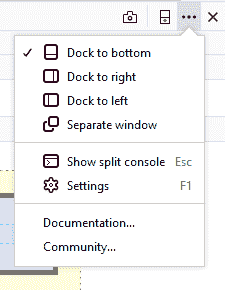](https://res.cloudinary.com/practicaldev/image/fetch/s--cKO6Zs1v--/c_limit%2Cf_auto%2Cfl_progressive%2Cq_auto%2Cw_880/https://thepracticaldev.s3.amazonaws.com/i/nluji0v1aweg8kc0vq9o.png)

## 页面检查器

页面检查器有许多有用的功能(相当于 Chrome DevTools inspect 元素)，但有几个是我用得最多的:

### 搜索 CSS 类

您可以使用 inspector 选项卡正下方的搜索框来搜索元素、类和其他选择器。但是我主要使用它来搜索具有特定类的元素。如果你有多个元素看起来很相似，但是有特定的类，或者如果你看不到它，因为它是隐藏的，这是非常有用的。

[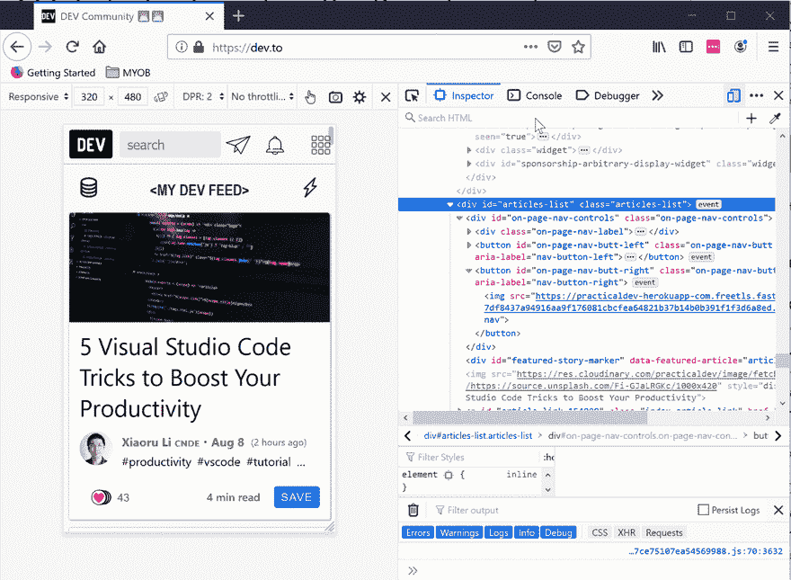](https://res.cloudinary.com/practicaldev/image/fetch/s--uZDyLt9B--/c_limit%2Cf_auto%2Cfl_progressive%2Cq_66%2Cw_880/https://yashints.dev/css-class-search-d2ca246d084569878116ee6798164627.gif)

### 滤镜样式

在下面的部分，有一个过滤样式的框，可以用来轻松地找到您可能正在寻找的特定样式。好的一面是，它突出显示了选择器并扩展了属性，这让您可以轻松地找到您正在寻找的内容。

[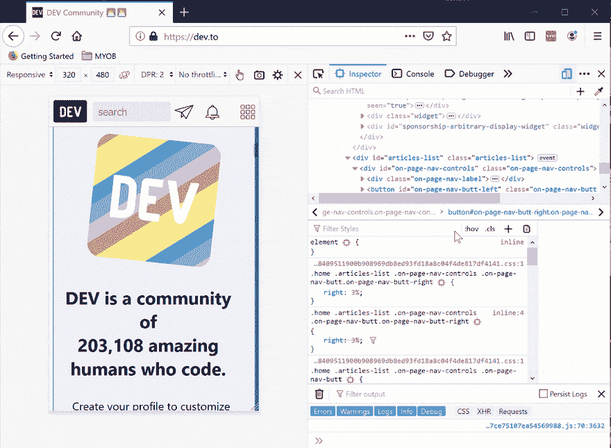](https://res.cloudinary.com/practicaldev/image/fetch/s--rv2PrVkt--/c_limit%2Cf_auto%2Cfl_progressive%2Cq_66%2Cw_880/https://thepracticaldev.s3.amazonaws.com/i/n6wtwrmvm55qhpnicsp6.gif)

### 查看不同格式的颜色代码

我最喜欢的是这块小金块。用这个你可以很容易地`Shift` + `click`，看到所有不同类型的颜色表现，包括`name`、`hex`、`rgb`和`hsl`。当然，不是所有的颜色都有名字，在某些情况下，你只能看到其他的颜色。

[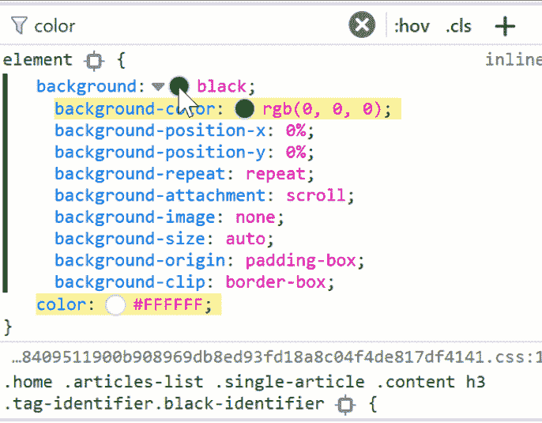](https://res.cloudinary.com/practicaldev/image/fetch/s--575n6bA_--/c_limit%2Cf_auto%2Cfl_progressive%2Cq_66%2Cw_880/https://thepracticaldev.s3.amazonaws.com/i/dd8umo31a5owj4gaadjr.gif)

很酷吧？

## Web 控制台

谁不喜欢浏览器开发工具中的控制台呢？它用于记录、计算、评估等等。

### 造型控制台消息

通过对控制台中的消息应用 CSS 样式，您可以对它们进行丰富多彩的处理。例如，当您有大量日志并且想要通过不同的样式突出显示特定的部分时，这就变得很重要。

[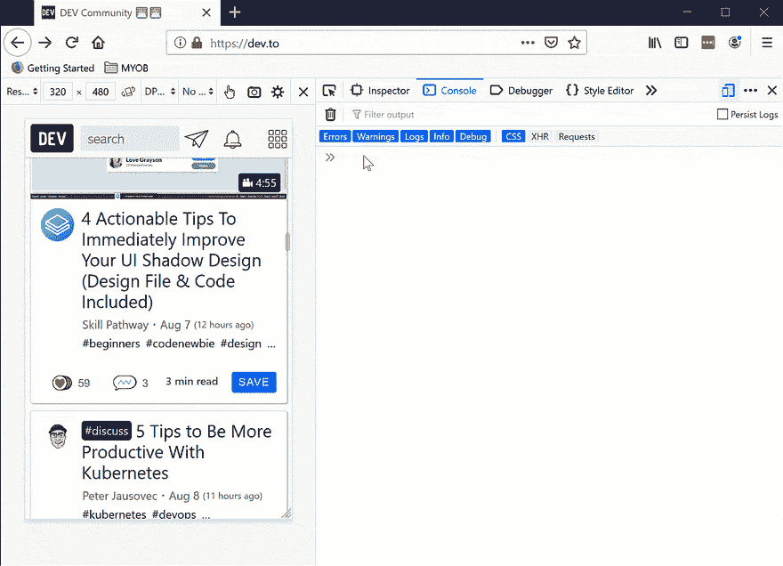](https://res.cloudinary.com/practicaldev/image/fetch/s--swWX60mc--/c_limit%2Cf_auto%2Cfl_progressive%2Cq_66%2Cw_880/https://thepracticaldev.s3.amazonaws.com/i/3c6w882vbdy1pdjwsi4i.gif)

请注意，您已经有了`console.info`、`console.warn`和`console.error`供您使用。所以这将是一个高于你所能得到的水平。

[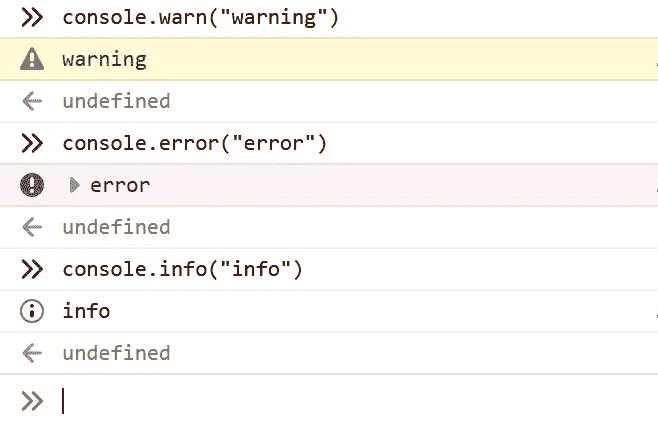](https://res.cloudinary.com/practicaldev/image/fetch/s--O9X3nokL--/c_limit%2Cf_auto%2Cfl_progressive%2Cq_auto%2Cw_880/https://thepracticaldev.s3.amazonaws.com/i/ay6mfr5k70bm9y7q9foj.JPG)

### 在命令历史中搜索

如果您已经键入了许多命令，并且想要在这些命令之间进行搜索，那么这个选项会很有帮助。只需键入您要查找的全部或部分命令，它就会显示所有与该短语匹配的内容。

按 windows 上的`F9`或`CTRL` + `R`打开搜索框。然后输入你的术语，如果右手边的计数显示你有结果，你可以通过按 windows 上的`F9`和`SHIFT` + `F9`在这些结果之间移动。对于 Mac 用户，在使用`CTRL` + `R`和`CTRL` + `S`的用户之间导航。

[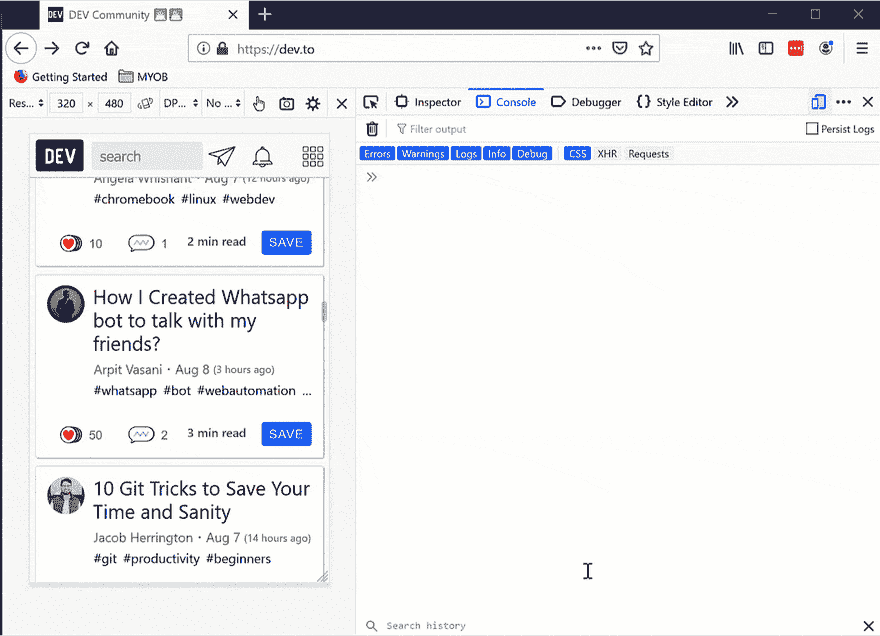](https://res.cloudinary.com/practicaldev/image/fetch/s--_X69NnYr--/c_limit%2Cf_auto%2Cfl_progressive%2Cq_66%2Cw_880/https://thepracticaldev.s3.amazonaws.com/i/9edu5bqbsjmdf8yni08j.gif)

PS:我只是用箭头键，因为在我的录音软件上,`F9`被映射为暂停和播放，我只是懒得去改变它😁。

### 全页面截图

要获得整个页面、视图端口或某个元素的屏幕截图，您只需键入`:screenshot`并传递您喜欢的参数。组合有:

```
:screenshot                           //the visible part of the page
:screenshot --fullpage                // whole page even invisible parts
:screenshot --selector .css-selector  // only one element (including its children) 
```

<svg width="20px" height="20px" viewBox="0 0 24 24" class="highlight-action crayons-icon highlight-action--fullscreen-on"><title>Enter fullscreen mode</title></svg> <svg width="20px" height="20px" viewBox="0 0 24 24" class="highlight-action crayons-icon highlight-action--fullscreen-off"><title>Exit fullscreen mode</title></svg>

[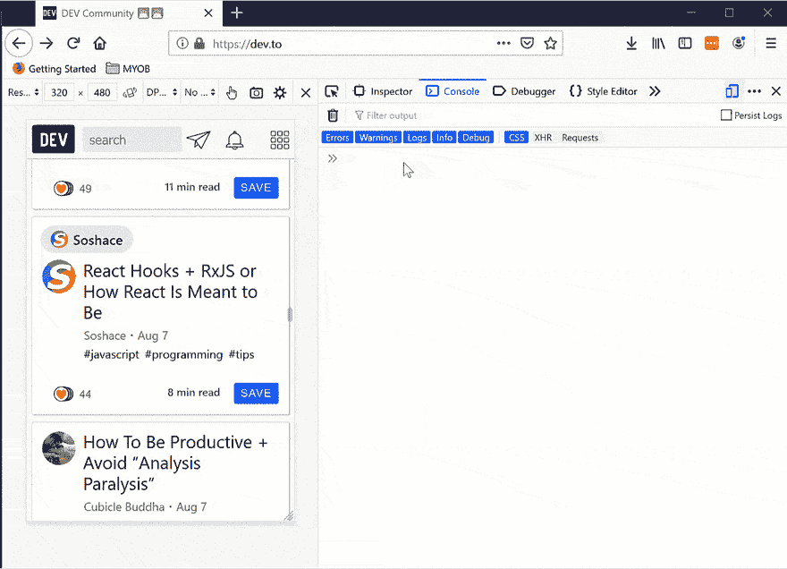](https://res.cloudinary.com/practicaldev/image/fetch/s--6JUKF_F1--/c_limit%2Cf_auto%2Cfl_progressive%2Cq_66%2Cw_880/https://thepracticaldev.s3.amazonaws.com/i/7wr3oy5czniag5k18blm.gif)

在文档中找到更多关于可以传递给它的其他参数[。](https://developer.mozilla.org/en-US/docs/Tools/Taking_screenshots#Taking_screenshots_with_the_web_console)

当然，您也可以使用上图中控制台左侧的照片图标来截图。

## JavaScript 调试器

除了上面的两个部分之外，像任何其他开发人员工具一样，是调试器部分，在这里您可以查看源代码，以了解为什么事情会以不应该的方式发生，或者只是简单地测试一些东西。

### 漂亮的打印缩小码

要美化缩小的文件，请在源代码窗格中单击此图标:`{}`。调试器将格式化源文件，并将其显示为一个新文件，文件名类似于:“{ }[原始名称]”。

[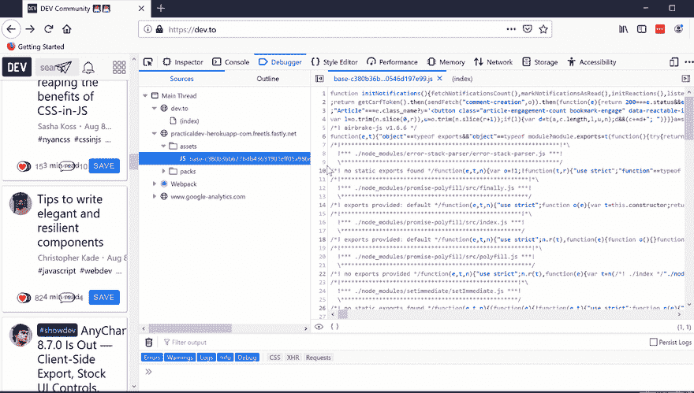](https://res.cloudinary.com/practicaldev/image/fetch/s--c6jRgFV0--/c_limit%2Cf_auto%2Cfl_progressive%2Cq_66%2Cw_880/https://yashints.dev/pretty-print-42f578c2b84f1f93246817648f1228da.gif)

### 搜索文件/功能

要搜索特定文件，只需按下`CTRL` + `P`(或在 Mac 上按下`CMD` + `P`)。显示面板会在您键入时显示与搜索词匹配的文件列表，您可以选择这些文件。只需按下`Enter`即可打开文件。

[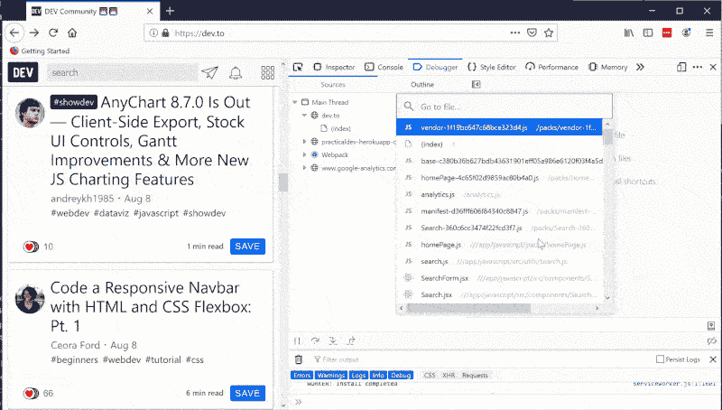](https://res.cloudinary.com/practicaldev/image/fetch/s--tALiD5CF--/c_limit%2Cf_auto%2Cfl_progressive%2Cq_66%2Cw_880/https://thepracticaldev.s3.amazonaws.com/i/frikdfc9xehn82nbt0sw.gif)

### XHR (XMLHttpRequest)断点

有时候你需要弄清楚当你访问一个特定的 URL 或者向它发送一个请求时会发生什么。一旦设置并点击了 URL，执行将会停止，因此您可以看到应用程序在该点的状态。

只需点击 XHR 断点部分的`+`,或者如果你想为所有网址启用它，只需勾选“暂停任何网址”复选框。

[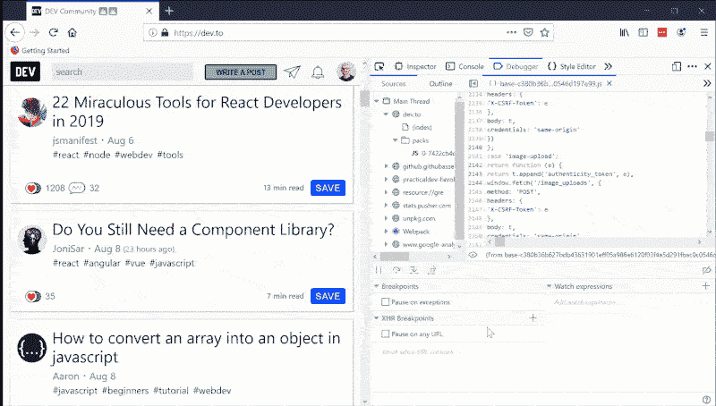](https://res.cloudinary.com/practicaldev/image/fetch/s--GjfUPj5b--/c_limit%2Cf_auto%2Cfl_progressive%2Cq_66%2Cw_880/https://thepracticaldev.s3.amazonaws.com/i/coimyrjp20bzuzy1y31d.gif)

## 性能工具

性能工具是我通常花费大部分时间的地方。正如你可能知道的，我一直在积极地研究 web 性能，也有一系列关于它的一些重要方面的文章。

然而，为了保持这篇文章的简短(原谅双关语😁)，我就只点两个我经常用的。你可以在[官方文件](https://developer.mozilla.org/en-US/docs/Tools/Performance)中找到更多关于其他的信息。

### 瀑布标签

在看到这些选项卡之前，您应该通过按⏱图标。一旦完成，您将默认看到瀑布选项卡。沿着`X`轴是时间。

[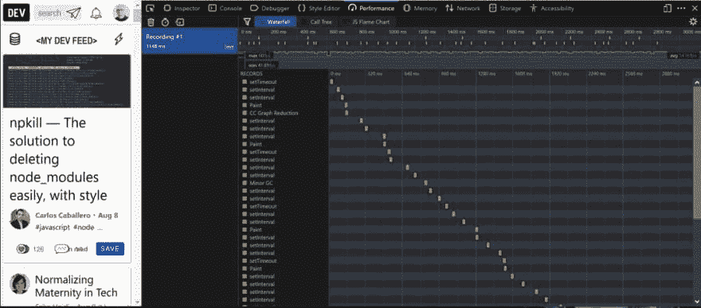](https://res.cloudinary.com/practicaldev/image/fetch/s--8zs9POmB--/c_limit%2Cf_auto%2Cfl_progressive%2Cq_auto%2Cw_880/https://yashints.dev/static/3b8a6a63aa08aadf6d97da5d75f3261e/b4133/waterfall.jpg)

正如你所看到的，浏览器所做的所有事情，比如运行 JavaScript、更新布局、垃圾收集等等都显示在视图中。在这个视图中，您可以发现您的应用程序在加载时的执行情况，以及哪些类型的事情需要花费最多的时间来轻松完成。

好的一面是每个类别都有不同的颜色，所以你可以很容易地在每个类别中找到它们。

有关每种颜色所代表的含义的完整参考，请参考文档中的[标记表。](https://developer.mozilla.org/en-US/docs/Tools/Performance/Waterfall#Markers)

### 呼叫树

在这个视图中，您可以看到从上到下被调用的所有函数的调用树。这个视图的主要目的是向您显示哪个函数执行了最多的时间。通过分析这些调用，您可以找到代码中的瓶颈。

[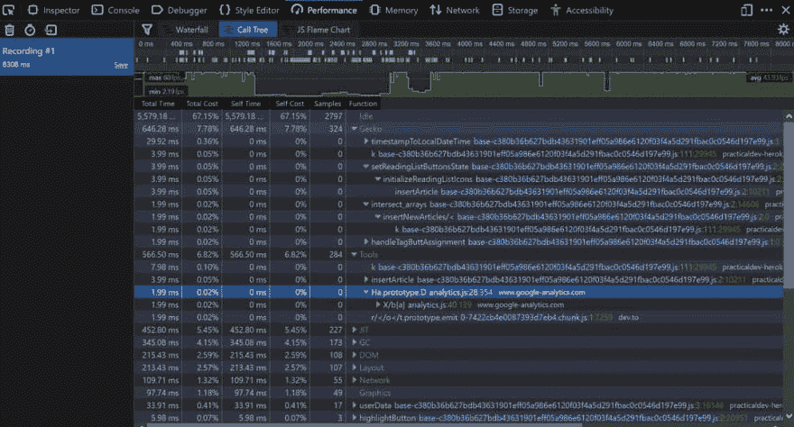](https://res.cloudinary.com/practicaldev/image/fetch/s--xivlhZoU--/c_limit%2Cf_auto%2Cfl_progressive%2Cq_auto%2Cw_880/https://yashints.dev/static/020af17329c63d208ed09d98ddd7bea8/b4133/calltree.jpg)

您可以在结果表中看到，每一行都代表一个函数，顺序是从高到低，取决于函数执行时采集的样本数。来自 docos:

> *总时间*是根据所选录像部分的总时间转换成毫秒的数字。这些数字应该与样本数大致相同。
> 
> *总成本*是该数字占所选记录部分中样本总数的百分比。
> 
> *自身时间*计算为该特定函数花费的时间，不包括其子函数。这来自捕获的堆栈，其中该函数是最叶子的函数。

## 杂项

还有很多其他的东西超出了一篇文章的范围。但是我想指出一些你可以用 Firefox 开发工具做的其他有用的事情。

### 辅助功能检查器

**可访问性检查器**允许您通过可访问性树访问当前页面上暴露于辅助技术的重要信息，这让您可以检查缺少什么或需要改进什么。

[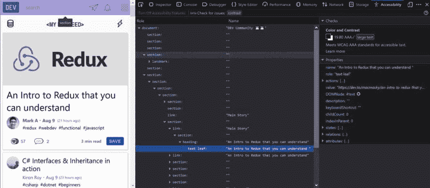](https://res.cloudinary.com/practicaldev/image/fetch/s--rkIo62Vd--/c_limit%2Cf_auto%2Cfl_progressive%2Cq_auto%2Cw_880/https://yashints.dev/static/853d434b15fecc13a6b2bbb64bfee1b4/b4133/accessibility.jpg)

在左侧，有一个节点树，代表当前页面的可访问性树中的所有项目。每个项目都列出了两个属性:

*   *角色* —此项在页面上的角色(例如，按钮、页脚、文本叶)。这可以是浏览器提供的默认角色，也可以是通过`WAI-ARIA`角色属性赋予它的角色。
*   *名称* —此项在页面上的名称。该名称取决于元素；例如，大多数文本元素的名称只是它们的 textContent，而表单元素的名称是它们关联的`<label>`的内容。

这里很酷的一点是你可以把整棵树打印到`JSON`。这将帮助您解析该结构，查找任何特定的不符合项。例如，[有人制作了一个 ML 模型](https://medium.com/myplanet-musings/making-the-web-more-accessible-using-machine-learning-8a32eaafdb3a)来验证可访问性，这个 JSON 非常适合为这些模型准备数据。

### 滴管

如果你想在当前页面中选择任何特定的颜色，这个工具是你的好朋友。它像放大镜一样工作，这一事实对于在页面的小区域选择颜色非常有帮助。

[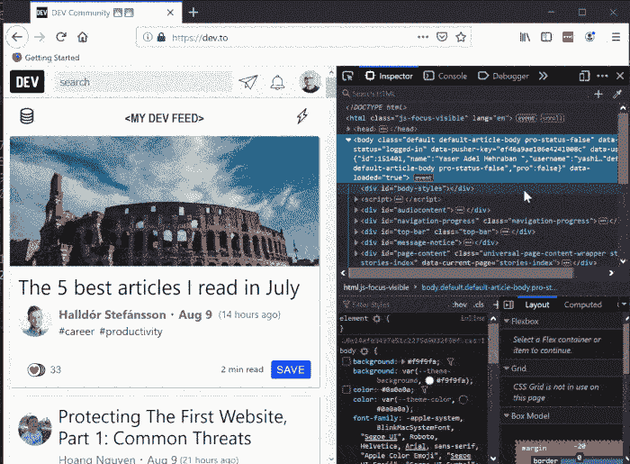](https://res.cloudinary.com/practicaldev/image/fetch/s--xAhCeiX8--/c_limit%2Cf_auto%2Cfl_progressive%2Cq_66%2Cw_880/https://thepracticaldev.s3.amazonaws.com/i/9ajrx4ktos5rytnoh812.gif)

## 总结

Firefox 已经走过了一段漫长的路，团队正在努力为每个次要和主要版本添加新的功能和改进。另外，我们应该总是用多种浏览器测试我们的应用程序，并确保用户在每一种主流浏览器上都有相同的体验。

祝您探索这些技巧和调试愉快。

## 更新

Cécile Lebleu 在评论中提到我已经忘记了 CSS 网格检查器，这是真的。所以让我告诉你吧。

### 网格检查器

[Grid inspector](https://developer.mozilla.org/en-US/docs/Tools/Page_Inspector/How_to/Examine_grid_layouts) 是 Firefox developer tools 中的独特工具之一，它允许您检查 [CSS 网格布局](https://developer.mozilla.org/en-US/docs/Web/CSS/CSS_Grid_Layout)，发现页面上出现的网格，检查并修改它们，调试布局问题，等等。

在 HTML 窗格中，使用网格布局的元素旁边有一个“网格”标记:

[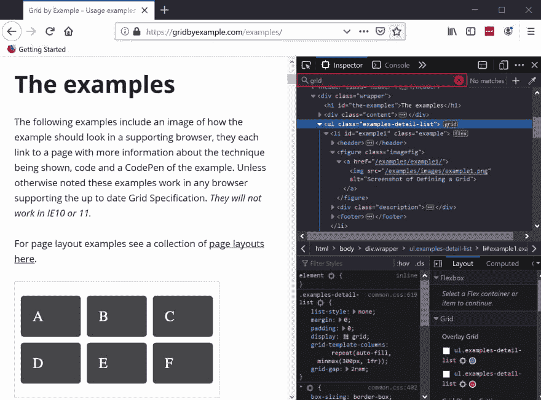](https://res.cloudinary.com/practicaldev/image/fetch/s--foSpBPFZ--/c_limit%2Cf_auto%2Cfl_progressive%2Cq_auto%2Cw_880/https://thepracticaldev.s3.amazonaws.com/i/nn91t5jmp8lval3nhua8.JPG)

除此之外，在 CSS 窗格的规则视图中，任何一个`display: grid`声明的实例都会包含一个网格图标👇🏽：

[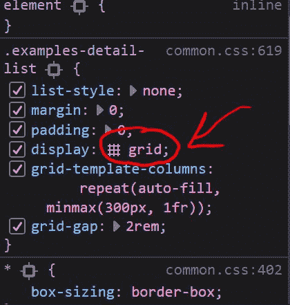](https://res.cloudinary.com/practicaldev/image/fetch/s--NzTgyF99--/c_limit%2Cf_auto%2Cfl_progressive%2Cq_auto%2Cw_880/https://thepracticaldev.s3.amazonaws.com/i/nv5i3v78ekhnsh1ajb21.jpg)

您可以单击图标，页面中的布局将会切换，您可以看到用线条分隔每个单元格的网格:

[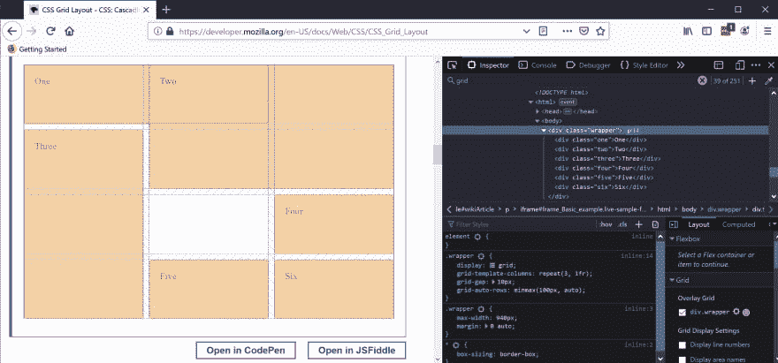](https://res.cloudinary.com/practicaldev/image/fetch/s--_p8Hlt1z--/c_limit%2Cf_auto%2Cfl_progressive%2Cq_auto%2Cw_880/https://thepracticaldev.s3.amazonaws.com/i/qx048bys06ioubdvmw9t.jpg)

默认情况下，行号和区域名称是隐藏的。但是您可以选中右边的两个复选框来启用它们。

[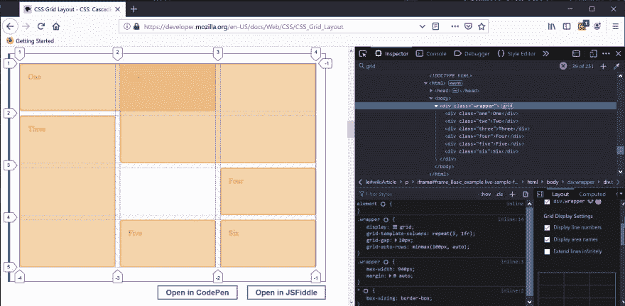](https://res.cloudinary.com/practicaldev/image/fetch/s--3DWGvYAg--/c_limit%2Cf_auto%2Cfl_progressive%2Cq_auto%2Cw_880/https://thepracticaldev.s3.amazonaws.com/i/49sjf4go9xto3kzsb7tm.jpg)