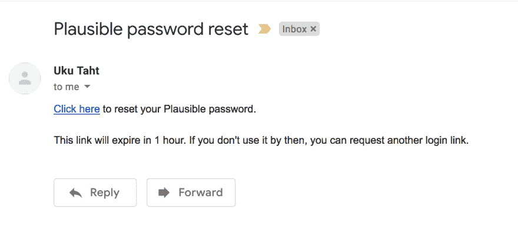

# 普通邮件是双赢的

> 原文：<https://dev.to/ukutaht/plain-emails-are-a-win-win-3bj6>

如果你曾经不得不用巧妙的设计来开发事务性 HTML 电子邮件，你会知道这完全是一团糟。电子邮件客户端之间的不兼容性比你在不同浏览器上看到的要糟糕得多。测试电子邮件是非常困难的，而且各种各样的客户似乎有无穷无尽的问题。

幸运的是，这个问题有一个非常简单的解决方案:只发送简单的事务性电子邮件，尽量少设计或不设计。电子邮件客户端从来不是为复杂的布局和图形设计的。不要滥用这种格式去做一些它不想做的事情，让我们尊重它，并利用它来为我们服务。

在我们继续之前，当然有些情况下为了更好的可读性而设计复杂的 HTML 邮件是有意义的。例如，我计划将来给[貌似合理的](https://plausible.io)添加一个常规的电子邮件报告。这样的报告需要以可扫描的格式容纳大量数据，所以我可能会倾向于设计一个电子邮件模板。

然而，大多数事务性邮件不需要设计。以下是您在貌似合理的网站上重置密码时收到的电子邮件:

没有大惊小怪，开门见山，没有任何分散注意力的成分。很难看出给邮件添加颜色、标志和按钮会有什么改善。

### 不仅仅是节省时间

避免 HTML 模板的复杂性可以节省大量的设计和开发时间。一个更大的优势是普通邮件也有更好的送达率和回复率。

HMTL 元素和图像对可送达性有负面影响，因为它们会触发垃圾邮件过滤器。过度设计的电子邮件肯定会让读者感觉很垃圾，不仅仅是人工智能。我猜这是因为我们每天都会收到大量不请自来的营销邮件。它们几乎完全是复杂的 HTML 模板，带有大量的图片。

普通邮件会得到更多的回复，因为它们比 HTML 邮件更具个性化。人们将设计的电子邮件与营销和单向大众传播联系起来。另一方面，普通邮件看起来像你从同事或朋友那里收到的邮件。点击“回复”会感觉更自然。

这就是为什么普通邮件是双赢的:它们不仅简化了开发过程，还能接触到更多的人。我的观点是，只有当复杂的 HTML 模板完全有必要增强用户体验时，我们才应该使用它们。我们应该接受使用它们会牺牲可送达性、打开率和开发时间。使用电子邮件设计的好处肯定是巨大的，超过了使用它们的负面后果。