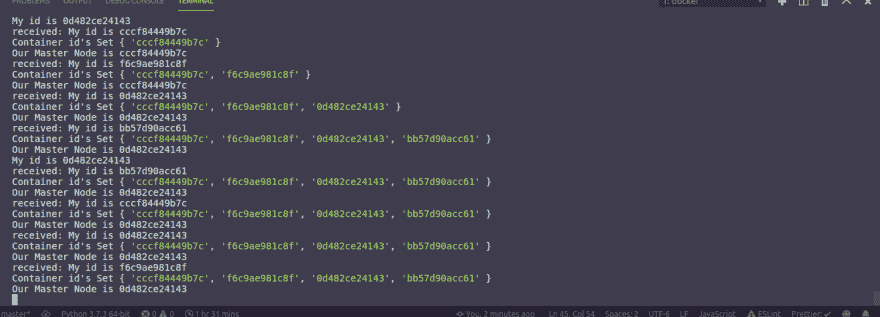
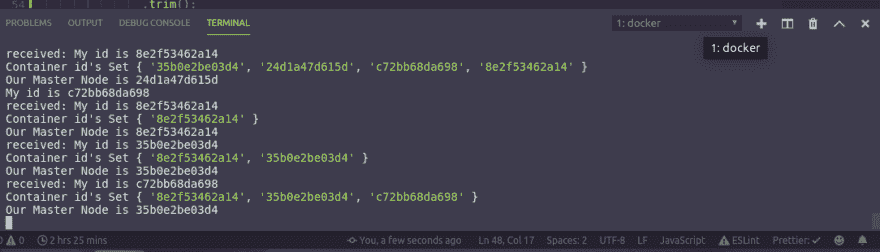

# 使用选举算法理解主从关系

> 原文：<https://dev.to/obbap/understand-master-slave-relationships-using-the-election-algorithm-8en>

# 简介

在构建分布式系统时，透明性是一个非常重要的因素。工程师必须考虑访问透明性、并发透明性、位置透明性、复制透明性等。复制透明性回答了这样一个问题，“我的数据资源会一直保持一致吗？”。

# 什么是复制透明？

使用分布式系统，我们可以访问我们资源的不同副本，这有助于冗余、备份、速度等。拥有特定资源的副本，也会引发一致性问题。我们如何确保特定资源的所有副本始终一致？两阶段提交有助于确保，如果出于任何原因，某个特定实例的所有副本没有得到更新(可能是由于超时或传播错误)，实例将回滚到它们以前的状态。这意味着更新丢失，必须重新进行。

三种模型帮助我们处理副本:

1.  主备份/主备份模式
2.  对等模型
3.  主从模型

***主备份模型*** 只向所有外部进程公开一个实例。此实例是主实例，它具有读写权限。所有其他实例或副本都只有读取权限。因此，使用这个模型，我们可以确保只有一个实例可以被更新，然后更改被传播。这种模型的缺点是不可伸缩，因为只有一个实例公开，如果该实例在传播发生之前崩溃，我们仍然会遇到不一致。

***对等*** 模型给予所有实例读写权限。通过这个模型，我们将观察到性能问题，尤其是当我们需要传播非常大的数据块时。保持全球一致性也很困难。它最适合要求低数据复制的应用程序。例如特定于用户的应用程序。

***主从*** 模型有一个实例作为主模型，具有读写权限。其他实例(从节点)具有读取权限，但它们是“热备盘”,因为一旦它们发现主节点出现故障，从节点就会变成主节点。它最适合用于读操作高于写操作的系统。数据库。这是因为要在数据库上写入或更新一个项，它首先读取(读取-修改-写入)。

# 哪个从机被选为主机？

这就是选举算法的用武之地。它用于在主节点出现故障后选举一个从节点(作为主节点)。我们有

1.  恶霸选举算法
2.  环形选举算法
3.  领导者预选算法

***霸选*** 算法将 ID 最高的节点作为下一个主节点。一旦节点意识到主节点出现故障，选举过程就开始了。如果最后加入会话的节点是具有最高 ID 的节点，那么与具有最高 ID 的节点首先加入相比，选举过程将花费一些时间。

***环选举*** 算法实现了恶霸选举算法，但是节点被安排在逻辑环中。这意味着每个节点向其相邻节点发送消息，而不是向每个节点发送。

***首领预选*** 算法在主节点仍在运行时选择“备份”主节点。它仍然实现选举算法，但它发生在主节点仍在运行的时候。这消除了其他方法产生的开销，但也是一种资源浪费，因为备份节点可能在主节点之前失败，然后选举将继续进行。

# 模拟选举算法

我们将模拟恶霸选举算法，使用四个 docker 容器来代表我们的节点。(1 个主机和 3 个从机)运行 NodeJS 和一个消息代理(Rabbitmq)。我最初尝试使用实际的虚拟机，Welp。祝你好运。

为了实现这一模拟，我们必须:

1.  创建一个 Docker 网络，它将托管所有的容器和 rabbitmq 服务器。
2.  启动 rabbitmq 服务器，并将端口绑定到运行在本地主机上的 rabbitmq。
3.  从我们的 docker 文件中旋转出四个 docker 容器。
4.  使用发布/订阅模式和扇出方法，以便每个节点发送和接收来自每个节点的消息。

# 创建码头工人网络

```
# The name of this network is election-algorithm_default
$ docker network create election-algorithm_default

# confirm it exists and copy the network id
$ docker network ls 
```

# [T1】rabbit MQ 服务器](#the-rabbitmq-server)

服务器将使用管理 alpine 映像，因此将使用端口 5672 和 15672。如果有任何进程正在这些端口上运行，您将需要终止它们。

```
# Run the rabbitmq image in detached mode
$ docker run -it -d --name rabbitmq -p 5672:5672 -p 15672:15672 rabbitmq:3.6-management-alpine

# Confirm its running and copy the container id
$ docker container ls 
```

现在，我们可以将 rabbitmq 服务器添加到我们的网络中，这样它就可以与其他节点进行通信。

```
# connect the rabbitmq server to the network
$ docker network connect <NETWORK_ID> <CONTAINER_ID_OF_THE_RABBITMQ_SERVER>
# Confirm its running
$ docker inspect election-alogithm_default
# You should see a "containers" key with the rabbitmq server. 
```

# 创建 Dockerfile

在我们现在的目录中，我们需要一个 server.js 文件和一些依赖项。

```
$ npm init && npm i --save amqlib node-cron && touch server.js Dockerfile 
```

然后我们的 Dockerfile

```
FROM alpine:latest

WORKDIR /usr/src/app
# Install Node js and npm
RUN apk add --update nodejs npm

RUN npm install

COPY . .

CMD ["node","server.js"] 
```

现在，我们需要获取 Rabbitmq 服务器的 IP 地址，因为这是我们要连接容器的地方。这将使所有容器能够看到来自相邻容器或节点的所有消息。

```
$ docker inspect -f '{{range .NetworkSettings.Networks}}{{.IPAddress}}{{end}}' <CONTAINER_ID>
#OR
$ docker inspect <CONTAINER_ID> | grep "IPAddress" 
```

我们应该能够从这些结果中看到我们的 IP 地址。

# Server.js

在这个文件中，每个节点都向 rabbitmq 服务器发送一个心跳，这是一个每 10 秒运行一次的 cron 作业。每个节点都可以看到所有的响应，然后根据容器 id 对信息进行排序。ID 最高的容器自动成为主节点，如果该节点出现故障，下一个节点将接管！我们将把消息存储在一个集合中，这样就只有唯一的 ID。

server.js 文件应该是这样的

```
// Require libraries
const amqp = require("amqplib/callback_api");
const cron = require("node-cron");
const os = require("os");

//Connect to the IP address of the Rabbitmq container
const url = `amqp://guest:guest@${IP_ADDRESS_OF_THE_RABBITMQ_SERVER}`;

//The transmitter
const sendContainerIdToOthers = () => {
  /**
   * method for sending containerId to other nodes
   * @param {null}
   * @returns {null}
   *
   */
  // This returns the container id
  console.log(`My id is ${os.hostname()}`);

  //Connect to the server
  amqp.connect(url, (error0, connection) => {
    if (error0) throw error0;
    //Create channel
    connection.createChannel((error1, channel) => {
      if (error1) throw error1;
      //Create exchange
      const exchange = "logs";
      //Send Message indicating your ID
      const msg = `My id is ${os.hostname()}`;
      //Use the fanout mechanism
      channel.assertExchange(exchange, "fanout", { durable: false });
      //Publish this message
      channel.publish(exchange, "", Buffer.from(msg));
    });
  });
};

//The receiver
amqp.connect(url, (error0, connection) => {
  if (error0) throw error0;
  connection.createChannel((error1, channel) => {
    if (error1) throw error1;
    const exchange = "logs";
    channel.assertExchange(exchange, "fanout", { durable: false });

    channel.assertQueue("", { exclusive: true }, (error2, q) => {
      if (error2) throw error2;
      console.log(`Waiting for messages in ${q.queue}`);
      channel.bindQueue(q.queue, exchange, "");
      //Since we want the IDs to be unique, we'll use a set
      let resultSet = new Set();
      //Clear the set every 15 seconds
      setInterval(() => {
        resultSet = new Set();
      }, 15000);

      channel.consume(
        q.queue,
        msg => {
          if (msg.content) {
            console.log(`received: ${msg.content.toString()}`);
            //Split the response to get the ID
            const id = msg.content
              .toString()
              .split("is")[1]
              .trim();
            //Add ID to the set
            resultSet.add(id);

            console.log("Container id's", resultSet);
            //FInd the master node
            const findMaster = Array.from(resultSet).sort();

            console.log(`Our Master Node is ${findMaster[0]}`);
          }
        },
        {
          noAck: true
        }
      );
    });
  });
});

//Run every 10 seconds
cron.schedule("10 * * * * *", () => sendContainerIdToOthers()); 
```

# 结果

现在，我们可以从 docker 文件中启动四台服务器，并将它们连接到网络上

```
# build the image
$ docker build --tag=server1 .
# Run this command for three other servers, server2, server3, and server4.

#Run the image and connect the container to the network election-algorithm_default
$ docker run -it -d --network <NETWORK_ID> server1
# Run this command for three other servers, server2, server3, and server4.

#Confirm they are running
$ docker container ls | grep server1 
```

10 秒钟后，我们可以检查任何节点的日志

```
$ docker logs --follow <CONTAINER_ID> 
```

然后，我们将看到所有节点的加入，以及当更高的节点加入时，主节点是如何改变的。
[T3】](https://res.cloudinary.com/practicaldev/image/fetch/s--cv3voG6x--/c_limit%2Cf_auto%2Cfl_progressive%2Cq_auto%2Cw_880/https://res.cloudinary.com/pbaba/image/upload/v1565388893/Screenshot_from_2019-08-09_10-18-13_m8bbcz.png)

如果我们杀死一个节点，我们将根据 ID 找出下一个被选中的节点，成为主节点。
[T3】](https://res.cloudinary.com/practicaldev/image/fetch/s--uSsRdTTG--/c_limit%2Cf_auto%2Cfl_progressive%2Cq_auto%2Cw_880/https://res.cloudinary.com/pbaba/image/upload/v1565388895/Screenshot_from_2019-08-09_11-14-12_skixyn.png)

# 结论

我刚刚开始接触 Docker /分布式系统，我希望这能让你有所了解。这里的回购是。