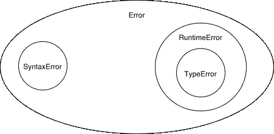
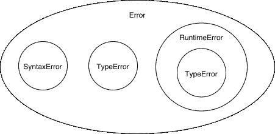
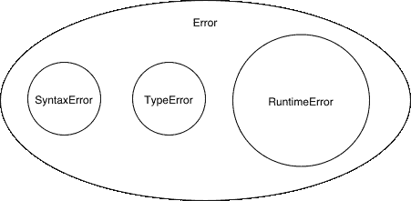

# 揭开错误的神秘面纱

> 原文：<https://dev.to/stereobooster/demystify-programming-languages-errors-3fbp>

在之前的帖子中，我们谈到了解析、评估和 REPL。在本帖中，我们将讨论错误。

## 什么是错误？

> 误差的定义
> 
> 1:无意中偏离事实或准确性的行为
> 
> 2:错误信念的一个例子
> 
> 3:错误产生的东西
> 
> 4:观察值或计算值与真实值之间的差异
> 
> 5:结构或功能上的缺陷或不足
> 
> - [韦氏词典](https://www.merriam-webster.com/dictionary/error)

错误是人类思维的产物。错误发生在以下情况:

*   人类的期望没有得到满足
*   当我们不知道答案时(未定义的行为)
*   当一些知识(或信仰)与另一个相矛盾时(悖论)

### 未定义的行为

> 未定义的:未清楚或精确显示、描述或限制的
> 
> - [韦氏词典](https://www.merriam-webster.com/dictionary/undefined)

例如，当你试图在机械计算器中除以 0 时，就会发生这种情况。

[](https://res.cloudinary.com/practicaldev/image/fetch/s--kE69E0wJ--/c_limit%2Cf_auto%2Cfl_progressive%2Cq_66%2Cw_880/https://thepracticaldev.s3.amazonaws.com/i/djxbzzje825ar8mla9nr.gif)

图片来源:[popularmechanics.com](https://www.popularmechanics.com/technology/gadgets/a20152/dividing-by-zero-will-mechanical-calculator/)。

### 悖论

> 悖论:乍一看似乎是真实的自相矛盾的陈述
> 
> - [韦氏词典](https://www.merriam-webster.com/dictionary/paradox)

[](https://res.cloudinary.com/practicaldev/image/fetch/s--fgkraOyG--/c_limit%2Cf_auto%2Cfl_progressive%2Cq_auto%2Cw_880/https://thepracticaldev.s3.amazonaws.com/i/5mzlmdl6rp6p53yg235j.jpg)

图片来源:[illustrations index](https://www.illusionsindex.org/i/impossible-triangle)。

## 电脑出错

[](https://res.cloudinary.com/practicaldev/image/fetch/s--QZV7vnkW--/c_limit%2Cf_auto%2Cfl_progressive%2Cq_66%2Cw_880/https://thepracticaldev.s3.amazonaws.com/i/i215r1t6qbt58gzg0hr4.gif)

当计算机(软件或硬件)错误发生时，这基本上意味着软件或硬件创建者不知道或不能处理给定的情况，并决定“放弃”并将错误返回到更高的级别，该级别可以是其他软件或硬件或用户。

举个例子，

*   不知道怎么处理:`0/0`，`1 + "apple"`
*   无法处理:当网络中断时连接到远程服务器，没有及时得到响应

错误是程序员最后的退路。你总是可以返回一个错误而不是实际的结果。

## 计算机如何交流错误？

计算机(软件或硬件)可以通过两种方式向更高层传达错误:

*   通过返回值:特殊值(例如 [`NaN`](https://www.doc.ic.ac.uk/~eedwards/compsys/float/nan.html) )或【非此即彼】单子或[围棋样式对`[err, res]`](https://www.innoq.com/en/blog/golang-errors-monads/)
*   通过旁门左道:异常，[恐慌](https://gobyexample.com/panic)，[内核恐慌](https://github.com/torvalds/linux/blob/master/kernel/panic.c)

> 当异常或中断发生时，硬件开始执行响应异常的代码。这个动作可能包括终止一个进程，输出一个错误信息，与外部设备通信，或者通过启动一个“蓝屏死机”和停止 CPU 使整个计算机系统严重崩溃
> 
> -[MIPS 架构中的异常和中断处理](http://people.cs.pitt.edu/~don/coe1502/current/Unit4a/Unit4a.html)

## 编程语言中的错误

让我们回到这个系列的主题——编程语言。在编程语言中我们需要处理什么样的错误？

我们可以用不同的方法对错误进行分类，例如在我们的 Calcy(前一篇文章中的小 PL)实现中，我们有两个阶段——解析和评估，所以我们可以有两种类型的错误:语法错误(计算机不能解析给定的程序)，运行时错误(计算机不能评估给定的输入)。

我们可以将运行时错误的分类进一步细化为:

*   一般运行时错误，例如，缺少函数(计算机不知道这个函数)
*   例如，键入错误，试图从数字中减去符号，但计算机只能从数字中减去数字。点击阅读更多关于类型[的信息。](https://sterebooster.com/posts/type-system-faq)

所以我们的层级可以是这样的:

[](https://res.cloudinary.com/practicaldev/image/fetch/s--4BzdIpP_--/c_limit%2Cf_auto%2Cfl_progressive%2Cq_auto%2Cw_880/https://thepracticaldev.s3.amazonaws.com/i/s2cct1rbveu8dacdikxs.png)

但是，例如，我们可以引入类型检查优先评估(静态类型检查)，如果我们的类型检查器不能捕获所有错误，并且我们仍然必须在运行时进行一些类型检查，这意味着错误层次结构将如下所示:

[](https://res.cloudinary.com/practicaldev/image/fetch/s--4MAjsu7M--/c_limit%2Cf_auto%2Cfl_progressive%2Cq_auto%2Cw_880/https://thepracticaldev.s3.amazonaws.com/i/tleh3n8vudefib8xrc7r.png)

如果我们的类型检查器是理想的，并且我们可以防止所有的类型错误，它将看起来像这样:

[](https://res.cloudinary.com/practicaldev/image/fetch/s--GctUgWen--/c_limit%2Cf_auto%2Cfl_progressive%2Cq_auto%2Cw_880/https://thepracticaldev.s3.amazonaws.com/i/x2stpglol1lz22juqq8o.png)

**注意**:运行时缺失类型错误，并不意味着没有动态类型检查，它只是意味着我们处理了所有与类型相关的边缘情况(包括不成功的动态类型检查)。

### 语法错误

Calcy 的当前实现可能有 3 个语法错误:

```
try {
  parse(")");
} catch (e) {
  assert.equal(e.message, `Unexpected ")"`);
}
try {
  parse("(* 2 2");
} catch (e) {
  assert.equal(e.message, `Expected ")" at the end of the input`);
}
try {
  parse("()()");
} catch (e) {
  assert.equal(e.message, `Unexpected "(" after ")"`);
} 
```

上面的三个例子在语法上是错误的:

*   我们要求所有括号匹配
*   我们需要一个根元素

### 运行时出错

现在我们只处理算术运算中有两个参数的情况:

```
let [name, first, second] = ast;
if (name === "+") {
  return evaluate(first) + evaluate(second);
} 
```

所以第三个和下一个参数被忽略了。我觉得这样不人性化。我们要么需要处理任意数量的参数，要么返回一个错误。

让我们暂时把它当作一个错误:

```
const numberOfArguments = ast.length - 1;
if (name === "+") {
  if (numberOfArguments !== 2) {
    throw new TypeError(
      `"${name}" expects 2 arguments, instead got ${numberOfArguments}`
    );
  }
  return evaluate(first) + evaluate(second);
} 
```

在 Calcy 中，我们有两种类型的值:

*   符号:`+`、`-`、`*`、`x`等。用作操作(或功能)的标识符
*   编号:`1`、`2`、`-3`等。

如果用户在预期数字的地方使用符号会发生什么:

```
(+ x 1) 
```

此时，它将从底层(JS)传播错误结果，而 JS 又从其底层系统(FPU -浮点单元)传播错误结果。我希望以一致的方式处理错误，所以让我们也为此添加类型检查:

```
if (name === "+") {
  // ...
  if (!isExpression(first) && typeof first !== "number") {
    throw new TypeError(
      `"${name}" expects number as the first argument, instead got "${first}"`
    );
  }
  if (!isExpression(second) && typeof second !== "number") {
    throw new TypeError(
      `"${name}" expects number as the second argument, instead got "${second}"`
    );
  }
  return evaluate(first) + evaluate(second);
} 
```

注意:Calcy 中的每个表达式都计算一个数字。

运行时错误还有一个更明显的例子——未知函数:

```
if (name === "+") {
  // ...
} else if (name === "-") {
  // ...
} else {
  throw new RuntimeError(`"${name}" is not a function`);
} 
```

测试:

```
try {
  evaluate(parse("(* 2 2)"));
} catch (e) {
  assert.equal(e.message, `"*" is not a function`);
}
try {
  evaluate(parse("(+ 2 2 2)"));
} catch (e) {
  assert.equal(e.message, `"+" expects 2 arguments, instead got 3`);
}
try {
  evaluate(parse("(+ x x)"));
} catch (e) {
  assert.equal(
    e.message,
    `"+" expects number as the first argument, instead got "x"`
  );
} 
```

有一些我们没有考虑到的错误:数字溢出，堆栈溢出，内存不足。

## 类型检查器

目前，我们正在运行时(评估时)进行类型检查，但是我们可以实现在执行前进行类型检查的附加函数(程序)。在没有副作用的 REPL 和确定性 PL 的情况下，这不会增加很多价值，所以我想我们稍后会添加这一点。

## PS

在这篇文章中，我们讨论了一些错误和类型。下一步，我们可能会添加变量或用户定义的函数。

这篇文章的源代码是[这里是](https://github.com/stereobooster/write-a-language/tree/master/2.error)。

> 照片由 Unsplash 上免费使用声音