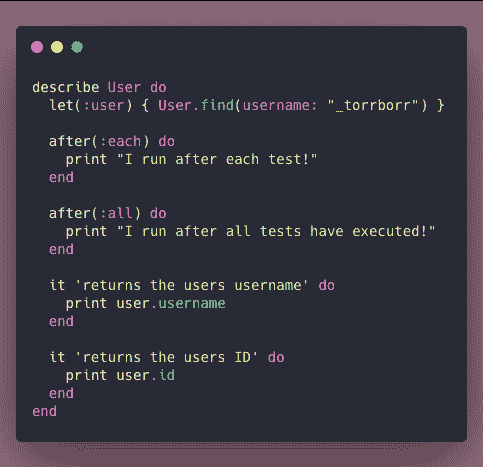
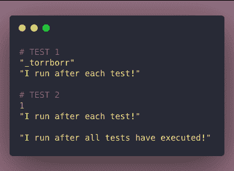
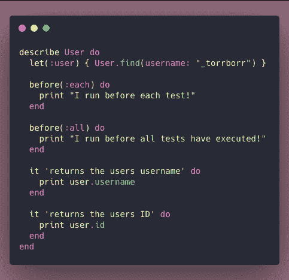
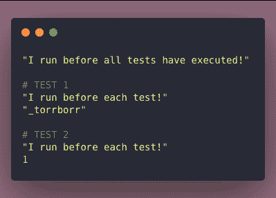
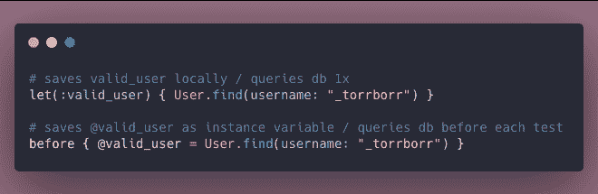
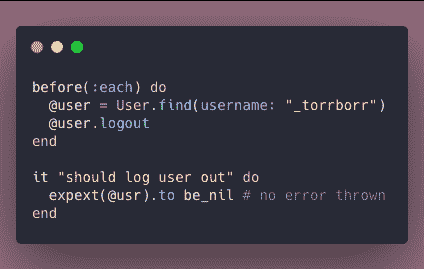
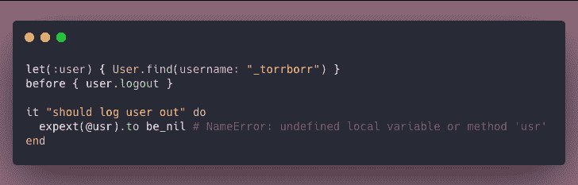

# 在 Ruby 中构建测试:RSpec 助手方法和钩子

> 原文：<https://dev.to/torianne02/building-ruby-tests-rspec-helper-methods-and-hooks-2dd1>

两周前，我用[这个帖子](https://dev.to/torianne02/building-tests-in-ruby-the-basics-59mo)开始了这个系列。上周和本周早些时候，由于收到了我的第一份技术工作邀请，我有点跑题了，但我试图通过写这篇文章回到正轨。这篇文章是这个 Rspec 系列的第二部分，我们将讨论一些真正常见的 RSpec 助手方法和钩子:`let`、`before`和`after`。

在你开始思考“但是关于`include`、`match`、`raise_error`等等”之前，不要担心。我将在本系列的下一期文章中讨论这些期望和匹配器。我认为他们应该有自己的位置，因为我计划报道的有很多。也就是说，让我们继续深入这些 RSpec 辅助方法和钩子。

### `after`

这个我要倒着来一点，在这里先说一下`after`。这是一个相对容易理解的概念，这也是为什么我从这里开始，然后逐步深入到更复杂的概念。

`after`接受一个`all`或`each`的参数，并在*每个*测试完成后或*所有*测试完成后执行你给它的任何功能。

在看这条线下面之前，花点时间考虑一下你认为这些会以什么顺序打印出来！

你是对的吗？！如果你是，耶！如果没有，请花一点时间重新阅读上面的描述。特别注意斜体的单词和作为参数传递给每个`after`语句的单词。

### `let`和`before`

在这一节中，我们将讨论助手方法`let`和钩子`before`。`before`类似于`after`，因为它也可以接受`all`和`each`这两个自变量。不同的是，这种挂钩类型要么在*所有*测试执行之前被激发，要么在*每个*测试执行之前被激发。

还是那句话，看看你能不能猜出正确的输出顺序！

既然我们已经有了这样的比较，我想讨论一下我在学习构建 RSpec 测试时遇到的一些困难。当我开始编写测试时，我遇到了一个障碍，我不知道发生了什么。我花了一段时间才意识到我使用的是钩子`before`而不是助手方法`let`。这两者之间的最大区别是，`let` **查询数据库一次，并将新创建的对象保存为本地变量**，同时使用`before`创建数据库查询**在每次测试**开始时查询数据库，这增加了加载时间，降低了测试速度。

我做错的是，我在编写测试时期望`user`的一个属性等于某个特定的东西，但是我没有在那个特定的测试中包含一个`before`语句，也没有使用`before(:each)`或`before(:all)`。我不断收到一个错误消息，说`user`不存在。你能从我目前告诉你的内容中猜出这是为什么吗？

如果你认为`before`没有将对象保存到一个局部变量，那么你是对的，所以它确实不存在于我正在进行的测试中。在我之前使用的测试中，它只是作为一个实例变量存在。因此，在适用的地方，我删除了所有的`before`方法，并在它的位置上使用了`let`,这样我只需要查询我的数据库一次，就可以使用局部变量进行多次测试。

除了查询数据库的次数之外，使用`before`还有一个障碍。当开发人员使用`before`时，这个数据库查询必须保存为一个实例变量。起初这似乎没有问题，但它可能是。这样做的原因是因为在测试中，如果实例变量没有被预先定义，它们就会“突然出现”为 0。这意味着，如果您的变量中有一个打字错误，您的代码可能仍然可以正常工作。

让我们来看一个情况，您可能正在测试一个用户是否被注销。您可能希望测试通过测试`@user`是否等于`nil`来检查用户是否被注销。如果你不小心输入了`@usr`，你的测试仍然会通过，因为`@usr`确实等于`nil`，同时你不知道`@user`实际上是否为零。

如果你在使用`let`时不小心拼错了`user`，你会收到一个`NameError`错误。

对我来说，似乎使用`let`来定义测试中可用的变量是更好也更安全的方法。`before`确实有它的用途，比如在测试前执行任务，就像你在上面的例子中看到的那样，但是我不会用它来查询数据库和定义在测试中使用的变量。

### 最后的想法

现在我们已经了解了一些在构建 RSpec 测试时使用的常见钩子和一个非常常见的 helper 方法！请注意，还有很多可以讨论的，所以请随时谷歌更多或看看我的来源，其中也列出了其他几个。

在写这篇文章的时候，我有一个“啊哈”的时刻，并且能够修复几个不同的错误，这些错误在我写这些文章的同时在我的项目中已经存在了 2 个星期了。这正是我喜欢写技术文章的原因。我在研究和写作中获得了和你们一样多的知识，学到了新的东西。这总是令人难以置信地值得，所以**感谢你们所有人继续阅读我的文章**并激励我每周写作。

注意:这一周的封面图片是我两年前去洪都拉斯的小岛乌蒂拉旅行时带给你的！

#### 来源

[Vs 前让](https://launchacademy.com/codecabulary/learn-test-driven-development/rspec/before-vs-let)
[权威 RSpec 教程附实例](https://www.rubyguides.com/2018/07/rspec-tutorial/)
[RSpec - Hooks](https://www.tutorialspoint.com/rspec/rspec_hooks.htm)